# AI-BOX Edge Box Management Platform — User Manual (English)

> Version: 1.2 | Document Type: User Guide | Audience: End Users, Operations Staff

---

## Table of Contents

1. [Product Introduction](#1-product-introduction)
2. [System Requirements & Access](#2-system-requirements--access)
3. [Quick Start: Login](#3-quick-start-login)
4. [Main Interface Overview](#4-main-interface-overview)
5. [Task Management](#5-task-management)
6. [Flow Editor](#6-flow-editor)
7. [Node Configuration](#7-node-configuration)
8. [Runtime Node Status](#8-runtime-node-status)
9. [Task Card Status](#9-task-card-status)
10. [Node Connection Guidelines](#10-node-connection-guidelines)
11. [Video Preview & Multi-view](#11-video-preview--multi-view)
12. [Alert Management](#12-alert-management)
13. [Plugins: Face Library & Recording](#13-plugins-face-library--recording)
14. [LLM Plugin Usage (Review Mode & Detector Mode)](#14-llm-plugin-usage-review-mode--detector-mode)
15. [Intelligent Retrieval Usage](#15-intelligent-retrieval-usage)
16. [Settings & System Management](#16-settings--system-management)
17. [Context Menu Operations](#17-context-menu-operations)
18. [Comprehensive Example](#18-comprehensive-example)
19. [Factory Firmware Plugin Inventory & Capabilities](#19-factory-firmware-plugin-inventory--capabilities)
20. [Troubleshooting](#20-troubleshooting)

---

## 1. Product Introduction

### 1.1 What is AI-BOX?

AI-BOX is an **Edge computing box management platform** for deploying, running, and managing AI video analysis tasks on edge devices. Using a visual drag-and-drop interface, you can combine input sources (e.g., RTSP cameras), algorithms (e.g., pedestrian detection, face recognition), and outputs (e.g., network streaming, alerts, recording) into complete analysis pipelines.

### 1.2 Core Features

| Module | Description |
|--------|-------------|
| **Task Management** | Create, edit, start, stop, copy, delete tasks; group management |
| **Flow Editing** | Drag-and-drop canvas, configure node parameters, connect data flows |
| **Video Preview** | Multi-channel live preview, multiple layouts, full screen |
| **Alert Notification** | View, acknowledge, delete alerts; alert popup toggle |
| **Face Library** | Manage face lists (whitelist/blacklist/VIP, etc.) |
| **Recording** | Browse, preview, delete recordings; space cleanup |
| **System Settings** | Device info, version, upgrade, reboot, change password |

---

## 2. System Requirements & Access

### 2.1 Browser Requirements

- **Recommended**: Chrome 90+, Edge 90+, Safari 14+
- JavaScript must be enabled
- HTTPS recommended (required for recording preview)

### 2.2 Access URL

- **Local**: `https://<device-IP>:port` or `https://<device-IP>:port/aibox/`
- **Example**: `https://192.168.1.100:8099/aibox/`

### 2.3 Device Connection

- The web app connects to the device via WebRTC. Ensure the **AI-BOX app is running** on the device.
- If connection fails, check: device online status, network connectivity, firewall rules.

---

## 3. Quick Start: Login

### 3.1 Open Login Page

1. Enter the access URL in the browser address bar (see 2.2)

   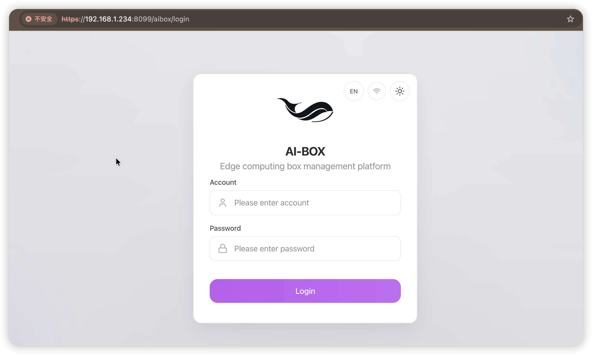

2. If not logged in, you will be redirected to the login page.

### 3.2 Login Steps

| Step | Action | Notes |
|------|--------|-------|
| 1 | Enter username in the Account field | Default is usually `admin` for local deployment |
| 2 | Enter password in the Password field | Input is masked; default is `admin` |
| 3 | Click **Login** | The system first connects via WebRTC, then validates credentials; either step failing will show an error |
| 4 | Wait for connection | Button shows "Logging in..."; do not click repeatedly; usually completes in seconds |
| 5 | Success | Redirects to home (Device Nodes); session conflict may occur if already logged in elsewhere |

### 3.3 Login Result

- **Success**: Redirects to home (Device Nodes)

  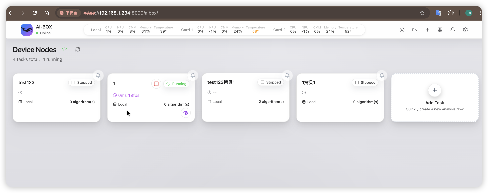

- **Failure**: Error message at top or in popup (e.g., "Device connection failed", "Login expired")

- If **device connection failed**: Confirm the device app is running and network is reachable, then refresh and retry.

### 3.4 Theme & Language (Login Page)

- **Theme**: Toggle light/dark via sun/moon icon on the login page.
- **Language**: Switch Chinese/English from the main Settings menu after login.

  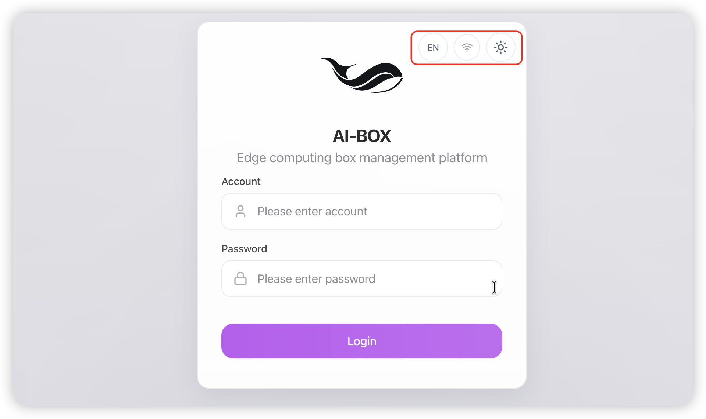

---

## 4. Main Interface Overview

### 4.1 Top Bar (Header)

| Area | Content |
|------|---------|
| **Left** | Logo, device name, online/offline status; shows "Reconnect" when offline |
| **Center** | Device status capsules: CPU, NPU, memory, temperature (double-click for details) |
| **Right** | Theme, language, add task, multi-view, alert bell, settings menu |

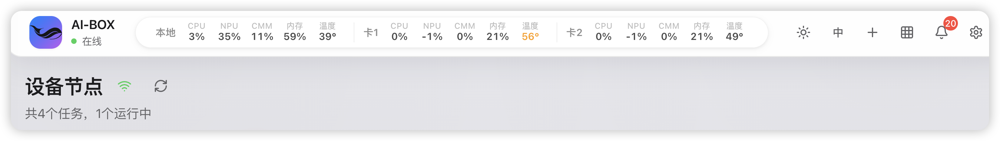

### 4.2 Device Status Capsules

- Shows real-time resource usage for **local** and **compute cards**
- **Colors**: Green = normal, Orange = warning, Red = critical
- **Double-click** to open device details popup

  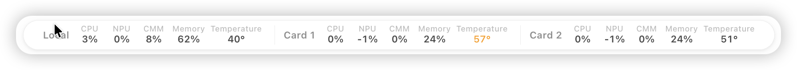
  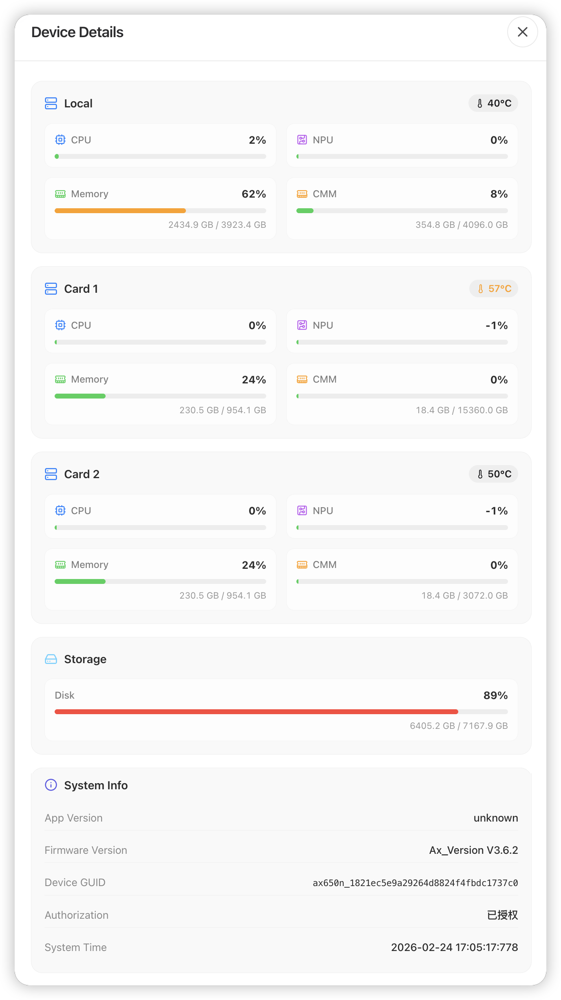

### 4.3 Main Content Area

- **Title**: "Device Nodes", with "X tasks total, X running"
- **Connection icon**: Green = connected, Orange = connecting, Red = disconnected
- **Refresh**: When connected, refreshes data without disconnecting; when disconnected, attempts to reconnect
- **Task cards & groups**: See next section

  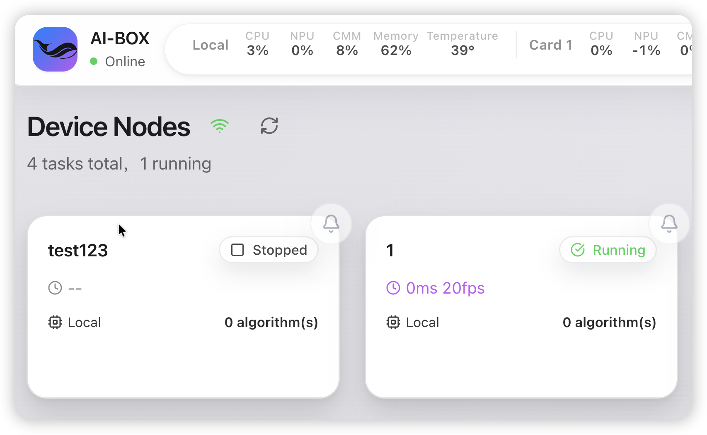

### 4.4 When Device Not Connected

A red banner appears with:
- Error description
- **Reconnect**: Try to re-establish connection
- **Re-login**: Clear session and return to login page

---

## 5. Task Management

### 5.1 Task Card Types

| Type | Appearance | Description |
|------|-------------|-------------|
| **Group Card** | Folder icon + count | Holds multiple tasks; click to expand/collapse |
| **Task Card** | Name, status, algorithm count | Single analysis task |
| **Add Task Card** | Dashed border + plus | Quick create new task |

### 5.2 Create New Task

**Method 1: Click "Add Task" card**

1. Find the "Add Task" card (dashed border, "+" in center)
2. Click it
3. Enter task name in the dialog
4. Click "Create and Edit" to open the flow editor

**Method 2: Click top "+" button**

1. Click the plus icon in the top bar
2. Same steps as above

**Method 3: Right-click on blank area**

1. Right-click on any blank area (not on cards or buttons)
2. Choose "New Task"
3. Enter name in the dialog

   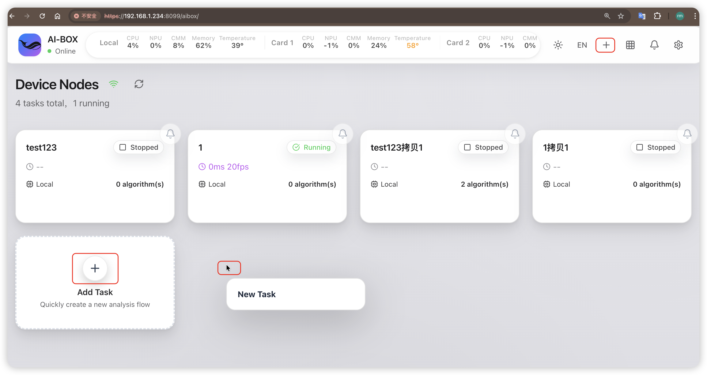
   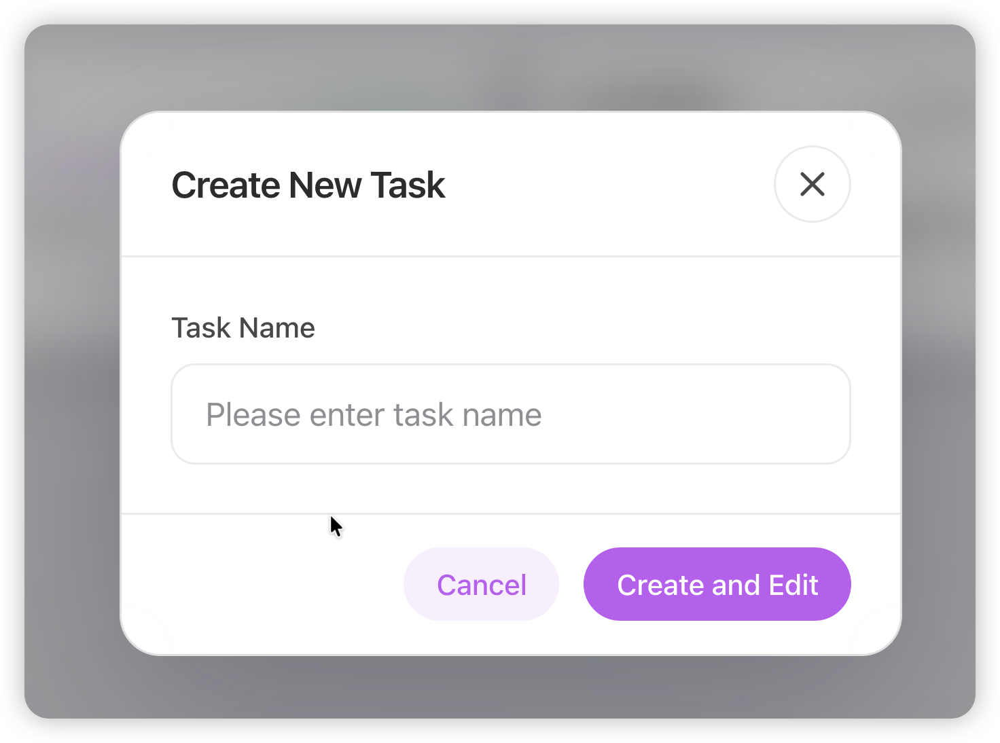

### 5.3 Edit Task

1. **Double-click** the task card, or click the **Edit** icon on the card
2. Opens the flow editor (see Chapter 6)

   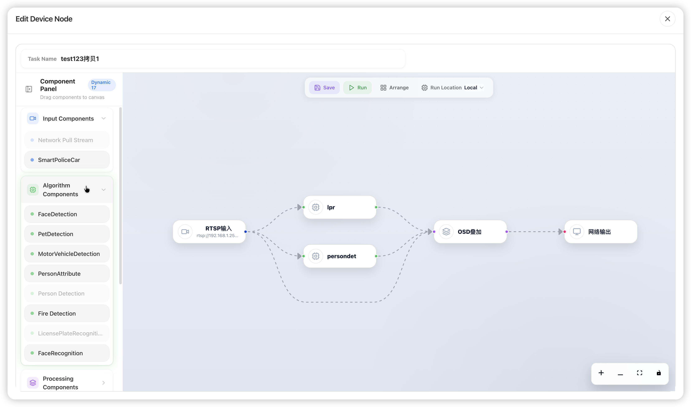

### 5.4 Start & Stop Task

- **Start**: Click **play icon** (▶) on the task card
- **Stop**: Click **stop icon** (■) on the task card
- **Status**: Running (green), Stopped (gray), Error (red), Schedule Paused (purple)

> ⚠️ Cannot start/stop when device is not connected.

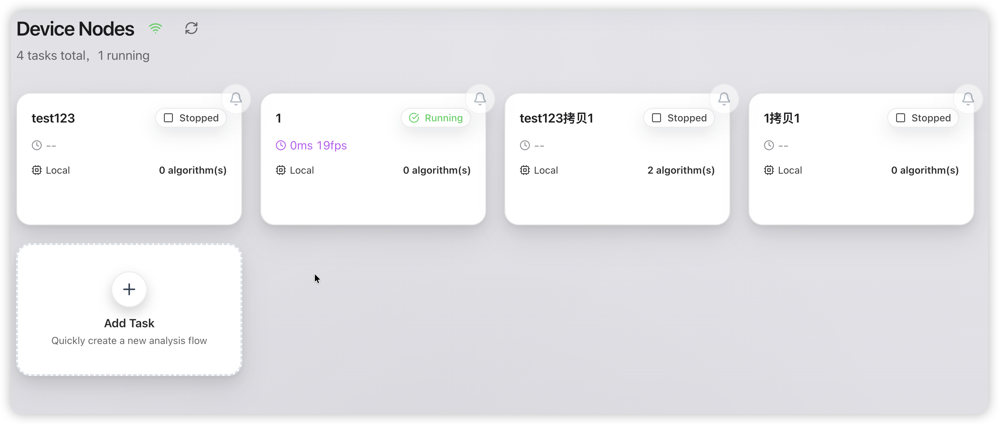

### 5.5 Copy Task

1. Right-click the task card
2. Choose "Copy"
3. A copy is created with "Copy" suffix in the name

   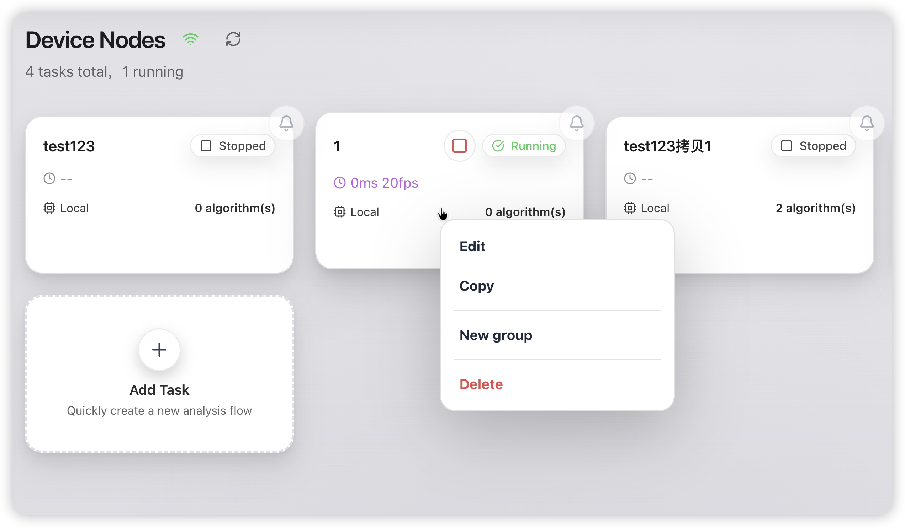

### 5.6 Delete Task

1. Right-click the task card
2. Choose "Delete" (red item)
3. Confirm in the dialog
4. ⚠️ Deletion is irreversible.

### 5.7 Group Management

**Create group**: Right-click task card → "New Group"; or drag a task onto a group card

**Move task**: Right-click task → "Move to X"; or drag task onto group card

**Rename group**: Right-click group card → "Rename"

**Remove from group**: Right-click task → "Remove from Group" (when task is in a group)

  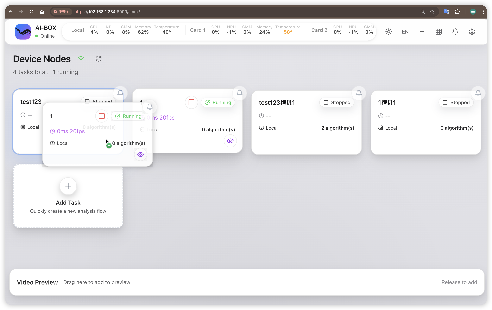
  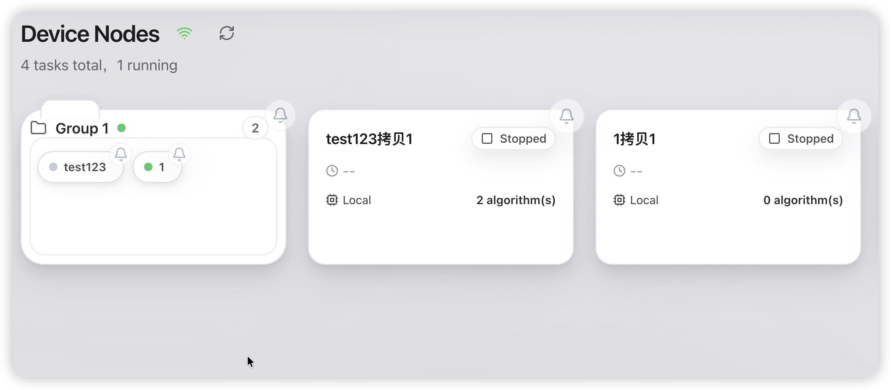

### 5.8 Alert Bell on Task Card

- Shows unread alert count for that task/group
- Click to open alert panel filtered by that task

  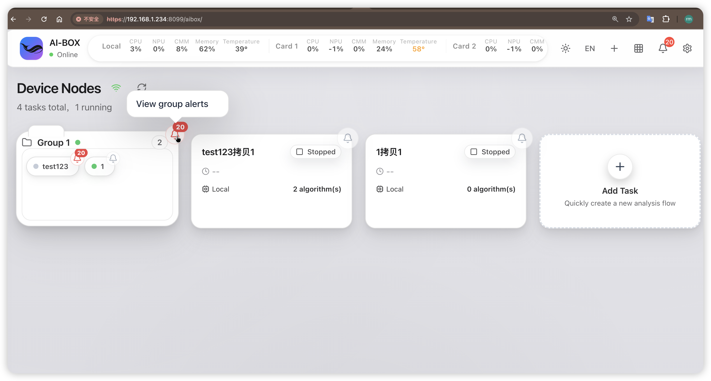

### 5.9 Task Card Expand/Collapse

- **Single click**: Expands to show flow preview (nodes and connections)
- **Click blank area again**: Collapses to small card
- **Double-click**: Opens flow editor directly
- When expanded: **Preview**, **Edit** buttons at bottom-right; hover for **Start/Stop**, **More**

  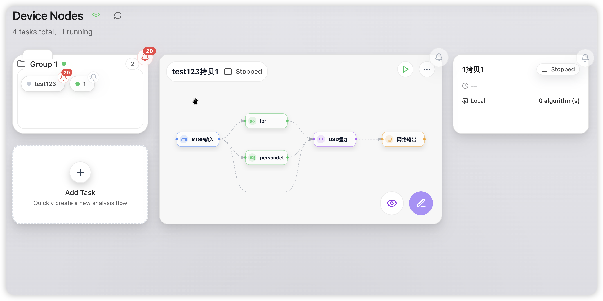

### 5.10 Drag to Copy (Option/Alt + Drag)

- Hold **Option** (Mac) or **Alt** (Windows) and **drag** task card to another group or blank area
- Releases a copy at the target; no need to right-click Copy first

---

## 6. Flow Editor

### 6.1 Open Flow Editor

- Double-click task card, or click Edit icon on the card
- New tasks: click "Create and Edit" after creation

### 6.2 Editor Layout

| Area | Description |
|------|--------------|
| **Left panel** | Input, Algorithm, Processing, Output components; collapsible |
| **Center canvas** | Drag, connect, layout area |
| **Top toolbar** | Save, Run, Arrange, Close |
| **Run location** | Dynamic or specific compute card |

### 6.3 Add Nodes to Canvas

1. Locate the component in the left panel (Input, Algorithm, Processing, Output)
2. Drag it onto the canvas
3. If a duplicate type exists, you'll see "Task already contains xxx"
4. Release; node appears at drop location

  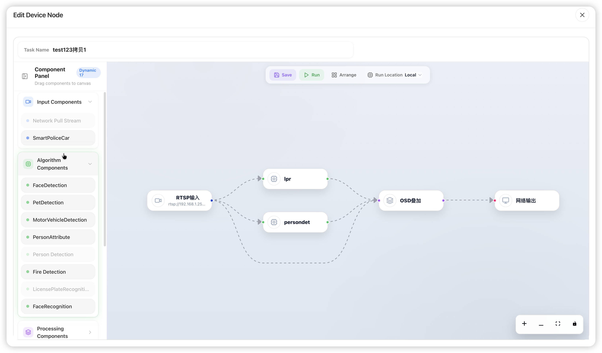

### 6.4 Connect Nodes

1. Each node has left (input/target) and right (output/source) handles
2. Drag from **source left handle** to **target right handle**
3. Canvas auto-arranges after new connections
4. Use top "Arrange" button to re-layout

> ⚠️ Direction must be: Input → Algorithm → Processing → Output.

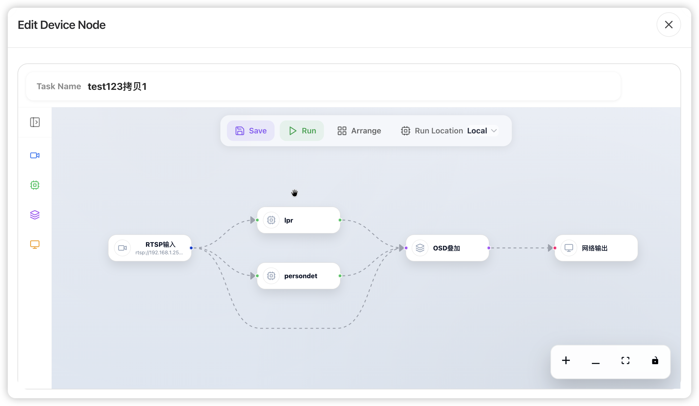

### 6.5 Configure Node Parameters

1. **Double-click** the node on the canvas
2. Fill the form in the config popup
3. Use "Test Connection", "ONVIF Search" etc. if available
4. Click "OK"; config is applied locally; click "Save" or "Run" at top to sync to device

   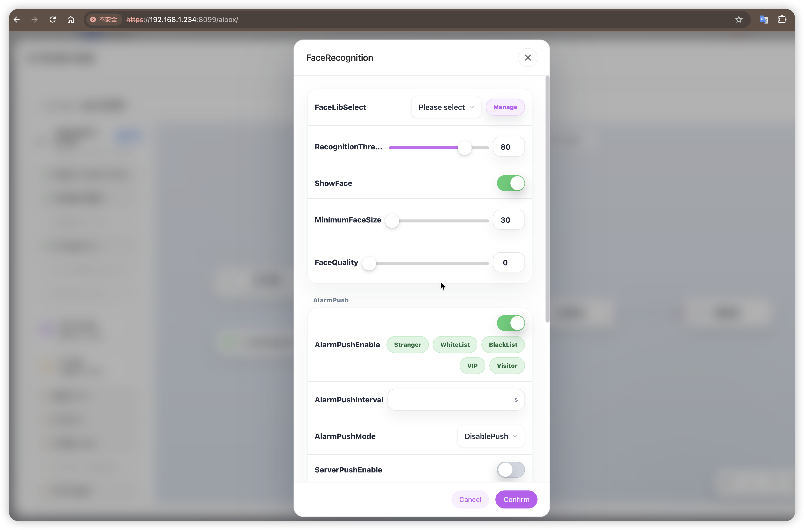

### 6.6 Canvas Operations

- **Pan**: Drag on blank canvas
- **Zoom**: Mouse wheel
- **Delete node**: Select node, press Delete
- **Delete edge**: Select edge, press Delete
- **Arrange**: Click top "Arrange" button

### 6.7 Save & Run

- **Save**: Top "Save" button
- **Run**: Top "Run" button (saves then starts)
- If task references deleted plugins, save/run will fail; remove or replace those nodes first

### 6.8 Canvas Context Menu

- Right-click **node**: Edit node, Delete node
- Right-click **edge**: Delete edge
- Click outside to close menu

### 6.9 Run Location

- Top "Run location" dropdown: **Dynamic**, **Local**, **Compute Card 1**, **Compute Card 2**, etc.
- **Dynamic**: Device assigns automatically; specific choice fixes to that unit

  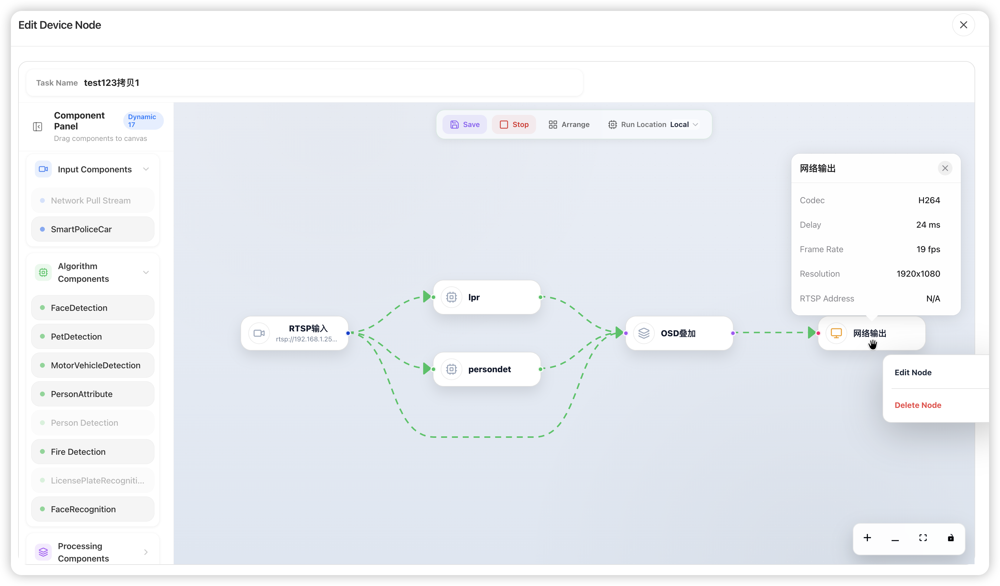

---

## 7. Node Configuration

Node config is driven by **formList** from the device/plugins. Common control types:

### 7.1 Input Controls

| Type | Description |
|------|--------------|
| **input** | Text or number; placeholder, unit |
| **textarea** | Multi-line text |
| **inputNumber** | Min/max range |
| **password** | Masked input |

### 7.2 Selection Controls

| Type | Description |
|------|--------------|
| **select** | Dropdown choices |
| **switch** | Toggle on/off |
| **slider** | Drag to set value |

### 7.3 Read-only & Status

| Type | Description |
|------|--------------|
| **readOnly** | Display only |
| **status** | Status label with color (OK/RUNNING=green, FAILED=red, WARNING=orange) |

### 7.4 Special Config

| Type | Description |
|------|--------------|
| **button** | Execute action (e.g., Test Connection, ONVIF Search) |
| **divider** | Section header |
| **schedule** | Time-based schedule (Monday–Sunday, 24h) |
| **regionDraw** | Draw detection regions on snapshot |

### 7.5 Schedule (Time-based Control)

1. In RTSP Input node config, open "Schedule"
2. Set enabled times by day, 15-minute slots
3. Enable/disable days
4. Copy to other days, clear day, etc.
5. Task runs only in enabled periods

   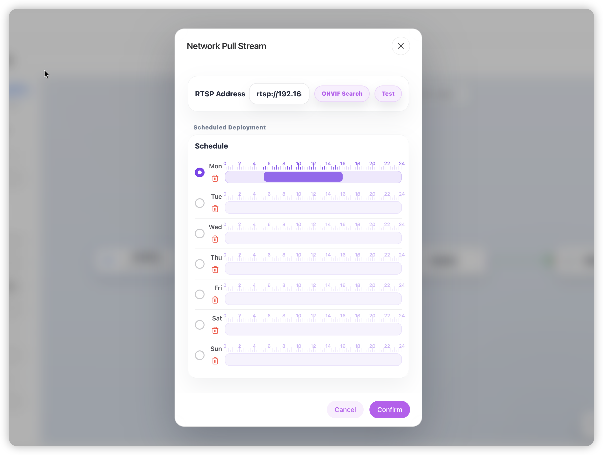

### 7.6 Region Drawing (Detection Area)

1. Task must be **saved** and device **connected**
2. In algorithm node config, click "Draw Detection Region"
3. Click "Refresh Snapshot" to get current frame

**Drawing:**

| Type | Action |
|------|--------|
| **Line** | Two clicks to complete, or double-click |
| **Polygon** | Click to add vertices (3+); double-click or click start to close |
| **Undo last step** | Right-click or **Backspace** while drawing |
| **Cancel** | **Esc** |

**Editing & deletion:**

| Action | Description |
|--------|-------------|
| Drag vertex | Left-click and drag vertex to reshape |
| Delete vertex | Left-click vertex to select, press **Delete**; or right-click vertex |
| Delete region | Right-click inside region or on segment; choose "Delete this region"; overlapping targets are highlighted in red |
| Select region | Right-click region; click elsewhere to close menu or deselect |

Use Undo, Clear All as needed; supports multiple regions; save to apply.

   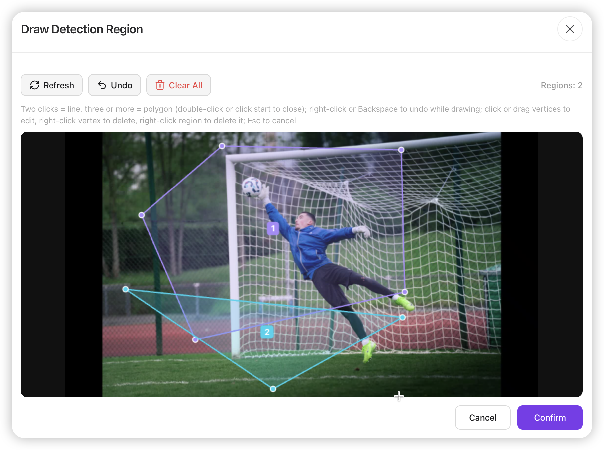

### 7.7 Quick Buttons

| Button | Description |
|--------|-------------|
| **Test Connection / RTSP Test** | Validate RTSP URL |
| **ONVIF Search** | Search ONVIF devices on LAN |
| **Face Library** | Open face library (face recognition nodes) |
| **Select Recording Path** | Choose recording storage path |

---

## 8. Runtime Node Status

When a task runs, nodes and edges show live status.

### 8.1 Edge Status

| Status | Color | Meaning |
|--------|-------|---------|
| **idle** | Gray dashed | Not running or unknown |
| **ok** | Green dashed (animated) | Data flowing normally |
| **stuck** | Red dashed | Blocked or error |
| **paused** | Purple dashed | Schedule paused (outside enabled time) |

### 8.2 Node Hover (detail_info)

- **Hover** over a node in a running task to see a popup
- Shows **detail_info** from device: format, resolution, fps, latency, etc.
- Click values to copy to clipboard

### 8.3 Form Status in Config

- Some read-only/status fields in node config are updated live via **form_status**

### 8.4 Node Timeout

- If a node has no valid data for ~10 seconds, task health becomes **warning** or **error**
- Task card shows "Run Warning" or "Run Error"; edges may turn red

---

## 9. Task Card Status

### 9.1 Task & Health Status

| Status | Icon/Color | Meaning |
|--------|------------|---------|
| **Running** | Green check | Normal |
| **Stopped** | Gray square | Stopped |
| **Starting/Stopping** | Orange loading | In progress |
| **Error** | Red X | Critical error |
| **Run Warning** | Orange triangle | Some nodes timed out |
| **Schedule Paused** | Purple pause | Within schedule, outside enabled time |

### 9.2 Latency & FPS

- When **running** and has **Network Output** node: shows **Xms Yfps** or **Xms** or **--**

### 9.3 Schedule Resume Countdown

- When schedule-paused, card shows countdown like "3d 2h 15m 30s until resume"

  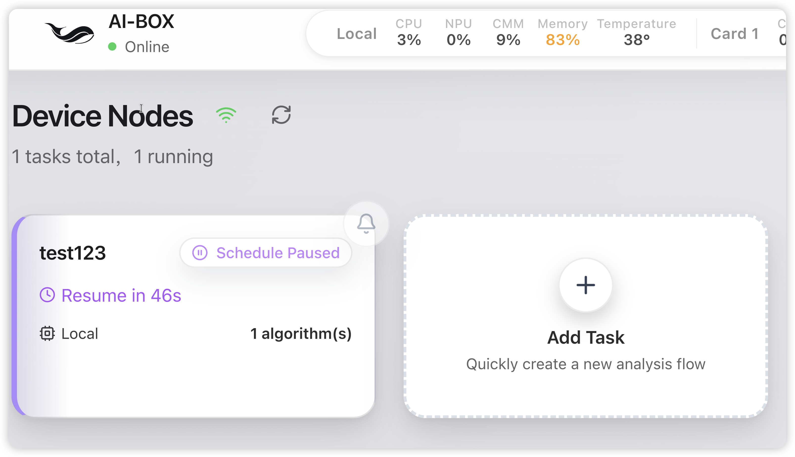

### 9.4 Run Location & Algorithm Count

- **Run location**: Local, Compute Card 1, etc.
- **X algorithm(s)**: Number of algorithm nodes

### 9.5 Card Left Color Bar

| Color | Meaning |
|-------|---------|
| Purple | Schedule paused |
| Red | Run error |
| Orange | Run warning |

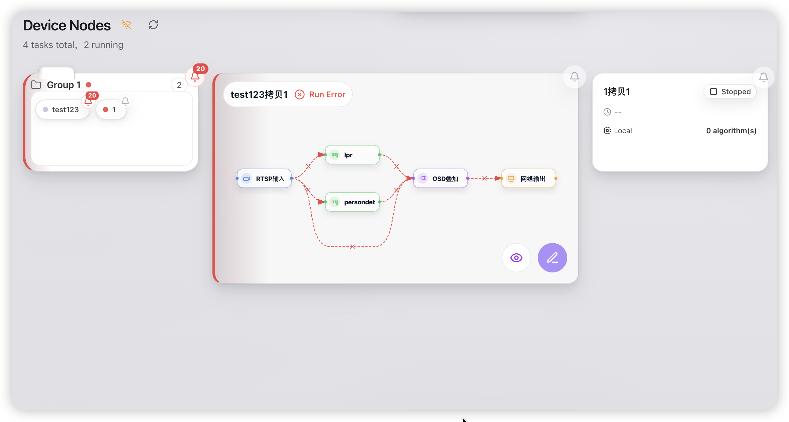

---

## 10. Node Connection Guidelines

### 10.1 Data Flow Order

- Standard: **Input → Algorithm → Processing → Output**
- Input nodes as start; output nodes as end
- Algorithm/processing can be parallel or serial

### 10.2 Connection Rules

- Connect source **left** to target **right**
- No duplicate node types in one task (unless plugin supports multi-input)

### 10.3 Tips

1. Build flow first, then configure parameters
2. Preview requires **Network Output** node
3. Alerts require **Alert Output** node
4. Run will auto-save if there are unsaved changes

### 10.4 Common Errors

| Symptom | Cause | Fix |
|---------|-------|-----|
| Cannot connect | Wrong direction | Connect source right → target left |
| No preview | No Network Output | Add and connect Network Output |
| No alerts | No Alert Output | Add and connect Alert Output |
| Node grayed | Plugin removed | Remove or replace node |

---

## 11. Video Preview & Multi-view

### 11.1 Open Multi-view

- Click **grid icon** in top bar
- Or **drag** task to preview dock at bottom

### 11.2 Add Preview Source

- **Drag** task to preview dock
- Or select from multi-view dialog

### 11.3 Layout

- Auto, 2/4/9/16 grid, custom

### 11.4 Full Screen & Close

- Full screen button; Close All

### 11.5 Notes

- Task must have **Network Output** node
- Must **start task** before preview

  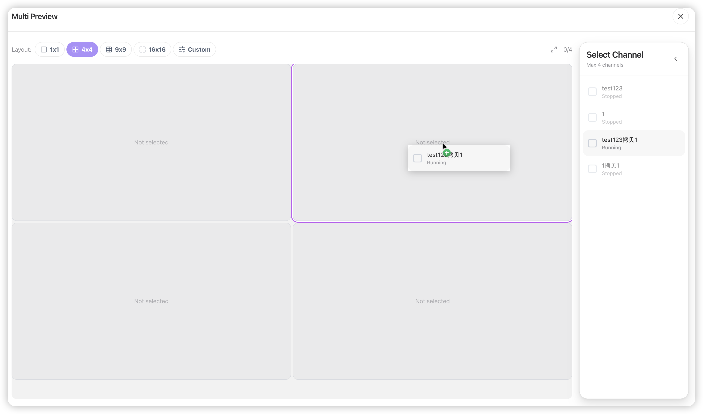
  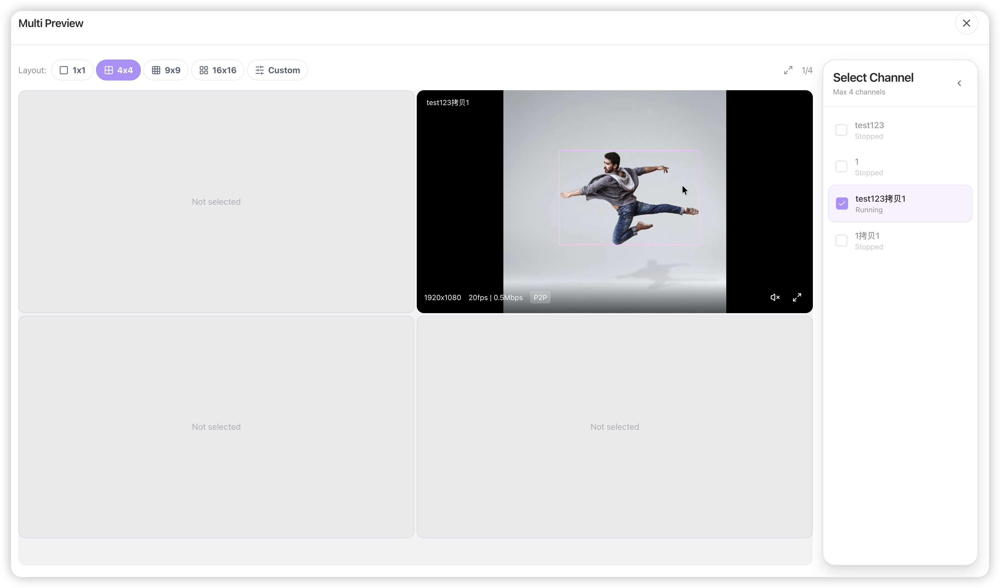

---

## 12. Alert Management

### 12.1 Open Alert Panel

- Click **bell icon** in top bar; red number = unread count

### 12.2 Alert List

| Action | Description |
|--------|-------------|
| View | Click to see details, large image |
| Acknowledge | Mark as read |
| Mark All Read | Mark all as read |
| Delete | Single or batch (with confirm) |
| Load More | Pull up at bottom |

### 12.3 Alert Popup

- Settings menu → "Alert Popup" toggle

### 12.4 Filter

- By task, by alert type

  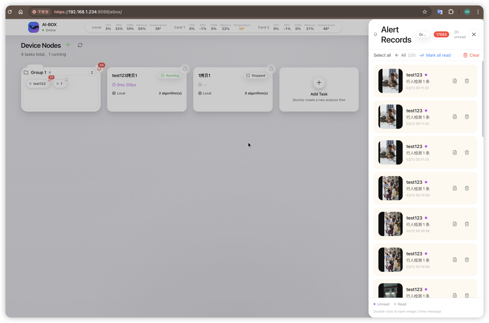

---

## 13. Plugins: Face Library & Recording

### 13.1 Face Library

**Entry**: Settings → Face Library; or "Manage" in face recognition node config

**Actions**: Create library, register faces, edit/delete, set types (whitelist/blacklist/VIP, etc.)

   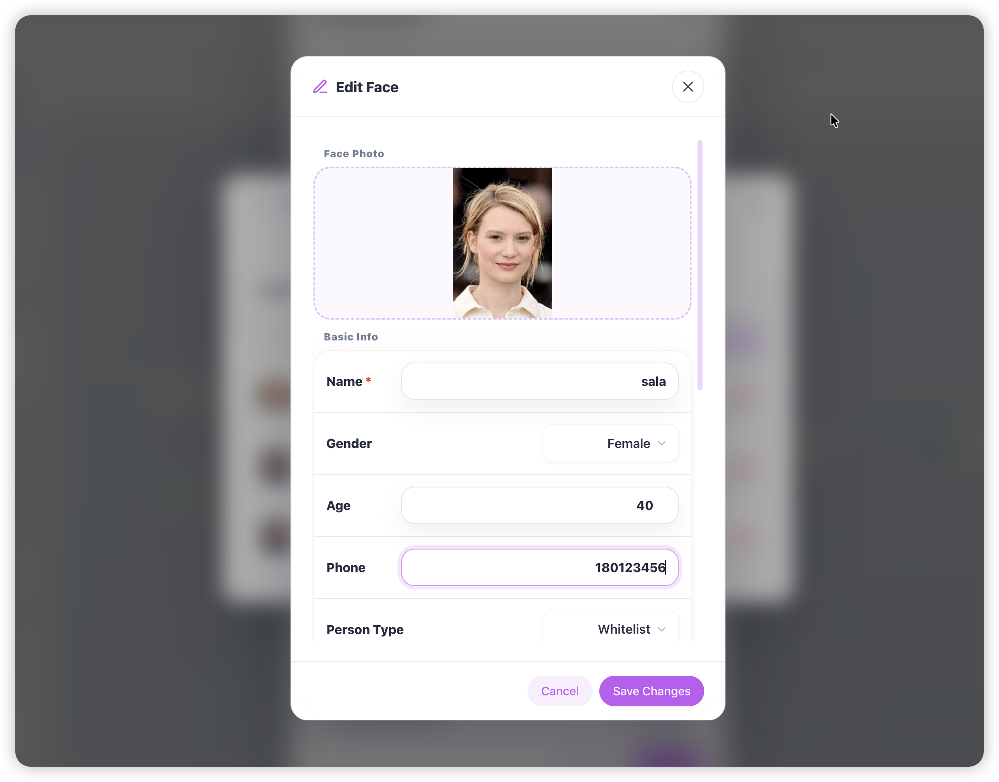

### 13.2 Recording

**Entry**: Settings → Recording

**Actions**: Browse by task/date, preview, delete, space cleanup, refresh

> Recording preview requires device playback endpoint (`/record/stream` etc.).

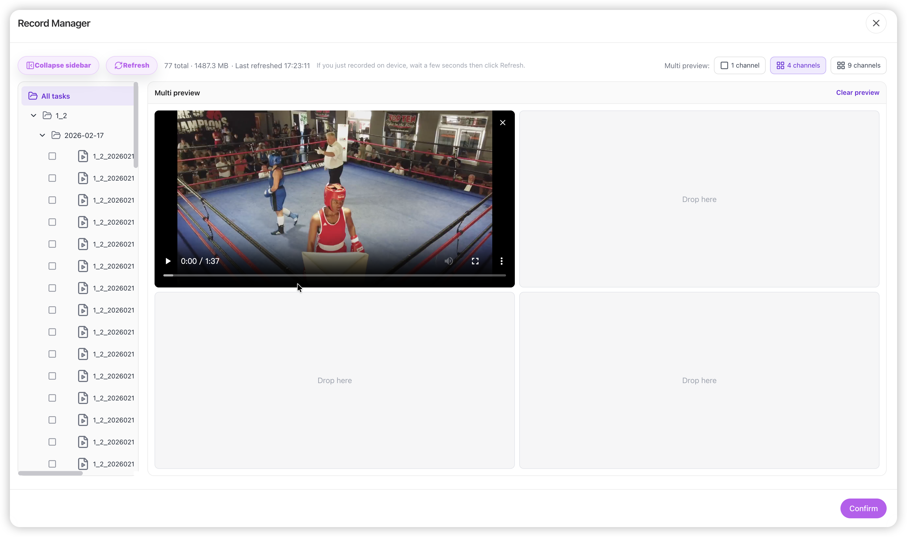

---

## 14. LLM Plugin Usage (Review Mode & Detector Mode)

This is the dedicated chapter for `LLM_PLUGIN`.
It covers two production scenarios:

1. **Review Mode**: CV model detects first, then LLM validates/filters false positives.
2. **Detector Mode**: No CV model for that target on device, LLM performs direct detection.

### 14.1 Where LLM Fits

| Scenario | Recommended Mode | Objective |
|----------|------------------|-----------|
| Frequent false positives (e.g., fire/smoke) | Review Mode | Increase alarm precision before final alert |
| No available CV model on edge | Detector Mode | Deliver detection quickly with LLM-only path |
| Mixed multi-algorithm pipeline | Both | Flexible composition per task chain |

### 14.2 Architecture and Pipeline Patterns

`LLM_PLUGIN` is designed as a centralized execution layer:

1. **Global singleton runtime** on device.
2. **Serial request execution** (queued) due embedded resource limits.
3. **Business semantics defined in algorithm plugins** (prompt, keyword, timeout, policy).
4. **LLM plugin handles execution and arbitration** (health, call, decision, write-back).

Recommended flow topologies:

1. Review Mode:
`RTSP -> FIRE_PLUGIN/PERSONDET_PLUGIN -> LLM_PLUGIN -> ALARM_PLUGIN`
2. Detector Mode:
`RTSP -> LLM_PLUGIN -> ALARM_PLUGIN`

### 14.3 Review Mode (CV + LLM Secondary Validation)

#### 14.3.1 Behavior

In Review Mode, upstream algorithms produce candidate alarms first.
`LLM_PLUGIN` reads `llm_request` from alarm JSON, evaluates the snapshot, then decides allow/deny.

Execution path:

1. Upstream alarm is generated.
2. `LLM_PLUGIN` obtains image (explicit `image_path` if provided, otherwise auto snapshot).
3. LLM inference runs with prompt + image.
4. Decision:
   - `allow`: keep upstream alarm;
   - `deny`: clear alarm (`alarm_count = 0`, `alarms = []`).
5. `llm_review` is appended to JSON for downstream alarm/audit.

#### 14.3.2 Configuration Ownership (Important)

Review business config should be owned by **algorithm plugins**, not by LLM plugin UI.

Current integrated examples:

1. `firedet_plugin`
2. `persondet_plugin`

You should configure review in algorithm node forms (enable, prompt, keyword, timeout, policy).

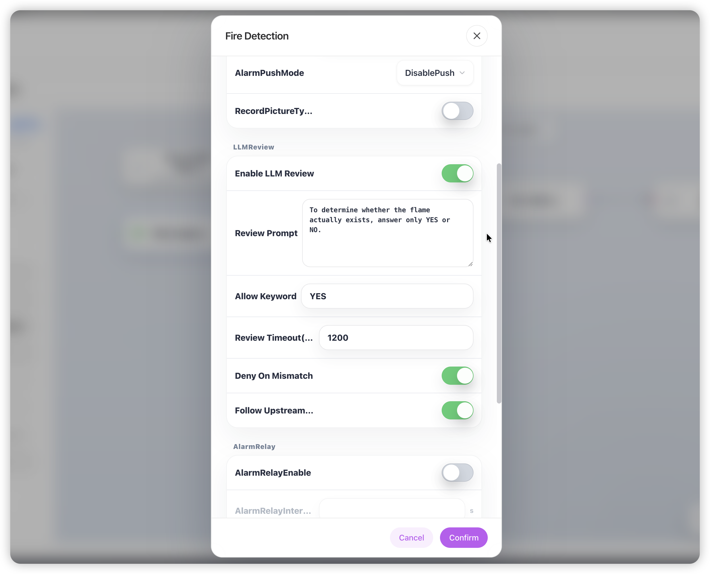

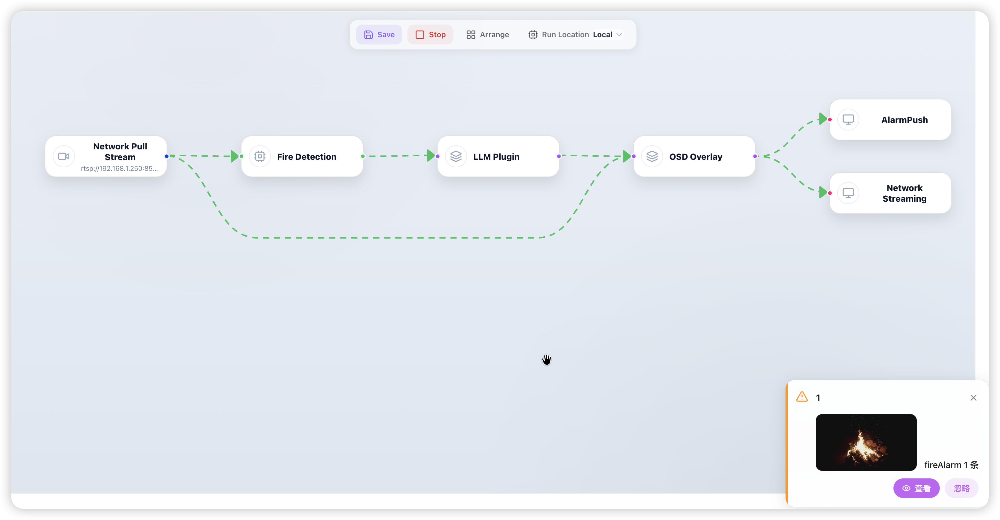

#### 14.3.3 Algorithm-side Review Parameters

| Key | Meaning | Typical Value |
|-----|---------|---------------|
| `llm_review_enable` | Enable LLM review for this algorithm alarm | `false/true` |
| `llm_review_prompt` | Review prompt (strict output) | "Answer YES or NO only" |
| `llm_review_expected_keyword` | Allow keyword | `YES` |
| `llm_review_timeout_ms` | Per-request timeout | 800~2000 |
| `llm_review_deny_on_mismatch` | Deny alarm when keyword not matched | `true` |
| `llm_review_follow_on_error` | Follow upstream result if LLM call fails | `true` (stable default) |
| `llm_review_decode_location` | Override runtime location | `""/local/compute_card_1/compute_card_2` |

#### 14.3.4 LLM Node Config in Review Mode

In Review Mode, LLM node is mainly for runtime location/service endpoint, not business prompts.

Core keys:

| Key | Meaning |
|-----|---------|
| `decode_location` | Default runtime location: `local / compute_card_1 / compute_card_2` |
| `http_url` | LLM service endpoint |

If algorithm payload includes `llm_review_decode_location`, it overrides the LLM node default.

#### 14.3.5 Step-by-step (Review Mode)

1. Create task and open flow editor.
2. Build flow:
`RTSP -> Algorithm (fire/persondet) -> LLM -> Alarm`.
3. Open algorithm node config and enable `llm_review_enable`.
4. Fill prompt/keyword/timeout/policy in algorithm node.
5. Open LLM node config and set `decode_location` + `http_url`.
6. Save and run task.
7. Verify `llm_review` fields in alert JSON/list.

#### 14.3.6 Review Result Fields

`LLM_PLUGIN` writes `llm_review` into alarm JSON:

| Field | Meaning |
|-------|---------|
| `decision` | `allow / deny / skip` |
| `matched` | Keyword matched or not |
| `success` | LLM call success flag |
| `profile` | Actual runtime profile/location |
| `latency_ms` | Inference latency |
| `source` | Upstream node name |
| `response` | Raw LLM response |
| `error` | Error detail when failed |

### 14.4 Detector Mode (LLM-only Detection)

#### 14.4.1 Behavior

Detector Mode is for cases without a dedicated CV model on device.
`LLM_PLUGIN` periodically samples frames and decides if target exists, then emits standard alarms.

Recommended flow:

`RTSP -> LLM_PLUGIN -> ALARM_PLUGIN`

#### 14.4.2 Detector Parameters

| Key | Meaning | Typical Value |
|-----|---------|---------------|
| `detector_enable` | Enable detector mode | `true` |
| `detector_prompt` | Detector prompt | "Determine if target exists. Answer YES or NO only." |
| `detector_expected_keyword` | Match keyword | `YES` |
| `detector_interval_sec` | Detection interval | 2~10 |

Advanced keys (JSON/deployment-level config):

| Key | Meaning |
|-----|---------|
| `detector_timeout_ms` | Per-request timeout |
| `detector_alarm_type` | Alarm type string |
| `detector_push_interval_ms` | Alarm push throttling |
| `detector_follow_on_error` | Follow policy on call failure |

#### 14.4.3 Step-by-step (Detector Mode)

1. Build flow:
    `RTSP -> LLM -> Alarm`.

2. Enable `detector_enable` in LLM node.

3. Configure `detector_prompt`, `detector_expected_keyword`, `detector_interval_sec`.

4. Save and run.

5. Validate periodic detector alarms in alert panel.

   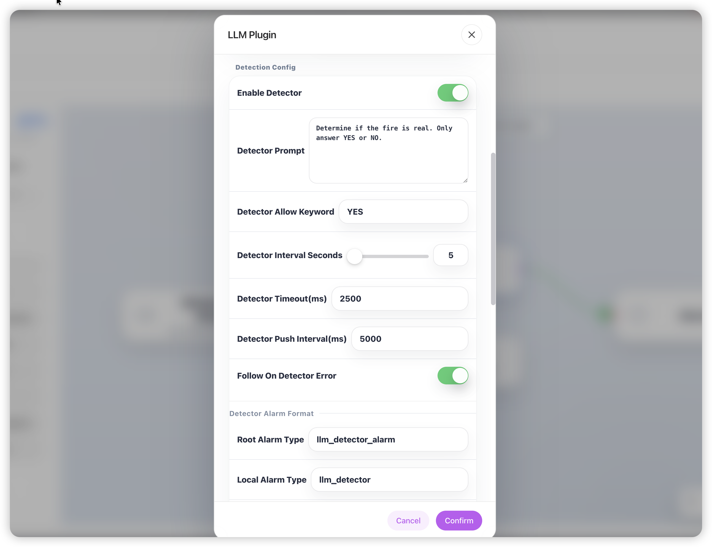

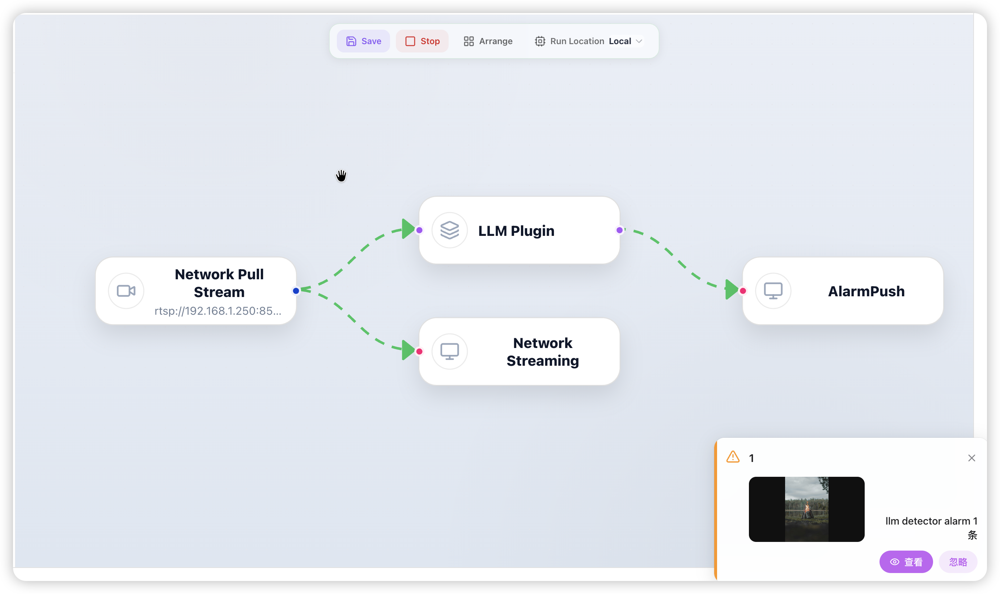

#### 14.4.4 Detector Mode Notes

1. Detector Mode is best for LLM-only chains (no upstream algorithm result).
2. Keep prompts strict and binary (YES/NO only).
3. Very short interval increases queue wait and device load.

### 14.5 `llm_request` Payload Contract (for Algorithm Plugin Developers)

Algorithm plugins can attach `llm_request` in alarm JSON root:

```json
{
  "llm_request": {
    "enabled": true,
    "prompt": "Determine whether fire is real. Answer YES or NO only.",
    "expected_keyword": "YES",
    "timeout_ms": 1200,
    "deny_on_mismatch": true,
    "follow_upstream_on_error": true,
    "decode_location": "compute_card_1",
    "payload": {
      "algo": "firedet",
      "task_id": "1001",
      "alarm_type": "fireAlarm"
    }
  }
}
```

Supported `llm_request` fields:

| Field | Meaning |
|-------|---------|
| `enabled` | Enable this review request |
| `prompt` | Prompt for this request |
| `expected_keyword` | Allow keyword |
| `timeout_ms` | Request timeout |
| `deny_on_mismatch` | Deny on keyword mismatch |
| `follow_upstream_on_error` | Keep upstream result on call error |
| `decode_location` | Per-request runtime override |
| `image_path` | Explicit image path (optional) |
| `payload/context` | Extra context (optional, merged into prompt) |

### 14.6 Runtime Behavior and Production Guidance

#### 14.6.1 Serial request

1. Restricted by hardware, the request is currently executed serially by queue.
2. Under burst load, requests queue; if queue is full, new requests are rejected.

#### 14.6.2 Auto Resource Management

1. Runtime can auto-start service when needed (if start command is configured).
2. Runtime can auto-stop service after idle timeout.
3. Runtime location can be local/card1/card2.

#### 14.6.3 Prompt and Policy Recommendations

1. Use stable prompt templates with strict output constraints.
2. Avoid long/open-ended prompts in real-time alarm flows.
3. For high-risk events, prefer `deny_on_mismatch=true`.
4. For continuity-critical tasks, keep `follow_on_error=true`.

### 14.7 LLM-specific Troubleshooting

| Symptom | Likely Cause | Action |
|---------|--------------|--------|
| `review` section still appears in LLM UI | Old plugin package/cache still in use | Repackage/reload plugin and restart service |
| Review has no effect | No `llm_request` from upstream or review disabled | Check algorithm-side config and payload |
| All alarms denied | Prompt/keyword mismatch | Tighten prompt and verify expected keyword |
| Frequent timeout | Service capacity low or timeout too short | Increase timeout/interval and reduce load |
| No detector alarms | Detector not enabled or keyword mismatch | Check detector parameters |

---


## 15. Intelligent Retrieval Usage

This chapter is for end users and operations teams. It explains how to use Intelligent Retrieval to quickly locate relevant alert snapshots and recording clips in production environments.

### 15.1 Capability Overview

Intelligent Retrieval supports:

1. **Text-to-image/video search**: enter a natural language description (for example, "fire scene with smoke"), then retrieve relevant snapshots and video hits.
2. **Image-to-image/video search**: use a reference image to find visually similar snapshots and recording segments.
3. **Unified scope filter**: search within `image`, `video`, or `all`.
4. **Incremental indexing**: newly generated alert images and recording files are indexed continuously without requiring full rebuild each time.

Typical business scenarios:

- Alert verification and false-positive reduction
- Incident trace-back and evidence retrieval
- Security operation review and post-event analysis

### 15.2 Data Sources and What Gets Indexed

Intelligent Retrieval indexes two data streams:

1. **Alert snapshots** generated by alert workflows.
2. **Recording videos**, indexed by key-frame sampling policy.

Notes:

- Video search returns matched key frames for fast timeline positioning.
- For best coverage, enable both alert and recording pipelines.

### 15.3 Prerequisites Before Use

Before go-live, confirm:

1. Task pipeline is running correctly (input, algorithm, alert, recording).
2. Storage path is writable and has enough free space.
3. Intelligent Retrieval is enabled in system settings and key parameters are configured.
4. Initial background indexing has completed (recommended to run during off-peak time).

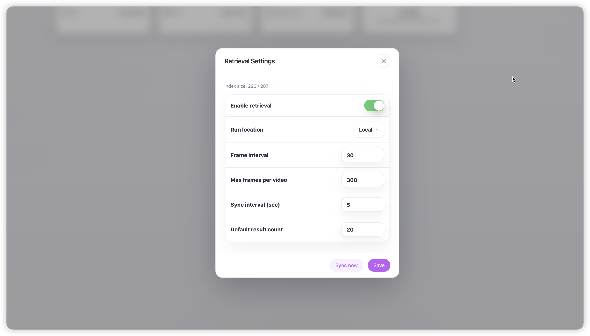

### 15.4 Key System Settings

Recommended key parameters in **Settings -> Intelligent Retrieval**:

| Parameter | Meaning | Recommended Baseline |
|-----------|---------|----------------------|
| **Retrieval Enabled** | Enable/disable Intelligent Retrieval | Enabled |
| **Run Location** | Runtime device for retrieval model (local / compute card) | Use compute card when host is busy |
| **Frame Sampling Interval** | Sample 1 frame every N frames for video indexing | 30 (common) |
| **Max Indexed Frames per Video** | Upper bound of indexed frames per video file | 300 (common) |
| **Text Search Threshold** | Minimum similarity for text search | -1 (no hard filter at start) |
| **Image Search Threshold** | Minimum similarity for image search | -1 (no hard filter at start) |

Configuration behavior:

- Saved settings are applied immediately whenever runtime is ready.
- If service is still warming up, settings are saved first and applied automatically later.
- Settings are persisted and auto-loaded on next application restart.

### 15.5 Standard User Workflow

#### 15.5.1 Text Search

1. Open the Intelligent Retrieval page.
2. Enter concise and explicit query text.
3. Select search scope: image / video / all.
4. Run search and review sorted results.
5. Verify candidate results with preview, timestamp, and source task context.

#### 15.5.2 Image Search

1. Upload or select a reference image.
2. Choose search scope (recommended: `all` first).
3. Execute search and inspect ranked results.
4. Open selected result for verification or export.

#### 15.5.3 Video Result Positioning

1. Select a video result item.

2. Jump to the matched timestamp/key-frame position.

3. Use Recording Management for surrounding timeline playback and evidence download.

   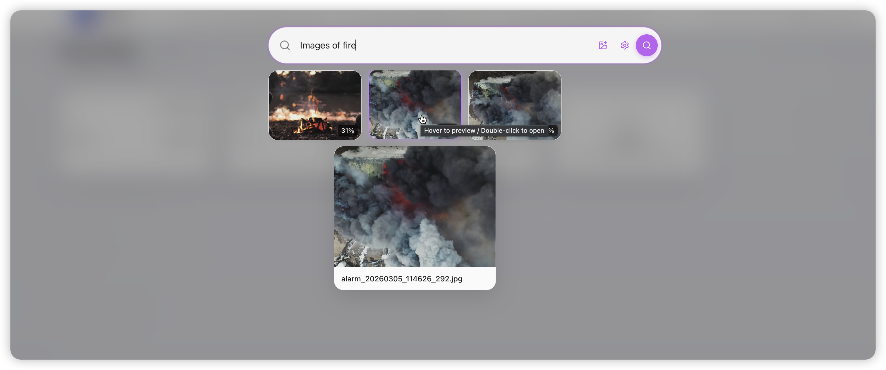

### 15.6 Result Interpretation

1. **Similarity score**: higher score generally indicates stronger semantic/visual relevance.
2. **Close score values**: common in small datasets or highly similar scenes; always verify by content.
3. **Multiple hits from same video**: expected when multiple key frames match; prioritize higher-score hits with broader time spread.
4. **Final decision rule**: retrieval results are for rapid filtering; business conclusions should be confirmed by human review and original evidence.

### 15.7 Data Lifecycle and Consistency

1. New alert images and new recordings are indexed incrementally.
2. When snapshots or recordings are removed through system workflow, corresponding index entries are removed as well.
3. Prefer built-in deletion operations; avoid direct filesystem-only deletion to reduce temporary inconsistency.
4. After historical data migration, run one full sync/rebuild to realign index and source data.

### 15.8 Production Deployment Recommendations

1. **Initial rollout**: schedule first full indexing in off-peak windows.
2. **Parameter tuning**: smaller sampling interval improves recall but increases index size and compute cost.
3. **Resource isolation**: if possible, separate retrieval runtime location from core streaming/preview workload.
4. **Operations practice**: periodically review hit quality and refine thresholds/query templates.

### 15.9 User-facing FAQ

| Symptom | Likely Cause | Recommended Action |
|---------|--------------|--------------------|
| Search not available right after startup | Retrieval service still warming up | Retry after warm-up completes |
| Too few search results | Small dataset, strict threshold, or narrow scope | Relax thresholds and use `all` scope |
| Deleted item still appears briefly | Background sync not yet completed | Wait one sync cycle and retry |
| Video results look similar | Multiple key-frame hits in the same video | Use timestamp-based playback for validation |
| Search latency increases at peak hours | Resource contention | Adjust run location and sampling parameters |

---


## 16. Settings & System Management

### 16.1 Open Settings

- Click **gear icon** in top bar

### 16.2 Menu Items

| Item | Description |
|------|-------------|
| Alert Popup | Toggle alert floating notification |
| Logs | View, delete device logs |
| Language | Chinese ↔ English |
| Reboot | Reboot device (with confirm) |
| Upgrade App | Upload .deb |
| Upgrade Firmware | Upload .swu |
| Network Config | Cloud/access key |
| Intelligent Retrieval | Configure retrieval enable, run location, frame sampling and thresholds |
| Version Info | Device, app, firmware versions |
| Change Password | Change login password |
| Face Library | See 13.1 (when plugin enabled) |
| Recording | See 13.2 (when plugin enabled) |
| Logout | Return to login |

### 16.3 Upgrade App / Firmware

1. Select menu item
2. Drag or select file (app: `aibox-<model>_<ver>-<ts>_arm64.deb`; firmware: `*.swu`)
3. Click "Start Upgrade"
4. Wait; device will reboot

### 16.4 Device Details

- Double-click status capsule to open device details popup

  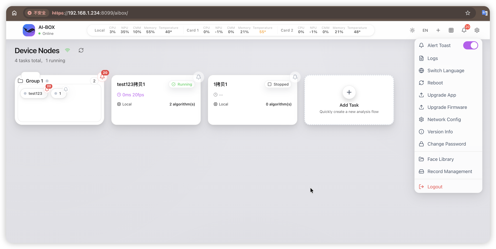

---

## 17. Context Menu Operations

### 17.1 Task Card Right-click

| Option | Description |
|--------|-------------|
| Edit | Open flow editor |
| Copy | Copy task |
| Move to X | Move to group |
| New Group | Create group and move |
| Delete | Delete task (red, confirm required) |

### 17.2 Group Card Right-click

| Option | Description |
|--------|-------------|
| Rename | Change group name |

### 17.3 Add Task Card Right-click

| Option | Description |
|--------|-------------|
| New Task | Same as click |

### 17.4 Blank Area Right-click

- "New Task" menu; click to create task

### 17.5 Close Menu

- Click outside menu to close

---

## 18. Comprehensive Example

Example: **Pedestrian detection at entrance + alerts + web preview**.

### 18.1 Scenario

- **Goal**: RTSP camera at entrance, pedestrian detection, alerts on detection, web preview
- **Prerequisite**: Device connected, RTSP URL known (e.g. `rtsp://192.168.1.10:554/stream1`)

### 18.2 Steps

1. Create task: Add Task → enter name → Create and Edit
2. Add nodes: RTSP Input, Pedestrian Detection, OSD Overlay (optional), Network Output, Alert Output
3. Connect: RTSP → Pedestrian → OSD → Network; Pedestrian → Alert
4. Configure RTSP Input: Enter URL, test connection, set decode location
5. Configure Pedestrian Detection: Thresholds; draw detection region if needed
6. Configure Alert Output: Alert threshold (e.g. 0.8)
7. Save & Run
8. Preview and verify alerts

### 18.3 Variants

| Variant | Action |
|---------|--------|
| Preview only | Omit Alert Output |
| Add face recognition | Chain face recognition after pedestrian; configure face library |
| Add recording | Add Recording Output node |
| Multi-input | If supported, add multiple inputs |

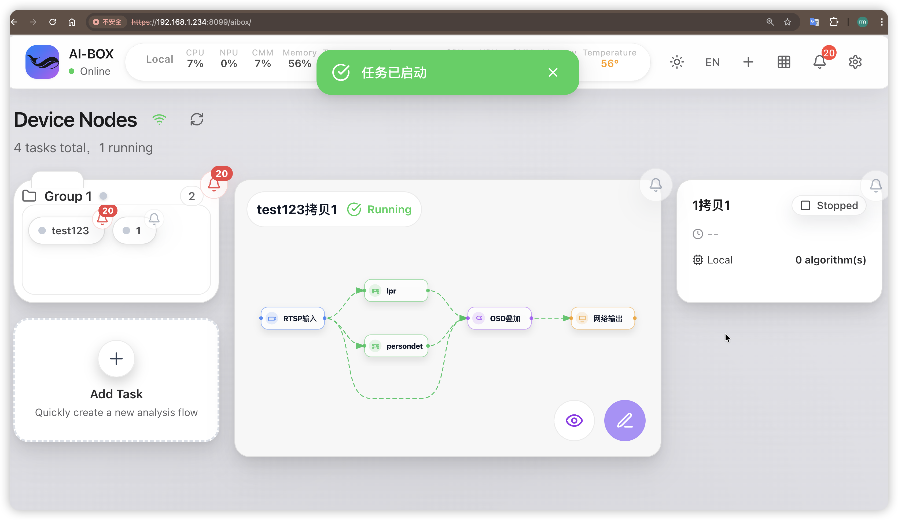

---

## 19. Factory Firmware Plugin Inventory & Capabilities

### 19.1 Scope and Source

- This chapter documents the **official plugin set shipped in the factory firmware image**.
- The list below reflects this delivery baseline; special project builds may add/remove plugins.

### 19.2 Factory-delivered Plugin Packages

| Plugin Package | Size | Primary Role |
|----------------|------|--------------|
| `alarm.plugin` | 959K | Alert output and event dispatch |
| `catdog.plugin` | 11M | Cat/Dog detection algorithm |
| `facedet.plugin` | 3.0M | Face detection algorithm |
| `facerec.plugin` | 106M | Face recognition algorithm (face library matching) |
| `firedet.plugin` | 26M | Fire detection algorithm |
| `gb28181.plugin` | 1.1M | GB28181 integration output |
| `hdmi.plugin` | 464K | HDMI video output |
| `llm.plugin` | 1.4M | Multimodal LLM review / detector |
| `lpr.plugin` | 34M | License plate recognition |
| `motor.plugin` | 12M | Motor/non-motor related detection |
| `netclient.plugin` | 693K | Network pull-stream input (RTSP, etc.) |
| `netserver.plugin` | 466K | Network streaming output |
| `osd.plugin` | 547K | OSD overlay processing |
| `p2p.plugin` | 1.3M | P2P access/output |
| `personAttr.plugin` | 37M | Person attribute analysis |
| `persondet.plugin` | 37M | Person detection algorithm |
| `record.plugin` | 1.2M | Recording output and storage |

### 19.3 Detailed Capabilities by Plugin

#### 19.3.1 Input Plugins

1. `netclient.plugin`
   - Function: pulls camera/network streams (typically RTSP), decodes frames, and feeds the graph.
   - Typical use: first node in most pipelines.
   - Typical chain: `RTSP -> Detection/LLM -> OSD/Alert/Stream/Record`.

#### 19.3.2 Algorithm Plugins

2. `persondet.plugin`
   - Function: detects people and outputs person target metadata.
   - Typical use: perimeter/entrance pedestrian monitoring.
   - Can be combined with: `osd`, `alarm`, `record`, `llm` (review mode).

3. `firedet.plugin`
   - Function: detects fire-like regions and emits fire alarm candidates.
   - Typical use: fire safety scenarios.
   - Can be combined with: `llm` review to reduce false positives, then `alarm`.

4. `facedet.plugin`
   - Function: detects face boxes and face quality cues for downstream matching.
   - Typical use: prerequisite stage for face recognition.
   - Typical chain: `netclient -> facedet -> facerec -> alarm/osd`.

5. `facerec.plugin`
   - Function: compares detected faces with configured face library and returns identity/match results.
   - Typical use: whitelist/blacklist/VIP face events.
   - Depends on: valid face library management and `facedet` outputs.

6. `personAttr.plugin`
   - Function: infers person attributes (for example clothing/appearance metadata, model-dependent).
   - Typical use: post-event search and structured description.
   - Typical chain: `persondet -> personAttr -> alarm/record`.

7. `catdog.plugin`
   - Function: detects cat/dog targets and outputs corresponding object results.
   - Typical use: pet monitoring or scene filtering.
   - Typical chain: `netclient -> catdog -> osd/alarm`.

8. `motor.plugin`
   - Function: vehicle/non-motor related detection or categorization (project/model dependent).
   - Typical use: traffic/roadside behavior analysis.
   - Typical chain: `netclient -> motor -> alarm/osd/record`.

9. `lpr.plugin`
   - Function: detects and recognizes vehicle license plates.
   - Typical use: vehicle access control and event indexing.
   - Typical chain: `netclient -> lpr -> alarm/record/server push`.

10. `llm.plugin`
    - Function A (Review Mode): secondary validation of upstream CV alarms to improve precision.
    - Function B (Detector Mode): direct LLM-only target detection in no-CV scenarios.
    - Runtime behavior: supports configurable API mode/profiles.

#### 19.3.3 Processing and Output Plugins

11. `osd.plugin`
    - Function: overlays boxes/text/time/status onto video frames.
    - Input expectation: video frames plus detection/alarm metadata.
    - Typical use: visualization for preview and streaming output.

12. `alarm.plugin`
    - Function: unified alarm handling, snapshot capture, local message insertion, and push dispatch.
    - Supports: local push message, server push message, relay, and TTS playback integration.
    - Input expectation: algorithm/LLM alarm JSON compatible with current alarm schema.

13. `netserver.plugin` (Network Streaming Output)
    - Function: re-encodes and outputs processed video for live network preview/streaming.
    - Typical use: publish OSD-overlaid stream to web preview or downstream consumers.
    - Typical chain: `... -> osd -> netserver`.

14. `hdmi.plugin` (HDMI Output)
    - Function: outputs processed video to HDMI display.
    - Typical use: local monitor wall / screen display on device side.
    - Typical chain: `... -> osd(optional) -> hdmi`.

15. `record.plugin`
    - Function: stores video stream to local recording files with management policy.
    - Typical use: event traceability and historical playback.
    - Typical chain: `... -> osd(optional) -> record`.

16. `gb28181.plugin`
    - Function: bridges stream/event data to GB28181 platforms.
    - Typical use: integration with standard surveillance platforms in public-sector projects.
    - Typical chain: `... -> gb28181`.

17. `p2p.plugin` (P2P Output)
    - Function: enables P2P access path for preview/control integration.
    - Typical use: remote connectivity scenarios where direct LAN path is not preferred.
    - Typical chain: `... -> p2p`.

### 19.4 Recommended Pipeline Templates

- CV + LLM Review + Alarm:
  - `netclient -> firedet/persondet/... -> llm -> alarm -> (osd/netserver/record)`
- LLM-only Detector + Alarm:
  - `netclient -> llm(detector mode) -> alarm`
- Visualized Streaming with Alarm:
  - `netclient -> algorithm/llm -> osd -> netserver`, and `algorithm/llm -> alarm`

### 19.5 Source Availability (Open-source / Binary-only)

- The factory firmware includes a mix of plugin types:
  - Open-source (source code available in delivered SDK/project tree)
  - Binary-only (closed-source plugin package for direct deployment)
- **Important**: some delivered plugins are not open-source in standard factory delivery.
- For commercial redistribution, code-level modification rights, or source access requests, follow your project contract/license terms with the vendor.

---

## 20. Troubleshooting

### 20.1 Connection

| Symptom | Cause | Action |
|---------|-------|--------|
| "Device connection failed" | Device off, network issue | Check device app, network, firewall |
| "Device not connected" | Connection lost | Reconnect or refresh |
| Channel timeout | Device busy, network | Retry; restart device app if needed |

### 20.2 Tasks

| Symptom | Cause | Action |
|---------|-------|--------|
| Cannot start | Not connected, config error | Check connection, flow |
| Save fails | References deleted plugin | Remove or replace node |
| No preview | No Network Output, task not started | Add node, start task |

### 20.3 UI

| Symptom | Action |
|---------|--------|
| Display issues | Refresh, try another browser |
| Slow loads | Wait, check network/device load |

### 20.4 Language & Theme

- Language: Settings → Switch language
- Theme: Sun/moon icon in top bar

### 20.5 Help

- Check device logs
- Contact deployer or support

---

## Appendix A: Shortcuts

| Action | Shortcut |
|--------|----------|
| Delete selected node/edge | Delete |
| Arrange nodes | Top "Arrange" button |
| Fit viewport | Canvas controls / wheel |
| Region draw: Undo last step | Backspace or right-click |
| Region draw: Delete vertex/region | Delete |
| Region draw: Cancel | Esc |

---

## Appendix B: Glossary

| Term | Description |
|------|-------------|
| **Node** | A unit in the flow (input, algorithm, output) |
| **Edge** | Data connection between nodes |
| **Group** | Folder for multiple tasks |
| **Alert** | Notification from algorithm detection |
| **Schedule** | Time-based task start/stop |
| **detail_info** | Device-pushed node runtime info |
| **form_status** | Device-pushed form live status |
| **formList** | Plugin-provided form config |

---

## Appendix C: Details

### C.1 Task Names

- Name required; unique per device
- Copy appends "Copy"; editable

### C.2 Component Panel

- Collapses on small screens (< 640px)
- Categories can fold individually

### C.3 Canvas Zoom & Pan

- Wheel: zoom
- Drag blank: pan

### C.4 Flow Preview (Expanded Card)

- Single-click card expands to show flow preview
- Running: edges colored by status
- Missing plugins: nodes grayed

### C.5 Device Capsule Double-click

- Opens device details popup

---

**End of Document**

For updates, refer to the actual UI and product documentation.
