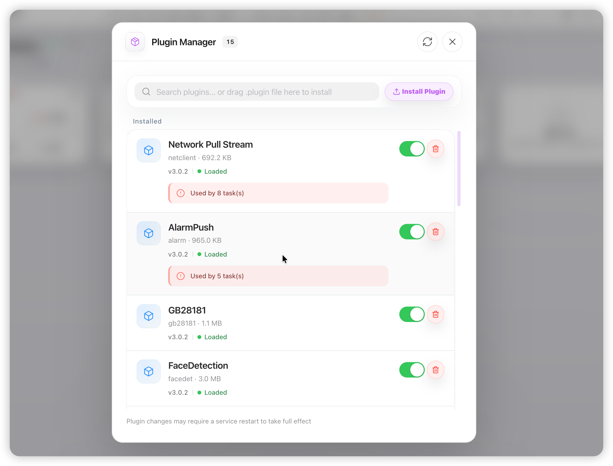
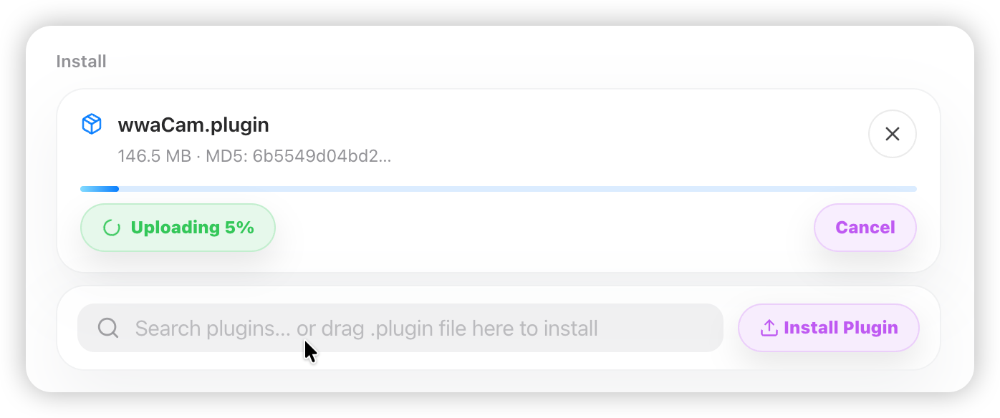
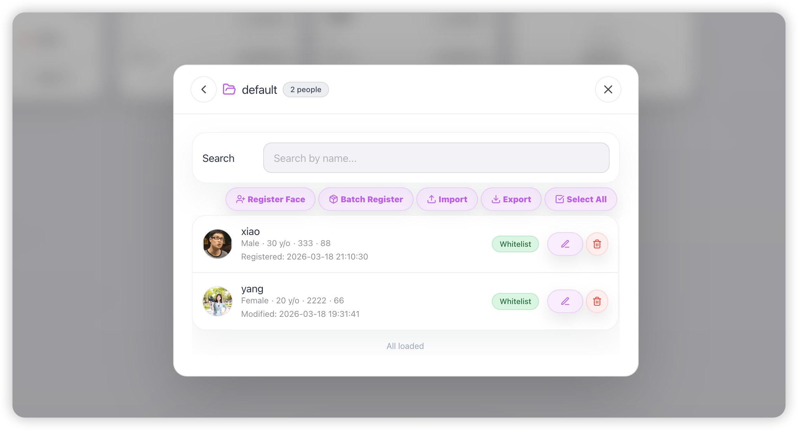

# AI-BOX Edge Box Management Platform — User Manual (English)

> Version: 1.2 | Document Type: User Guide | Audience: End Users, Operations Staff

---

## Table of Contents

1. [Product Introduction](#1-product-introduction)
2. [System Requirements & Access](#2-system-requirements--access)
3. [Quick Start: Login](#3-quick-start-login)
4. [Main Interface Overview](#4-main-interface-overview)
5. [Task Management](#5-task-management)
6. [Flow Editor](#6-flow-editor)
7. [Node Configuration](#7-node-configuration)
8. [Runtime Node Status](#8-runtime-node-status)
9. [Task Card Status](#9-task-card-status)
10. [Node Connection Guidelines](#10-node-connection-guidelines)
11. [Video Preview & Multi-view](#11-video-preview--multi-view)
12. [Alert Management](#12-alert-management)
13. [Plugin Management](#13-plugin-management)
14. [Plugins: Face Library & Recording](#14-plugins-face-library--recording)
15. [LLM Plugin Usage (Review Mode & Detector Mode)](#15-llm-plugin-usage-review-mode--detector-mode)
16. [Intelligent Retrieval Usage](#16-intelligent-retrieval-usage)
17. [Settings & System Management](#17-settings--system-management)
18. [Context Menu Operations](#18-context-menu-operations)
19. [Comprehensive Example](#19-comprehensive-example)
20. [Factory Firmware Plugin Inventory & Capabilities](#20-factory-firmware-plugin-inventory--capabilities)
21. [Troubleshooting](#21-troubleshooting)

---

## 1. Product Introduction

### 1.1 What is AI-BOX?

AI-BOX is an **Edge computing box management platform** for deploying, running, and managing AI video analysis tasks on edge devices. Using a visual drag-and-drop interface, you can combine input sources (e.g., RTSP cameras), algorithms (e.g., pedestrian detection, face recognition), and outputs (e.g., network streaming, alerts, recording) into complete analysis pipelines.

### 1.2 Core Features

| Module | Description |
|--------|-------------|
| **Task Management** | Create, edit, start, stop, copy, delete tasks; group management |
| **Flow Editing** | Drag-and-drop canvas, configure node parameters, connect data flows |
| **Video Preview** | Multi-channel live preview, multiple layouts, full screen |
| **Alert Notification** | View, acknowledge, delete alerts; alert popup toggle |
| **Face Library** | Manage face lists (whitelist/blacklist/VIP, etc.) |
| **Recording** | Browse, preview, delete recordings; space cleanup |
| **System Settings** | Device info, version, upgrade, reboot, change password |

---

## 2. System Requirements & Access

### 2.1 Browser Requirements

- **Recommended**: Chrome 90+, Edge 90+, Safari 14+
- JavaScript must be enabled
- HTTPS recommended (required for recording preview)

### 2.2 Access URL

- **Local**: `https://<device-IP>:port` or `https://<device-IP>:port/aibox/`
- **Example**: `https://192.168.1.100:8099/aibox/`

### 2.3 Device Connection

- The web app connects to the device via WebRTC. Ensure the **AI-BOX app is running** on the device.
- If connection fails, check: device online status, network connectivity, firewall rules.

---

## 3. Quick Start: Login

### 3.1 Open Login Page

1. Enter the access URL in the browser address bar (see 2.2)

   

2. If not logged in, you will be redirected to the login page.

### 3.2 Login Steps

| Step | Action | Notes |
|------|--------|-------|
| 1 | Enter username in the Account field | Default is usually `admin` for local deployment |
| 2 | Enter password in the Password field | Input is masked; default is `admin` |
| 3 | Click **Login** | The system first connects via WebRTC, then validates credentials; either step failing will show an error |
| 4 | Wait for connection | Button shows "Logging in..."; do not click repeatedly; usually completes in seconds |
| 5 | Success | Redirects to home (Device Nodes); session conflict may occur if already logged in elsewhere |

### 3.3 Login Result

- **Success**: Redirects to home (Device Nodes)

  

- **Failure**: Error message at top or in popup (e.g., "Device connection failed", "Login expired")

- If **device connection failed**: Confirm the device app is running and network is reachable, then refresh and retry.

### 3.4 Theme & Language (Login Page)

- **Theme**: Toggle light/dark via sun/moon icon on the login page.
- **Language**: Switch Chinese/English from the main Settings menu after login.

  

---

## 4. Main Interface Overview

### 4.1 Top Bar (Header)

| Area | Content |
|------|---------|
| **Left** | Logo, device name, online/offline status; shows "Reconnect" when offline |
| **Center** | Device status capsules: CPU, NPU, memory, temperature (double-click for details) |
| **Right** | Theme, language, add task, multi-view, alert bell, settings menu |

### 4.2 Device Status Capsules

- Shows real-time resource usage for **local** and **compute cards**
- **Colors**: Green = normal, Orange = warning, Red = critical
- **Double-click** to open device details popup

  
  

### 4.3 Main Content Area

- **Title**: "Device Nodes", with "X tasks total, X running"
- **Connection icon**: Green = connected, Orange = connecting, Red = disconnected
- **Refresh**: When connected, refreshes data without disconnecting; when disconnected, attempts to reconnect
- **Task cards & groups**: See next section

  

### 4.4 When Device Not Connected

A red banner appears with:
- Error description
- **Reconnect**: Try to re-establish connection
- **Re-login**: Clear session and return to login page

---

## 5. Task Management

### 5.1 Task Card Types

| Type | Appearance | Description |
|------|-------------|-------------|
| **Group Card** | Folder icon + count | Holds multiple tasks; click to expand/collapse |
| **Task Card** | Name, status, algorithm count | Single analysis task |
| **Add Task Card** | Dashed border + plus | Quick create new task |

### 5.2 Create New Task

**Method 1: Click "Add Task" card**

1. Find the "Add Task" card (dashed border, "+" in center)
2. Click it
3. Enter task name in the dialog
4. Click "Create and Edit" to open the flow editor

**Method 2: Click top "+" button**

1. Click the plus icon in the top bar
2. Same steps as above

**Method 3: Right-click on blank area**

1. Right-click on any blank area (not on cards or buttons)
2. Choose "New Task"
3. Enter name in the dialog

   
   

### 5.3 Edit Task

1. **Double-click** the task card, or click the **Edit** icon on the card
2. Opens the flow editor (see Chapter 6)

   

### 5.4 Start & Stop Task

- **Start**: Click **play icon** (▶) on the task card
- **Stop**: Click **stop icon** (■) on the task card
- **Status**: Running (green), Stopped (gray), Error (red), Schedule Paused (purple)

> ⚠️ Cannot start/stop when device is not connected.

### 5.5 Copy Task

1. Right-click the task card
2. Choose "Copy"
3. A copy is created with "Copy" suffix in the name

   

### 5.6 Delete Task

1. Right-click the task card
2. Choose "Delete" (red item)
3. Confirm in the dialog
4. ⚠️ Deletion is irreversible.

### 5.7 Group Management

**Create group**: Right-click task card → "New Group"; or drag a task onto a group card

**Move task**: Right-click task → "Move to X"; or drag task onto group card

**Rename group**: Right-click group card → "Rename"

**Remove from group**: Right-click task → "Remove from Group" (when task is in a group)

  
  

### 5.8 Alert Bell on Task Card

- Shows unread alert count for that task/group
- Click to open alert panel filtered by that task

  

### 5.9 Task Card Expand/Collapse

- **Single click**: Expands to show flow preview (nodes and connections)
- **Click blank area again**: Collapses to small card
- **Double-click**: Opens flow editor directly
- When expanded: **Preview**, **Edit** buttons at bottom-right; hover for **Start/Stop**, **More**

  

### 5.10 Drag to Copy (Option/Alt + Drag)

- Hold **Option** (Mac) or **Alt** (Windows) and **drag** task card to another group or blank area
- Releases a copy at the target; no need to right-click Copy first

---

## 6. Flow Editor

### 6.1 Open Flow Editor

- Double-click task card, or click Edit icon on the card
- New tasks: click "Create and Edit" after creation

### 6.2 Editor Layout

| Area | Description |
|------|--------------|
| **Left panel** | Input, Algorithm, Processing, Output components; collapsible |
| **Center canvas** | Drag, connect, layout area |
| **Top toolbar** | Save, Run, Arrange, Close |
| **Run location** | Dynamic or specific compute card |

### 6.3 Add Nodes to Canvas

1. Locate the component in the left panel (Input, Algorithm, Processing, Output)
2. Drag it onto the canvas
3. If a duplicate type exists, you'll see "Task already contains xxx"
4. Release; node appears at drop location

  

### 6.4 Connect Nodes

1. Each node has left (input/target) and right (output/source) handles
2. Drag from **source left handle** to **target right handle**
3. Canvas auto-arranges after new connections
4. Use top "Arrange" button to re-layout

> ⚠️ Direction must be: Input → Algorithm → Processing → Output.

### 6.5 Configure Node Parameters

1. **Double-click** the node on the canvas
2. Fill the form in the config popup
3. Use "Test Connection", "ONVIF Search" etc. if available
4. Click "OK"; config is applied locally; click "Save" or "Run" at top to sync to device

   

### 6.6 Canvas Operations

- **Pan**: Drag on blank canvas
- **Zoom**: Mouse wheel
- **Delete node**: Select node, press Delete
- **Delete edge**: Select edge, press Delete
- **Arrange**: Click top "Arrange" button

### 6.7 Save & Run

- **Save**: Top "Save" button
- **Run**: Top "Run" button (saves then starts)
- If task references deleted plugins, save/run will fail; remove or replace those nodes first

### 6.8 Canvas Context Menu

- Right-click **node**: Edit node, Delete node
- Right-click **edge**: Delete edge
- Click outside to close menu

### 6.9 Run Location

- Top "Run location" dropdown: **Dynamic**, **Local**, **Compute Card 1**, **Compute Card 2**, etc.
- **Dynamic**: Device assigns automatically; specific choice fixes to that unit

  

---

## 7. Node Configuration

Node config is driven by **formList** from the device/plugins. Common control types:

### 7.1 Input Controls

| Type | Description |
|------|--------------|
| **input** | Text or number; placeholder, unit |
| **textarea** | Multi-line text |
| **inputNumber** | Min/max range |
| **password** | Masked input |

### 7.2 Selection Controls

| Type | Description |
|------|--------------|
| **select** | Dropdown choices |
| **switch** | Toggle on/off |
| **slider** | Drag to set value |

### 7.3 Read-only & Status

| Type | Description |
|------|--------------|
| **readOnly** | Display only |
| **status** | Status label with color (OK/RUNNING=green, FAILED=red, WARNING=orange) |

### 7.4 Special Config

| Type | Description |
|------|--------------|
| **button** | Execute action (e.g., Test Connection, ONVIF Search) |
| **divider** | Section header |
| **schedule** | Time-based schedule (Monday–Sunday, 24h) |
| **regionDraw** | Draw detection regions on snapshot |

### 7.5 Schedule (Time-based Control)

1. In RTSP Input node config, open "Schedule"
2. Set enabled times by day, 15-minute slots
3. Enable/disable days
4. Copy to other days, clear day, etc.
5. Task runs only in enabled periods

   

### 7.6 Region Drawing (Detection Area)

1. Task must be **saved** and device **connected**
2. In algorithm node config, click "Draw Detection Region"
3. Click "Refresh Snapshot" to get current frame

**Drawing:**

| Type | Action |
|------|--------|
| **Line** | Two clicks to complete, or double-click |
| **Polygon** | Click to add vertices (3+); double-click or click start to close |
| **Undo last step** | Right-click or **Backspace** while drawing |
| **Cancel** | **Esc** |

**Editing & deletion:**

| Action | Description |
|--------|-------------|
| Drag vertex | Left-click and drag vertex to reshape |
| Delete vertex | Left-click vertex to select, press **Delete**; or right-click vertex |
| Delete region | Right-click inside region or on segment; choose "Delete this region"; overlapping targets are highlighted in red |
| Select region | Right-click region; click elsewhere to close menu or deselect |

Use Undo, Clear All as needed; supports multiple regions; save to apply.

   

### 7.7 Quick Buttons

| Button | Description |
|--------|-------------|
| **Test Connection / RTSP Test** | Validate RTSP URL |
| **ONVIF Search** | Search ONVIF devices on LAN |
| **Face Library** | Open face library (face recognition nodes) |
| **Select Recording Path** | Choose recording storage path |

---

## 8. Runtime Node Status

When a task runs, nodes and edges show live status.

### 8.1 Edge Status

| Status | Color | Meaning |
|--------|-------|---------|
| **idle** | Gray dashed | Not running or unknown |
| **ok** | Green dashed (animated) | Data flowing normally |
| **stuck** | Red dashed | Blocked or error |
| **paused** | Purple dashed | Schedule paused (outside enabled time) |

### 8.2 Node Hover (detail_info)

- **Hover** over a node in a running task to see a popup
- Shows **detail_info** from device: format, resolution, fps, latency, etc.
- Click values to copy to clipboard

### 8.3 Form Status in Config

- Some read-only/status fields in node config are updated live via **form_status**

### 8.4 Node Timeout

- If a node has no valid data for ~10 seconds, task health becomes **warning** or **error**
- Task card shows "Run Warning" or "Run Error"; edges may turn red

---

## 9. Task Card Status

### 9.1 Task & Health Status

| Status | Icon/Color | Meaning |
|--------|------------|---------|
| **Running** | Green check | Normal |
| **Stopped** | Gray square | Stopped |
| **Starting/Stopping** | Orange loading | In progress |
| **Error** | Red X | Critical error |
| **Run Warning** | Orange triangle | Some nodes timed out |
| **Schedule Paused** | Purple pause | Within schedule, outside enabled time |

### 9.2 Latency & FPS

- When **running** and has **Network Output** node: shows **Xms Yfps** or **Xms** or **--**

### 9.3 Schedule Resume Countdown

- When schedule-paused, card shows countdown like "3d 2h 15m 30s until resume"

  

### 9.4 Run Location & Algorithm Count

- **Run location**: Local, Compute Card 1, etc.
- **X algorithm(s)**: Number of algorithm nodes

### 9.5 Card Left Color Bar

| Color | Meaning |
|-------|---------|
| Purple | Schedule paused |
| Red | Run error |
| Orange | Run warning |

---

## 10. Node Connection Guidelines

### 10.1 Data Flow Order

- Standard: **Input → Algorithm → Processing → Output**
- Input nodes as start; output nodes as end
- Algorithm/processing can be parallel or serial

### 10.2 Connection Rules

- Connect source **left** to target **right**
- No duplicate node types in one task (unless plugin supports multi-input)

### 10.3 Tips

1. Build flow first, then configure parameters
2. Preview requires **Network Output** node
3. Alerts require **Alert Output** node
4. Run will auto-save if there are unsaved changes

### 10.4 Common Errors

| Symptom | Cause | Fix |
|---------|-------|-----|
| Cannot connect | Wrong direction | Connect source right → target left |
| No preview | No Network Output | Add and connect Network Output |
| No alerts | No Alert Output | Add and connect Alert Output |
| Node grayed | Plugin removed | Remove or replace node |

---

## 11. Video Preview & Multi-view

### 11.1 Open Multi-view

- Click **grid icon** in top bar
- Or **drag** task to preview dock at bottom

### 11.2 Add Preview Source

- **Drag** task to preview dock
- Or select from multi-view dialog

### 11.3 Layout

- Auto, 2/4/9/16 grid, custom

### 11.4 Full Screen & Close

- Full screen button; Close All

### 11.5 Notes

- Task must have **Network Output** node
- Must **start task** before preview

  
  

---

## 12. Alert Management

### 12.1 Open Alert Panel

- Click **bell icon** in top bar; red number = unread count

### 12.2 Alert List

| Action | Description |
|--------|-------------|
| View | Click to see details, large image |
| Acknowledge | Mark as read |
| Mark All Read | Mark all as read |
| Delete | Single or batch (with confirm) |
| Load More | Pull up at bottom |

### 12.3 Alert Popup

- Settings menu → "Alert Popup" toggle

### 12.4 Filter

- By task, by alert type

  

---

## 13. Plugin Management

This chapter is intended for customers and operations teams. It explains how to upload, install, enable, disable, uninstall, replace, and roll back plugins from the web UI.

### 13.1 Entry and Status Overview

**Where to open it:**

- From the top menu: **Plugin Manager**
- In some builds, the same entry is also available from the settings menu

**Common status meanings in the plugin list:**

| Status | Meaning | Recommended user action |
|--------|---------|-------------------------|
| **Loaded** | The plugin has already been loaded successfully by the running service | Safe to use in flows and tasks |
| **Installed** | The package is already stored on the device, but the current service has not fully loaded it yet | Usually restart the service and verify again |
| **Disabled** | The plugin was manually turned off | Do not use it in new tasks until re-enabled |
| **Pending disable** | The plugin is still referenced by tasks and cannot be fully disabled yet | Stop the related tasks and check status again |
| **Pending update** | The new package is already prepared, but the old version is still waiting for task references to be released | Perform the change during a low-traffic window |
| **Error** | Loading, initialization, or validation failed | Check package integrity, compatibility, and runtime dependencies |

**Compatibility warning:**

- If the UI shows a compatibility warning, the platform declared by the plugin does not fully match the current device architecture, OS, or chip.
- You may validate it in a test environment first. Confirm compatibility before using it in actual tasks.

### 13.2 Uploading and Installing Plugins

#### 13.2.1 Standard installation procedure

1. Open **Plugin Manager**.

2. Click **Install Plugin**, or drag a `.plugin` file into the upload area.

3. Wait for upload, validation, and package inspection to finish.

4. Confirm plugin name, type, version, and compatibility information.

5. Click **Install**.

6. After installation succeeds, follow the UI prompt to **Restart Service**.

7. After the page reconnects, verify that the plugin state becomes **Loaded**.

   

#### 13.2.2 What users may see during installation

- Small plugin packages usually complete validation and installation quickly.

- Large plugin packages may take noticeably longer than normal configuration changes.

- Even after the upload finishes, the page may still show a processing state while the device continues the installation. This is often normal.

  

#### 13.2.3 What to check before installing

1. Make sure the file is a valid `.plugin` package.
2. Confirm the plugin type matches your planned use, such as `llm.plugin`, `record.plugin`, or `persondet.plugin`.
3. Confirm the version matches the intended release plan.
4. Check whether the current device architecture, OS version, and chip are compatible.
5. Confirm device storage is sufficient so installation does not fail after upload.

### 13.3 Replacement, Upgrade, and Same-type Plugin Override

If a plugin of the same type already exists on the device, installing a new package of that type is typically treated as a replacement or upgrade.

#### 13.3.1 Recommended workflow

1. Confirm which tasks are currently using that plugin.
2. Stop the related tasks during a low-traffic window.
3. Install the new plugin package.
4. Restart the service after installation.
5. Verify plugin version, state, and related task behavior after restart.

#### 13.3.2 Typical system behavior

- If the old plugin is still referenced by running tasks, direct replacement may be blocked until those tasks are released.
- After a successful replacement, the system usually preserves the old package as a managed backup for rollback.
- Before restart, the UI may show the plugin as **Installed** or **Pending update** rather than **Loaded**. This is expected transitional behavior.

#### 13.3.3 Operation Tips

- Before replacement, make sure related tasks have been stopped.
- After replacement, return to the task page and confirm tasks still work normally.

### 13.4 Enabling, Disabling, and When Changes Take Effect

#### 13.4.1 Enabling a plugin

1. Locate the target plugin in the list.
2. Turn on the enable switch.
3. If the UI asks for **Restart Service**, follow that prompt.
4. After restart, return to the plugin list and confirm the state is correct.

#### 13.4.2 Disabling a plugin

1. Turn off the plugin switch.
2. If no task is using the plugin, the system may disable it immediately.
3. If tasks still reference it, the state will become **Pending disable**.
4. Stop the related tasks and, if needed, restart the service before checking the final state again.

#### 13.4.3 Common misunderstandings

- **Installed is not the same as Loaded**: installed only means the package is already stored on disk.
- **Pending disable is not necessarily a failure**: it usually means a task still references the plugin.
- **No immediate state change after enable does not always mean an error**: the system may still be processing the change or waiting for restart.

### 13.5 Uninstall and Rollback

#### 13.5.1 Uninstalling a plugin

1. Confirm that no task still references the plugin.
2. If tasks still contain nodes from that plugin, remove or replace those nodes and save the tasks first.
3. Stop all related running tasks.
4. Return to **Plugin Manager** and uninstall the plugin.
5. Verify that the plugin disappears from the list or moves to the expected final state.

**Notes:**

- If the UI reports that the plugin is still in use, do not keep retrying blindly. Remove task dependencies first.
- If old tasks still contain nodes from a removed plugin, those tasks may no longer save or run until the nodes are cleaned up manually.

#### 13.5.2 Rolling back a plugin

1. Rollback is available only if a previous replacement kept an older backup package.
2. Stop every task that still references the plugin before rollback.
3. Trigger rollback and wait for the previous version to be restored.
4. Restart the service after rollback and confirm the plugin state and version again.

**Notes:**

- If the UI reports that rollback is unavailable, no preserved backup package exists on the device.

### 13.6 Operation Tips

1. During upload, installation, or replacement, do not refresh the page or click buttons repeatedly.
2. If the UI asks for **Restart Service**, follow the prompt.
3. If the page disconnects during restart, wait for it to reconnect.
4. If plugin status stays abnormal for a long time, refresh the page and check again; if needed, confirm the plugin package is correct.

---

## 14. Plugins: Face Library & Recording

### 14.1 Face Library

**Entry**

- Settings → Face Library, if the shortcut is enabled
- Or click **Manage** in the face-recognition node configuration

**Interface overview**

- The upper level is the **face-library list**, where you can create, rename, and delete libraries
- After entering a library, you can search, register, batch register, import, export, and select faces in batch
- Supported person types are: **Whitelist, Blacklist, VIP, Visitor**

**14.1.1 Create and open a face library**

1. Click **New Face Library**
2. Enter the library name
3. Confirm to create the library
4. Click the library item to enter the face list

**14.1.2 Register a single face**

1. Enter the target face library
2. Click **Register Face**
3. Select one clear face photo
4. Enter the name
5. Optionally fill in gender, age, phone number, and person type
6. Optionally fill in extended fields: `PID`, `Work ID`, ID card number, IC card number, department
7. Click confirm. The system uploads the image first, then extracts face features on the device and stores the record

**Recommendations**

- Use a **single-person, frontal, clear, unobstructed** face photo whenever possible
- Avoid group photos, strong backlight, tiny faces, or heavily compressed images
- If the system reports "no face detected" or "registration failed", replace the image with a clearer photo and try again

**14.1.3 Search, edit, and delete**

- The search box performs **fuzzy search by name**
- Click the edit button or double-click a row to update face information
- When changing the photo, the system uploads the new image first and then saves the profile
- Click the delete button to remove one face
- In selection mode, you can run batch delete, batch move, and batch category update

**14.1.4 Batch registration**

Batch registration is suitable when many people need to be added at once, such as project initialization or periodic library updates.

**Steps:**

1. Enter the target face library.
2. Click **Batch Register**.
3. Select multiple images or the supported batch-import file.
4. Fill in the required options shown by the page.
5. Click confirm and wait for the system to finish processing.
6. Review the result dialog for success count, failure count, and failure reasons.

**Recommendations**

- Use clear file names so staff can check imported records easily later.
- For larger imports, work in smaller batches instead of importing everything at once.
- Failed items can usually be retried separately without affecting the successfully imported records.

**14.1.5 Export a face library**

1. Enter the target face library.
2. Click **Export**.
3. The browser downloads an export file. Save it to the customer PC or backup location.

**Notes**

- The export file includes the current library records and related images.
- If the library is empty, the system may not generate an export file.
- For larger libraries, export may take more time. Keep the page open until the download completes.

**14.1.6 Import a face library**

1. Enter the target face library.
2. Click **Import**.
3. Select the exported library file.
4. Choose the duplicate-name handling policy shown by the page, such as skip or overwrite.
5. Click confirm and wait for import to finish.
6. Check the result message for succeeded, skipped, and failed items.

**Recommendations**

- Make sure you are importing into the correct target library.
- For migration or large updates, export a backup before importing new data.
- If import fails, reduce the batch size and retry in smaller groups.

**14.1.7 Recommendations and current limitations**

- The current version is suitable for routine maintenance, batch import/export by library, and small to medium deployments
- For large libraries, split operations **by library and by time window**. For commercial deployments, avoid keeping all data in one oversized library whenever possible
- For large exports, use **wired network + recent Chrome/Edge + a PC with sufficient memory**. Keep the page open and avoid network changes during export
- When a single import/export job is very large, the browser may still show long wait time, increased memory usage, or stalled progress. This is a normal boundary of large package handling
- For commercial projects, plan naming rules, library grouping, and unique identifiers such as `PID` or `Work ID` in advance to reduce duplicate data and manual maintenance

   

### 14.2 Recording

**Entry**: Settings → Recording

**Actions**: Browse by task/date, preview, delete, space cleanup, refresh

> If recording preview is unavailable, first confirm the device recording function is working and the page is connected to the device.

---

## 15. LLM Plugin Usage (Review Mode & Detector Mode)

This chapter only explains how customers can use the LLM plugin in the web UI.

### 15.1 Function Overview

The LLM plugin is commonly used in two ways:

1. **Review Mode**: an existing algorithm detects first, and LLM performs a second check.
2. **Detector Mode**: LLM directly checks whether the target exists in the scene.

### 15.2 Review Mode Steps

1. Create a task and open the flow editor.
2. Build the flow:
`RTSP -> Algorithm -> LLM -> Alarm`.
3. Open the algorithm node and enable LLM review.
4. Fill in the required prompt and options shown in the page.
5. Open the LLM node and confirm the basic settings.
6. Save and run the task.
7. Check the alert list to confirm the result.

### 15.3 Detector Mode Steps

1. Create a task and build the flow:
`RTSP -> LLM -> Alarm`.
2. Enable detector mode in the LLM node.
3. Fill in the prompt and interval shown by the page.
4. Save and run the task.
5. Check the alert panel to confirm alarms are generated normally.

### 15.4 Common Issues

| Symptom | Action |
|---------|--------|
| LLM configuration has no visible effect | Check node connection and whether the feature is enabled |
| Results are unstable | Simplify and adjust the prompt |
| No alarms are generated | Check the task chain, task status, and prompt content |

---

## 16. Intelligent Retrieval Usage

This chapter only explains how customers can use Intelligent Retrieval in the web UI.

### 16.1 Function Overview

Intelligent Retrieval supports:

1. Searching images or videos with text.
2. Searching similar images or videos with an uploaded image.
3. Choosing search scope: image, video, or all.

### 16.2 Before Use

1. The task should already be running normally.
2. Alert snapshots or recordings should already exist.
3. Intelligent Retrieval should already be enabled in system settings.

### 16.3 Steps

#### 16.3.1 Text Search

1. Open the Intelligent Retrieval page.
2. Enter the search text.
3. Select the search scope.
4. Click search and review the results.

#### 16.3.2 Image Search

1. Upload a reference image.
2. Select the search scope.
3. Click search and review the results.

#### 16.3.3 View Results

1. Click a result item to view details.
2. If it is a video result, jump to the corresponding time point.
3. Use Recording Management for further playback if needed.

### 16.4 Common Issues

| Symptom | Action |
|---------|--------|
| No search results | Confirm the task is running and data has already been generated |
| Too few results | Change the keywords or switch to `all` scope |
| Video results look similar | Open the original video and check by time point |

---

## 17. Settings & System Management

### 17.1 Open Settings

- Click **gear icon** in top bar

### 17.2 Menu Items

| Item | Description |
|------|-------------|
| Alert Popup | Toggle alert floating notification |
| Logs | View, delete device logs |
| Language | Chinese ↔ English |
| Reboot | Reboot device (with confirm) |
| Upgrade App | Upload .deb |
| Upgrade Firmware | Upload .swu |
| Network Config | Cloud/access key |
| Intelligent Retrieval | Configure retrieval enable, run location, frame sampling and thresholds |
| Version Info | Device, app, firmware versions |
| Change Password | Change login password |
| Face Library | See 14.1 (when plugin enabled) |
| Recording | See 14.2 (when plugin enabled) |
| Logout | Return to login |

### 17.3 Upgrade App / Firmware

1. Select menu item
2. Drag or select file (app: `aibox-<model>_<ver>-<ts>_arm64.deb`; firmware: `*.swu`)
3. Click "Start Upgrade"
4. Wait; device will reboot

### 17.4 Device Details

- Double-click status capsule to open device details popup

  

---

## 18. Context Menu Operations

### 18.1 Task Card Right-click

| Option | Description |
|--------|-------------|
| Edit | Open flow editor |
| Copy | Copy task |
| Move to X | Move to group |
| New Group | Create group and move |
| Delete | Delete task (red, confirm required) |

### 18.2 Group Card Right-click

| Option | Description |
|--------|-------------|
| Rename | Change group name |

### 18.3 Add Task Card Right-click

| Option | Description |
|--------|-------------|
| New Task | Same as click |

### 18.4 Blank Area Right-click

- "New Task" menu; click to create task

### 18.5 Close Menu

- Click outside menu to close

---

## 19. Comprehensive Example

Example: **Pedestrian detection at entrance + alerts + web preview**.

### 19.1 Scenario

- **Goal**: RTSP camera at entrance, pedestrian detection, alerts on detection, web preview
- **Prerequisite**: Device connected, RTSP URL known (e.g. `rtsp://192.168.1.10:554/stream1`)

### 19.2 Steps

1. Create task: Add Task → enter name → Create and Edit
2. Add nodes: RTSP Input, Pedestrian Detection, OSD Overlay (optional), Network Output, Alert Output
3. Connect: RTSP → Pedestrian → OSD → Network; Pedestrian → Alert
4. Configure RTSP Input: Enter URL, test connection, set decode location
5. Configure Pedestrian Detection: Thresholds; draw detection region if needed
6. Configure Alert Output: Alert threshold (e.g. 0.8)
7. Save & Run
8. Preview and verify alerts

### 19.3 Variants

| Variant | Action |
|---------|--------|
| Preview only | Omit Alert Output |
| Add face recognition | Chain face recognition after pedestrian; configure face library |
| Add recording | Add Recording Output node |
| Multi-input | If supported, add multiple inputs |

---

## 20. Factory Firmware Plugin Inventory & Capabilities

### 20.1 Factory-delivered Plugin Packages

| Plugin Package | Size | Primary Role |
|----------------|------|--------------|
| `alarm.plugin` | 959K | Alert output and event dispatch |
| `catdog.plugin` | 11M | Cat/Dog detection algorithm |
| `facedet.plugin` | 3.0M | Face detection algorithm |
| `facerec.plugin` | 106M | Face recognition algorithm (face library matching) |
| `firedet.plugin` | 26M | Fire detection algorithm |
| `gb28181.plugin` | 1.1M | GB28181 integration output |
| `hdmi.plugin` | 464K | HDMI video output |
| `llm.plugin` | 1.4M | Multimodal LLM review / detector |
| `lpr.plugin` | 34M | License plate recognition |
| `motor.plugin` | 12M | Motor/non-motor related detection |
| `netclient.plugin` | 693K | Network pull-stream input (RTSP, etc.) |
| `netserver.plugin` | 466K | Network streaming output |
| `osd.plugin` | 547K | OSD overlay processing |
| `p2p.plugin` | 1.3M | P2P access/output |
| `personAttr.plugin` | 37M | Person attribute analysis |
| `persondet.plugin` | 37M | Person detection algorithm |
| `record.plugin` | 1.2M | Recording output and storage |

### 20.2 Detailed Capabilities by Plugin

#### 20.2.1 Input Plugins

1. `netclient.plugin`
   - Function: pulls camera/network streams (typically RTSP), decodes frames, and feeds the graph.
   - Typical use: first node in most pipelines.
   - Typical chain: `RTSP -> Detection/LLM -> OSD/Alert/Stream/Record`.

#### 20.2.2 Algorithm Plugins

2. `persondet.plugin`
   - Function: detects people and outputs person target metadata.
   - Typical use: perimeter/entrance pedestrian monitoring.
   - Can be combined with: `osd`, `alarm`, `record`, `llm` (review mode).

3. `firedet.plugin`
   - Function: detects fire-like regions and emits fire alarm candidates.
   - Typical use: fire safety scenarios.
   - Can be combined with: `llm` review to reduce false positives, then `alarm`.

4. `facedet.plugin`
   - Function: detects face boxes and face quality cues for downstream matching.
   - Typical use: prerequisite stage for face recognition.
   - Typical chain: `netclient -> facedet -> facerec -> alarm/osd`.

5. `facerec.plugin`
   - Function: compares detected faces with configured face library and returns identity/match results.
   - Typical use: whitelist/blacklist/VIP face events.
   - Depends on: valid face library management and `facedet` outputs.

6. `personAttr.plugin`
   - Function: infers person attributes (for example clothing/appearance metadata, model-dependent).
   - Typical use: post-event search and structured description.
   - Typical chain: `persondet -> personAttr -> alarm/record`.

7. `catdog.plugin`
   - Function: detects cat/dog targets and outputs corresponding object results.
   - Typical use: pet monitoring or scene filtering.
   - Typical chain: `netclient -> catdog -> osd/alarm`.

8. `motor.plugin`
   - Function: vehicle/non-motor related detection or categorization (project/model dependent).
   - Typical use: traffic/roadside behavior analysis.
   - Typical chain: `netclient -> motor -> alarm/osd/record`.

9. `lpr.plugin`
   - Function: detects and recognizes vehicle license plates.
   - Typical use: vehicle access control and event indexing.
   - Typical chain: `netclient -> lpr -> alarm/record/server push`.

10. `llm.plugin`
    - Function: used for review mode and detector mode.
    - Typical use: tasks that need a second check or direct LLM detection.

#### 20.2.3 Processing and Output Plugins

11. `osd.plugin`
    - Function: overlays boxes/text/time/status onto video frames.
    - Typical use: visualization for preview and streaming output.

12. `alarm.plugin`
    - Function: unified alarm handling, snapshot capture, local message insertion, and push dispatch.
    - Supports: local push message, server push message, relay, and TTS playback integration.

13. `netserver.plugin` (Network Streaming Output)
    - Function: re-encodes and outputs processed video for live network preview/streaming.
    - Typical use: publish OSD-overlaid stream to web preview or downstream consumers.
    - Typical chain: `... -> osd -> netserver`.

14. `hdmi.plugin` (HDMI Output)
    - Function: outputs processed video to HDMI display.
    - Typical use: local monitor wall / screen display on device side.
    - Typical chain: `... -> osd(optional) -> hdmi`.

15. `record.plugin`
    - Function: stores video stream to local recording files with management policy.
    - Typical use: event traceability and historical playback.
    - Typical chain: `... -> osd(optional) -> record`.

16. `gb28181.plugin`
    - Function: bridges stream/event data to GB28181 platforms.
    - Typical use: integration with standard surveillance platforms in public-sector projects.
    - Typical chain: `... -> gb28181`.

17. `p2p.plugin` (P2P Output)
    - Function: enables P2P access path for preview/control integration.
    - Typical use: remote connectivity scenarios where direct LAN path is not preferred.
    - Typical chain: `... -> p2p`.

### 20.3 Notes

- The plugin list in this chapter is based on the actual delivered firmware version.
- Different projects may have different delivered plugin sets.

## 21. Troubleshooting

### 21.1 Connection

| Symptom | Cause | Action |
|---------|-------|--------|
| "Device connection failed" | Device off, network issue | Check device app, network, firewall |
| "Device not connected" | Connection lost | Reconnect or refresh |
| Channel timeout | Device busy, network | Retry; restart device app if needed |

### 21.2 Tasks

| Symptom | Cause | Action |
|---------|-------|--------|
| Cannot start | Not connected, config error | Check connection, flow |
| Save fails | References deleted plugin | Remove or replace node |
| No preview | No Network Output, task not started | Add node, start task |

### 21.3 Plugins

| Symptom | Cause | Action |
|---------|-------|--------|
| Validation/install takes a long time | Large package is still being processed by the system | Keep the page open and wait |
| Replacement is rejected | Existing plugin is still referenced by tasks | Stop related tasks and remove the dependency first |
| Plugin shows "Installed" instead of "Loaded" | The package is already installed, but the service has not fully taken effect yet | Click **Restart Service** and check again |
| Disable shows "Pending disable" for a long time | Running tasks still reference the plugin | Stop referenced tasks or restart the service |
| Uninstall is blocked | Tasks still contain nodes from that plugin | Remove or replace those nodes first |
| Compatibility warning appears | Plugin-declared platform does not fully match the current device | Verify architecture / OS / chip before deployment |

### 21.4 UI

| Symptom | Action |
|---------|--------|
| Display issues | Refresh, try another browser |
| Slow loads | Wait, check network/device load |

### 21.5 Language & Theme

- Language: Settings → Switch language
- Theme: Sun/moon icon in top bar

### 21.6 Help

- Check device logs
- Contact deployer or support

---

## Appendix A: Shortcuts

| Action | Shortcut |
|--------|----------|
| Delete selected node/edge | Delete |
| Arrange nodes | Top "Arrange" button |
| Fit viewport | Canvas controls / wheel |
| Region draw: Undo last step | Backspace or right-click |
| Region draw: Delete vertex/region | Delete |
| Region draw: Cancel | Esc |

---

## Appendix B: Glossary

| Term | Description |
|------|-------------|
| **Node** | A unit in the flow (input, algorithm, output) |
| **Edge** | Data connection between nodes |
| **Group** | Folder for multiple tasks |
| **Alert** | Notification from algorithm detection |
| **Schedule** | Time-based task start/stop |
| **detail_info** | Device-pushed node runtime info |
| **form_status** | Device-pushed form live status |
| **formList** | Plugin-provided form config |

---

## Appendix C: Details

### C.1 Task Names

- Name required; unique per device
- Copy appends "Copy"; editable

### C.2 Component Panel

- Collapses on small screens (< 640px)
- Categories can fold individually

### C.3 Canvas Zoom & Pan

- Wheel: zoom
- Drag blank: pan

### C.4 Flow Preview (Expanded Card)

- Single-click card expands to show flow preview
- Running: edges colored by status
- Missing plugins: nodes grayed

### C.5 Device Capsule Double-click

- Opens device details popup

---

**End of Document**

For updates, refer to the actual UI and product documentation.
