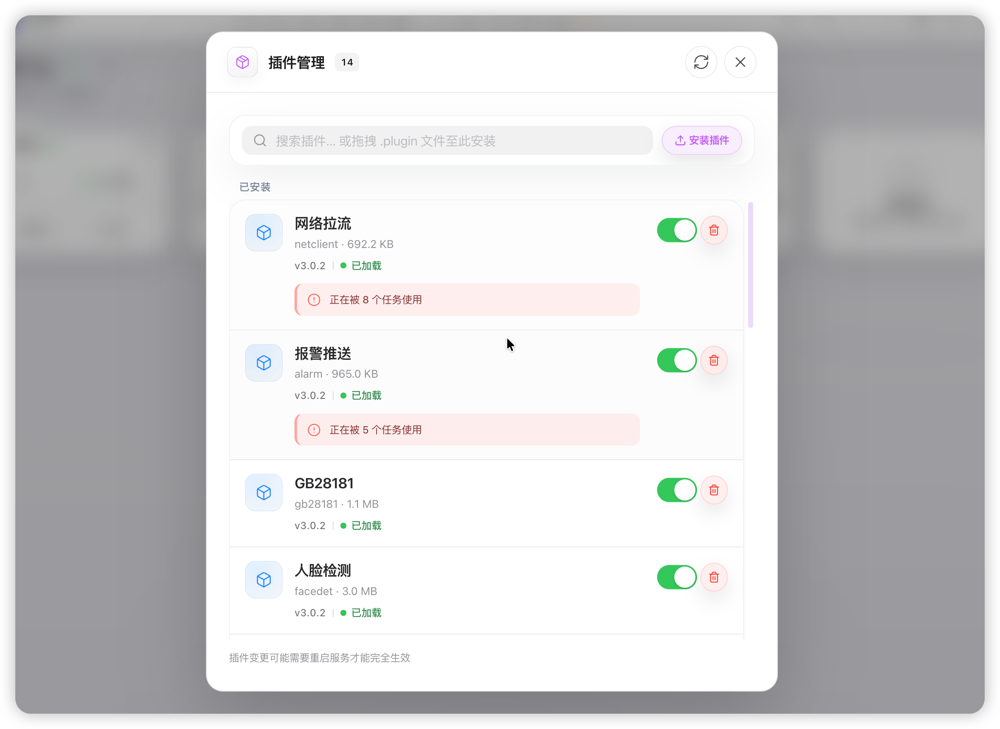
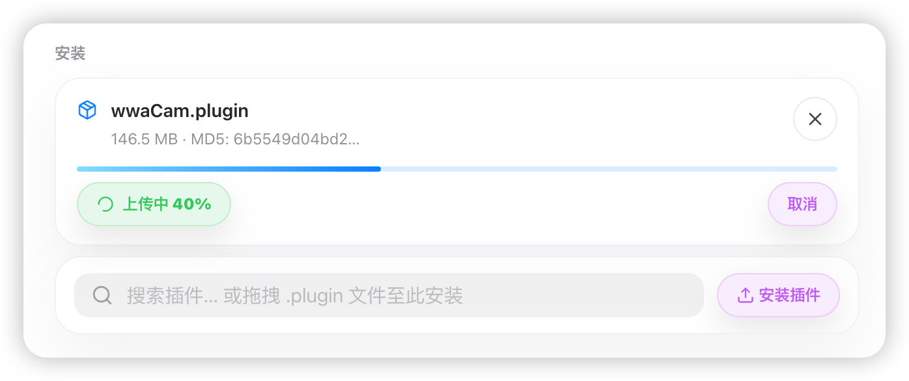
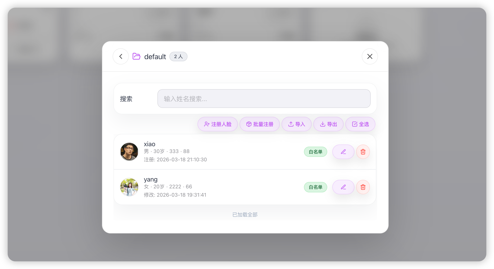

# AI-BOX 边缘盒子管理平台 — 用户使用手册（中文版）

> 版本：1.2 | 文档类型：用户操作指南 | 面向对象：终端用户、运维人员

---

## 目录

1. [产品简介](#一产品简介)
2. [系统要求与访问](#二系统要求与访问)
3. [快速入门：登录](#三快速入门登录)
4. [主界面导览](#四主界面导览)
5. [任务管理](#五任务管理)
6. [流程编辑器详解](#六流程编辑器详解)
7. [节点配置详解](#七节点配置详解)
8. [运行时节点状态](#八运行时节点状态)
9. [任务卡片状态信息](#九任务卡片状态信息)
10. [节点连接建议与注意事项](#十节点连接建议与注意事项)
11. [视频预览与多路预览](#十一视频预览与多路预览)
12. [报警管理](#十二报警管理)
13. [插件管理](#十三插件管理)
14. [插件功能：人脸库与录像管理](#十四插件功能人脸库与录像管理)
15. [LLM 插件使用说明（复核模式与检测模式）](#十五llm-插件使用说明复核模式与检测模式)
16. [智能检索使用说明](#十六智能检索使用说明)
17. [设置与系统管理](#十七设置与系统管理)
18. [右键菜单操作](#十八右键菜单操作)
19. [综合实例演示](#十九综合实例演示)
20. [官方出厂固件插件清单与功能说明](#二十官方出厂固件插件清单与功能说明)
21. [常见问题与排障](#二十一常见问题与排障)

---

## 一、产品简介

### 1.1 什么是 AI-BOX？

AI-BOX 是一款**边缘计算盒管理平台**，用于在边缘设备上部署、运行和管理 AI 视频分析任务。通过可视化拖拽的方式，您可以将输入源（如 RTSP 摄像头）、算法（如行人检测、人脸识别）和输出（如网络推流、报警、录像）组合成完整的分析流程。

### 1.2 核心功能概览

| 功能模块 | 说明 |
|---------|------|
| **任务管理** | 创建、编辑、启动、停止、复制、删除分析任务，支持分组管理 |
| **流程编辑** | 拖拽式画布编辑，配置节点参数，连接数据流 |
| **视频预览** | 多路实时视频预览，支持多种布局与全屏 |
| **报警通知** | 报警记录查看、忽略、删除，支持报警弹窗开关 |
| **人脸库** | 管理人脸名单（白名单/黑名单/VIP 等） |
| **录像管理** | 查看、预览、删除录像文件，空间回收 |
| **系统设置** | 设备信息、版本、升级、重启、修改密码等 |

---

## 二、系统要求与访问

### 2.1 浏览器要求

- **推荐**：Chrome 90+、Edge 90+、Safari 14+
- 需启用 JavaScript
- 建议使用 HTTPS 访问（录像预览等依赖）

### 2.2 访问地址

- **本地部署**：`https://<设备IP>:端口` 或 `https://<设备IP>:端口/aibox/`
- **示例**：`https://192.168.1.100:8099/aibox/`

### 2.3 设备连接说明

- 网页通过 WebRTC 与设备建立连接，需确保**设备端 AI-BOX 应用已启动**
- 若连接失败，请检查：设备是否在线、网络是否互通、防火墙是否放行

---

## 三、快速入门：登录

### 3.1 打开登录页

1. 在浏览器地址栏输入访问地址（见 2.2）

   

2. 若未登录，将自动跳转到登录页

### 3.2 登录步骤（详细操作）

| 步骤 | 操作 | 说明 |
|-----|------|------|
| 1 | 在「账号」输入框中输入您的用户名 | 点击输入框，确保光标在框内，键盘输入；本地部署时通常为设备默认账号(admin) |
| 2 | 在「密码」输入框中输入密码 | 点击密码框，输入内容以圆点或星号掩码显示，不会明文展示,默认密码(admin) |
| 3 | 点击「登录」按钮 | 系统会**先**通过 WebRTC 连接设备，**再**校验账号密码；两阶段任一失败都会提示 |
| 4 | 等待连接与验证 | 按钮会变为「登录中...」，请勿重复点击；通常数秒内完成 |
| 5 | 验证成功 | 自动跳转到首页「设备节点」；若已在其他标签页登录，可能提示会话冲突 |

### 3.3 登录结果

- **成功**：自动跳转到首页（设备节点）

  

- **失败**：页面顶部或弹窗会提示错误信息（如「设备连接失败」「登录已过期」等）

- 若提示**设备连接失败**：请确认设备应用已启动、网络可达，然后刷新页面重试

### 3.4 主题与语言（登录页可选）

- **主题**：登录页支持浅色/深色切换，点击太阳/月亮图标可切换

- **语言**：登录后可在主界面设置菜单中切换中文/英文

  

---

## 四、主界面导览

### 4.1 顶部栏（Header）

登录成功后，顶部栏包含以下区域：

| 区域 | 内容 |
|------|------|
| **左侧** | 品牌 Logo、设备名称、在线/离线状态；离线时显示「重新连接」 |
| **中间** | 设备状态胶囊：CPU、NPU、内存、温度等（可双击查看详情） |
| **右侧** | 主题、语言、添加任务、多路预览、报警铃铛、设置菜单 |

### 4.2 设备状态胶囊

- 显示**本地**及各**计算卡**的实时资源占用

- **颜色含义**：绿色正常、橙色警告、红色危险

  

- **双击**可打开设备详情弹窗

  

### 4.3 主内容区

- **标题**：「设备节点」，下方显示「共 X 个任务，X 个运行中」

- **连接状态图标**：绿色=已连接，橙色=连接中，红色=未连接

- **刷新按钮**：已连接时仅刷新数据不断开；未连接时可尝试重连

- **任务卡片与分组**：见下一节

  

### 4.4 设备未连接时的提示

若设备未连接，主内容区会显示红色提示框，包含：

- 错误说明
- **重新连接**：尝试重新建立连接
- **重新登录**：清除当前会话并返回登录页

---

## 五、任务管理

### 5.1 任务卡片类型

| 类型 | 外观 | 说明 |
|------|------|------|
| **分组卡片** | 文件夹图标 + 数字 | 可收纳多个任务，点击可展开/收起 |
| **任务卡片** | 任务名、状态、算法数 | 单个分析任务 |
| **添加任务卡片** | 虚线框 + 加号 | 快速创建新任务 |

### 5.2 创建新任务

**方式一：点击「添加任务」卡片**

1. 在任务网格中找到「添加任务」卡片（虚线边框、中间有「+」）
2. 单击该卡片
3. 弹出「创建新任务」对话框，输入任务名称
4. 点击「创建并编辑」进入流程编辑器

**方式二：点击顶部「+」按钮**

1. 点击顶部栏右侧的加号图标
2. 后续操作同上

**方式三：空白处右键**

1. 在主内容区任意空白处（非卡片、非按钮）单击右键

2. 选择「新建任务」

3. 弹出创建对话框，输入名称后创建

   

### 5.3 编辑任务

1. 在任务卡片上**双击**，或点击卡片上的**编辑图标**

2. 打开流程编辑弹窗，可修改节点与连线（见第六章）

   

### 5.4 启动与停止任务

- **启动**：在任务卡片上点击**播放图标**（▶）
- **停止**：在任务卡片上点击**停止图标**（■）
- **状态显示**：运行中（绿）、已停止（灰）、异常（红）、布控暂停（紫）等

> ⚠️ 设备未连接时无法启动或停止任务。

### 5.5 复制任务

1. 在任务卡片上**右键**

2. 选择「复制」

3. 系统会自动创建一个副本，名称为「原名称 + 拷贝」

   

### 5.6 删除任务

1. 在任务卡片上**右键**
2. 选择「删除」（红色项）
3. 在确认对话框中点击「确定」
4. ⚠️ 删除不可恢复，请谨慎操作

### 5.7 分组管理

**创建分组**

- 在任务卡片上**右键** → 选择「新建分组」
- 或先将任务卡片**拖拽**到某个分组卡片上，若无分组可先新建

**移动任务到分组**

- 任务卡片**右键** → 「移动到 X」（选择已有分组）
- 或直接**拖拽**任务卡片到分组卡片上

**重命名分组**

- 在分组卡片上**右键** → 选择「重命名」
- 在弹出框中输入新名称

**移出分组**

- 任务卡片**右键** → 「移出分组」（若任务在分组内）

  

### 5.8 任务卡片上的小铃铛

- 显示该任务/分组的未读报警数量

- 点击可打开报警面板并定位到相关报警

  

### 5.9 任务卡片展开与收起

- **单击**任务卡片：展开为**大卡片**，显示流程预览图（节点与连线）

- **再次单击**卡片空白处：收起为小卡片

- **双击**任务卡片：直接打开流程编辑器

- 展开状态下，右下角有**预览**、**编辑**悬浮按钮；悬停时还会显示**启动/停止**、**更多**按钮

  

### 5.10 拖拽复制任务（option/Alt + 拖拽）

- 按住 **option**（Mac）或 **Alt**（Windows）键，同时**拖动**任务卡片到另一分组或空白处
- 松开后会**复制**该任务到目标位置，无需先右键复制再移动

---

## 六、流程编辑器详解

### 6.1 打开流程编辑器

- 双击任务卡片，或点击卡片上的编辑图标
- 新任务创建后点击「创建并编辑」也会打开

### 6.2 编辑器界面结构

| 区域 | 说明 |
|------|------|
| **左侧组件面板** | 输入、算法、处理、输出四类组件，可折叠 |
| **中间画布** | 拖拽、连线、布局的工作区 |
| **顶部工具栏** | 保存、运行、排列、关闭等 |
| **运行位置** | 可选「动态」或指定计算卡 |

### 6.3 添加节点到画布（详细步骤）

**步骤一：定位组件**

1. 在左侧组件面板中，找到对应分类（输入、算法、处理、输出）
2. 若分类已折叠，点击分类标题展开
3. 确认所需组件名称（如「RTSP 输入」「行人检测」「网络输出」）

**步骤二：拖拽到画布**

1. 将鼠标移动到目标组件上，按住左键不松开
2. 拖动到中间画布区域（灰色网格背景）
3. 在合适位置松开鼠标，节点会出现在画布上
4. 若拖到画布外松开，节点可能不会添加

**步骤三：重复类型检查**

- 若任务中已包含同类型组件，松开时会提示「该任务已包含 xxx」，无法添加

- 例如：一个任务只能有一个 RTSP 输入（除非插件支持多路），需删除原有或选择其他输入类型

  

### 6.4 连接节点（详细步骤）

**步骤一：识别连接点**

- 每个节点左右两侧各有一个小圆点（**handle**）
- **左侧**为输入（target），**右侧**为输出（source）
- 数据从左侧流向右侧

**步骤二：建立连线**

1. 将鼠标悬停在**源节点**的**右侧**连接点上
2. 鼠标会变为可拖动状态，按住左键不松开
3. 拖动到**目标节点**的**左侧**连接点
4. 当目标连接点高亮时松开，连线即建立

**步骤三：连线后的布局**

- 新建连线后，画布会自动执行「排列」，整理节点位置
- 若布局不理想，可点击顶部「排列」按钮重新整理

> ⚠️**注意**：不可从输出节点连到输入节点，也不可反向连接；必须沿 输入→算法→处理→输出 的方向。

### 6.5 配置节点参数（详细步骤）

**步骤一：打开配置弹窗**

1. 在画布上**双击**目标节点（非连线、非空白）
2. 弹出节点参数配置弹窗，标题为节点名称（如「RTSP 输入」）

**步骤二：填写表单**

1. 按从上到下的顺序，逐项填写或选择
2. 带 `*` 或标注必填的字段需填写完整
3. 输入框：直接键盘输入；下拉框：点击展开选择；开关：点击切换；滑块：拖动调节

**步骤三：使用快捷按钮**

- 若有「测试连接」「ONVIF 搜索」等按钮，点击后等待设备返回结果
- 测试成功/失败会通过提示反馈

**步骤四：保存配置**

1. 点击弹窗底部「确定」或右上角关闭

2. 配置会写入当前节点，但**不会自动保存到设备**

3. 需点击编辑器顶部「保存」或「运行」才会同步到设备

   

### 6.6 画布操作

- **平移**：按住画布空白处拖动
- **缩放**：鼠标滚轮
- **删除节点**：选中节点后按 Delete，或使用顶部删除按钮
- **删除连线**：选中连线后按 Delete
- **自动排列**：点击顶部「排列」按钮，自动整理节点布局

### 6.7 保存与运行

- **保存**：点击顶部「保存」按钮，将画布上的节点与连线保存到设备
- **运行**：点击「运行」按钮，保存并启动任务
- 若任务引用了已删除的插件，会提示无法保存/运行，需先移除或更换对应节点

### 6.8 画布右键菜单

- 在**节点**上右键：可执行「编辑节点」「删除节点」
- 在**连线**上右键：可执行「删除连线」
- 菜单外点击可关闭

### 6.9 运行位置选择

- 顶部「运行位置」下拉可选：**动态**、**本地**、**计算卡1**、**计算卡2** 等

- **动态**：由设备自动分配；指定位置则固定到该计算单元

  

---

## 七、节点配置详解

节点配置由设备/插件下发的 **formList** 驱动，不同节点类型会展示不同的表单控件。以下为常见配置项类型及操作说明。

### 7.1 输入类控件

| 类型 | 说明 | 操作要点 |
|------|------|----------|
| **单行输入 (input)** | 文本或数字输入 | 支持 placeholder 占位提示、unit 单位显示；可设置 inputType 为 text/number/password |
| **多行文本 (textarea)** | 多行文本输入 | 适用于备注、长文本 |
| **数字输入 (inputNumber)** | 带范围的数字 | 可设置 min、max、unit；输入超出范围会被限制 |
| **密码 (password)** | 掩码输入 | 输入内容不显示明文 |

### 7.2 选择类控件

| 类型 | 说明 | 操作要点 |
|------|------|----------|
| **下拉选择 (select)** | 从预设选项中选择 | 点击展开选项列表，选择后保存 |
| **开关 (switch)** | 开/关切换 | 点击即可切换；可配合 list 做多选芯片 |
| **滑块 (slider)** | 拖动调节数值 | 拖动滑块在 min～max 范围内取值 |

### 7.3 只读与状态

| 类型 | 说明 | 操作要点 |
|------|------|----------|
| **只读 (readOnly)** | 仅展示不可编辑 | 如版本号、固件信息 |
| **状态标签 (status)** | 胶囊徽标显示状态 | 按值自动配色：OK/RUNNING→绿，FAILED/ERROR→红，WARNING→橙 |

### 7.4 特殊配置

| 类型 | 说明 | 操作要点 |
|------|------|----------|
| **按键 (button)** | 执行操作 | 如「测试连接」「ONVIF 搜索」；点击后由设备或前端执行逻辑 |
| **分段标题 (divider)** | 分组标题 | 无输入，仅作视觉分隔 |
| **时段配置 (schedule)** | 按时布控 | 打开时段编辑器，按周一～周日、24 小时设置启用时段 |
| **区域绘制 (regionDraw)** | 检测区域 | 打开画布，在快照上绘制多边形检测区域 |

### 7.5 时段配置（按时布控）详细步骤

1. 在 RTSP 输入节点的「按时布控」配置中，点击「添加时段」或对应区域

2. 时段编辑器按**周一～周日**分栏，每栏为 0～24 小时的横向时间轴

3. **拖拽**或**点击**可选择启用时段（每格 15 分钟）

4. **点击启用/禁用**：切换某天是否参与布控

5. **复制到其他天**：将当前天的时段复制到勾选的其他天

6. **全天关闭**：清空该天所有时段

7. 保存后，任务会在设定时段内自动运行，非时段内自动暂停

   

### 7.6 区域绘制（检测区域）详细步骤

1. 任务需**已保存**且设备**已连接**

2. 在支持区域绘制的算法节点配置中，点击「画检测区域」

3. 点击「刷新快照」获取当前视频帧

**绘制方式：**

| 类型 | 操作 |
|------|------|
| **线段** | 单击两点即完成，或双击完成 |
| **多边形** | 单击添加顶点，三点及以上；双击或点击起点闭合 |
| **撤销上一步** | 绘制中右键或按 **Backspace** |
| **取消** | **Esc** |

**编辑与删除：**

| 操作 | 说明 |
|------|------|
| 拖拽顶点 | 左键按住顶点拖动可调整形状 |
| 删除顶点 | 左键点击顶点选中后按 **Delete**，或右键点击顶点删除 |
| 删除区域 | 右键点击区域内部或线段，弹出菜单选择「删除此区域」；重叠时目标区域会红色高亮 |
| 选中区域 | 右键区域可选中；点击空白处可关闭菜单或取消选中 |

- 「撤销」「清除全部」可管理历史；支持多区域，保存后生效

   

### 7.7 常用快捷按钮

| 按钮 | 说明 |
|------|------|
| **测试连接 / RTSP 测试** | 验证 RTSP 地址是否可访问 |
| **ONVIF 搜索** | 搜索局域网内 ONVIF 设备，选择后自动填入地址 |
| **人脸库管理** | 打开人脸库管理弹窗（人脸识别节点） |
| **选择录像路径** | 选择录像存储路径（录像输出节点） |

---

## 八、运行时节点状态

任务运行后，画布上的节点和连线会显示实时状态，便于排查数据流是否正常。

### 8.1 连线（边）状态

| 状态 | 连线颜色 | 含义 |
|------|----------|------|
| **idle** | 灰色虚线 | 任务未运行或状态未知 |
| **ok** | 绿色虚线（流动动画） | 数据流正常 |
| **stuck** | 红色虚线 | 数据阻塞或异常 |
| **paused** | 紫色虚线 | 布控暂停（按时段未到启用时间） |

### 8.2 节点 Hover 浮层（detail_info）

- 将鼠标**悬停**在运行中任务的节点上，会弹出浮层
- 显示设备推送的 **detail_info**，例如：
  - **RTSP 输入**：编码格式、分辨率、帧率、 RTSP 地址等
  - **网络输出**：延时、帧率、码率、状态等
  - **算法节点**：处理时间、阈值、状态等
- 点击浮层中的值可**复制到剪贴板**

### 8.3 节点配置弹窗内的实时状态（form_status）

- 打开节点配置弹窗时，部分**只读/状态**字段会由设备通过 **form_status** 实时更新
- 如 runStatus、lastProbe、sendStats 等
- 与 Hover 的 detail_info 分离，互不影响

### 8.4 节点超时检测

- 若某节点超过约 **10 秒**无正常数据上报，任务健康状态会变为 **warning** 或 **error**
- 任务卡片会显示「运行警告」或「运行异常」，画布上对应连线可能变红

---

## 九、任务卡片状态信息

### 9.1 任务状态与健康状态

| 状态 | 图标/颜色 | 含义 |
|------|------------|------|
| **运行中** | 绿色勾 | 任务正常运行 |
| **已停止** | 灰色方块 | 任务已停止 |
| **启动中 / 停止中** | 橙色 loading | 正在启停 |
| **异常** | 红色叉 | 严重错误 |
| **运行警告** | 橙色三角 | 部分节点超时等 |
| **布控暂停** | 紫色暂停 | 按时布控中，当前不在启用时段 |

### 9.2 延时与帧率显示

- 任务**运行中**且包含**网络输出**节点时，卡片会显示：
  - **Xms Yfps**：如 `12ms 25fps` 表示总延时 12ms、帧率 25fps
  - **Xms**：仅有时延时只显示延时
  - **--**：无有效数据时显示灰色占位
- 数据来源于设备上报的 runtime 或 task.stats

### 9.3 布控暂停恢复倒计时

- 当任务处于**布控暂停**状态时，卡片会显示**恢复倒计时**

- 格式如：`3天2时15分30秒后恢复`

- 倒计时每秒更新，到达启用时段后任务会自动恢复运行

  

### 9.4 运行位置与算法数

- **运行位置**：本地、计算卡1、计算卡2 等，表示任务跑在哪个计算单元
- **X 个算法**：该任务包含的算法节点数量

### 9.5 卡片左侧色条

| 色条 | 含义 |
|------|------|
| 紫色 | 布控暂停 |
| 红色 | 运行异常 |
| 橙色 | 运行警告 |

---

## 十、节点连接建议与注意事项

### 10.1 数据流顺序

- 标准流程：**输入 → 算法 → 处理 → 输出**
- 输入节点（如 RTSP）只能作为**起点**，输出节点（如网络输出、报警）只能作为**终点**
- 算法、处理节点可**并联**或**串联**，顺序影响检测与叠加效果
- 实时**视频输出**最好和算法及处理节点进行**并联**，保证视频输出帧率，算法结果可**异步叠加**到实时视频流上

### 10.2 连接规则

- 每个节点有**左侧（target）**和**右侧（source）**连接点
- 连线必须从**源节点右侧**连到**目标节点左侧**
- 同一任务中**不能添加重复类型的节点**（如同一任务不能有两个 RTSP 输入，除非插件支持多路）

### 10.3 连接建议

1. **先搭骨架再填参数**：先拖入节点、完成连线，再逐一双击配置参数
2. **预览依赖网络输出**：若要网页预览，流程中必须有**网络输出**节点
3. **报警依赖报警输出**：若要收报警，必须有**报警输出**节点
4. **保存后再运行**：有未保存修改时，运行会先自动保存再启动

### 10.4 常见错误

| 现象 | 原因 | 处理 |
|------|------|------|
| 无法连线 | 连接方向反了 | 从上游节点右侧连到下游节点左侧 |
| 预览无画面 | 无网络输出节点 | 添加网络输出节点并连接 |
| 报警收不到 | 无报警输出节点 | 添加报警输出节点并连接 |
| 节点灰显无法编辑 | 插件已删除 | 移除该节点或更换为可用插件 |

---

## 十一、视频预览与多路预览

### 11.1 打开多路预览

- 点击顶部栏的**九宫格图标**（多路预览）
- 或从任务卡片**拖拽**任务到页面底部的预览 Dock

### 11.2 添加预览源

**方式一：拖拽**

1. 从任务卡片**按住并拖动**到预览 Dock 区域
2. 看到「松手添加」提示时松开
3. 该任务的视频流会加入预览

**方式二：在多路预览弹窗中选择**

1. 打开多路预览弹窗
2. 在通道列表中选择要预览的任务
3. 点击添加（最多支持多路，具体以界面提示为准）

### 11.3 布局切换

- **自动**：根据预览路数自动排布
- **2/4/9/16 宫格**：固定宫格布局
- **自定义**：自定义行数和列数

### 11.4 全屏与关闭

- **全屏**：点击全屏按钮，进入全屏预览模式
- **关闭全部**：关闭所有预览流

### 11.5 注意事项

- 任务需包含**网络输出**节点才能预览

- 需先**启动任务**后再预览，否则会提示「请先启动任务后再预览」

  

  

---

## 十二、报警管理

### 12.1 打开报警面板

- 点击顶部栏的**铃铛图标**
- 红色数字表示未读报警数量

### 12.2 报警列表操作

| 操作 | 说明 |
|------|------|
| **查看** | 点击某条报警查看详情、大图 |
| **忽略** | 将报警标记为已读 |
| **全部已读** | 一键标记所有为已读 |
| **删除** | 单条或批量删除（需确认） |
| **上拉加载** | 列表底部上拉加载更多 |

### 12.3 报警弹窗开关

- 进入**设置菜单**（齿轮图标）
- 找到「报警弹窗」项
- 切换右侧开关，开启/关闭报警时是否弹出浮层提示

### 12.4 按任务/类型筛选

- 报警面板支持按任务、报警类型筛选

- 可查看「行人检测」「火焰检测」「烟雾检测」等分类统计

  

---

## 十三、插件管理

本章面向客户与运维人员，集中说明插件在网页端的上传、安装、启用、禁用、卸载、回滚和日常维护方法。

### 13.1 入口与列表状态说明

**入口：**

- 顶部菜单中的「插件管理」
- 部分版本也可从设置菜单进入「插件管理」

**列表中常见状态含义：**

| 状态 | 含义 | 客户建议 |
|------|------|----------|
| **已加载 / Loaded** | 插件已被当前服务成功加载，可立即参与任务运行 | 可直接用于流程编辑与任务启动 |
| **已安装 / Installed** | 插件包已经写入设备，但当前服务还没有完成加载 | 通常建议执行一次“重启服务”后再确认 |
| **已禁用 / Disabled** | 插件被手工关闭，不再参与新任务加载 | 禁用后不建议继续在新任务中使用 |
| **待禁用 / Pending disable** | 当前仍有任务占用该插件，暂不能立即完成禁用 | 先停止相关任务，再观察状态是否切换 |
| **待更新 / Pending update** | 新版本已准备好，但仍需等待旧任务释放后再完成替换 | 业务低峰时段执行停止任务与重启 |
| **错误 / Error** | 插件加载失败、初始化失败或包校验失败 | 需要核对插件包、平台兼容性和依赖 |

**兼容性提示：**

- 若界面出现“兼容性警告”，表示插件声明的平台信息与当前设备的架构、系统或芯片信息不完全一致。
- 在测试环境可先做功能验证；在生产环境不建议直接上线，需先与交付方确认兼容性。

### 13.2 上传与安装插件

#### 13.2.1 标准安装步骤

1. 打开 **插件管理** 页面。

2. 点击 **安装插件**，或直接将 `.plugin` 文件拖拽到窗口。

3. 等待页面完成上传、文件校验和包预检。

4. 确认插件名称、类型、版本、兼容性信息正确。

5. 点击 **安装插件** 完成写入。

6. 安装成功后，按页面提示执行 **重启服务**。

7. 页面重新连回设备后，确认插件状态是否变为 **已加载**。

   

#### 13.2.2 上传过程中的页面表现

- 小插件包通常只需几秒即可完成校验与安装。

- 大插件包的等待时间会明显长于普通配置操作，属于正常现象。

- 页面在“上传完成后仍继续等待”的情况，通常表示系统仍在处理安装，请先耐心等待。

  

#### 13.2.3 安装前建议核对的信息

1. 插件是否为合法 `.plugin` 文件。
2. 插件类型是否与计划用途一致，例如 `llm.plugin`、`record.plugin`、`persondet.plugin`。
3. 插件版本是否符合本次发布计划。
4. 当前设备架构、系统版本、芯片平台是否与插件兼容。
5. 设备磁盘空间是否充足，避免上传完成后因空间不足导致失败。

### 13.3 替换、升级与同类型插件覆盖

当设备中已经存在同类型插件时，再安装新的同类型包，通常会被识别为“替换升级”。

#### 13.3.1 推荐操作流程

1. 先确认哪些任务正在使用该插件。
2. 在业务低峰时段停止相关任务。
3. 再执行新插件安装。
4. 安装完成后执行 **重启服务**。
5. 重启后检查插件版本、状态和相关任务运行情况。

#### 13.3.2 系统典型表现

- 若旧插件仍被运行中的任务引用，系统可能拒绝直接替换，提示先释放任务占用。
- 替换成功后，系统通常会保留旧版本备份，用于后续回滚。
- 替换安装完成但未重启前，页面可能先显示“已安装”或“待更新”，这属于正常过渡状态。

#### 13.3.3 操作提示

- 替换前请先确认相关任务已经停止。
- 替换完成后，建议返回任务页面检查任务是否正常。

### 13.4 启用、禁用与加载生效时机

#### 13.4.1 启用插件

1. 在插件列表中找到目标插件。
2. 打开启用开关。
3. 若页面提示需要 **重启服务**，请按提示执行。
4. 重启服务后，再回到插件列表确认状态是否正常。

#### 13.4.2 禁用插件

1. 在插件列表中关闭插件开关。
2. 若当前没有任务使用该插件，系统可直接完成禁用。
3. 若仍有任务在使用，状态会显示 **待禁用**。
4. 停止相关任务，必要时执行一次 **重启服务**，再确认是否已变为 **已禁用**。

#### 13.4.3 客户容易误解的几个点

- **已安装不等于已加载**：已安装仅表示插件包已经落盘，不代表当前服务已经完成加载。
- **待禁用不等于失败**：通常只是因为任务仍占用该插件，需要等待任务停止。
- **启用后页面未立即变化**：可能是系统仍在处理或等待服务重启，不建议连续重复点击。

### 13.5 卸载与回滚

#### 13.5.1 卸载插件

1. 先确认没有任务继续引用该插件。
2. 若任务中仍有该插件节点，请先删除或更换节点，并保存任务。
3. 停止所有相关运行中任务。
4. 回到插件管理页面执行卸载。
5. 卸载完成后，再次确认插件已从列表移除或状态已变化。

**说明：**

- 若页面提示“插件仍被任务引用”，请不要强行重复操作，应先清理任务依赖。
- 卸载后如果旧任务里仍残留该插件节点，相关任务可能无法保存或运行，需要人工处理节点。

#### 13.5.2 回滚插件

1. 适用于插件已做过替换升级，且系统中保留了上一版本备份的场景。
2. 回滚前同样要先停止所有引用该插件的任务。
3. 点击回滚后，等待系统恢复旧版本插件。
4. 回滚完成后建议立即 **重启服务**，并重新检查状态与版本号。

**提示：**

- 若页面提示“无可用回滚版本”，说明设备中没有该插件的历史备份包。

### 13.6 操作提示

1. 插件上传、安装、替换过程中，请不要刷新页面或重复点击按钮。
2. 若页面提示 **重启服务**，请按提示操作。
3. 重启后如果页面暂时断开，等待重新连接即可。
4. 若插件状态长时间异常，请先刷新页面重新确认；仍异常时请检查插件包是否正确。

---

## 十四、插件功能：人脸库与录像管理

### 14.1 人脸库管理

**入口：**

- 设置菜单中的「人脸库管理」（若插件配置了快捷入口）
- 或在节点配置中点击「管理」按钮（人脸识别类节点）

**界面说明：**

- 上层为**人脸库列表**，可新建、重命名、删除人脸库
- 进入某个人脸库后，可对库内人脸进行搜索、注册、批量注册、导入、导出、批量选择
- 列表中的人员类型支持：**白名单、黑名单、VIP、访客**

**14.1.1 新建与进入人脸库**

1. 点击「新建人脸库」
2. 输入人脸库名称
3. 点击确认后，人脸库会出现在列表中
4. 点击人脸库条目进入库内人员列表

**14.1.2 单张注册人脸**

1. 进入目标人脸库
2. 点击「注册人脸」
3. 选择一张清晰的人脸照片
4. 填写姓名
5. 按需填写性别、年龄、手机号、人员类型
6. 按需填写扩展字段：`PID`、`Work ID`、身份证号、IC 卡号、部门
7. 点击确认，系统会先上传图片，再在设备端提取人脸特征并入库

**建议：**

- 优先使用**单人、正脸、清晰、无遮挡**照片
- 避免多人合照、强逆光、头像过小、过度压缩图片
- 若提示“未检测到人脸”或“注册失败”，建议更换更清晰的人脸照片重新注册

**14.1.3 编辑、删除与搜索**

- 顶部搜索框按**姓名模糊搜索**
- 点击编辑按钮或双击条目，可修改人员资料
- 修改照片时，系统会先上传新照片，再保存资料
- 点击删除按钮可删除单个人脸
- 开启选择模式后，可执行批量删除、批量移动、批量修改人员类型

**14.1.4 批量注册**

批量注册适用于一次性导入多人照片，常见于项目初始化或名单集中维护场景。

**操作步骤：**

1. 进入目标人脸库。
2. 点击「批量注册」。
3. 选择多张图片，或选择系统支持的批量导入文件。
4. 根据页面提示补充人员类型等必要信息。
5. 点击确认并等待系统处理。
6. 导入完成后，查看结果窗口中的成功数、失败数和失败原因。

**客户建议：**

- 导入前先确认照片命名清晰，便于后续核对。
- 批量导入时建议分批进行，不建议一次导入过多图片。
- 若有失败项，可根据提示单独重新导入，不会影响已经成功的人员记录。

**14.1.5 人脸库导出**

1. 进入目标人脸库。
2. 点击「导出」。
3. 浏览器会下载导出文件，请保存到本地电脑或客户的备份位置。

**说明：**

- 导出文件会包含当前人脸库中的人员信息与对应图片。
- 若当前人脸库为空，系统通常不会生成导出文件。
- 人脸数量较多时，导出等待时间会更长，请保持页面开启直到下载完成。

**14.1.6 人脸库导入**

1. 进入目标人脸库。
2. 点击「导入」。
3. 选择导出的库文件。
4. 根据页面提示选择重名处理方式，例如跳过或覆盖。
5. 点击确认并等待导入完成。
6. 完成后查看界面提示中的成功、跳过和失败数量。

**客户建议：**

- 导入前先确认目标人脸库是否正确，避免导入到错误的库中。
- 若用于项目切换或设备迁移，建议先做一次导出备份，再执行导入。
- 若导入失败，可先减少单次导入规模，再分批重试。

**14.1.7 使用建议与限制**

- 当前版本适合日常库维护、分批导入导出和中小规模客户使用
- 对于图片总量较大的人脸库，建议**按库分组、分时段**导入导出，避免长期堆在单一超大库中
- 大库导出时建议使用**有线网络 + 较新的 Chrome/Edge + 充足内存的电脑**；导出过程中尽量不要关闭页面或切换设备网络
- 若单次导入/导出数据量很大，浏览器端仍可能出现等待时间长、内存占用上升、进度停顿等现象，属于大包处理的正常边界
- 建议提前规划人脸库分组、命名规范、`PID/工号` 等唯一标识，降低重复数据和人工维护成本

   

### 14.2 录像管理

**入口：**

- 设置菜单中的「录像管理」（若插件配置了快捷入口）

**主要操作：**

1. **目录浏览**：按任务、日期、文件夹浏览录像文件
2. **预览**：双击或选择后加入预览，支持单路/四路/九路
3. **删除**：单条或批量删除录像
4. **空间回收**：清理无用录像释放空间
5. **刷新**：设备刚录像后建议稍等几秒再点击刷新

> 若录像无法预览，请先确认设备录像功能正常，且页面已经成功连接到设备。

---

## 十五、LLM 插件使用说明（复核模式与检测模式）

本章只说明客户在网页中如何使用 LLM 插件。

### 15.1 功能说明

LLM 插件常见有两种使用方式：

1. **复核模式**：先由原有算法做初步检测，再由 LLM 做二次判断。
2. **检测模式**：直接由 LLM 判断画面中是否存在目标。

### 15.2 复核模式操作步骤

1. 新建任务并进入流程编辑器。
2. 连接链路：
`RTSP -> 算法节点 -> LLM -> 报警`。
3. 打开算法节点配置，开启 LLM 复核并填写提示词。
4. 打开 LLM 节点配置，确认基础设置。
5. 保存并运行任务。
6. 在报警列表中查看结果是否符合预期。

### 15.3 检测模式操作步骤

1. 新建任务并连接链路：
`RTSP -> LLM -> 报警`。
2. 在 LLM 节点开启检测模式。
3. 根据页面提示填写检测提示词和检测间隔。
4. 保存并运行任务。
5. 在报警面板查看是否正常产生报警。

### 15.4 常见问题

| 现象 | 处理方式 |
|------|----------|
| LLM 节点配置后没有效果 | 检查节点是否连接正确，功能是否已开启 |
| 报警结果不稳定 | 调整提示词，描述尽量简洁清楚 |
| 一直没有报警 | 检查任务是否运行、链路是否正确、提示词是否合适 |

---

## 十六、智能检索使用说明

本章只说明客户如何在网页中使用智能检索。

### 16.1 功能说明

智能检索支持以下操作：

1. 输入文字搜索相关图片或视频。
2. 上传图片搜索相似图片或视频。
3. 按图片、视频或全部范围进行检索。

### 16.2 使用前准备

1. 任务需要已经正常运行。
2. 报警或录像数据需要已经生成。
3. 系统设置中需要已经开启智能检索。

### 16.3 操作步骤

#### 16.3.1 文字检索

1. 打开“智能检索”页面。
2. 输入搜索内容。
3. 选择检索范围。
4. 点击搜索并查看结果。

#### 16.3.2 图片检索

1. 上传参考图片。
2. 选择检索范围。
3. 点击搜索并查看结果。

#### 16.3.3 查看结果

1. 点击结果条目查看详情。
2. 若结果为视频，可定位到对应时间点。
3. 如需进一步查看，可结合录像管理进行回看。

### 16.4 常见问题

| 现象 | 处理方式 |
|------|----------|
| 搜索无结果 | 确认任务已运行且已有报警或录像数据 |
| 搜索结果较少 | 更换关键词，或切换到“全部”范围重新搜索 |
| 视频结果看起来相似 | 可按时间点逐个查看原视频确认 |

---

## 十七、设置与系统管理

### 17.1 打开设置菜单

- 点击顶部栏的**齿轮图标**

### 17.2 菜单项说明

| 菜单项 | 说明 |
|--------|------|
| **报警弹窗** | 开关：是否在收到报警时弹出浮层 |
| **日志管理** | 查看、删除设备日志 |
| **切换语言** | 中文 ↔ English |
| **重启** | 重启设备（需确认） |
| **升级应用** | 上传 .deb 安装包进行应用升级 |
| **升级固件** | 上传 .swu 固件进行固件升级 |
| **连网配置** | 配置云端连接（Access Key 等） |
| **智能检索** | 配置检索启停、运行位置、抽帧与阈值等参数 |
| **版本信息** | 查看设备、应用、固件版本 |
| **修改密码** | 修改登录密码 |
| **人脸库管理** | 见 14.1（插件配置时显示） |
| **录像管理** | 见 14.2（插件配置时显示） |
| **退出** | 退出登录，返回登录页 |

### 17.3 升级应用 / 固件

1. 选择对应菜单项
2. 拖拽或选择符合格式的文件：
   - 应用：`aibox-<型号>_<版本>-<时间戳>_arm64.deb`
   - 固件：`*.swu`
3. 点击「开始升级」
4. 等待上传与安装，设备将自动重启

### 17.4 设备详情

- 双击顶部栏的**状态胶囊**可打开设备详情弹窗

- 包含：设备名称、应用版本、固件版本、序列号、系统信息等

  

---

## 十八、右键菜单操作

### 18.1 任务卡片右键

| 选项 | 说明 |
|------|------|
| 编辑 | 打开流程编辑器 |
| 复制 | 复制该任务 |
| 移动到 X | 将任务移到指定分组 |
| 新建分组 | 创建新分组并移入 |
| 删除 | 删除任务（红色，需确认） |

### 18.2 分组卡片右键

| 选项 | 说明 |
|------|------|
| 重命名 | 修改分组名称 |

### 18.3 添加任务卡片右键

| 选项 | 说明 |
|------|------|
| 新建任务 | 与单击效果相同，创建新任务 |

### 18.4 空白区域右键

- 在主内容区任意空白处右键，可显示「新建任务」菜单
- 点击后弹出创建任务对话框

### 18.5 菜单关闭

- 点击菜单外任意区域可关闭右键菜单

---

## 十九、综合实例演示

本节以「**门口行人检测 + 报警 + 网页预览**」为例，演示从零创建完整任务的全流程。

### 19.1 场景说明

- **目标**：门口摄像头 RTSP 画面做行人检测，有人时产生报警，并在网页上实时预览
- **前置**：设备已连接、摄像头 RTSP 地址已知（如 `rtsp://192.168.1.10:554/stream1`）

### 19.2 步骤一：创建任务

1. 点击「添加任务」卡片或顶部「+」
2. 输入任务名称，如「门口行人检测」
3. 点击「创建并编辑」，进入流程编辑器

### 19.3 步骤二：添加节点

1. 在左侧**输入组件**中，拖拽「RTSP 输入」到画布
2. 在**算法组件**中，拖拽「行人检测」到画布
3. 在**处理组件**中，拖拽「OSD 叠加」到画布（可选，用于显示检测框）
4. 在**输出组件**中，拖拽「网络输出」「报警输出」到画布

### 19.4 步骤三：连接节点

1. 从 **RTSP 输入** 右侧连接点，拖到 **行人检测** 左侧
2. 从 **行人检测** 右侧，拖到 **OSD 叠加** 左侧
3. 从 **OSD 叠加** 右侧，拖到 **网络输出** 左侧
4. 从 **行人检测** 右侧，再拖一条线到 **报警输出** 左侧（报警可直接接算法输出）
5. 点击「排列」按钮自动整理布局

### 19.5 步骤四：配置 RTSP 输入

1. 双击 **RTSP 输入** 节点
2. 在「RTSP 地址」中填入：`rtsp://192.168.1.10:554/stream1`
3. 可选：点击「测试连接」验证地址
4. 「解码位置」选择「本地」或「计算卡1」等
5. 若需按时布控：配置「按时布控」时段
6. 点击「确定」关闭

### 19.6 步骤五：配置行人检测（可选）

1. 双击 **行人检测** 节点
2. 若有检测阈值、置信度等参数，按需调整
3. 若支持检测区域，点击「画检测区域」划定门口区域
4. 点击「确定」

### 19.7 步骤六：配置报警输出

1. 双击 **报警输出** 节点
2. 设置「报警阈值」（如 0.8），低于该置信度不报警
3. 点击「确定」

### 19.8 步骤七：保存并运行

1. 点击顶部「运行」按钮（会先保存再启动）
2. 等待任务状态变为「运行中」
3. 观察任务卡片上的延时/帧率是否显示正常

### 19.9 步骤八：预览与验证

1. 点击任务卡片上的**预览**按钮，或拖拽到预览 Dock
2. 确认画面正常、检测框显示
3. 在有人经过时，顶部铃铛应有未读报警，报警面板可查看详情

### 19.10 常见变体

| 变体 | 操作 |
|------|------|
| **仅预览不报警** | 不添加报警输出节点 |
| **加人脸识别** | 在行人检测后串接「人脸识别」，并配置人脸库 |
| **加录像** | 添加「录像输出」节点，配置存储路径 |
| **多路输入** | 若插件支持多路 RTSP，可添加多个输入并合并后再接算法 |

---

## 二十、官方出厂固件插件清单与功能说明

### 20.1 出厂交付插件列表

| 插件包 | 大小 | 主要角色 |
|--------|------|----------|
| `alarm.plugin` | 959K | 报警输出与事件分发 |
| `catdog.plugin` | 11M | 猫狗检测算法 |
| `facedet.plugin` | 3.0M | 人脸检测算法 |
| `facerec.plugin` | 106M | 人脸识别算法（人脸库比对） |
| `firedet.plugin` | 26M | 火焰检测算法 |
| `gb28181.plugin` | 1.1M | GB28181 对接输出 |
| `hdmi.plugin` | 464K | HDMI 视频输出 |
| `llm.plugin` | 1.4M | 多模态 LLM 复核/检测 |
| `lpr.plugin` | 34M | 车牌识别算法 |
| `motor.plugin` | 12M | 机动车/非机动车相关检测 |
| `netclient.plugin` | 693K | 网络拉流输入（RTSP 等） |
| `netserver.plugin` | 466K | 网络推流输出 |
| `osd.plugin` | 547K | OSD 叠加处理 |
| `p2p.plugin` | 1.3M | P2P 接入输出 |
| `personAttr.plugin` | 37M | 行人属性分析 |
| `persondet.plugin` | 37M | 行人检测算法 |
| `record.plugin` | 1.2M | 录像输出与存储 |

### 20.2 按插件逐项功能说明

#### 20.2.1 输入类插件

1. `netclient.plugin`
   - 功能：从网络摄像头/流媒体拉流（常见 RTSP），完成解码并输出视频帧。
   - 使用位置：多数任务的首节点。
   - 典型链路：`RTSP -> 检测/LLM -> OSD/报警/推流/录像`。

#### 20.2.2 算法类插件

2. `persondet.plugin`
   - 功能：检测画面中的行人目标并输出目标元数据。
   - 使用场景：门口、周界、通道等行人布控。
   - 常见组合：与 `osd`、`alarm`、`record`、`llm(复核模式)` 组合使用。

3. `firedet.plugin`
   - 功能：检测火焰目标并产生火焰报警候选。
   - 使用场景：消防安全类场景。
   - 常见组合：接 `llm` 做复核降误报，再接 `alarm`。

4. `facedet.plugin`
   - 功能：检测人脸框并输出人脸质量相关信息，供后续识别使用。
   - 使用场景：人脸识别前置节点。
   - 典型链路：`netclient -> facedet -> facerec -> alarm/osd`。

5. `facerec.plugin`
   - 功能：将检测到的人脸与人脸库比对，输出身份/命中结果。
   - 使用场景：白名单、黑名单、VIP 等人脸事件。
   - 依赖：有效的人脸库配置以及 `facedet` 输出。

6. `personAttr.plugin`
   - 功能：输出行人属性信息（如穿着/外观等，具体字段随模型版本变化）。
   - 使用场景：事后检索、结构化描述。
   - 典型链路：`persondet -> personAttr -> alarm/record`。

7. `catdog.plugin`
   - 功能：检测猫/狗目标并输出对应结果。
   - 使用场景：宠物看护、场景过滤。
   - 典型链路：`netclient -> catdog -> osd/alarm`。

8. `motor.plugin`
   - 功能：机动车/非机动车相关检测与分类（以项目模型配置为准）。
   - 使用场景：道路、园区、出入口交通类分析。
   - 典型链路：`netclient -> motor -> alarm/osd/record`。

9. `lpr.plugin`
   - 功能：车牌检测与字符识别。
   - 使用场景：车辆出入口、停车管理、车辆事件记录。
   - 典型链路：`netclient -> lpr -> alarm/record/server push`。

10. `llm.plugin`
    - 功能：用于复核模式和检测模式。
    - 使用场景：需要二次判断或直接检测的任务。

#### 20.2.3 处理与输出类插件

11. `osd.plugin`
    - 功能：将框、文本、时间戳、状态等信息叠加到视频帧。
    - 使用价值：在预览/推流画面中可视化显示检测结果。

12. `alarm.plugin`
    - 功能：统一报警处理，包含抓图、落库、本地消息推送、服务器推送。
    - 支持能力：`local_push_msg`、`alarm_push_msg`、`server_push_msg`、联动、TTS 播报。

13. `netserver.plugin`（网络推流输出）
    - 功能：对处理后视频进行编码并输出网络流，供网页实时预览/下游消费。
    - 典型位置：`... -> osd -> netserver`。
    - 使用价值：输出叠框后实时视频。

14. `hdmi.plugin`（HDMI 输出）
    - 功能：将处理后视频输出到 HDMI 显示设备。
    - 使用场景：本地显示屏、电视墙实时展示。
    - 典型链路：`... -> osd(可选) -> hdmi`。

15. `record.plugin`
    - 功能：将视频流录制到本地文件并按策略管理存储。
    - 使用场景：事件留证、回放追溯。
    - 典型链路：`... -> osd(可选) -> record`。

16. `gb28181.plugin`
    - 功能：将视频/事件对接到 GB28181 平台。
    - 使用场景：国标安防平台接入项目。
    - 典型链路：`... -> gb28181`。

17. `p2p.plugin`（P2P 输出）
    - 功能：提供 P2P 访问链路，支持远程预览/控制集成。
    - 使用场景：不便直连局域网的远程接入场景。
    - 典型链路：`... -> p2p`。

### 20.3 说明

- 本章节列出的插件，以实际交付版本为准。
- 不同项目的交付内容可能存在差异，请以现场设备中实际可见插件为准。

## 二十一、常见问题与排障

### 21.1 连接相关

| 现象 | 可能原因 | 建议操作 |
|------|----------|----------|
| 登录时提示「设备连接失败」 | 设备未启动、网络不通 | 确认设备应用已运行，检查网络与防火墙 |
| 页面显示「设备未连接」 | 连接断开或未建立 | 点击「重新连接」或刷新页面 |
| 消息通道建立超时 | 设备繁忙或网络不稳定 | 稍后重试，必要时重启设备应用 |

### 21.2 任务相关

| 现象 | 可能原因 | 建议操作 |
|------|----------|----------|
| 无法启动任务 | 设备未连接、任务配置有误 | 确认连接正常，检查流程中节点配置 |
| 保存失败 | 任务引用了已删除的插件 | 移除或更换对应节点 |
| 无法预览 | 任务无网络输出节点、任务未启动 | 添加网络输出节点并启动任务 |

### 21.3 插件相关

| 现象 | 可能原因 | 建议操作 |
|------|----------|----------|
| 安装时长时间无结果 | 插件包较大，系统仍在处理中 | 保持页面在线等待，不要刷新或关闭 |
| 替换安装被拒绝 | 旧插件仍被现有任务引用 | 先停止相关任务并移除依赖，再执行替换 |
| 已安装但未显示“已加载” | 插件安装完成，但服务尚未重新生效 | 点击“重启服务”并重新检查状态 |
| 禁用后仍显示“待禁用” | 仍有任务在使用该插件 | 停止引用任务，或重启服务后再确认 |
| 无法卸载插件 | 任务中仍有该插件节点 | 先删除/更换节点并保存任务 |
| 页面提示兼容性警告 | 插件声明的平台与当前设备不完全匹配 | 核对架构、系统、芯片后再部署 |

### 21.4 界面相关

| 现象 | 建议操作 |
|------|----------|
| 界面显示异常 | 尝试刷新页面、更换浏览器 |
| 报警/录像加载慢 | 网络或设备负载较高，可稍等再刷新 |

### 21.5 多语言与主题

- **语言**：设置菜单 → 切换语言
- **主题**：点击顶部栏太阳/月亮图标切换浅色/深色

### 21.6 获取帮助

- 查看设备端日志以排查问题
- 联系部署方或技术支持获取进一步协助

---

## 附录 A：快捷键速查

| 操作 | 快捷键 |
|------|--------|
| 流程编辑器中删除选中节点/连线 | Delete |
| 流程编辑器中自动排列 | 顶部「排列」按钮 |
| 流程编辑器中适应视口 | 画布控件或滚轮缩放 |
| 区域绘制中撤销上一步 | Backspace 或 右键 |
| 区域绘制中删除选中顶点/区域 | Delete |
| 区域绘制中取消 | Esc |

---

## 附录 B：术语表

| 术语 | 说明 |
|------|------|
| **节点** | 流程中的一个功能单元，如输入、算法、输出 |
| **连线 / 边** | 节点之间的数据流连接，有 idle/ok/stuck/paused 等状态 |
| **分组** | 用于归类管理多个任务的文件夹 |
| **报警** | 算法检测到目标时产生的通知 |
| **布控** | 按时间段启停任务的调度 |
| **detail_info** | 设备推送的节点运行详情，用于 Hover 浮层 |
| **form_status** | 设备推送的节点表单实时状态 |
| **formList** | 插件下发的节点表单配置，决定配置弹窗的控件类型 |

---

## 附录 C：更多细节说明

### C.1 任务名称规则

- 新建任务时名称不可为空
- 同一设备下任务名称不可重复
- 复制任务会自动加「拷贝」后缀，可编辑修改

### C.2 组件面板折叠

- 小屏幕（< 640px）下组件面板默认收起，点击左侧可展开
- 各分类（输入、算法、处理、输出）可单独折叠/展开

### C.3 画布缩放与平移

- **滚轮**：缩放画布
- **拖拽空白**：平移画布
- 添加节点或连线后，画布会自动 fit 到合适视野（可关闭）

### C.4 流程预览（展开卡片）

- 单击任务卡片展开后，会显示流程的**简化预览图**
- 运行中时，连线会按状态显示不同颜色
- 缺失插件的节点会灰显并带提示

### C.5 设备状态胶囊双击

- 双击顶部栏中间的状态胶囊，可打开**设备详情**弹窗
- 包含设备名称、应用版本、固件版本、序列号、系统信息等

---

**文档结束**

如有更新，请以实际界面与产品说明为准。
