# AI Assistant User Guide

[简体中文](../../zh/ai-assistant/index.md)

The AI assistant is a conversational entry point for video tasks in the AI-BOX Web interface. Use it to discuss detection plans, inspect capabilities and [device versions and resource metrics](#device-information), choose algorithms, create detection tasks, manage existing tasks, and find alarms, logs, and related recordings. It translates a request into a concrete business operation and presents algorithm, camera, task-selection, and confirmation forms when needed.

This guide is intended for device administrators, deployment engineers, and operators. It follows the workflow: open the assistant, check readiness, create a task, manage tasks, review evidence, and troubleshoot.

!!! note "Scope and illustrations"
    Updated September 11, 2026. New features use the matching `2.1.1-202609110020-ai-assistant-rc3` implementation as their baseline. Availability depends on the application, Web assets, algorithm plugins, independent model extension, and hardware combination. Older releases may not have every form or query described here. Always use the algorithms and runtime locations returned by your device.

    RC3 is a release candidate. Updated documentation and generated packages do not mean every device or cloud page has been upgraded or every deployment has passed acceptance. Existing illustrations show earlier interfaces and do not include the new device-information cards; they are not RC3 device-acceptance evidence.

    Figure 1 shows the English device interface in a supplied screenshot. Other screenshots use actual application components with illustrative data to explain controls and workflows; they do not show a connected device or prove successful execution. Chinese and English illustrations are maintained separately. Data in the illustrative figures are examples; the task name in Figure 1 is retained as displayed on the device.

Click an illustration to open the original image and inspect its controls and text at full size.

## 1. Find and open the assistant

### 1.1 Device Web entry point

1. Open your device's Web management address and sign in.
2. Wait for the device connection in the header to become available.
3. Click **AI**, to the left of the search icon, to open the **AI assistant · video tasks** floating window.
4. If the Web interface was just upgraded and the entry is missing, refresh to load the matching assets. If it remains unavailable, check the application and Web versions.

[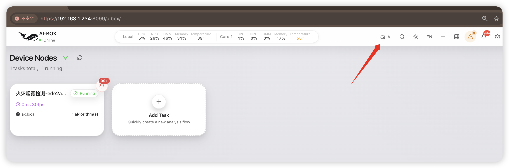](../../assets/ai-assistant/en-01-entry.png)

*Figure 1: AI-BOX device interface in English. The red arrow points to the AI button immediately to the left of the search icon. Click it to open the assistant; use your own device address.*

### 1.2 Floating window controls

The task page remains interactive while the assistant is open. You can inspect a task and read the conversation at the same time.

| Area or action | Purpose | Usage notes |
|---|---|---|
| Title bar | Move the window | Drag it away from task cards you need to inspect |
| Window edges or lower-right corner | Resize | Increase the height for long lists; the input stays at the bottom |
| Collapse | Reduce obstruction | Expand to return to the current conversation |
| Reset position | Restore the default placement | Useful after moving the window or changing screen size |
| Close | Close the assistant view | Does not undo operations already accepted by the device |
| Status row | Read actual model location and state | “Not started” does not necessarily mean the assistant is unavailable |
| Assistant help icon | Expand dependency, mode, and installation information | Normally collapsed when dependencies are available |
| Model service icon | Open shared model settings | Inspect preferences, available locations, and diagnostics |
| Conversation | Read responses, forms, and evidence links | Scroll independently to inspect longer responses |
| Bottom input | Enter a request | Click Send or press Enter; Shift+Enter inserts a line break |

[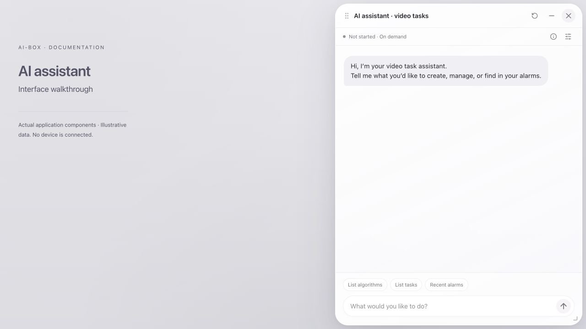](../../assets/ai-assistant/en-02-overview.png)

*Figure 2: Actual application components with example state. The top row contains model status, help, and settings; the bottom contains shortcuts and the input. No device is connected.*

Window geometry is stored in the current browser; another browser may use a different position. With the title bar focused, use arrow keys to move the window. The lower-right resize control also supports arrow keys; Shift increases the step. Compact windows may hide shortcuts without disabling text input.

## 2. Check prerequisites

### 2.1 Preparation checklist

| Item | What to verify | If unavailable |
|---|---|---|
| Device connection | Signed-in session and working device message channel | Restore connectivity and wait for automatic checks |
| Application and Web interface | Compatible versions | Upgrade the matching release components |
| Algorithm plugins | Required algorithms installed, loaded, and visible | Check plugin management, then query the catalog again |
| LLM bridge component | Application-side component available | Follow the Check LLM component prompt |
| Independent model extension | Correct AX/AXCL or RK extension | Have an administrator install the matching package |
| Text capability | A working text-only backend | Use supported explicit commands when semantic understanding is unavailable |
| Storage | External model storage remains mounted and readable | Check TF storage and mounts rather than repeatedly removing media |
| Camera | Device can access a valid RTSP stream | Verify network, port, authentication, and stream path |
| Site settings | Regions, directions, face libraries, and other required details | Complete them in the draft editor when requested |

!!! warning "Model extensions and algorithm packages are different"
    Do not upload an independent `.deb` model extension as a `.plugin` algorithm package. The application-side LLM component is separate from the model program and weights. Install a matching release combination using its package instructions. File presence alone does not establish successful inference.

### 2.2 Dependency checks and retry

The complete RC3 delivery combinations are listed below. Install the matching main package before extensions. The main package supplies a private Python runtime; customers do not need to install system Python separately.

| Platform | Main package | Extensions in the complete delivery |
|---|---|---|
| AX650N | `aibox-ax650n` | `aibox-plugin-llm` |
| RK3588 | `aibox-rk3588` | `aibox-plugin-llm`, `aibox-plugin-llm-rk-vlm` |

The shared AX/AXCL extension contains separately built and signed host-platform plugins. The RK VLM extension supplies the RK-native model. Do not mix main-package platforms or upgrade only the Web assets while leaving incompatible backend components. Installing device DEBs does not deploy the cloud Web application.

The assistant checks dependencies when opened and checks again after reconnection. Missing extensions, incomplete files, unavailable components, or failed checks can disable input and display guidance.

1. Open **Assistant help** and read the specific state and reason.
2. Use **Installation help** for a missing extension or **Check LLM component** for a component problem.
3. After an administrator resolves the issue, click **Check again**.
4. Wait until the input becomes available before querying or creating tasks.

Checking does not start the model. You do not need to create an LLM video task first. “Installed,” “supports text,” and “running” are separate facts.

### 2.3 DEB paths and model-storage configuration {#installation-storage}

#### 2.3.1 Three different paths

| Path | Configurable in current rc3? | Meaning |
|---|---|---|
| Location of the DEB archive | Yes | An accessible source for installation, not the destination of installed files |
| Application, libraries, signed plugins | No arbitrary destination option | Package-defined system paths such as `/usr/local/aibox` remain in use |
| Actual LLM model storage | A mounted external volume can be selected in advance | Configure `/etc/aibox/llm-storage.json`; only model weights move outside the system partition |

Running `dpkg -i` from an external drive does not install the whole application there. A builder's `--output-dir` selects where package artifacts are written, not where a device installs them. Do not use `dpkg --root` or move all of `/usr/local/aibox` as a substitute for normal installation.

Internal storage is the default, not an arbitrary internal-directory selector. AX/AXCL models use `/usr/local/aibox-plugin-llm-ax/server/<model-directory>`; RK-native models use `/usr/local/aibox-plugin-llm-rk/models`.

#### 2.3.2 Check existing configuration first

These commands only read existing settings/bindings:

```bash
for p in /etc/aibox/llm-storage.json \
  /usr/local/aibox-plugin-llm-ax/external-model.json \
  /usr/local/aibox-plugin-llm-rk/external-model.json \
  /usr/local/aibox-plugin-llm/external-model.json; do
  if [ -f "$p" ]; then
    printf '\n%s\n' "$p"
    cat "$p"
  fi
done
```

Selection priority is:

1. An existing `external-model.json` binding in the corresponding private extension root.
2. Its `ax` or `rk` entry in `/etc/aibox/llm-storage.json`.
3. For AX, a compatible legacy external binding may be inherited when no configuration selects a volume.
4. Without an effective external selection, use internal defaults. Insufficient space aborts installation; no arbitrary drive is selected.

!!! warning "Examples below primarily describe first-time extension installation"
    Existing model directories, bindings, or interrupted transactions require separate handling. Do not delete binding/transaction files or links to bypass protection. Read migration and recovery below before changing an installed system.

#### 2.3.3 Select internal defaults

On a fresh device without private or legacy AX external bindings, leave `/etc/aibox/llm-storage.json` absent, or use:

```json
{}
```

If another extension needs external storage, preserve its entry and omit only the relevant key. For example, an `rk` entry alone leaves a first-time, unbound AX installation on internal defaults.

`internal`, `install_path`, `model_path`, and `mode` are not supported internal-path switches here. Replacing an existing configuration with `{}` or `null` does **not** migrate externally bound models back to the system partition.

#### 2.3.4 Prepare an external volume

An administrator runs these commands on the device. Examples use `sudo`; omit it when already root. Schedule maintenance for upgrades/migration and ensure no task, review, or assistant request is using the affected model.

**Identify the partition instead of guessing from a device name:**

```bash
lsblk -o NAME,SIZE,FSTYPE,UUID,MOUNTPOINT
```

Choose the intended TF/USB/SSD partition and record its filesystem UUID. Stop if it is unformatted, contains data requiring protection, or its purpose is unclear. These instructions do not format storage.

If the volume already has a stable mountpoint such as `/mnt/storage/...`, use that actual mountpoint. Do not mount it again elsewhere. The following example is only for an existing filesystem that is not yet mounted. Confirm the example directory is unmounted and empty before mounting over it:

```bash
sudo mkdir -p /mnt/aibox-models
ls -A /mnt/aibox-models
# Replace YOUR-ACTUAL-UUID with the UUID you verified above.
sudo mount UUID=YOUR-ACTUAL-UUID /mnt/aibox-models
findmnt -rn --mountpoint /mnt/aibox-models -o TARGET,UUID,FSTYPE,OPTIONS
df -h /mnt/aibox-models /usr/local
```

Verify the exact mountpoint, UUID, filesystem type, and `rw` option for installation. An ordinary directory is not an external mount. The configured `mountpoint` must be an actual mountpoint, not an arbitrary child directory.

For automatic mounting at boot, an administrator should back up and edit `/etc/fstab`. This example is for **ext4 only**; do not label another filesystem as ext4:

```text
UUID=YOUR-ACTUAL-UUID /mnt/aibox-models ext4 defaults,nofail,x-systemd.device-timeout=10s 0 2
```

Keep the same partition, stable mountpoint, and correct filesystem type; avoid duplicate entries. If the target is unmounted and unused, `sudo mount /mnt/aibox-models` tests the fstab entry; verify again with `findmnt`. `nofail` allows system boot without the drive, not model operation without its drive.

Do not configure `/`, a plain directory, `/dev/shm`, or a network mount without a filesystem UUID as an external model volume. The installer neither mounts nor formats storage nor chooses a drive for you.

#### 2.3.5 Write external-storage settings

```bash
sudo mkdir -p /etc/aibox
sudoedit /etc/aibox/llm-storage.json
# If sudoedit is unavailable, use vi as root to edit the same file.
```

Save UTF-8 JSON without comments. Copy the actual `uuid` and `fstype` reported by `findmnt`.

**AX650N AX/AXCL models on an external volume:**

```json
{
  "ax": {
    "mountpoint": "/mnt/aibox-models",
    "uuid": "YOUR-ACTUAL-UUID",
    "fstype": "ext4"
  }
}
```

**Both RK-native and AXCL models on the same external volume for RK3588:**

```json
{
  "ax": {
    "mountpoint": "/mnt/aibox-models",
    "uuid": "YOUR-ACTUAL-UUID",
    "fstype": "ext4"
  },
  "rk": {
    "mountpoint": "/mnt/aibox-models",
    "uuid": "YOUR-ACTUAL-UUID",
    "fstype": "ext4"
  }
}
```

For RK-native weights only, configure `rk`; for AX/AXCL only, configure `ax`. Different entries may select different verified volumes. An omitted key means internal defaults **only when no existing binding overrides it**. Preserve other required entries when editing an existing file.

The installer creates its own paths beneath the selected mountpoint:

```text
/mnt/aibox-models/.aibox/llm-models/aibox-plugin-llm-ax/generations/model-<generated-ID>/
/mnt/aibox-models/.aibox/llm-models/aibox-plugin-llm-rk/generations/model-<generated-ID>/
```

Arbitrary generation directory names are not configurable. Fixed system model paths link to these directories; application binaries and plugins remain on the system partition.

#### 2.3.6 Install the matching platform packages

After configuring storage, enter the delivery's platform directory and run only the matching command group. Install the main package first; separate system Python installation is unnecessary.

**AX650N:**

```bash
( # A subshell stops this installation group if any command fails.
set -e
AIBOX_INSTALL_VERSION=2.1.1-202609110020-ai-assistant-rc3
sudo dpkg -i "./aibox-ax650n_${AIBOX_INSTALL_VERSION}_arm64.deb"
if [ -f /etc/aibox/llm-storage.json ]; then
  sudo /usr/local/aibox/bin/aibox-python3 -m json.tool /etc/aibox/llm-storage.json
fi
sudo dpkg -i "./aibox-plugin-llm_${AIBOX_INSTALL_VERSION}_arm64.deb"
)
```

**RK3588:**

```bash
( # Run only the RK3588 group; do not mix main-package platforms.
set -e
AIBOX_INSTALL_VERSION=2.1.1-202609110020-ai-assistant-rc3
sudo dpkg -i "./aibox-rk3588_${AIBOX_INSTALL_VERSION}_arm64.deb"
if [ -f /etc/aibox/llm-storage.json ]; then
  sudo /usr/local/aibox/bin/aibox-python3 -m json.tool /etc/aibox/llm-storage.json
fi
sudo dpkg -i "./aibox-plugin-llm_${AIBOX_INSTALL_VERSION}_arm64.deb"
sudo dpkg -i "./aibox-plugin-llm-rk-vlm_${AIBOX_INSTALL_VERSION}_arm64.deb"
)
```

Run the next command only after the preceding one succeeds; stop on errors. JSON syntax validation does not validate mounts, space, or version compatibility; extension pre-install checks do that. Do not force overwrites, ignore dependencies, or falsify UUIDs.

Space requirements use unpacked payload size, not compressed DEB size:

- Main-package upgrades still need system-partition payload space and reserve; external model settings do not replace that requirement.
- External-model installation checks system runtime space and external model space separately, with 128 MiB reserve on each.
- External upgrades preserve the old generation while unpacking a new one. Free space must not be limited to the size difference between versions.
- Two paths on the same filesystem do not provide additional capacity.

#### 2.3.7 Verify the effective location

After external installation, inspect `mountpoint`, `uuid`, `fstype`, and `model_path` in the corresponding binding:

```bash
# AX/AXCL:
sudo cat /usr/local/aibox-plugin-llm-ax/external-model.json
# RK native:
sudo cat /usr/local/aibox-plugin-llm-rk/external-model.json
```

Run only commands for installed extensions. A fresh internal installation normally has no external binding file.

The packaged read-only storage check does not start a model:

```bash
# AX/AXCL:
sudo /usr/local/aibox/bin/aibox-python3 /usr/local/aibox-plugin-llm-ax/bin/check_model_storage.py
# RK native:
sudo /usr/local/aibox/bin/aibox-python3 /usr/local/aibox-plugin-llm-rk/bin/check_model_storage.py
```

Use `findmnt --mountpoint <actual-mountpoint>` to verify volume identity and `df -h <actual-mountpoint>` for capacity. Installation verifies model SHA-256. Fast startup checks primarily validate bindings, paths, and file sizes, not a full rehash of all weights. Finally verify extension state and an actual inference; storage validation alone is not inference or algorithm acceptance.

#### 2.3.8 Migration, replacement drives, and recovery

| Current state | Is editing the configuration sufficient? |
|---|---|
| First-time extension with no historical model directory/binding | Yes: use internal defaults or preconfigure an external volume |
| Existing external binding, upgrade on the same volume | The existing binding is reused and identity/space checked |
| Internal models already exist, change to external | No automatic migration; the existing directory may cause refusal |
| Existing external models, change drive or return to internal | Existing bindings take precedence; a separate migration plan is required |
| Legacy official AX external configuration | Compatible volume identity may be inherited; arbitrary legacy links are not automatically migrated |

Current rc3 has no universal, lossless one-command migration. An administrator must first confirm versions and bindings, stop affected model consumers, back up and verify assets, and plan the switch. Do not manually move/link directories, delete ownership metadata, or assume uninstall/reinstall preserves all data.

After an interrupted installation, restore the original drive/mount and verify UUID, read/write state, and capacity. If only configuration failed and files are complete, retry the specific package with `sudo dpkg --configure aibox-plugin-llm` or `sudo dpkg --configure aibox-plugin-llm-rk-vlm`. Incomplete unpacking requires reinstalling the same complete trusted DEB. Transaction records support recovery; they cannot bypass storage faults.

After commit, cleanup removes only unchanged old model files owned by the recorded inventory. Added, modified, or unmanaged files may remain, so external storage still needs capacity management. The installer does not automatically format drives or delete customer recordings to finish installation.

## 3. Your first five minutes

Begin with queries to understand the returned information before creating a task.

1. Open the assistant and wait for dependency checks.
2. Click **List tasks** and review names, IDs, and states.
3. Click **List algorithms** to see actual device capabilities.
4. Enter `Create a smoking detection task` and choose its algorithm and task runtime.
5. Enter the real camera RTSP address in the dedicated form, review it, and click **Confirm**.
6. Read the result: a draft needing settings, a saved task, or a started task. Follow up if verification has not completed.
7. Open the video preview and check the image, detection overlays, and alarms. Complete site validation before production use.

!!! tip "State the goal clearly"
    Recommended: `Create a smoking detection task on the local device.`

    Too vague: `Set it up for me.`

    Creation, pause, and stop requests can change actual task state. Check the target before sending. Use List algorithms or List tasks when you only want to inspect the device.

## 4. Describe a request

### 4.1 Recommended structure

Ask in everyday language; algorithm IDs and a fixed command syntax are not required. Including **action + object + scope + required conditions** helps reduce follow-up questions. For example:

```text
List tasks
Create a smoking and missing safety helmet detection task
Pause task "Warehouse entrance"
Show today's fire alarms
Show error logs for this week
Show recordings related to license plate alarms
```

Natural-language requests use an available text model to extract intent and constraints, followed by validation against installed capabilities, task state, and allowed business interfaces. Shortcuts and some explicit commands can use controlled business paths directly. When a proposal card appears, check the action before clicking **Confirm**. Unreliable interpretations, unsupported conditions, and missing information require clarification; natural-language support is not a guarantee of correct interpretation of every possible message.

### 4.2 Follow-ups and corrections

During an unsubmitted creation flow, you can add algorithms, placement, review, or output requirements: “Also add fall detection,” “Use the first compute card,” or “Add recording.” Inspect the updated selections and form to verify that previous requirements were retained correctly.

After an alarm query, ask for related recordings. After a task list, identify the tasks to manage. References such as “them” or “these” rely on available context. If the previous scope was incomplete or expired, query again and select explicit targets instead of relying on a guess.

When changing topics or cancelling a pending form, state the new target. A later correction does not automatically roll back an already submitted creation or state change.

### 4.3 Understand the different confirmations

| Confirmation | What to inspect | Meaning |
|---|---|---|
| Operation proposal | Action, target, time, and conditions | Accepts the interpretation; task selection may still follow |
| Algorithm or camera form | Algorithms, runtime, camera address, review, and outputs | Continues creation; complete configurations may be saved and started |
| Task selection or deletion | Actual names, IDs, states, and count | Applies to selected targets; deletion has a separate confirmation |

Cancel ends the pending step. If task configuration or state changes while a confirmation is open, the device may require a fresh selection. Review the current list and continue.

### 4.4 Discuss a plan before creating it

For example: `I only need advice: how could I reduce nuisance smoke alerts in a loading bay?` The assistant can propose installed capabilities and explain limitations. `Why this recommendation?` is a consultation, not permission to create a task.

To prepare a proposal, continue with `Prepare that setup on compute card 1 and keep video recordings`, then `Change it to the host; keep everything else`. Verify the algorithms, location, and recording requirement in the updated form. Changing placement should not replace the detection goal with another algorithm.

Use the conversation's algorithm and RTSP forms directly, then click **Confirm/Cancel**; there is no need to rewrite form selections as a chat message. Advice is not evidence of field performance, and an unsubmitted draft is not a running task.

### 4.5 Query device information {#device-information}

Ask `Which software and firmware versions are installed?`, `Show the host CPU usage`, or `What is the temperature of compute card 1?`, then follow with `And its memory usage?`. Replies should identify hardware scope, units, and freshness.

#### 4.5.1 Supported information

| Information | Example | Interpretation |
|---|---|---|
| Software version | `What software version is installed?` | Application version reported by the device, not a cached Web label |
| Firmware version | `What firmware version is on this box?` | Firmware/SDK version supplied by the version interface; formats differ by platform |
| Device identifier | `Show the device identifier` | Device number supplied by the interface; redact as required before sharing |
| Platform | `Which platform is this device?` | Reported platform, not a guess based on task names |
| Device time | `What time does the device report?` | Device-side time, not the operator's computer clock |
| CPU usage | `Show the host CPU usage` | Percentage for the identified hardware |
| NPU usage | `Show the host NPU usage` | Sampled utilization; model inference itself can increase it |
| CMM | `Show the host CMM usage` | Usage and used/total capacity when supported; otherwise explicitly unavailable |
| Memory | `Just the onboard RAM usage, please` | Percentage and used/total capacity in MiB when supplied |
| Temperature | `What is the temperature of compute card 1?` | Temperature in °C for that hardware, not an automatic safety assessment |

Ask `Which software and firmware versions are installed?` or `Show the host CPU, NPU, and memory usage` for multiple fields. `Show device information` requests the currently integrated fields.

Disk, network configuration, uptime, and other properties are outside this page's current field set. Use device management for those details. This feature does not imply access to every possible device attribute.

#### 4.5.2 Host, compute cards, and follow-ups

```text
What is the temperature of compute card 1?
And its memory usage?
Now show the host CPU usage instead.
```

The first two queries should retain the same compute-card scope; the third explicitly switches to the host. Expressions such as `compute card 1`, `the first compute card`, `计算卡1`, and `第一张计算卡` refer to hardware returned by the actual device.

Check the hardware label, not just the number. A missing, offline, or unsupported card must not be replaced with host values. If card-specific version information is unavailable, the host's software/firmware version must not be presented as the card's version. Split requests if several hardware scopes cannot be distinguished reliably.

These settings are independent:

- **Query scope** selects which hardware's information to read.
- **Video-task runtime** selects where video detection executes.
- **Shared-model runtime** selects where language understanding/review runs.

Asking for a card's temperature does not move a task or change model-service preferences.

#### 4.5.3 Data sources and freshness

The model interprets the question and selects fields. Device business interfaces supply the values: the version interface supplies versions, and the device-information interface supplies resources. CPU, temperature, and version values are not generated from model guesses.

| Display | Meaning | Action |
|---|---|---|
| Valid `0%` | The interface reported a valid zero | Do not confuse it with a missing field |
| Unavailable / missing | Hardware, field, or interface has no usable data | Check hardware and versions; do not substitute zero |
| Recent sample | A supplied sample timestamp meets current freshness criteria | Also verify hardware and units |
| Stale data | Sample age exceeds current freshness criteria | Query again or inspect sampling |
| Unknown sample time | A legacy interface lacks a valid timestamp | Do not describe it as a freshly sampled real-time value |

Query time and sample time are different: receiving a new reply does not prove a new underlying sample was taken. Version information generally does not use resource-sample expiry rules.

This is an on-demand query, not continuous monitoring. Ask again for another response. Sampling cadence, concurrent workload, and the assistant's own inference may change adjacent readings. Without vendor thresholds and site evidence, a temperature or usage value alone cannot establish absolute safety or a hardware fault.

#### 4.5.4 Chinese and English examples

| 中文 | English |
|---|---|
| 软件和固件分别是什么版本？ | Which software and firmware versions are installed? |
| 主板CPU占用多少？ | Show the host CPU usage. |
| 本机NPU和CMM占用各是多少？ | Show the host NPU and CMM usage. |
| 一号计算卡有多烫？ | What is the temperature of compute card 1? |
| 那内存呢？ | And its memory usage? |
| 只看本机内存 | Just the onboard RAM usage, please. |

There is no need to translate metric names into algorithm names or create a video task before querying.

#### 4.5.5 Troubleshooting and site verification

1. Verify a signed-in page and a working device connection.
2. Check compatible application, Web, and model-component versions, including cached assets after upgrades.
3. Confirm host/card scope and whether an expired conversation supplied the wrong reference.
4. Inspect units, sample times, and unavailable markers. Compare with device management for the same scope and a nearby sample time when necessary.
5. Wait for recovery during model loading, busy periods, or service interruption. Do not create duplicate tasks, delete model files, or interpret an error response as a metric.

For support, provide versions, the original question, hardware scope, query time, and a redacted response. Do not supply camera passwords, tokens, or complete authentication data.

## 5. Inspect and select algorithms

### 5.1 Inspect actual capabilities

Click **List algorithms**, or ask `Which algorithms are available?` The catalog comes from components loaded on the current device. It is not the complete product catalog.

Algorithms are marked as:

- **Defaults available**: eligible for a default-configuration creation attempt. Camera, resources, outputs, and field performance still need checking.
- **Site settings required**: typically needs regions, tripwires, directions, a face library, or prompts. Expect a draft workflow.

### 5.2 Select one or more algorithms

1. Check the required algorithms and inspect the **Selected** count.
2. Expand **Other installed algorithms** if the desired item is not initially visible.
3. Choose an available local device or compute card under **Task runtime**.
4. Review retained LLM review and additional-output requirements.
5. Click **Confirm** to continue, or **Cancel** to stop this step.

[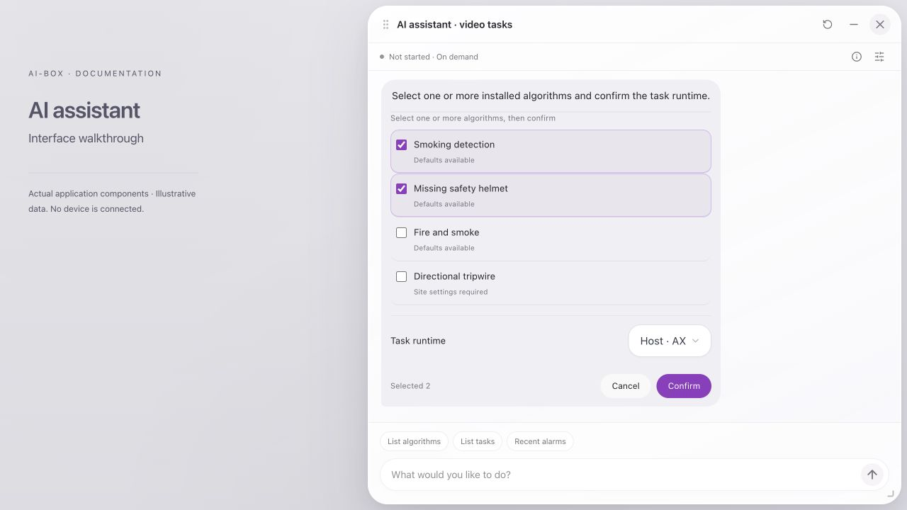](../../assets/ai-assistant/en-03-algorithms.png)

*Figure 3: Example algorithm selection. Checked boxes indicate this selection. “Site settings required” means defaults alone are insufficient for deployment. The example list does not represent your installed count.*

If an algorithm is unavailable, check installation, loading, and compatibility first. Typing an unknown algorithm name does not bypass device capability validation.

## 6. Create detection tasks

### 6.1 Enter the camera address

After algorithm selection, the assistant may display the **Camera RTSP address** form. Use this dedicated field to enter the address.

```text
rtsp://192.168.1.100:554/live
```

This demonstrates the format. It does not imply every camera uses `/live`. Obtain the actual path, port, username, and password from the camera configuration. Playback on your computer does not prove reachability from AI-BOX; creation checks connectivity from the device.

1. Enter the complete URL without surrounding spaces.
2. Verify the camera location and channel to avoid processing the wrong view.
3. Check **Task runtime**; it is separate from model-service placement.
4. Click **Confirm** and wait for the device result. Do not submit repeatedly.

[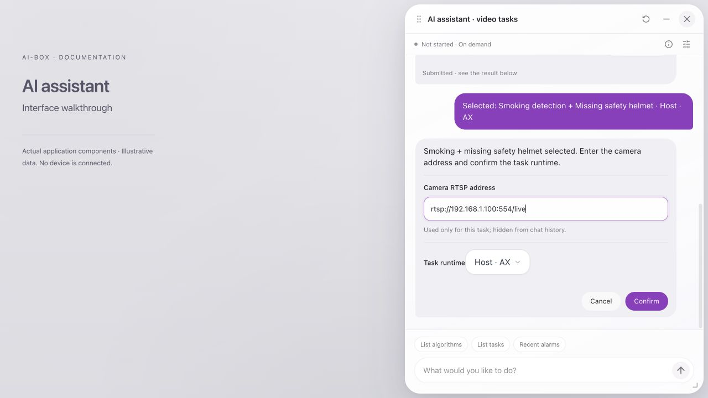](../../assets/ai-assistant/en-04-camera.png)

*Figure 4: Dedicated camera form. The address is used for the current task and hidden from chat history. Saved task configuration still requires appropriate protection.*

The camera field accepts up to 2,048 characters; the main request input accepts up to 4,096. Prefer concise requests instead of pasting large logs or task JSON as instructions.

### 6.2 Single and combined algorithms

```text
Create a smoking detection task
Create a combined smoking and missing safety helmet task
Create a fire and smoke detection task with LLM review
Create a smoking detection task with recording
```

Combined algorithms normally detect independently on the same video source and aggregate their results for display. Smoking + missing safety helmet does not mean “alarm only when the same person is smoking AND missing a helmet.” Same-object correlation, sequence, time windows, and AND conditions require appropriate business rules. A normal combination does not establish those rules.

The default output template includes network output and alarms. Additional recording, HDMI, or other outputs depend on the actual catalog and request. Storage or destination settings may require a draft. An alarm output node does not establish that relays, TTS, or external reporting are enabled; inspect their configuration separately.

### 6.3 Task runtime versus model location

| Setting | What it controls | Where to inspect |
|---|---|---|
| Task runtime | Available execution placement for this video task | Creation form and task configuration |
| Model-service location | Local device or compute card for shared LLM inference | Model service settings |
| Actual model location | Where the resident instance is really running | Assistant status row and model overview |

A local video task does not necessarily require a local LLM. Selecting a compute card does not establish hardware, plugin, or model validation. Choose a location returned as available by the device and resolve resource or compatibility errors as reported.

### 6.4 Drafts requiring site configuration

When site-specific information is missing, the assistant lists requirements and offers **Open draft to complete settings**.

1. Read the missing items: region, station boundary, tripwire, direction, face library, prompt, or other fields.
2. Open the draft and inspect generated nodes and connections.
3. Complete required fields using actual site conditions. Also check video inputs and outputs.
4. Save the task, then start it and open the preview.
5. Validate trigger conditions and false alarms against site acceptance criteria.

An unsaved draft is not a saved or running task. After a refresh, the camera address may need to be entered again so it is not restored from a sensitive persisted receipt. See the [Web User Manual](../user-manual/index.md) for editor details.

### 6.5 Interpret creation results

| Stage | What it establishes | Next step |
|---|---|---|
| Selection or input required | Request is still being completed | Complete the active form |
| Draft requires settings | An editable draft exists | Configure, save, and start |
| Saved | Device has the task configuration | Verify successful startup |
| Started | Startup was accepted or task is running | Check frames and preview |
| Frame verification passed | Fresh output metrics met the checks | Validate playback, image, algorithms, and alarms |
| Saved but startup failed / verification incomplete | A task may exist without a fully working pipeline | Inspect the original task before creating another |
| Result unknown | Web interface cannot establish the outcome | Recheck the original request and task list |

Automatic frame observation is bounded, currently approximately 30 seconds. It does not promise full algorithm validation within 30 seconds or establish that every algorithm branch passed acceptance.

## 7. Manage existing tasks

### 7.1 Check names, IDs, and states first

Enter `List tasks`. Similar names or the same algorithm can match several tasks. Prefer complete task names and verify the ID in the returned candidates.

[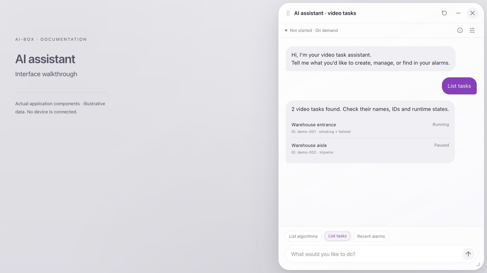](../../assets/ai-assistant/en-05-tasks.png)

*Figure 5: Example task list. Use current device state for actual operations. A read-only list row does not mean the task has been selected for an operation.*

### 7.2 Start, pause, resume, and stop

| Example | Behavior and considerations |
|---|---|
| `Start task "Warehouse entrance"` | Starts the existing target; does not create a duplicate |
| `Pause task "Warehouse entrance"` | Keeps configuration and releases video resources; does not freeze a frame or preserve tracker memory |
| `Resume paused tasks` | Filters paused tasks; inspect the selected scope |
| `Restore the state before pausing` | Uses saved pre-pause state; tasks previously stopped should remain stopped |
| `Stop task "Warehouse entrance"` | Stops execution while retaining configuration |
| `Start all tasks` | Affects the submitted target set; verify scope and capacity before sending |
| `Pause all tasks` | Pauses video tasks; does not stop the entire device service |

Restoring earlier state requires a supported version and stored state records. If an older task has no pre-pause record, the assistant cannot infer whether it was running. Inspect tasks manually as prompted. Task pause and stop are not interfaces for shutdown, reboot, or stopping remote maintenance services.

### 7.3 Select among multiple matches

[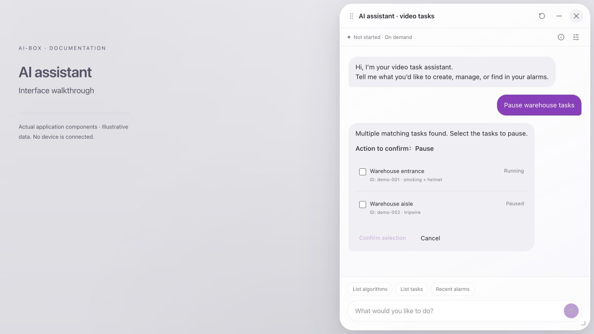](../../assets/ai-assistant/en-06-selection.png)

*Figure 6: Example pause selection. Review the action and task IDs, then select only intended targets.*

1. Read **Action to confirm** and verify start, pause, stop, edit, or delete.
2. Inspect each name, ID, algorithm, and state.
3. Select intended targets. Multiple matches do not imply automatic selection of all tasks.
4. Click **Confirm selection**.
5. Read per-task results. A batch may partially succeed; one success does not establish success for every item.

### 7.4 Edit and delete

Enter `Edit task "Warehouse entrance"`, then click **Open task editor**. The existing editor opens for the original task ID. Edit parameters in its forms; arbitrary natural-language parameter changes are not guaranteed.

For deletion, state the target explicitly, for example `Delete task "Warehouse entrance"`. Select the target when required and inspect the separate deletion confirmation.

[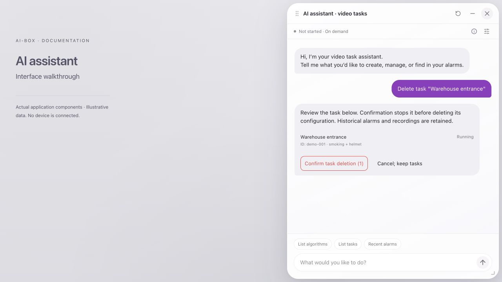](../../assets/ai-assistant/en-07-delete.png)

*Figure 7: Recheck names, IDs, and count before confirming. “Cancel; keep tasks” abandons an unsubmitted deletion.*

Execution stops a running task and releases resources before deleting configuration. Stop or release failure should retain configuration and report failure. This operation does not erase historical alarms or recordings. Retained history does not imply that deleted task configuration has one-click recovery.

## 8. Find alarms and image evidence

### 8.1 Time range and type

Start with **Recent alarms**, or ask:

```text
Show today's alarms
Show fire alarms for this week
What license plate alarms occurred in the last seven days?
Show smoking alarms
```

Supported ranges are **today, this week, and the last 7 days**. “Recent” or an omitted time normally uses the last 7 days; always inspect the displayed boundaries. Yesterday, arbitrary dates, and whole-month requests are not silently replaced with another range.

Statistics use device local time. A week starts Monday at midnight. The last 7 days include today and the preceding six calendar days. An incorrect device clock or timezone affects results; check time settings first.

Types depend on recognized categories and actual records. If ambiguous, choose a returned type candidate. **Other alarm types** are a separate group and are not included in the requested type's total.

### 8.2 Read counts and open evidence

[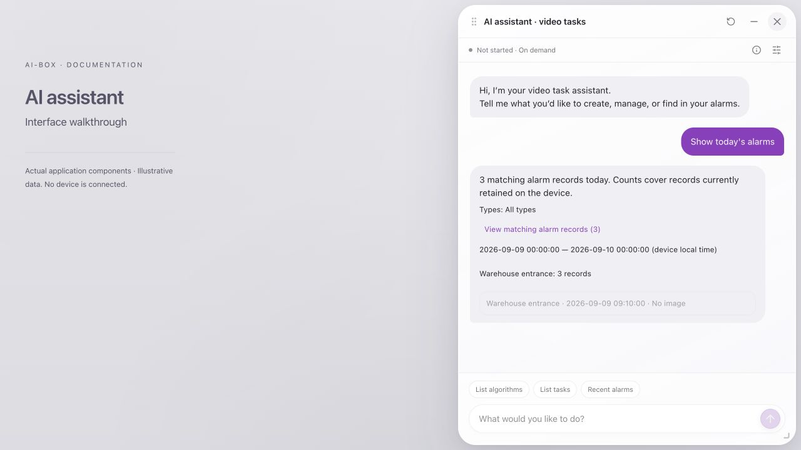](../../assets/ai-assistant/en-08-alarms.png)

*Figure 8: Alarm example with 3 illustrative records. “No image” means no image is available for that item; it does not establish that the alarm was invalid.*

1. Verify the type and time boundaries.
2. Read the total, task groups, and currently displayed records.
3. Click **View image** where available and inspect the timestamp, task, and scene.
4. Click **View matching alarm records**, or double-click the relevant response, to open the alarm panel.
5. The panel preserves that query's filters and snapshot. The assistant collapses to make room.
6. Submit a new query to include alarms arriving after the original query.

The total is not the number currently displayed. The conversation normally presents up to 20 recent records; the panel continues through the same query. A database error is not a zero count. Retention policies may remove older records. No records do not prove no event occurred, and record counts are not counts of independent incidents. Assess the evidence accordingly.

## 9. Find related recordings

After an alarm query, ask for related recordings, or enter `Show recordings related to this week's license plate alarms`.

[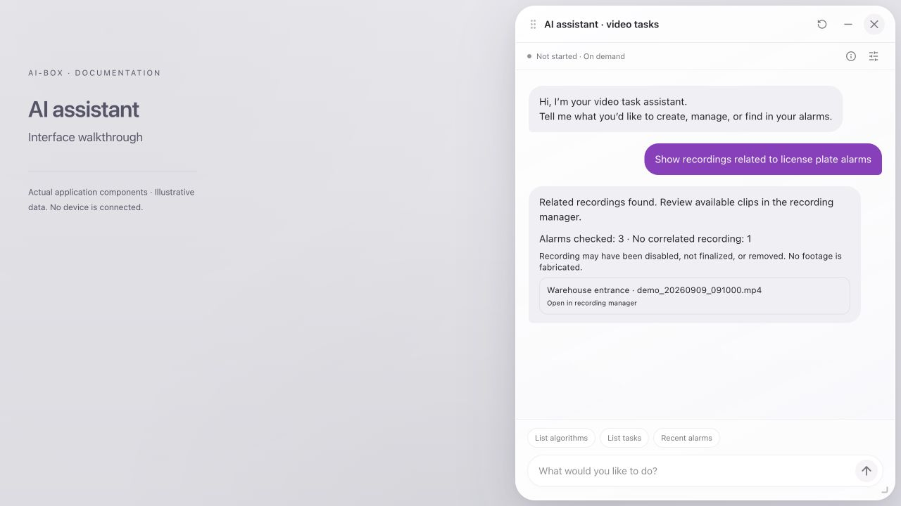](../../assets/ai-assistant/en-09-recordings.png)

*Figure 9: Example recording correlation. The interface distinguishes checked alarms, alarms without a matching recording, and accessible clips. The example filename is not actual footage.*

1. Verify the inherited alarm type and time range.
2. Review **Alarms checked** and **No correlated recording** counts.
3. Click an accessible clip to open the **recording manager**.
4. If inaccessible, inspect storage and retention rather than creating another task.

A recording may be absent because recording was disabled, the file is unfinished or removed, or correlation found no matching clip. **Recording correlation unavailable · Not checked** means correlation could not be completed; it does not mean a completed check found no footage. At most 20 clips are shown, with a truncation notice when applicable. The assistant does not fabricate historical footage.

## 10. Inspect and download log excerpts

Ask `Show today's error logs` or `Show recent error logs`.

[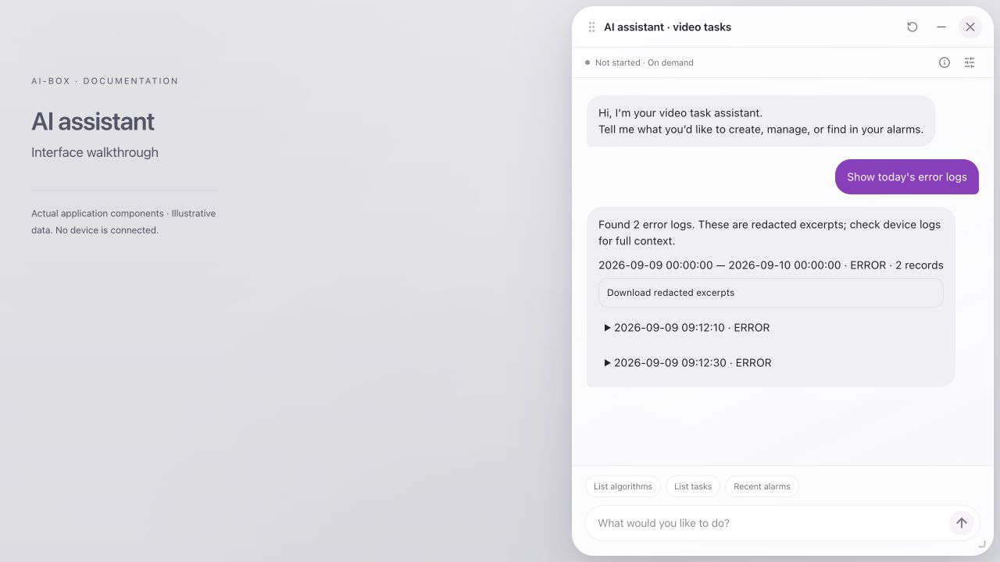](../../assets/ai-assistant/en-10-logs.png)

*Figure 10: Illustrative error logs. Expand individual entries and download the returned redacted excerpts.*

1. Verify the time range and severity.
2. Expand entries to read timestamp, level, and error text.
3. Click **Download redacted excerpts** to save the returned content.
4. Use device log management when full context is required.

The download contains returned excerpts, not a complete device diagnostics archive. Check for site names, internal addresses, and other project information before sharing. Log queries are not an interface for executing operating-system commands.

## 11. Configure the shared model service

### 11.1 Open settings and inspect state

Open **Model service** from the assistant icon or settings menu. Read actual runtime state at the top before inspecting preferences below.

[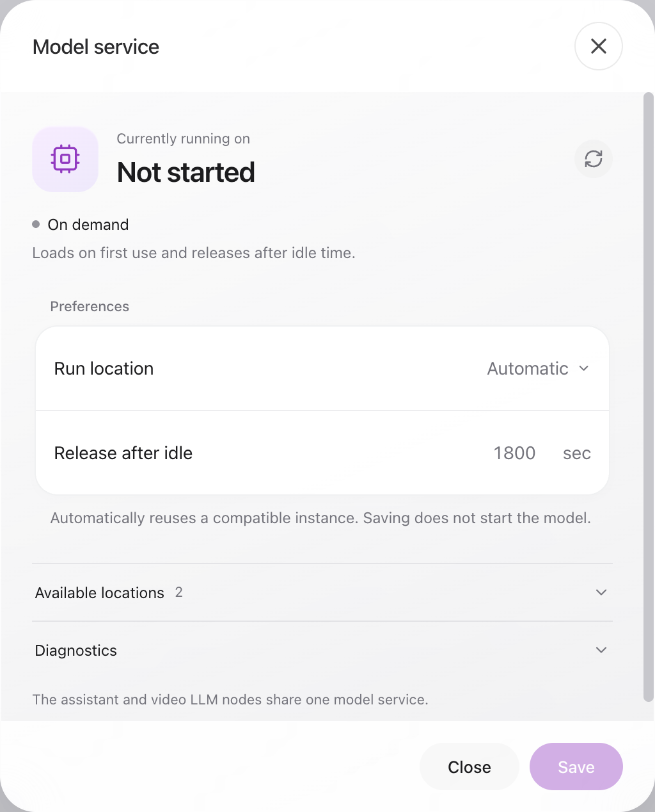](../../assets/ai-assistant/en-11-model-clear.png)

*Figure 11: Model-service example. The overview describes the actual instance; preferences describe saved policy. “Automatic” does not mean the model has started.*

| Setting or state | Meaning |
|---|---|
| Currently running on | Actual model instance location; may be unavailable before startup |
| Automatic | Selects using available capabilities and reuses a compatible instance |
| Local / compute card | Explicit placement; unavailable choices report an error instead of silently moving |
| Release after idle | New configurations default to 1,800 seconds (30 minutes); accepts 30–3,600 integer seconds. 3,600 seconds is one hour. Existing devices retain their saved setting |
| Available locations | Extension availability and declared text support |
| Diagnostics | PID, state, consumers, queued work, and in-flight work |
| Save | Persists preferences without immediately starting the model |

### 11.2 Why replies may not start the model

Task queries, algorithm queries, and explicit business commands can be handled directly by device services. A model is not loaded for every reply. Language understanding or video LLM inference creates actual model demand.

| Displayed state | Interpretation | Action |
|---|---|---|
| Not started / on demand | No resident model | Continue supported queries; actual inference will request loading |
| Starting / loading | Model is being prepared | Wait for the current request rather than resubmitting |
| Resident and idle | Loaded without active inference | Reuse on later requests; idle policy may release it |
| Inference / queued | Shared service is processing demand | Wait and inspect consumers or queue if needed |
| Error / unconfirmed state | Available evidence does not establish healthy operation | Refresh and inspect diagnostics, extension, and storage |

The assistant and video LLM nodes share one model service. Opening the window and querying status do not create extra instances. First loading can be much slower than a warm request; duration depends on model, storage, hardware, and resource load.

### 11.3 Change preferences

1. Wait until relevant LLM consumers release the instance and settings become editable.
2. Select an available location and enter the idle-release duration.
3. Click **Save** and verify **Saved**.
4. After the next actual inference, inspect the actual runtime location.

If saving fails or status is stale, refresh before assuming a value in an input field is active. Settings may remain locked while the model is in use or resident. Resolve conflicts between existing nodes' explicit placement and global preferences; repeated saving does not force migration.

## 12. Understand LLM review

LLM review is a processing stage after detection, separate from selecting a detector. RC3 assistant-created fire/smoke tasks include review by default; other algorithms can request it explicitly. Existing tasks are not automatically rewritten. Inspect the generated proposal and node settings.

- Check for **LLM review requirement retained** in the creation form.
- Verify the LLM stage exists and upstream algorithms request review.
- Check **Enable LLM review** on upstream algorithms. Review Prompt must be readable, nonempty text appropriate to the algorithm, never `[object Object]`. Verify the acceptance keyword (normally `YES`) and timeout.
- A single detector feeds LLM review, then OSD and outputs. Parallel detectors feed the shared review stage before OSD. Preserve the direct video-source-to-OSD frame path; parallel wiring does not imply an AND condition.
- Review uses the shared service rather than implying another independent instance.
- If a required LLM component is missing, a task without review does not satisfy the original requirement.
- Under new strict templates, failed, timed-out, or indeterminate review can preserve the original alarm. Receiving an alarm does not prove successful model review.
- Validate positive and negative examples, timeouts, and load. Frames or a resident model do not establish review accuracy.

See [Alarm Linkage](../alarm-linkage.md) and the [Full Plugin Configuration Reference](../reference/plugin-config-full.md) for output and plugin settings.

## 13. Disconnection, refresh, and unknown results

Use this workflow to avoid duplicates and incorrect state assumptions.

1. After a submission disconnects or times out, treat the outcome as unknown.
2. When connected, click **Check original request/result**.
3. Inspect whether the original task was created, changed, or deleted.
4. If the receipt cannot be found, finish manual verification before clicking **Task list checked; release wait**.
5. Only then decide whether another request is necessary.

Rechecking uses the original request; it does not mean executing again. Rewording and resending a creation request can create a new request. Repeated clicks and refreshes are not substitutes for receipt checks.

Closing the window, leaving the page, or cancelling an unsubmitted form does not guarantee cancellation of accepted background work. Chat text is not a reliable long-term operational ledger. Use task state and operation receipts to establish outcomes.

## 14. Chinese and English usage

Chinese pages use the Chinese assistant; English pages use English. Interface guidance, states, and buttons follow the selected language. Original task names, camera addresses, and business content are not arbitrarily translated.

| 中文 | English |
|---|---|
| 查看算法列表 | List algorithms |
| 查看任务列表 | List tasks |
| 查看最近报警 | Recent alarms |
| 软件和固件分别是什么版本？ | Which software and firmware versions are installed? |
| 主板CPU占用多少？ | Show the host CPU usage. |
| 一号计算卡有多烫？ | What is the temperature of compute card 1? |
| 那内存呢？ | And its memory usage? |
| 创建吸烟检测任务 | Create a smoking detection task |
| 暂停任务“Warehouse entrance” | Pause task “Warehouse entrance” |
| 查询今天的火灾报警 | Show today's fire alarms |
| 查看本周错误日志 | Show error logs for this week |
| 查看车牌报警的关联录像 | Show recordings related to license plate alarms |
| 模型服务 | Model service |
| 确认所选任务 | Confirm selection |
| 查询结果 / 原请求重查 | Check original request/result |

Keep the actual stored task name when referring to a task. Switching interface language does not rename it.

## 15. Troubleshooting

| Symptom | Check first | Resolution |
|---|---|---|
| Assistant entry missing | Application and Web version match | Refresh and verify the delivered release |
| Input disabled | Connection, dependencies, pending request | Restore connection or resolve/recheck the pending operation |
| Extension installation prompt | Platform and matching extension | Follow installation guidance, then Check again |
| Files installed but free-form requests fail | Actual text-only backend | Use explicit commands and verify compatible versions |
| Queries work while model is not started | Direct business-service routing | Normal on-demand behavior; do not start a model just for queries |
| Metrics missing or sample time unknown | Fields and timestamps supplied by the device | Never interpret missing data as zero; see Device Information Queries |
| Input too long or incomplete answer | Request size, model capacity, output budget | Split the request and inspect its form/receipt; do not repeatedly submit writes |
| Model busy or shutting down | Active inference, release, or loading | Wait for recovery; interruption is not a success receipt |
| Camera check fails | Device-side network, credentials, path | Fix the cause; check whether a task was saved before retrying |
| Algorithm absent | Installation, loading, visibility | Inspect plugin management; do not guess component names |
| Creation returns a draft | Required site settings | Complete and save the draft in the editor |
| Started task has no picture | Input stream, output, playback | Inspect the original task and preview |
| Previous state cannot be restored | Saved pre-pause state | Review tasks and manually choose the intended scope |
| Deletion incomplete | Version change, stop or release failure | Read per-item errors and refresh targets |
| Zero alarms | Time, type, retention, database state | Do not infer absolute site safety from zero |
| Missing image | Evidence absent or inaccessible | Inspect record and storage; do not create substitute evidence |
| No related recording | Recording, completion, retention, correlation | Inspect recording manager and storage |
| Model placement locked | Consumers, queued work, resident instance | Wait for release before changing preferences |
| Controls disabled after disconnect | Original outcome unconfirmed | Recheck the original request and tasks |
| Old form cannot be confirmed | Expiry, connection or target changes | Submit a fresh request and review its new form |
| Window obscures content | Position or size | Move, resize, collapse, or reset position |

## 16. Site acceptance and handover

Record acceptance against the actual deployment. At minimum, verify:

- [ ] Both language pages expose the entry and readable forms and guidance.
- [ ] Connection, catalog, extension, and runtime choices match the deployment.
- [ ] Versions and metrics match device data; single-field/card follow-ups retain scope and missing/stale values are labelled.
- [ ] Camera address corresponds to the correct scene; handover screenshots contain no credentials.
- [ ] Automatic and draft creation meet requirements; task IDs are recorded.
- [ ] Start, pause, resume, stop, and deletion scopes and results are checked.
- [ ] Preview, positive and negative detections, and alarm images meet site criteria.
- [ ] Recording storage, accessibility, and alarm correlation work when used.
- [ ] LLM cold start, placement, reuse, release, and failure behavior are verified when used.
- [ ] Original-request checks resolve disconnections without duplicate creation.
- [ ] Application, Web, plugin, and extension versions and unresolved issues are recorded.

For support, provide event time, actual task ID, request description, interface state, and necessary redacted logs. A report saying only “the assistant did not respond” is insufficient. Do not include camera passwords or complete authentication information.

## 17. Further reading

- [Device Onboarding & Quick Start](../device-onboarding.md): first connection, access, and deployment.
- [Web User Manual](../user-manual/index.md): editor, node settings, and preview.
- [Runtime Location and Deployment](../runtime-location.md): hardware and execution placement.
- [Alarm Linkage](../alarm-linkage.md): alarm outputs and integrations.
- [Deployment and Operations](../deployment-ops.md): rollout, upgrades, and maintenance.
- [FAQ](../faq.md): other device and SDK questions.
