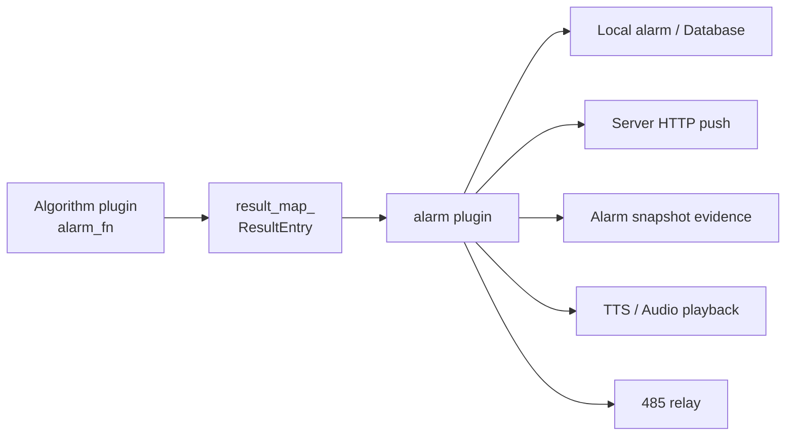

# Alarm Linkage

The AIBox SDK alarm pipeline turns algorithm events into business alarms that can be pushed, retained as evidence, and linked with field devices. The core design is **separation of responsibilities**: algorithm plugins only decide "whether a business event occurred" and output structured results, while the `alarm_plugin` handles push, snapshot, TTS, and relay actions. This avoids every algorithm reimplementing peripheral control, and centralizes concurrency, cooldown, and error recovery.

## Alarm Pipeline



## Two-Layer Protocol

The alarm protocol has two layers. Understanding this layering is the key to integration:

| Layer | Scope | Carrier |
|---|---|---|
| **Layer A (plugin internal)** | Algorithm plugin ↔ `alarm_plugin` | JSON returned by `alarm_fn` |
| **Layer B (device external)** | Device ↔ platform | HTTP reporting (spec V1.0.2) |

## Layer A: `alarm_fn` Unified Alarm Structure

An algorithm plugin's `alarm_fn` must return a unified structure so the `alarm_plugin` can route it correctly:

```json
{
  "msg": "TaskId:xxx 检测到目标",
  "alarm_type": "persondet_alarm",
  "timestamp": "2026-03-07T10:10:10.123Z",
  "alarm_count": 1,
  "alarm_push_uri": "/api/v1/device/report/event",
  "server_push_uri": "/api/v1/face/capture",
  "alarms": [
    {
      "local_push_msg": {
        "alarm_type": "persondet_alarm",
        "region_event": "Enter",
        "region_id": 0,
        "track_id": 42,
        "bbox": {"x": 100, "y": 120, "w": 200, "h": 260},
        "tts_text": "注意，检测到人员入侵"
      },
      "server_push_msg": {
        "time": 1770000000000,
        "sn": "device-sn",
        "event": "Enter",
        "face_data": "data:image/jpeg;base64,...",
        "bg_data":   "data:image/jpeg;base64,..."
      },
      "alarm_push_msg": {
        "did": "device-id",
        "type": 11,
        "time": 1770000000000,
        "state": 0,
        "data": {
          "event": "Enter",
          "region_id": 0,
          "track_id": 42,
          "bg_data": "data:image/jpeg;base64,..."
        }
      }
    }
  ]
}
```

Routing rules of the `alarm_plugin`:

| Field | Behavior |
|---|---|
| `server_push_uri` + `server_push_msg` | POST to `server_push_uri` (business snapshot reporting) |
| `alarm_push_uri` + `alarm_push_msg` | POST to `alarm_push_uri` (event reporting) |
| `local_push_msg` | Local UI / database / TTS, not pushed over HTTP externally |

!!! warning "Empty payloads are skipped"
    When `alarm_fn` returns an empty JSON object, the `alarm_plugin` skips that push. Make sure `alarms[]` is populated only when `alarm_count > 0`.

## TTS Fields

TTS fields are placed inside `local_push_msg`:

| Field | Description |
|---|---|
| `tts_text` | Text to speak directly |
| `tts_url` | Play a remote audio URL |
| `tts_queue` | `["文本1", "文本2"]` queue played in order |

## Event Type Mapping (EventType)

Source: `thirdpark/comm/include/DevProtoDef.hpp`. Common values:

| Value | Enum name | Meaning |
|---|---|---|
| 2 | INTRUSION_DETECTION | Intrusion / tripwire |
| 5 | CROWD_GATHERING | Crowd gathering |
| 6 | PERSON_LOITERING | Person loitering |
| 8 | FIRE_ALARM | Fire / smoke |
| 11 | HUMAN_DETECTION | Human snapshot |
| 12 | WHITELIST_DETECTION | Whitelist recognition |
| 13 | BLACKLIST_DETECTION | Blacklist recognition |
| 15 | POST_ABANDONMENT | Leave-post detection |
| 16 | FALL_DETECTION | Fall detection |
| 19 | BEHAVIOR_DETECTION | Behavior detection (fighting/smoking/phone call) |
| 20 | NON_MOTORIZED_VEHICLE | Non-motorized vehicle |

!!! note "Forward compatibility"
    The SDK currently extends up to `type=20`, while the protocol document V1.0.2 examples cover up to `14`. It is recommended that the backend enum be forward compatible: do not reject unknown values, and instead use the combined `type + alarm_type` two-field identification.

## Layer B: Device External HTTP Protocol

Per the platform device integration protocol spec V1.0.2:

| Interface | Method | Purpose |
|---|---|---|
| `/api/v1/device/report/event` | POST | General event reporting |
| `/api/v1/device/report/info` | POST | Device info reporting |
| `/api/v1/adapter/lenfocus/face/capture` | POST | Face snapshot reporting |
| `/api/v1/adapter/lenfocus/vehicle/capture` | POST | Vehicle snapshot reporting |

Standard event reporting body:

```json
{
  "did": "1234512",
  "type": 11,
  "time": 1666781577816,
  "data": {
    "face_data":       "data:image/jpeg;base64,...",
    "body_data":       "data:image/jpeg;base64,...",
    "bg_data":         "data:image/jpeg;base64,...",
    "jpeg_url_face":   "sdcard/capture/xxx_face.jpg",
    "jpeg_url_body":   "sdcard/capture/xxx_body.jpg",
    "jpeg_url_frame":  "sdcard/capture/xxx_frame.jpg"
  }
}
```

## Alarm Plugin Responsibilities

The alarm plugin executes actions:

- Server HTTP push.
- Local alarm records.
- Alarm snapshots.
- TTS or audio playback.
- RS485 relay trigger.

An execution failure affects only the corresponding peripheral and should not block the main video pipeline.

## RS485 Relay

The alarm plugin provides RS485 execution settings:

| Parameter | Description |
|---|---|
| `relay_enabled` | Enable RS485 relay |
| `relay_device` | Serial device, such as `/dev/ttyS1` or `/dev/ttyUSB0` |
| `relay_baud_rate` | Baud rate |
| `relay_slave_id` | Slave address |
| `relay_channel` | Relay channel |
| `relay_coil_address` | Coil address. `-1` means automatically mapped from channel |
| `relay_pulse_ms` | Trigger duration |
| `relay_default_interval` | Default trigger interval |
| `relay_active_high` | Whether active-high output is used |

## Multi-task Concurrency

When multiple tasks trigger alarms simultaneously, the alarm plugin executes RS485 writes through a unified queue:

- All tasks submit requests to one controller.
- Serial writes are serialized to avoid RS485 bus conflicts.
- The cooldown key includes device, slave, coil, task ID, and alarm type.
- When the queue is full, the oldest request is dropped to protect system stability.

## Delivery Recommendations

- Keep relay linkage disabled by default and enable it only after wiring and relay protocol are confirmed on site.
- Configure the serial device according to the hardware platform. Do not assume every platform uses the same `/dev/tty*`.
- Configure alarm intervals in algorithm plugins according to the business scenario. The alarm plugin only executes actions.

## Alarm Pipeline Commissioning Checklist

Confirm each item before going live to ensure the alarm pipeline is complete:

- [ ] The algorithm plugin outputs `alarm_count > 0`.
- [ ] `alarm_push_uri` / `server_push_uri` are not empty.
- [ ] The `http_url` configured in `alarm_plugin` is network-reachable (verify with `curl -X POST <url>`).
- [ ] The payload contains the `did` / `type` / `time` fields.
- [ ] The `data.bg_data` image size is within limits (compress to under 200KB is recommended; oversized images cause interface timeouts).
- [ ] TTS: `tts_enabled=true` and `tts_speaker_ip` is reachable.
- [ ] RS485: enable only after wiring and relay protocol are confirmed on site.

For more troubleshooting, see [Deployment & Operations](deployment-ops.md) and [FAQ](faq.md).
