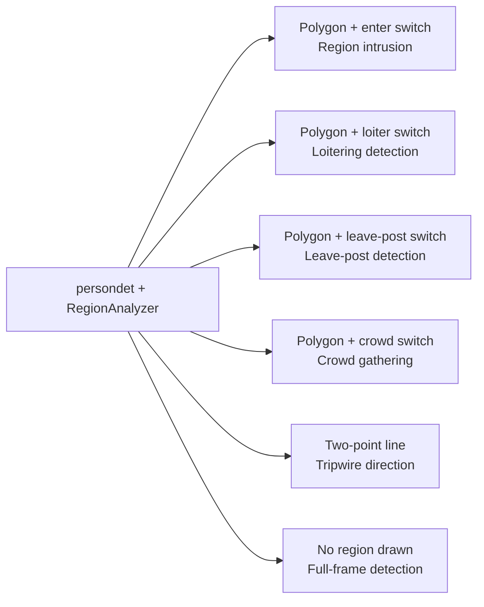

# Algorithm Capabilities

The AIBox SDK provides an algorithm component matrix oriented to field business, covering personnel security, vehicle management, production safety, behavior recognition, and open-vocabulary detection.

## Personnel Security

| Capability | Typical scenarios |
|---|---|
| Region intrusion | Restricted areas, equipment rooms, warehouses, hazardous zones |
| Loitering detection | Entrances, perimeters, key passages |
| Leave-post detection | Duty posts, toll posts, production posts |
| Crowd gathering | Plazas, stores, waiting areas |
| Tripwire direction | Entrances/exits, passages, perimeters |
| People counting | Retail, parks, exhibition halls |
| Face detection and recognition | Access control, attendance, watchlist monitoring |

## Vehicle Management

| Capability | Typical scenarios |
|---|---|
| License plate recognition | Park entrances, parking lots, road checkpoints |
| Illegal parking | Fire lanes, park roads, entrances |
| Vehicle counting | Entrances/exits, roads, parking lots |
| Wrong-way driving | One-way roads, logistics yards, park passages |

## Production Safety

| Capability | Typical scenarios |
|---|---|
| Fire and smoke | Warehouses, factories, equipment rooms |
| Helmet detection | Construction sites, workshops, construction areas |
| Fall detection | Elderly care, parks, public spaces |
| Phone call detection | Gas stations, production workshops, phone-restricted areas |
| Smoking detection | Warehouses, fire-sensitive areas |
| Fight detection | Parks, stores, public spaces |

## Behavior Recognition

| Plugin | Display name | Key capability |
|---|---|---|
| `fight` | Fight detection | Physical conflict behavior recognition |
| `falldown` | Fall detection | Person fall posture recognition |
| `calling` | Phone call detection | Handheld device phone-call behavior recognition |
| `smoking` | Smoking detection | Smoking behavior recognition |

## Region Rule Engine

The `persondet` plugin integrates `RegionAnalyzer`. **The same plugin can implement 6 security scenarios by drawing different shapes and toggling configuration switches on the front end**, without deploying a separate algorithm for each scenario:



Key configuration items (`config.json`):

| Config key | Default | Description |
|---|---|---|
| `region_enable_enter` | `true` | Enable enter/leave alarm |
| `region_enable_loiter` | `false` | Enable loitering detection |
| `region_loiter_sec` | `10` | Loitering trigger time (seconds) |
| `region_loiter_cooldown` | `30` | Loitering alarm cooldown (seconds) |
| `region_enable_absence` | `false` | Enable leave-post detection |
| `region_absence_sec` | `30` | Leave-post trigger time (seconds) |
| `region_enable_crowd` | `false` | Enable crowd gathering |
| `region_crowd_threshold` | `10` | Gathering trigger headcount |
| `region_enable_line_cross` | `false` | Enable tripwire crossing |

## Open Vocabulary and Intelligent Review

The `promptdet` plugin targets business where "categories change frequently, but you don't want to retrain a model for each scenario." Users push English prompts from the Web side, and the system understands the semantics and detects the corresponding targets in real-time video. The `llm` plugin performs semantic re-checking of candidate alarms to reduce false positives.

Typical target words:

```text
person
trash bag
traffic cone
fire extinguisher
cardboard box
```

Core capabilities:

- **Dynamic prompts**: up to 5 English prompts per task; one per line, and prompts may contain spaces internally.
- **Unified resource delivery**: detection capability, prompt understanding capability, and required resources are delivered together with the plugin (`promptdet_model.axpkg`).
- **Region rules**: full-frame detection by default when no region is drawn; after a polygon is drawn, only targets inside the region take effect.
- **General event rules**: supports target appearance, target absence, target stationary, new object, count over limit, action candidate, and other rules.
- **Alarm governance**: built-in lightweight tracking, consecutive-frame confirmation, repeat-alarm interval, and local/server alarm push.

Typical scenarios:

| Scenario | Recommended prompts | Recommended rules |
|---|---|---|
| Doorway package detection | `package` / `cardboard box` | New object or target appearance |
| Passage obstruction detection | `box` / `trash bag` / `carton` | Target stationary |
| Road debris detection | `traffic cone` / `debris` | Target appearance or target stationary |
| Post item missing | `fire extinguisher` / `helmet` | Target absence |

!!! note "Prompt language recommendation"
    The current version recommends using English prompts. Chinese prompts will not raise an error, but semantic alignment is unstable and is not recommended for production monitoring.

## Capability Combinations (Industry Solutions)

In real projects, capability combinations complete the business closed loop:

| Industry scenario | Capability combination |
|---|---|
| Perimeter security | Region intrusion + alarm snapshot + 485 relay |
| Fire safety | Fire and smoke + LLM review + TTS playback |
| Parking management | License plate recognition + platform push + video evidence |
| Rapid customization | Prompt detection + region rules + intelligent retrieval |
| Production management | Helmet + leave-post detection + platform work order |
| Business analytics | People counting + crowd gathering + data reports |

For more algorithm interfaces and model types, see the [SDK Development Guide](sdk-guide.md).
