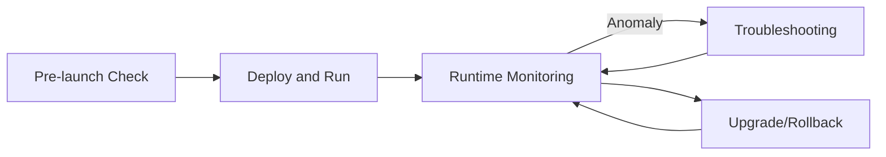

# Deployment and Operations

This chapter is aimed at delivery implementation and on-site operations, covering the complete workflow from pre-launch checks and runtime monitoring to upgrade/rollback and troubleshooting.



## Pre-launch Checklist

Check each item before going live:

- [ ] Camera RTSP URL, stream format, and frame rate.
- [ ] Whether the runtime location matches the hardware capability (`ax.local` / `rk.local` / `compute_card_N`).
- [ ] Whether plugin versions, model resources, and configuration files match.
- [ ] Alarm push URL, authentication parameters, and network connectivity.
- [ ] Whether the snapshot, recording, and log directories have enough space.
- [ ] Whether RS485, speakers, platform interfaces, and other peripherals have completed on-site validation.

## Runtime Monitoring

Watch the following metrics, which can be observed through the platform dashboard or system commands:

| Category | Key Metrics | Notes |
|---|---|---|
| System resources | CPU, NPU, memory, temperature | Excessive temperature triggers throttling and affects inference frame rate |
| Media pipeline | Decoding frame rate, inference latency, encoding frame rate | A frame rate drop usually indicates overload or an abnormal stream |
| Alarm pipeline | Alarm count, push success rate, snapshot success rate | Push failures are mostly network or backend URL issues |
| Service status | Plugin loading, task startup, device online | Use `journalctl -u aibox -f` to observe |

```bash
# View real-time service logs
journalctl -u aibox -f

# Check whether runtime library dependencies are complete (RK platform)
ldd /usr/local/aibox/bin/TaskManager | grep -E 'rga|mpp|rknn'
```

## Common Issues

### Video Plays but No Alarm Is Triggered

Check:

- Whether the algorithm threshold is too high.
- Whether the region or tripwire is configured correctly.
- Whether the alarm plugin is connected after the algorithm node.
- Whether `alarm_count` is greater than 0.

### OSD Shows an Alarm but the Platform Receives Nothing

Check:

- Whether the alarm push node is enabled.
- Whether the server URL is reachable.
- Whether device authentication is valid.
- Whether the alarm cooldown is currently in effect.

### RS485 Relay Does Not Actuate

Check:

- Whether the RS485 relay is enabled in the alarm node.
- Whether `relay_device` maps to the real serial port.
- Whether the baud rate, slave address, channel, and coil address match the relay board.
- Whether RS485 mode is enabled in the kernel.
- Whether the serial port is occupied by another process.

## Debug Helper Environment Variables

During on-site troubleshooting, you can enable diagnostic capabilities via environment variables:

| Variable | Description |
|---|---|
| `AXPLUGIN_KEEP_TMP_SO=1` | Keep the extracted temporary `.so` for easier GDB debugging |
| `PLUGIN_DECRYPT_KEY=<key>` | Decryption key for encrypted plugins |
| `ALARM_SNAPSHOT_RETENTION_DAYS=7` | Snapshot retention days (default 7) |
| `ALARM_SNAPSHOT_MAX_BYTES_MB=500` | Snapshot storage limit (MB, default 500) |
| `AIBOX_RK_IVPS_DIAG=1` | Enable RK RGA / IVPS diagnostic logs to locate scaling, OSD, and format conversion issues |
| `AIBOX_RKNN_DMA_INPUT=1` | Attempt the dma-buf binding path for RKNN input |

## Upgrade Recommendations

- Validate plugin packages and model packages on a test device first.
- Keep a rollback package for the previous version.
- Upgrade critical tasks in batches.
- After upgrade, verify task runtime location, alarm push, and snapshot pipelines.

## Related Documents

- Quick reference for frequent questions: [FAQ](faq.md)
- Alarm pipeline validation: [Alarm Linkage](alarm-linkage.md)
- Runtime location selection: [Runtime Location and Deployment](runtime-location.md)
