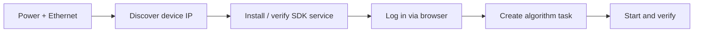
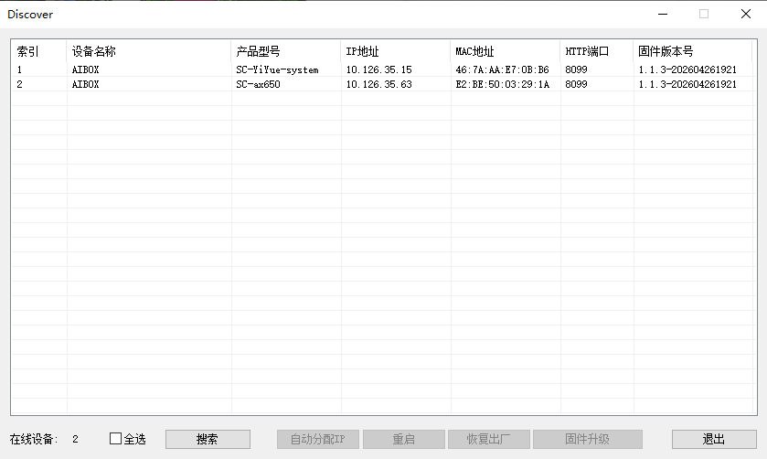
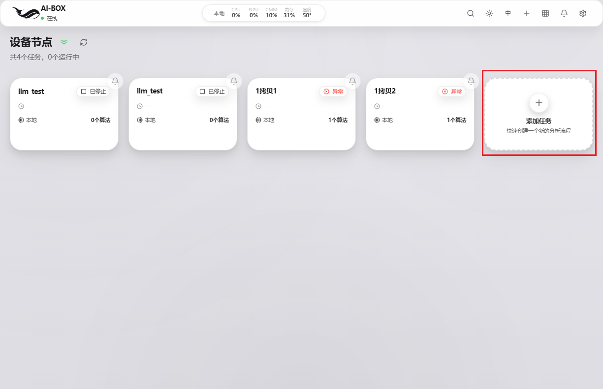
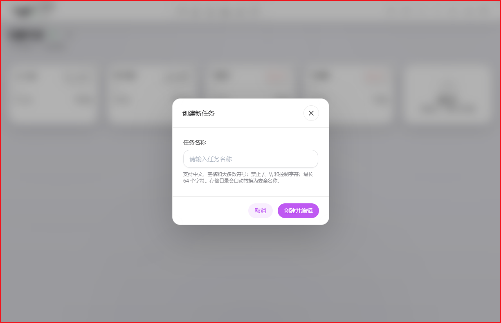
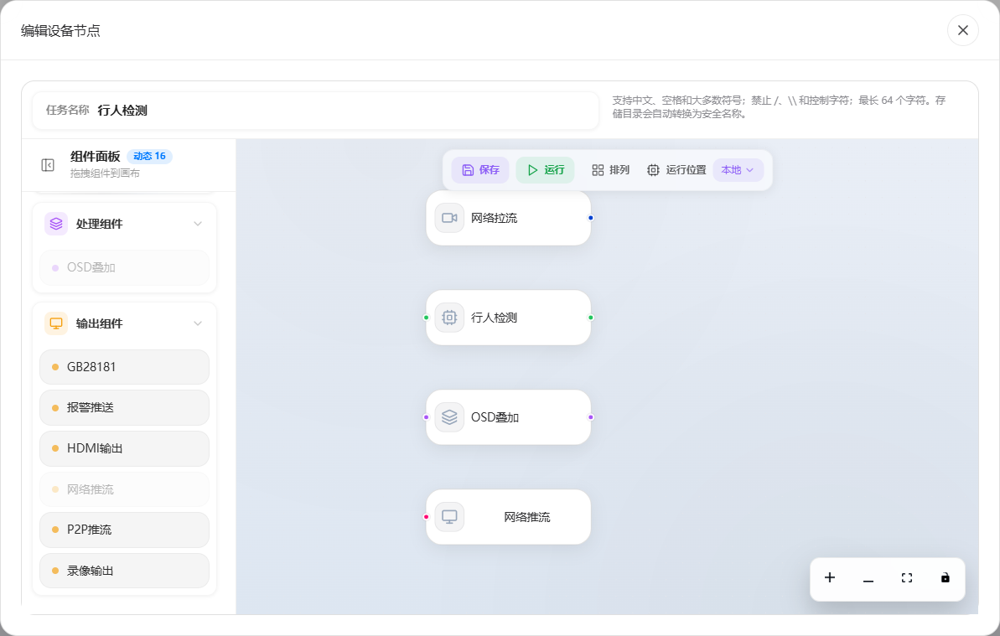
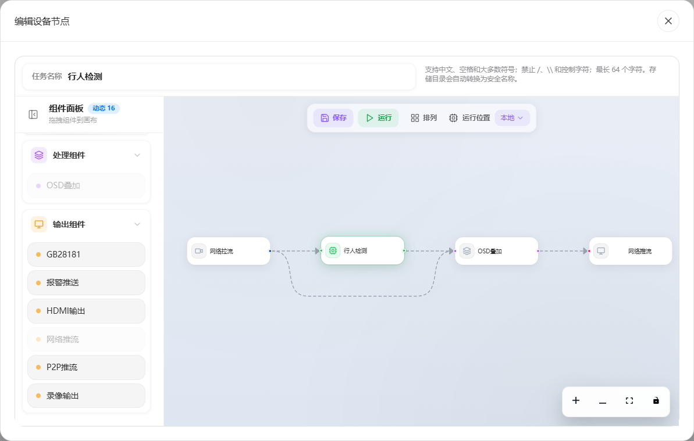
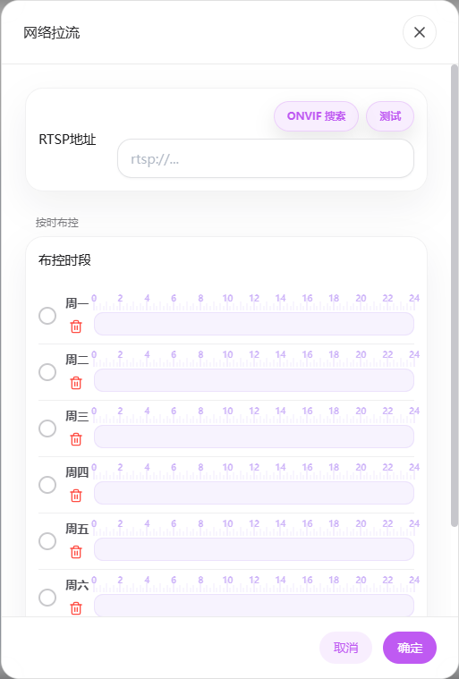
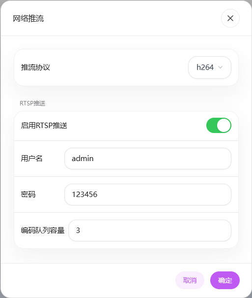
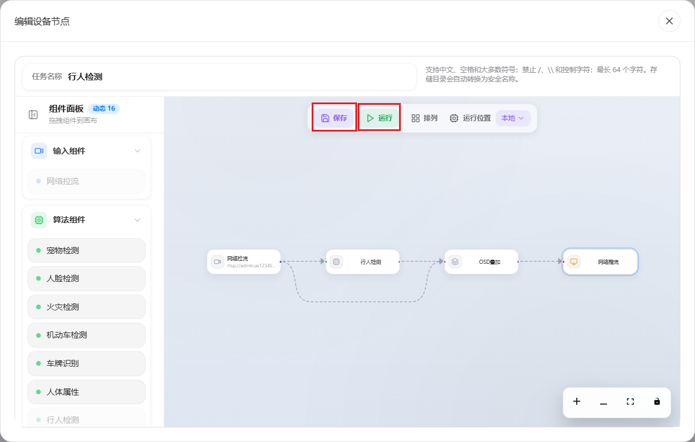
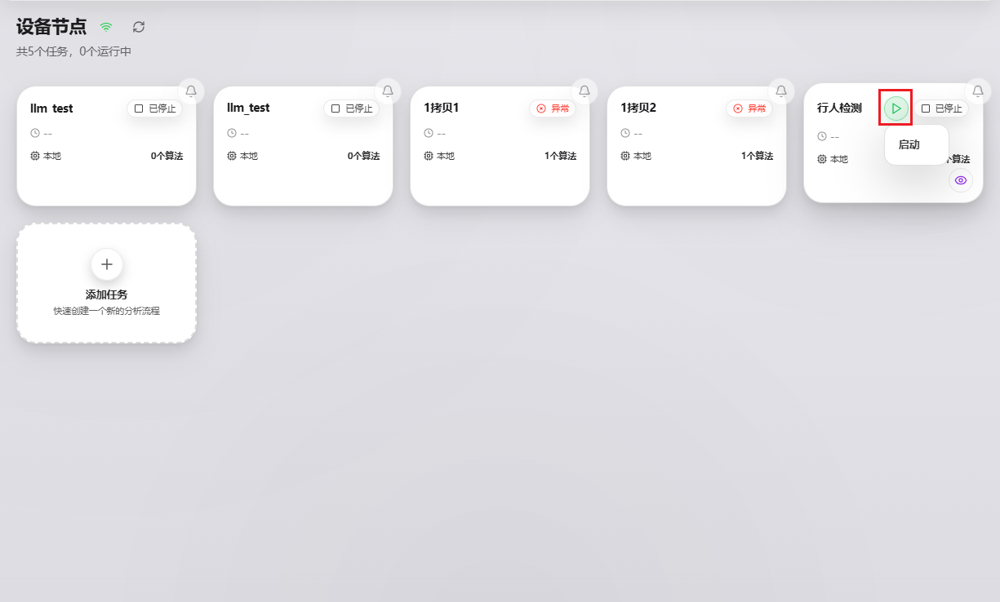

# Device Onboarding & Quick Start

This chapter is for users who have **just received a Jinsonic AIBOX device**. It walks you from physical connection to running your first algorithm task in the web management platform: **connect the box → discover its IP → install the SDK → log in → create a task**.

!!! info "Scope"
    This guide uses the **Jinsonic AX650 box** as an example, firmware version `3.10.2`. Default network behavior varies by model/firmware; both cases are covered below.



---

## 1. Physical Connection

1. Connect the box to power and turn it on.
2. Use an Ethernet cable to connect the box's **LAN port** to the same local network as your computer (switch / router).
3. Make sure your computer and the box are on the **same subnet** so you can discover and access the device.

!!! tip "Dual LAN ports"
    Some models provide two LAN ports (LAN1 / LAN2). Connecting either one to the network is sufficient.

---

## 2. Obtain the Device IP Address

How you get the device IP depends on the firmware's network configuration.

### 2.1 Option A: Device Discovery Tool (recommended, for dynamic-IP firmware)

!!! warning "Latest firmware uses dynamic IP (DHCP)"
    The latest box firmware obtains its IP via **DHCP by default** — there is no fixed default address. In this case you **must use the device discovery tool** to find the box's actual IP.

1. Download the **`Discover.exe`** tool (Windows) from the toolchain cloud drive:
    - [Baidu Netdisk](https://pan.baidu.com/s/18CczjjNDnMhM15VDcAJcpQ?pwd=v8me) (code: `v8me`)
    - [Google Drive](https://drive.google.com/drive/folders/15cmvIBABTxfgwNvJvhgTI9tMyAiH8vVT?usp=drive_link)
2. Run `Discover.exe` on a Windows PC on the **same local network** as the box.
3. The tool scans and lists devices on the LAN. **Double-click a device** in the list to open that box's management page directly.

    

### 2.2 Option B: Known default static IP (some older firmware)

Some firmware ships with a preset static IP. For the **Jinsonic AX650 box**, the factory defaults are:

| LAN port | Default IP |
| :-- | :-- |
| LAN1 | `192.168.6.100` |
| LAN2 | `192.168.9.100` |

Temporarily set your computer's IP to the same subnet (e.g. `192.168.6.x`) and access the address directly via browser or SSH.

### 2.3 Switch the NIC to DHCP (optional)

To have the box join an existing network and obtain an IP automatically, SSH in and edit the NIC config:

```bash
# SSH into the box (using the default static IP as an example)
ssh root@192.168.6.100

# Edit the network interface config
vim /etc/network/interfaces
```

Set `eth0` / `eth1` to DHCP:

```text
# interfaces(5) file used by ifup(8) and ifdown(8)
# Include files from /etc/network/interfaces.d:
source /etc/network/interfaces.d/*

allow-hotplug eth0
iface eth0 inet dhcp

allow-hotplug eth1
iface eth1 inet dhcp
```

Configure DNS and verify connectivity:

```bash
echo "nameserver 8.8.8.8" >> /etc/resolv.conf
ping baidu.com
```

After switching to DHCP, the router assigns the box's IP dynamically — use the device discovery tool to re-check the address.

---

## 3. Install / Verify the SDK Service

Most boxes ship with the AIBOX service preinstalled — you can skip to [Section 4](#4-log-in-to-the-web-management-platform). To install or upgrade the SDK manually, follow these steps.

1. Get the installer from the cloud drive, example path:

    ```text
    aibox/software-packages/ax650x/aibox-ax650n_1.1.3-202604261921_arm64.deb
    ```

2. Copy the package to the box and install it:

    ```bash
    dpkg -i aibox-ax650n_1.1.3-202604261921_arm64.deb
    ```

3. After installation, an `aibox` service is added. Verify it is running:

    ```bash
    service aibox status
    ```

!!! tip "Optional: LLM plugin"
    For the SDK's LLM plugin (alarm secondary review, etc.), install this package from the cloud drive:

    ```text
    aibox/software-packages/ax650x/aibox-plugin-llm_1.1.2-202605121019_arm64.deb
    ```

---

## 4. Log in to the Web Management Platform

1. Double-click the device in the discovery tool to open the management page, or enter the device address directly in a browser:

    ```text
    https://<device-IP>:8099/aibox/
    ```

2. Log in with the default credentials: **username `admin` / password `admin`**.

!!! note "Full platform manual"
    For all web platform features (task management, flow editing, alarms, face library, recordings, etc.), see the [Web User Manual](user-manual/index.md).

---

## 5. Create Your First Task (Person Detection Example)

The following uses person detection to demonstrate the web platform. Target pipeline:

```text
RTSP pull → person detection → OSD overlay → RTSP push
```

### 5.1 Create a task

After logging in, click **Add Task** to create a new person-detection task.





### 5.2 Drag plugins

Tasks are composed by **dragging and connecting plugins**. First drag the required plugins into the editor.

!!! tip "Canvas controls"
    Use the mouse wheel to zoom the viewport; hold the middle mouse button to pan.



### 5.3 Connect components

Each component has input / output ports. Connect them following the data flow.



!!! warning "OSD overlay connections"
    The OSD overlay input must connect to **both** the network-pull and the person-detection outputs. This is because person detection outputs only structured data (bounding boxes, etc.) without video frames — the video stream is supplied by the network-pull node.

### 5.4 Configure components

Double-click a component to configure it. For more options, see the [Web User Manual](user-manual/index.md).

- Double-click the **network-pull** component to configure the RTSP pull URL:

    

- Double-click the **network-push** component to configure the RTSP push URL and enable the "Enable RTSP push" switch:

    

### 5.5 Save the task

Click **Save**.

!!! danger "Always save manually"
    Task composition and component configuration are **not saved automatically**. Be sure to click Save after making changes.



### 5.6 Start the task

Click **Run** in the editor, or click the **play button** for the task on the task management page to start it.



!!! success "Auto-restore after reboot"
    The `aibox` service remembers task start/stop states. For example, if a person-detection task is running and the device reboots, the service **automatically restarts** the task — no manual restart needed.

---

## Next Steps

- Explore algorithm capabilities → [Algorithm Capabilities](algorithm-capabilities.md)
- Dive into the web platform → [Web User Manual](user-manual/index.md)
- Cross-compilation and plugin development → [Quick Start](quickstart.md) / [Plugin Development](plugin-development.md)
