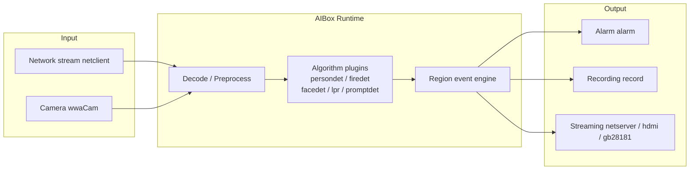
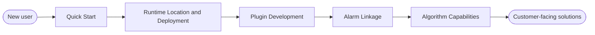

# AIBox Edge Vision Intelligence Platform

AIBox SDK targets edge vision scenarios such as campuses, factories, communities, retail stores, transportation, warehousing, and security. It delivers an end-to-end capability spanning video ingestion, AI inference, region rules, event decisions, alarm push, and recording for evidence. The platform adopts a plugin-based algorithm architecture and supports multiple hardware forms including AX650N / AX8850, RK35xx / RV1126B, and AXCL compute cards, performing real-time analysis at the edge to reduce cloud bandwidth and backend compute pressure.

It is not a single-algorithm demo, but a deliverable, extensible, and maintainable edge AI software system.

<ul class="aibox-badges">
<li>SDK aibox_sdk</li>
<li>Firmware baseline 3.10.2</li>
<li>Integration protocol V1.0.2</li>
<li>AX / RK / AXCL multi-platform</li>
<li>Plugin-based algorithm ecosystem</li>
</ul>

[:material-rocket-launch: Quick Start](quickstart.md){ .md-button .md-button--primary }
[:material-book-open-variant: SDK Development Guide](sdk-guide.md){ .md-button }
[:material-translate: 中文](../index.md){ .md-button }

## Choose an Entry Point by Role

-   :material-brain:{ .lg .middle } __Algorithm Engineers__

    ---

    Quickly integrate detection, recognition, behavior analysis, and open-vocabulary detection algorithm plugins, and understand the node lifecycle and inference backend selection.

    [:octicons-arrow-right-24: Plugin Development](plugin-development.md)

-   :material-server-network:{ .lg .middle } __Platform Engineers__

    ---

    Understand the task DAG, alarm protocol, plugin configuration, and platform event integration, connecting devices with business systems.

    [:octicons-arrow-right-24: Alarm Linkage](alarm-linkage.md)

-   :material-tools:{ .lg .middle } __Delivery Engineers__

    ---

    Complete device deployment, runtime location selection, alarm linkage, and on-site troubleshooting to keep projects stable in production.

    [:octicons-arrow-right-24: Delivery and Operations](deployment-ops.md)

-   :material-presentation:{ .lg .middle } __Solution Teams__

    ---

    Present platform capabilities, the algorithm matrix, and industry deployment patterns to customers, and quickly build solutions.

    [:octicons-arrow-right-24: Algorithm Capabilities](algorithm-capabilities.md)

## Platform Architecture Overview

Task decoding, preprocessing, inference, and encoding are ideally completed as a closed loop within the same **runtime location**, reducing cross-device data movement.

## Core Capabilities

-   :material-puzzle:{ .lg .middle } __Plugin-Based Algorithms__

    ---

    Algorithms, configuration, model resources, and UI metadata are delivered as plugins, making it easy to tailor and upgrade per project.

-   :material-cpu-64-bit:{ .lg .middle } __Multiple Runtime Locations__

    ---

    Support runtime locations such as AX local, RK local, and AXCL compute cards, selected uniformly when a task is created.

-   :material-sync:{ .lg .middle } __Edge Closed Loop__

    ---

    Complete stream pulling, decoding, preprocessing, inference, OSD, encoding, streaming, and alarms at the edge.

-   :material-bell-ring:{ .lg .middle } __Alarm Linkage__

    ---

    Support server push, local alarms, snapshot evidence, TTS playback, and RS485 relays.

-   :material-shape-outline:{ .lg .middle } __Rule Engine__

    ---

    Support business rules such as regions, tripwires, direction, dwell time, count thresholds, and cooldown deduplication.

-   :material-truck-delivery:{ .lg .middle } __Engineering Delivery__

    ---

    Support plugin packaging, task configuration, runtime diagnostics, cross-platform deployment, and field operations.

## Recommended Reading Path

1. New users should start with [Quick Start](quickstart.md).
2. For deployment and compute selection, see [Runtime Location and Deployment](runtime-location.md).
3. For algorithm customization, see [Plugin Development](plugin-development.md).
4. For alarm push, TTS, and RS485 relays, see [Alarm Linkage](alarm-linkage.md).
5. For customer-facing solution presentations, see [Algorithm Capabilities](algorithm-capabilities.md).
6. For issues, check the [FAQ](faq.md), and for version changes see the [Changelog](changelog.md).

## Documentation Map

| Section | Content | Intended Reader |
|---|---|---|
| [Quick Start](quickstart.md) | Get the SDK, build, deploy, create tasks, and validate results | Everyone |
| [SDK Development Guide](sdk-guide.md) | Architecture, interfaces, alarm protocol, demos, troubleshooting | Algorithm / platform engineers |
| [Web User Manual](user-manual/index.md) | Platform UI operations and task management | Delivery / operations |
| [Runtime Location and Deployment](runtime-location.md) | AX / RK / AXCL runtime locations and deployment forms | Platform / delivery engineers |
| [Plugin Development](plugin-development.md) | Node lifecycle, project structure, configuration forms | Algorithm engineers |
| [Alarm Linkage](alarm-linkage.md) | Alarm pipeline, RS485 relays, concurrency control | Platform / delivery engineers |
| [Algorithm Capabilities](algorithm-capabilities.md) | Algorithm matrix and industry scenario combinations | Solution teams |
| [Configuration Reference](plugin-config.md) | Plugin configuration structure and full field reference | Algorithm / platform engineers |
| [Delivery and Operations](deployment-ops.md) | Go-live checks, monitoring, upgrades, troubleshooting | Delivery / operations |
| [FAQ](faq.md) | Quick lookup for common questions | Everyone |

## Read the Docs Build

The repository root already provides:

- `.readthedocs.yaml`
- `mkdocs.yml`
- `docs/requirements.txt`

After adding the project in the Read the Docs console, select this repository and it will be built automatically with MkDocs.

中文文档请见 [中文](../index.md)。
