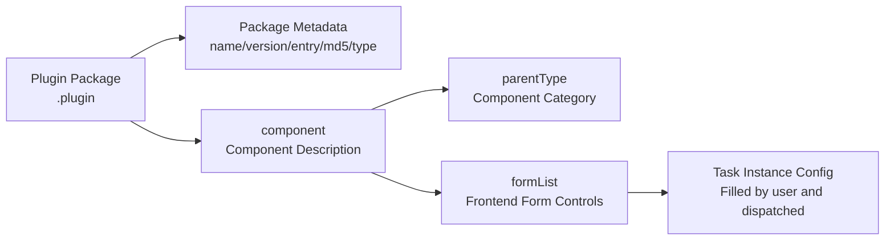

# Configuration Reference

Plugin configuration defines default node parameters and the way Web forms are rendered. It is the contract between the plugin package and the platform: the **backend** loads and validates the plugin based on `name` / `version` / `entry` / `md5`, while the **frontend** dynamically renders the task configuration form based on `component.formList`.

!!! tip "Complete Field List"
    This page is a design overview. For field-by-field descriptions and all control types, see [Plugin Configuration Full Reference](reference/plugin-config-full.md).

## Configuration Layers



- **Package metadata**: Used by the backend for loading and integrity checks; not visible to users.
- **component**: Defines the node's categorization and presentation on the canvas.
- **formList**: Defines the parameters the user can adjust on the Web side, ultimately generating the task instance configuration.

## Basic Structure

```json
{
  "name": "example_plugin",
  "version": "1.0.0",
  "entry": "libexample.so",
  "type": "example",
  "component": {
    "parentType": "algorithm-component",
    "label": {
      "zh": "示例算法",
      "en": "Example"
    },
    "type": "example",
    "component": {
      "formList": []
    }
  }
}
```

## Common Fields

| Field | Required | Description |
|---|---|---|
| `name` | Yes | Plugin name, must be globally unique |
| `version` | Yes | Plugin version, used for upgrade and rollback |
| `entry` | Yes | Shared library entry filename, consistent with the `.so` in the package |
| `md5` | Recommended | Shared library checksum, for integrity verification before backend loading |
| `type` | Yes | Node type, must exactly match the value registered by `register_node()` |
| `model_files` | As needed | Array of model filenames that actually exist in the package |
| `component.parentType` | Yes | Component category: `algorithm-component` / `input-component` / `output-component` |
| `component.type` | Yes | Frontend component type, must match `type` |
| `component.label` | Yes | Multilingual display name |
| `component.formList` | Yes | Array of frontend form controls |

!!! warning "type Must Be Consistent in Three Places"
    `type`, `component.type`, and the type registered by `register_node()` must be **exactly identical** (case-sensitive), otherwise the frontend form cannot be matched with the backend node.

## Common Controls

Each control contains at least three fields: `type` (control type), `key` (parameter key), and `name` (display name).

| Control | Purpose | Key Attributes |
|---|---|---|
| `input` | Single-line input | `placeholder`, `default` |
| `textarea` | Multi-line text, such as prompts | `rows`, `maxlength` |
| `switch` | Boolean toggle, such as TTS/relay enablement | `default` (high-risk items recommended to default off) |
| `slider` | Numeric adjustment for thresholds, ratios, time, etc. | `min`, `max`, `step`, `default` |
| `select` | Enumeration selection | `options[]` (`{label,value}`) |
| `inputNumber` | Numeric input | `min`, `max`, `precision` |
| `divider` | Divider for configuration grouping | `name` (group title) |
| `readOnly` / `status` / `label` / `tag` | Read-only display / runtime status badge | `default`, `unit` |
| `button` | Standalone action button | `buttonType` (e.g. `testConnection`) |
| `schedule` | Time-based patrol scheduling | `default` (contains timezone/schedule) |
| `regionDraw` | Region drawing | `default` (usually `[]`) |

### Control Example

```json
{
  "formList": [
    { "type": "divider", "name": "检测参数" },
    { "type": "slider", "key": "conf_threshold", "name": "置信度阈值",
      "min": 0.1, "max": 0.9, "step": 0.05, "default": 0.5 },
    { "type": "switch", "key": "tts_enabled", "name": "语音播报", "default": false }
  ]
}
```

## Multilingual Labels

Delivery-oriented plugins should provide at least Chinese and English labels. Multilingual fields should keep the same meaning across languages.

```json
{
  "name": {
    "zh": "检测区域",
    "en": "Detection Region"
  }
}
```

## Conditional Display: showWhen

Any control (including `divider`) can define `showWhen` so the Web UI shows or hides the item based on current form values. It supports a single condition or an array of conditions (AND semantics).

Supported operators: `eq` (equals), `ne` (not equal), `in` (in array), and `notIn` (not in array).

```json
{ "type": "slider", "key": "nms_threshold", "name": "NMS Threshold",
  "showWhen": { "key": "advanced_mode", "eq": true } }
```

```json
{ "type": "input", "key": "extra", "name": "Extra Param", "showWhen": [
  { "key": "enable", "eq": true },
  { "key": "mode", "in": ["advanced", "expert"] }
] }
```

Runtime status fields (`readOnly` / `status` / `label` / `tag`) additionally follow task runtime state: they are hidden before the task starts and shown once it is running.

See the [Plugin Configuration Full Reference](reference/plugin-config-full.md) for the complete field list.

## Configuration Design Principles

- Defaults should be conservative to avoid false alarms and accidental peripheral actions.
- High-risk peripheral options, such as relays and audio alarms, should be disabled by default.
- Parameter names should remain stable and be backward-compatible with existing task configurations.
- Complex business rules should stay in algorithm plugin configuration, while execution-layer parameters should stay in output plugin configuration.
