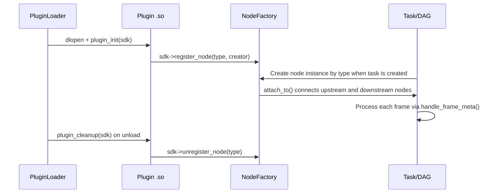
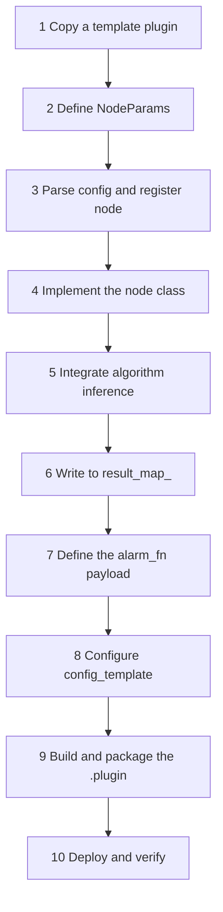

# Plugin Development

Plugins are the functional extension units of AIBox Runtime. Algorithm capabilities are delivered independently as `.plugin` packages and loaded dynamically at runtime, making it easy to tailor deployments per project and upgrade individual capabilities without affecting the stability of the main program. This chapter explains the composition and lifecycle of plugins, along with the standard steps for developing one from scratch.

## Plugin Composition

A plugin typically contains:

- The node implementation shared library (`.so`).
- The plugin configuration file (`config.json`, generated from `config_template.json.in`).
- Model resources (`.axmodel` / `.rknn` / `.axpkg`).
- Web form metadata (`formList`).
- Packaging and version information (`name` / `version` / `md5`).

## Node Lifecycle

Every plugin must export two C interfaces, through which the runtime registers and unregisters node types:

```cpp
extern "C" void plugin_init(SDKInterface* sdk);
extern "C" void plugin_cleanup(SDKInterface* sdk);
```



!!! warning "type must match"
    `component.type` (in the configuration file) must be **exactly identical** to the `type` registered by `register_node()` (case-sensitive). Otherwise the Web form will not appear and the node cannot be created.

## Recommended Project Structure

```text
xxx_plugin/
├── CMakeLists.txt
├── config_template.json.in   # Web form and component definition template
├── plugin_infer.cpp          # Plugin entry: parse config, register node
├── JdkXxxNode.hpp            # Node parameter struct NodeParams
├── JdkXxxNode.cpp            # Node implementation: algorithm core
└── models/                   # Model resources
```

!!! note "Directory naming"
    Directories should end with `_plugin`. By default `plugins/CMakeLists.txt` auto-discovers and builds subprojects matching the `*_plugin` pattern.

## From Scratch: The Standard 10 Steps



### Step 1: Copy the Closest Template

Pick the structurally closest one among `persondet_plugin` / `firedet_plugin` / `netclient_plugin` and copy it.

### Step 2: Define the Node Parameter Struct

Define `NodeParams` in `JdkXxxNode.hpp` to centrally manage the default values of configuration items.

### Step 3: Parse Config and Register the Node

In `plugin_infer.cpp`, read parameters with `jp(config, key, default)`, construct the node, and register it. Note that you should select the model and backend through `PluginRuntime` rather than hard-coding platform branches:

```cpp
sdk->register_node(PLUGIN_NODE_NAME, [](const std::string& name, const nlohmann::json& config) {
    const auto runtime = PluginRuntime::from_task_config(config);

    auto nodeParams = std::make_unique<MyNodeParams>();
    nodeParams->threshold = jp(config, "threshold", 0.8f);
    nodeParams->runtime_location = runtime.location;
    nodeParams->runtime_device_id = runtime.runtime_device_id; // local=-1, compute_card_N=N-1
    nodeParams->model_path = runtime.is_rk_local()
        ? jp(config, "model_path_rk", "./models/xxx.rknn")
        : jp(config, "model_path_ax", "./models/xxx.axmodel");

    return jdk_nodes::jdk_node_wrapper::create(
        name,
        std::make_shared<jdk_nodes::MyNode>(name, std::move(nodeParams), runtime));
});
```

### Step 4: Implement the Node Class

We recommend inheriting from `jdk_node_base`, `CustomHandleFrame`, and `CustomHandleControl`. The minimum you need to implement:

- `handle_frame_meta(std::shared_ptr<jdk_frame_meta>)`
- `handle_control_meta(...)`
- (optional) `run_infer_combinations(...)`

### Step 5: Integrate Algorithm Inference

When using the AX Algorithm SDK, prefer wrapping it with `SafeAlgorithm`:

```cpp
SafeAlgorithm::Options opt{ax_model_type_fire_smoke, nodeParams_->model_path, nodeParams_->runtime_device_id};
alg_ = std::make_shared<SafeAlgorithm>(opt);
alg_->set_affinity(true);              // Required for multi-stream scenarios: randomized NPU affinity
alg_->update_params([&](auto &p) {
    p.det_threshold = 0.8f;
});
```

When you also need RKNN support, select the backend based on the runtime location:

```cpp
// runtime.infer_type(): rk.local → "rk", ax.local / compute_card_N → "ax"
infer_ = YOLOV5FACE::create_infer(model_path, runtime.infer_type(), runtime.runtime_device_id);
```

Common inference interfaces: `detect()`, `track()`, `get_body_attr()`, `get_plate()`, `get_face_feature_2()`.

### Step 6: Write Results to `result_map_`

The core task is to construct a `jdk_objects::ResultEntry`, which acts as the result bus between the algorithm and the output plugins:

| Field | Purpose |
|---|---|
| `result` | Algorithm result object (usually `std::any`) |
| `render_fn` | OSD drawing callback |
| `alarm_fn` | Alarm payload construction callback |
| `push_enabled` / `push_interval_ms` | Reporting switch and cooldown strategy |

### Step 7: Define the `alarm_fn` Payload

You **must follow the unified payload structure**; otherwise `alarm_plugin` cannot correctly route it to HTTP / TTS / storage. See [Alarm Linkage](alarm-linkage.md) for details.

### Step 8: Configure `config_template.json.in`

- Define component ownership: `input-component` / `algorithm-component` / `output-component` / `other-component`.
- Define the Web visualization config: `component.formList`.

### Step 9: Build and Package

`plugins/CMakeLists.txt` automatically traverses the `*_plugin` subdirectories, builds them, and packages them into `.plugin` files:

```bash
cmake -S plugins -B plugins/build && cmake --build plugins/build -j$(nproc)
ls plugins/build_out/*.plugin
```

### Step 10: Deploy and Verify

```bash
cp plugins/build_out/*.plugin /usr/local/aibox/plugins/
service aibox restart
./jdk_node_sample      # Confirm the node registered successfully and the component structure is correct
```

## Runtime Troubleshooting: Red Connection

!!! warning "A red connection = abnormal node reporting"
    While a task is running, the **color of the connection between nodes on the canvas reflects link health**: green/normal means the upstream and downstream nodes keep reporting frames/results, while **red means the link has not received valid node information for a while**. When you see a red line, don't just look at the frontend—start by investigating the reporting path on the node side.

Common causes and the order to check them:

- **The node stopped producing output**: `handle_frame_meta()` returns early on an exception, or inference blocks and no longer forwards frames downstream. Make sure inference errors are caught and frames can still pass through.
- **`result_map_` not written or `push_enabled=false`**: the result bus has no valid entry, so downstream has nothing to report. Check that `ResultEntry` is populated correctly.
- **Reporting cooldown too long**: an overly large `push_interval_ms` makes reporting sparse and may be misjudged as a timeout. Reduce it appropriately.
- **Upstream/downstream not connected via `attach_to()`**: nodes failed to link and the path was never established. Verify the node `type` matches in all three places (config/registration/frontend).
- **Model or device init failed**: the node was created but inference is not ready, and the log shows loading errors. Confirm the model path, runtime location, and backend selection are correct.

While troubleshooting, use `./jdk_node_sample` to confirm node registration and structure, and check the runtime log for that node's frame handling and reporting records.

## Input and Output Contract

Algorithm plugins receive video frames and metadata from upstream nodes, and output inference results, OSD drawing callbacks, alarm construction callbacks, and push cooldown times. Output plugins such as alarm, streaming, and recording consume these results without coupling directly to a specific algorithm implementation.

## Common Configuration Form Controls

Plugins define the Web configuration UI through `config_template.json.in`. Common controls:

| Control | Purpose |
|---|---|
| `input` / `inputNumber` / `password` / `textarea` | Text / numeric input |
| `select` / `switch` / `slider` | Dropdown / toggle / slider |
| `button` / `divider` / `subdivider` | Action button / divider |
| `schedule` | Time-based patrol scheduling config |
| `regionDraw` | Web region / tripwire drawing (works together with RegionAnalyzer) |
| `readOnly` / `status` | Read-only display / runtime status |

Configuration keys should be stable, semantically clear, and provide both English and Chinese display names. See the [Configuration Reference](plugin-config.md) for the full field list.

## Engineering Recommendations

- Algorithm plugins should only perform algorithm judgment and should not directly operate relays, TTS, platform push, or other peripherals.
- Peripheral execution should be centralized in the alarm plugin, making it easier to handle concurrency, cooldown, and error recovery in one place.
- Keep high-frequency video paths low-copy; use debug dumps and CPU synchronization only when necessary.
- New fields must have default values (`jp(config, key, default)`); avoid renaming old fields to prevent database migrations.
- When adding new platform capabilities, prefer extending through the runtime location and common frame interfaces.
