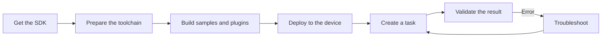
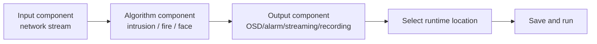

# Quick Start

This chapter walks you through a complete pipeline from scratch: **get the SDK → prepare the cross-compilation environment → build samples and plugins → deploy to the device → create a task → validate the result**. Every step provides directly executable commands and explains the reasoning behind them, so you can reproduce the flow in your own environment.



!!! tip "Reading recommendation"
    If you only want to get a demo running first, follow 1→2→3→6; when you need to configure business tasks in the Web UI, add 4→5.

## 1. Get the SDK

### 1.1 Directory Structure

The SDK is delivered as source code. After extraction, the directory looks like this:

```text
jinsonic-ai-sdk/
├── include/              # Public headers (essential reading for plugin development)
├── plugins/              # Plugin reference implementations and packaging scripts
├── example/              # Example projects (demo samples)
├── doc/                  # Protocols and supplementary materials
├── README_CN.md          # Chinese development guide (most complete)
├── README.md             # English development guide
├── build_sdk_sample.sh   # One-command build script
└── CMakeLists.txt        # Root project
```

### 1.2 How to Obtain It

=== "Git clone (recommended)"

    ```bash
    # Obtain from the Git repository for easier future updates
    git clone https://github.com/JinsonicAi/jinsonic-ai-sdk.git
    cd jinsonic-ai-sdk

    # Check the current version and commit
    git log -1 --oneline
    ```

=== "Archive"

    ```bash
    # After getting the tar.gz from the delivery channel, extract it
    tar -xzf jinsonic-ai-sdk-<version>.tar.gz
    cd jinsonic-ai-sdk
    ```

!!! note "Version alignment"
    This document corresponds to SDK `aibox_sdk`, firmware baseline `3.10.2`, and integration protocol specification `V1.0.2`. Before deployment, confirm that the device firmware and SDK version match to avoid ABI inconsistencies between plugins and the runtime.

## 2. Prepare the Cross-Compilation Environment

The SDK runs on ARM64 (`aarch64`) devices. You need to use a **cross-compilation toolchain** on an x86 host to generate ARM64 executables and shared libraries.

### 2.1 Environment Requirements

| Item | Requirement |
|---|---|
| Host OS | Ubuntu 20.04 / 22.04 |
| Cross compiler | `aarch64-none-linux-gnu-g++` (12.2.rel1) |
| CMake | ≥ 3.10 |
| Build tools | `make`, `git`, `unzip` |

### 2.2 Download and Install the Toolchain

The toolchain is large and is distributed via cloud storage:

| Channel | Address |
|---|---|
| Baidu Netdisk | `https://pan.baidu.com/s/18CczjjNDnMhM15VDcAJcpQ?pwd=v8me` (extraction code `v8me`) |
| Google Drive | `https://drive.google.com/drive/folders/15cmvIBABTxfgwNvJvhgTI9tMyAiH8vVT` |

After downloading, extract it to a fixed directory and add `bin/` to `PATH`:

```bash
# Assume it is extracted to /home/work/ax/
tar -xf arm-gnu-toolchain-12.2.rel1-x86_64-aarch64-none-linux-gnu.tar.xz -C /home/work/ax/

# Add to PATH temporarily (effective in the current terminal)
export PATH="/home/work/ax/arm-gnu-toolchain-12.2.rel1-x86_64-aarch64-none-linux-gnu/bin:$PATH"

# Verify the toolchain works; it should output version 12.2.x
aarch64-none-linux-gnu-g++ --version
```

!!! warning "The path must match the script"
    The toolchain path is hard-coded in `build_sdk_sample.sh`. If your extraction location differs, update the `export PATH=...` line in the script accordingly, or use the manual build approach below to specify `PATH` yourself.

## 3. Build Samples and Plugins

### 3.1 One-Command Build

```bash
cd jinsonic-ai-sdk
bash build_sdk_sample.sh
```

The script internally performs the following in order:

1. Configures the cross-toolchain `PATH`.
2. Builds the root project `cmake -B build && cmake --build build`, producing all demo samples.
3. Enters `plugins/`, builds the sub-projects, and packages them into `.plugin` packages.

### 3.2 Manual Build (recommended for CI)

When you need fine-grained control or are building in CI, run the two steps manually:

```bash
export PATH="/home/work/ax/arm-gnu-toolchain-12.2.rel1-x86_64-aarch64-none-linux-gnu/bin:$PATH"

# Step 1: build the demo samples
cmake -B build && cmake --build build -j$(nproc)

# Step 2: build and package the plugins
cmake -S plugins -B plugins/build && cmake --build plugins/build -j$(nproc)
```

### 3.3 Build Artifacts

| Artifact | Path | Description |
|---|---|---|
| Sample programs | `build/example/<demo_name>` | ARM64 executables that can be pushed directly to the device to run |
| Plugin packages | `plugins/build_out/*.plugin` | Functional packages containing `shared library + config.json + model files` |
| Plugin configuration | `config.json` inside the plugin package | Generated from `config_template.json.in`, defining the frontend form |

Confirm the artifacts exist:

```bash
ls build/example/
ls plugins/build_out/*.plugin
```

!!! tip "What is an artifact"
    A `.plugin` is a functional unit dynamically loaded at runtime, internally packaging a shared library, `config.json`, and model resources. The runtime loads it via `dlopen` and calls `plugin_init()` to register nodes, so algorithm capabilities can be tailored per project and upgraded independently without affecting the stability of the main program.

## 4. Deploy to the Device

Build artifacts need to be pushed to an ARM64 device to run.

```bash
# 1. Install the runtime (run on the device; the deb is provided by the delivery channel)
dpkg -i aibox-runtime_*.deb

# 2. Deploy plugins to the runtime plugin directory
cp plugins/build_out/*.plugin /usr/local/aibox/plugins/

# 3. Set the dynamic library search path (recommended to write into /etc/profile.d/)
export LD_LIBRARY_PATH=/usr/local/aibox/lib:$LD_LIBRARY_PATH

# 4. Restart the service to load the new plugins
service aibox restart

# 5. View live logs to confirm successful loading
journalctl -u aibox -f
```

If the host and the device are connected over the network, you can first use `scp` to copy the artifacts to the device:

```bash
scp build/example/jdk_node_sample root@<device-IP>:/root/
scp plugins/build_out/*.plugin root@<device-IP>:/usr/local/aibox/plugins/
```

## 5. Create a Task

Create a task in the Web management interface following the flow below:



1. Add an input component, for example a network stream (RTSP).
2. Add one or more algorithm components, for example region intrusion, fire and smoke, or face detection.
3. Add output components such as OSD, alarm push, network streaming, and recording.
4. Select the [runtime location](runtime-location.md) (`ax.local` / `rk.local` / `compute_card_N`).
5. Save and run the task.

!!! note "The meaning of the runtime location"
    The runtime location determines which hardware backend the task runs on as a closed loop. You should try to complete decoding, preprocessing, inference, and encoding within the same runtime location to reduce the bandwidth and latency overhead caused by cross-device data movement.

## 6. Validate the Result

### 6.1 Validate the SDK Stack First (Demos)

We recommend validating layer by layer in dependency order to quickly identify which layer a problem is in:

| Order | Demo | Validation goal |
|---|---|---|
| 1 | `jdk_frame_sample` | Frame object file read/write works |
| 2 | `jdk_capture_sample` / `jdk_ivps_sample` | Image processing chain (snapshot, scaling, format conversion) works |
| 3 | `jdk_npu_sample` / `jdk_alg_sample` | NPU inference stack works |
| 4 | `jdk_node_sample` | Plugin loading and component structure output works |

```bash
# Example: run the node sample; it should print the component structure JSON of each plugin
./jdk_node_sample
```

### 6.2 Then Validate the Business Task

After the task is running, confirm each item:

- [ ] The input video is stable, with no artifacts and no frequent disconnections.
- [ ] The algorithm OSD is overlaid correctly (detection boxes, regions, trajectories).
- [ ] Alarms are triggered according to cooldown rules, with no storm-like repeated alarms.
- [ ] Snapshot images, recording files, and streaming URLs are all accessible.
- [ ] Local alarms, HTTP reporting (`/api/v1/device/report/event`), and image storage (`sdcard/capture/`) are in place.
- [ ] Device CPU, NPU, memory, and temperature are within reasonable ranges.

### 6.3 Expected Result Example

During normal operation, a single target event produces the following closed loop:

```text
Target enters the region
  → Algorithm node outputs structured result (alarm_count > 0)
  → OSD overlays detection box and region
  → alarm plugin: local alarm + HTTP report + snapshot storage
  → (optional) TTS playback / RS485 relay action
```

## Next Steps

- Dive into the architecture, interfaces, and alarm protocol: [SDK Development Guide](sdk-guide.md)
- Choose the right hardware backend: [Runtime Location and Deployment](runtime-location.md)
- Develop your own algorithm plugin: [Plugin Development](plugin-development.md)
- Check errors first: [FAQ](faq.md)
