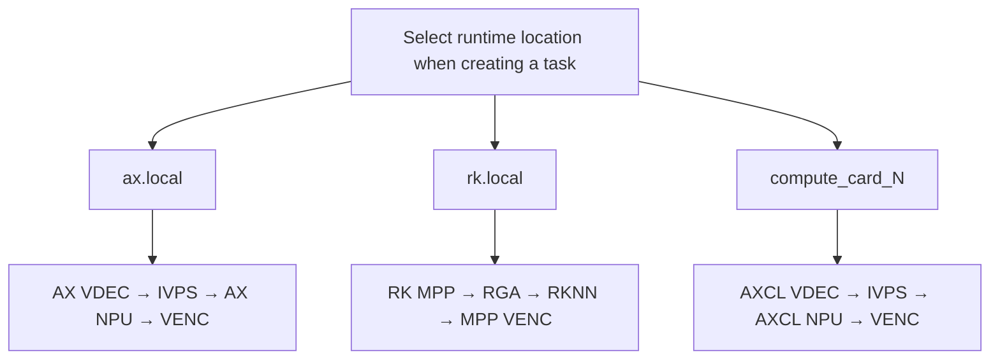
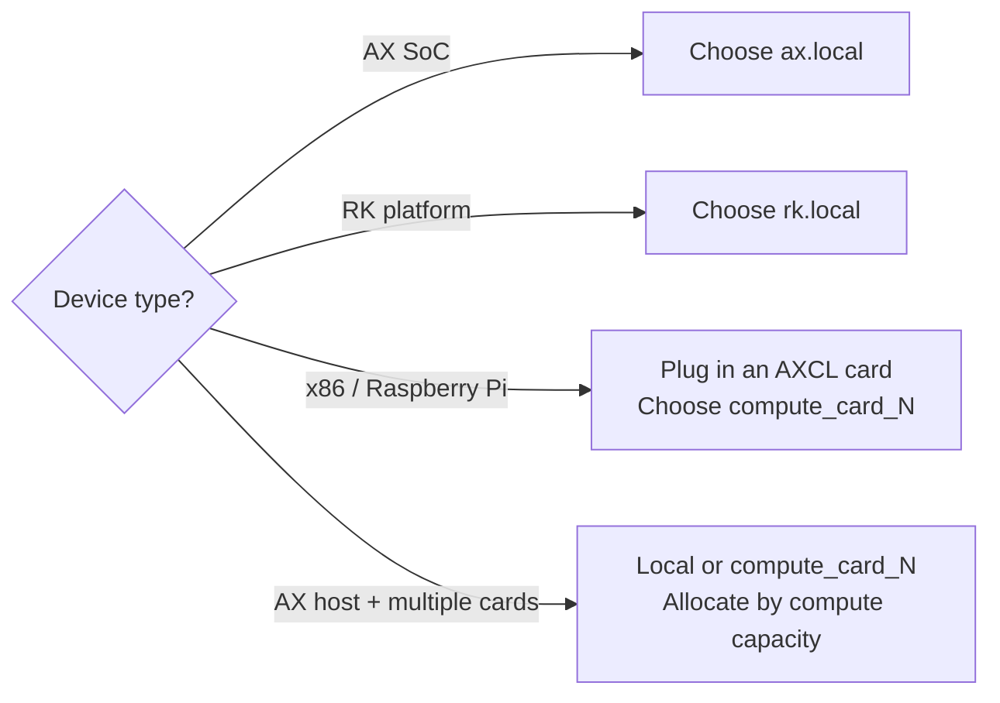

# Runtime Location and Deployment

AIBox Runtime uses a unified **Runtime Location** abstraction, so upper-layer tasks, plugins, and the frontend only need to choose "where the task runs" without caring whether the underlying platform is AX local, RK local, or an AXCL compute card. This way the same business logic can cover multiple hardware forms.



## Runtime Location Types

| Runtime location | Typical hardware | Media pipeline | Inference backend | Scenario |
|---|---|---|---|---|
| `ax.local` | AX650N / AX8850 standalone devices | AX VDEC / IVPS / VENC | AX NPU | AX integrated machines, edge boxes, local closed-loop processing |
| `rk.local` | RK35xx / RV1126B and other RK platforms | RK MPP / RGA / MPP VENC | RKNN | Standalone RK host deployment, local closed loop that reduces data movement |
| `compute_card_N` | AXCL compute cards | AXCL VDEC / IVPS / VENC | AXCL NPU | RK / Raspberry Pi / x86 / AX hosts with a plug-in card; `N` starts from 1 |

## Design Principles

- **Local compute exposed on demand**: AX platforms show `ax.local` and RK platforms show `rk.local`; ordinary x86 / Raspberry Pi and similar hosts do not expose a local NPU option and can only use an external compute card.
- **Task-level closed-loop operation**: by default, decoding, image processing, inference, and encoding for the same task all run in the same runtime location, avoiding frequent movement of large frame data between RK and AXCL.
- **Consistent plugin interface**: plugins uniformly receive common abstractions such as `AXVideoFrame` / `jdk_frame_meta`; the underlying frame may come from AX, AXCL, or RK, but upper-layer algorithm nodes do not directly operate platform-private structures.
- **Optimized for zero copy**: RK decode output, RGA processing, and RKNN input preferably pass data via dma-buf / MPP buffer; synchronization to the host only happens when capture, debug dumps, or CPU algorithms genuinely require it.

## Resource Isolation Rules

| Runtime location | `runtime_device_id` | Resource type |
|---|---|---|
| `ax.local` | `-1` | Local AX media / NPU |
| `rk.local` | `-1` | Local RK MPP / RGA / RKNN |
| `compute_card_1` | `0` | AXCL card 0 |
| `compute_card_2` | `1` | AXCL card 1 (and so on) |

Decode, encode, and image processing channels are allocated independently per `runtime_location` to prevent local and compute-card resources from overwriting each other.

## Deployment Forms and Selection



=== "AX Integrated Machine"

    Suitable for standalone on-site operation; `ax.local` is recommended. Pipeline:

    ```text
    RTSP → AX VDEC → AX IVPS → AX NPU → AX VENC / WebRTC
    ```

=== "RK Local Device"

    Suitable for lightweight edge terminals; `rk.local` is recommended, using RK local encoding/decoding, RGA image processing, and RKNN inference. Pipeline:

    ```text
    RTSP → RK MPP → RGA → RKNN → RK MPP VENC / WebRTC
    ```

=== "Third-party Host + AXCL Compute Card"

    Suitable for multi-stream video and compute expansion; `compute_card_N` is recommended, letting the task run in a closed loop on the compute-card side. Pipeline:

    ```text
    RTSP → AXCL VDEC → AXCL IVPS → AXCL NPU → AXCL VENC / WebRTC
    ```

## RK Local Runtime Environment

When you choose `rk.local`, the on-board runtime environment must include the relevant Rockchip runtime libraries and drivers:

| Capability | Dependency | Purpose |
|---|---|---|
| Video decode / encode | RK MPP | RTSP H.264/H.265 pull-stream decoding, encoded output, WebRTC preview |
| Image processing | librga / RGA driver | OSD compositing, scaling, cropping, format conversion, affine transforms |
| NPU inference | RKNN Runtime | `.rknn` model loading and inference |
| Frame memory | dma-buf / MPP buffer | Reduce large-frame copies between MPP, RGA, and RKNN |

Pre-deployment checks:

```bash
# 1. Confirm RK device nodes and drivers are available
ls /dev/rga /dev/mpp_service 2>/dev/null

# 2. Confirm the runtime libraries can be loaded
ldd /usr/local/aibox/bin/TaskManager | grep -E 'rga|mpp|rknn'

# 3. Set the runtime library path before starting the service
export LD_LIBRARY_PATH=/usr/local/aibox/lib:$LD_LIBRARY_PATH
```

!!! warning "rk.local does not appear in the runtime location list?"
    Confirm that the current device is an RK / RV / Rockchip platform: `cat /proc/device-tree/compatible`. Non-RK platforms will not expose a local runtime location.

## Plugin Development Convention

Plugins should read the runtime location from the configuration injected by TaskManager, and should not hard-code platform branches internally:

```json
{
  "runtime_location": "rk.local",
  "runtime_device_id": -1,
  "device_id": -1
}
```

We recommend parsing uniformly through `PluginRuntime::from_task_config(config)`:

```cpp
const auto runtime = PluginRuntime::from_task_config(config);

if (runtime.is_rk_local()) {
    // RK local: RK MPP / RGA / RKNN
} else if (runtime.is_ax_local()) {
    // AX local: AX VDEC / IVPS / NPU / VENC
} else if (runtime.is_compute_card()) {
    // AXCL compute card: runtime.runtime_device_id is the card index, starting from 0
}

// Select the inference backend based on the runtime location
const char* backend = runtime.infer_type(); // rk.local → "rk", other AX paths → "ax"
auto infer = Algorithm::create_infer(model_path, backend, runtime.runtime_device_id);
```

!!! tip "RK local development notes"
    - The inference model must be provided in RKNN format; we recommend configuring `model_path_rk` separately from the AX model.
    - For real-time MPP / RGA frames, prefer continuing to pass them via the `AXVideoFrame` abstraction; do not frequently call `toHost()` for ordinary processing flows.
    - In multi-task scenarios, RGA / RKNN are scheduled by the runtime; plugins should not create their own global singleton hardware contexts.

For more detailed interface and backend adaptation, see the [SDK Development Guide](sdk-guide.md).
