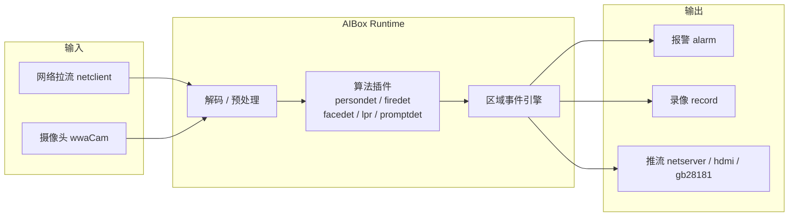

# AIBox 边缘视觉智能平台

AIBox SDK 面向园区、工厂、社区、门店、交通、仓储和安防等边缘视觉场景，提供从视频接入、AI 推理、区域规则、事件判断、报警推送到录像留证的一体化能力。平台采用插件化算法架构，支持 AX650N / AX8850、RK35xx / RV1126B、AXCL 算力卡等多种硬件形态，可在边缘侧完成实时分析，降低云端带宽和后端计算压力。

它不是单一算法 Demo，而是一套可交付、可扩展、可运维的边缘 AI 软件系统。

<ul class="aibox-badges">
<li>SDK aibox_sdk</li>
<li>固件基线 3.10.2</li>
<li>对接协议 V1.0.2</li>
<li>AX / RK / AXCL 多平台</li>
<li>插件化算法生态</li>
</ul>

[:material-rocket-launch: 快速开始](zh/quickstart.md){ .md-button .md-button--primary }
[:material-book-open-variant: SDK 开发指南](zh/sdk-guide.md){ .md-button }
[:material-translate: English](en/index.md){ .md-button }

## 按角色选择入口

-   :material-brain:{ .lg .middle } __算法工程师__

    ---

    快速接入检测、识别、行为分析、开放词汇检测等算法插件，理解节点生命周期与推理后端选择。

    [:octicons-arrow-right-24: 插件开发](zh/plugin-development.md)

-   :material-server-network:{ .lg .middle } __平台工程师__

    ---

    理解任务 DAG、报警协议、插件配置与平台事件对接，打通设备与业务系统。

    [:octicons-arrow-right-24: 报警联动](zh/alarm-linkage.md)

-   :material-tools:{ .lg .middle } __交付工程师__

    ---

    完成设备部署、运行位置选择、报警联动和现场排障，保障项目稳定上线。

    [:octicons-arrow-right-24: 交付运维](zh/deployment-ops.md)

-   :material-presentation:{ .lg .middle } __方案人员__

    ---

    面向客户介绍平台能力、算法矩阵和行业落地方式，快速构建解决方案。

    [:octicons-arrow-right-24: 算法能力](zh/algorithm-capabilities.md)

## 平台架构总览

任务的解码、预处理、推理、编码优先在同一个 **运行位置** 内闭环完成，减少跨设备搬运。

## 核心能力

-   :material-puzzle:{ .lg .middle } __插件化算法__

    ---

    算法、配置、模型资源和 UI 元数据以插件形式交付，便于按项目裁剪和升级。

-   :material-cpu-64-bit:{ .lg .middle } __多运行位置__

    ---

    支持 AX 本地、RK 本地、AXCL 算力卡等运行位置，任务创建时统一选择。

-   :material-sync:{ .lg .middle } __边缘闭环__

    ---

    在边缘端完成拉流、解码、预处理、推理、OSD、编码、推流和报警。

-   :material-bell-ring:{ .lg .middle } __报警联动__

    ---

    支持服务器推送、本地告警、抓拍留证、TTS 播报和 485 继电器。

-   :material-shape-outline:{ .lg .middle } __规则引擎__

    ---

    支持区域、绊线、方向、停留时间、数量阈值、冷却去重等业务规则。

-   :material-truck-delivery:{ .lg .middle } __工程交付__

    ---

    支持插件打包、任务配置、运行诊断、跨平台部署和现场运维。

## 推荐阅读路径

1. 新用户先看 [快速开始](zh/quickstart.md)。
2. 部署和算力选择看 [运行位置与部署](zh/runtime-location.md)。
3. 算法二次开发看 [插件开发](zh/plugin-development.md)。
4. 报警推送、TTS、485 继电器看 [报警联动](zh/alarm-linkage.md)。
5. 对外方案介绍看 [算法能力](zh/algorithm-capabilities.md)。
6. 遇到问题查 [常见问题 FAQ](zh/faq.md)，版本变化看 [更新记录](zh/changelog.md)。

## 文档地图

| 板块 | 内容 | 适合读者 |
|---|---|---|
| [快速开始](zh/quickstart.md) | 获取 SDK、编译、部署、创建任务、验证结果 | 全部 |
| [SDK 开发指南](zh/sdk-guide.md) | 架构、接口、报警协议、Demo、排障 | 算法 / 平台工程师 |
| [Web 用户手册](zh/user-manual/index.md) | 平台界面操作与任务管理 | 交付 / 运维 |
| [运行位置与部署](zh/runtime-location.md) | AX / RK / AXCL 运行位置与部署形态 | 平台 / 交付工程师 |
| [插件开发](zh/plugin-development.md) | 节点生命周期、工程结构、配置表单 | 算法工程师 |
| [报警联动](zh/alarm-linkage.md) | 报警链路、485 继电器、并发控制 | 平台 / 交付工程师 |
| [算法能力](zh/algorithm-capabilities.md) | 算法矩阵与行业场景组合 | 方案人员 |
| [配置参考](zh/plugin-config.md) | 插件配置结构与完整字段参考 | 算法 / 平台工程师 |
| [交付运维](zh/deployment-ops.md) | 上线检查、监控、升级、排障 | 交付 / 运维 |
| [常见问题](zh/faq.md) | 高频问题速查 | 全部 |

## Read the Docs 构建方式

仓库根目录已提供：

- `.readthedocs.yaml`
- `mkdocs.yml`
- `docs/requirements.txt`

在 Read the Docs 控制台添加项目后，选择本仓库即可自动按 MkDocs 构建。

English documentation is available at [English](en/index.md).
