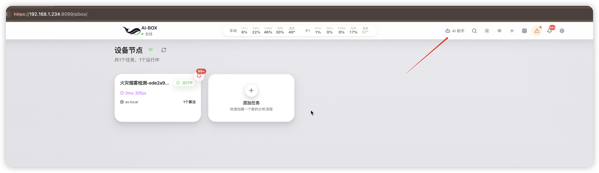
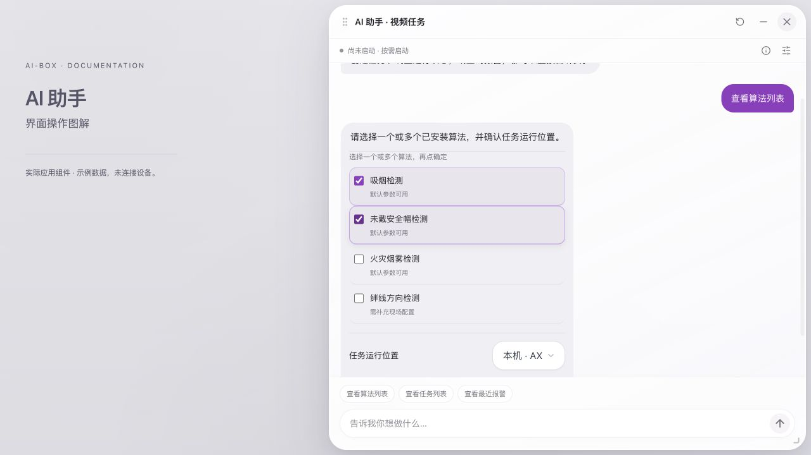

# AI 助手使用说明

[English](../../en/ai-assistant/index.md)

AI 助手是 AI-BOX Web 页面中的视频任务工作入口。你可以通过对话查看设备能力、选择算法、创建检测任务、调整已有任务的运行状态，以及查询报警、日志和关联录像。助手会把需求转成具体的业务操作，并在需要时提供算法选择、摄像头地址、目标任务和确认表单。

本手册面向设备管理员、现场交付工程师和日常运维人员，按“进入助手 → 检查状态 → 创建任务 → 管理任务 → 查阅证据 → 排障”的顺序介绍使用方法。

!!! note "适用范围与图片说明"
    本页依据 2026-09-09 的配套前后端实现编写。实际可用功能取决于设备应用、网页、算法插件、独立模型扩展及硬件的组合；旧版本可能没有本文中的表单或查询入口。算法名称和运行位置以当前设备返回的列表为准。

    图 1 为设备入口截图；其余界面截图使用真实应用组件和示例数据制作，用于说明控件与操作，不代表连接了设备或已完成任务执行。中文和英文图文分别维护。文中摄像头地址、任务名称、数量和时间均为示例。

点击文中图片可打开原图，放大查看控件和文字。

## 1. 找到并打开 AI 助手

### 1.1 设备网页入口

1. 在浏览器中打开实际设备的 Web 管理地址并登录。
2. 等待顶栏设备连接状态恢复正常。
3. 点击顶栏放大镜左侧的 **AI 助手**，打开“AI 助手 · 视频任务”悬浮窗。
4. 若网页刚升级而入口没有出现，刷新页面以加载配套资源；若仍无入口，核对应用和网页版本。

[](../../assets/ai-assistant/01-entry.png)

*图 1：设备主页入口。红色箭头标出 AI 助手按钮。截图中的设备地址仅用于说明位置，请使用你自己的设备地址。*

### 1.2 悬浮窗的基本操作

助手打开后，背景任务页面仍可操作。你可以一边查看任务，一边阅读助手的回复。

| 界面区域 / 操作 | 用途 | 使用要点 |
|---|---|---|
| 标题栏 | 移动助手窗口 | 拖动到不遮挡任务卡片的位置 |
| 窗口边缘或右下角 | 调整大小 | 长列表可适当拉高窗口；输入区保持在底部 |
| 收起 | 暂时减少遮挡 | 展开后继续查看当前会话 |
| 恢复默认位置 | 将窗口放回默认位置 | 窗口偏移或屏幕尺寸变化后使用 |
| 关闭 | 关闭助手视图 | 关闭窗口不会撤销设备已经接受的操作 |
| 状态行 | 查看实际模型运行位置与状态 | “尚未启动”不必然意味着助手不可用 |
| 使用说明图标 | 展开依赖、模式与安装说明 | 正常状态下说明默认折叠 |
| 模型服务图标 | 打开共享模型服务设置 | 用于查看运行策略、可用位置和诊断 |
| 对话区 | 显示回复、表单和证据入口 | 独立滚动，长回复可向上查看 |
| 底部输入区 | 输入自然语言需求 | 点击发送或按 Enter；Shift+Enter 换行 |

[](../../assets/ai-assistant/zh-02-overview.png)

*图 2：真实组件的界面示例。顶部为模型状态、说明和设置；下方为快捷查询与输入区。示例环境不连接设备。*

窗口位置和大小保存在当前浏览器中；更换浏览器不保证沿用原位置。标题栏聚焦后可使用方向键移动，右下角缩放控件支持方向键调整，Shift 可增大步长。小窗口可能隐藏快捷示例，这不影响输入指令。

## 2. 首次使用前检查

### 2.1 准备清单

| 项目 | 应确认的内容 | 不满足时如何处理 |
|---|---|---|
| 设备连接 | 网页已登录，设备消息通道可用 | 先恢复连接，再等待助手自动检测 |
| 应用与网页 | 使用互相兼容的版本 | 按正式升级流程更新配套版本 |
| 算法插件 | 所需算法已安装、成功加载且可见 | 在插件管理中核对，再查询算法列表 |
| LLM 桥接组件 | 应用内组件可用 | 按“检查 LLM 组件”提示处理 |
| 独立模型扩展 | 与 AX/AXCL 或 RK 平台匹配 | 由管理员按扩展包说明安装 |
| 文本能力 | 当前扩展真正支持纯文本推理 | 没有文本能力时，按界面支持的明确指令使用 |
| 存储 | 外置模型存储持续挂载、可读 | 核对 TF 卡/挂载状态，不反复插拔 |
| 摄像头 | 设备可访问有效 RTSP 地址 | 核对网络、端口、认证与流路径 |
| 现场参数 | 区域、方向、人脸库等已准备 | 需要时进入草稿编辑器补充 |

!!! warning "扩展包与算法包不是同一种文件"
    独立 `.deb` 模型扩展不能当作 `.plugin` 算法包上传。应用内的 LLM 组件与独立模型程序、权重也不是同一项依赖。请按当前交付包说明安装匹配的版本，不要仅凭文件存在就判断模型能正常推理。

### 2.2 依赖检查与重新检测

助手会在打开时检查依赖；连接恢复后也会自动重新检查。扩展缺失、文件不完整、组件不可用或检查失败时，输入可能不可用，界面会给出对应提示。

1. 展开 **使用说明**，阅读具体状态和原因。
2. 扩展缺失时查看 **安装说明**；组件不可用时进入 **检查 LLM 组件**。
3. 管理员修复后点击 **重新检测**。
4. 确认输入区恢复可用，再执行查询或创建。

检测本身不会启动模型，也不需要先创建一个 LLM 视频任务。模型“已安装”“支持文本”“正在运行”是三个独立事实。

## 3. 五分钟完成第一次使用

首次操作建议从查询开始，熟悉返回内容后再创建任务。

1. 打开助手，等待依赖检查结束。
2. 点击 **查看任务列表**，核对当前任务名称、ID 和状态。
3. 点击 **查看算法列表**，查看设备实际可选算法。
4. 输入 `创建吸烟检测任务`，按提示选择算法与任务运行位置。
5. 在专用表单中填写实际摄像头 RTSP 地址，检查无误后点击 **确定**。
6. 阅读结果：是需要补配置的草稿，还是已保存、已启动的任务；若验证未完成，继续核对状态。
7. 在任务页面打开视频预览，检查画面、检测叠加和报警。现场验证完成后再投入正式使用。

!!! tip "第一次创建就明确写出目标"
    推荐：`创建吸烟检测任务，使用本机运行。`

    不够明确：`帮我弄一下。`

    创建、暂停、停止等需求可能改变实际任务状态。发送前确认目标；若需要先了解能力，使用“查看算法列表”或“查看任务列表”。

## 4. 如何描述需求

### 4.1 推荐结构

用“**动作 + 对象 + 范围 + 必要条件**”组织需求。例如：

```text
查看任务列表
创建吸烟和未戴安全帽检测任务
暂停任务“仓库入口”
查询今天的火灾报警
查看本周错误日志
查看车牌报警的关联录像
```

不必记忆固定命令。设备能直接识别的明确指令进入业务处理；需要语言理解时，由可用文本模型生成受控建议，再交给设备校验。遇到建议确认卡片，先核对建议动作再点击 **确定**。

### 4.2 多轮补充与改口

在当前未提交的创建流程中，可以补充算法、运行位置、复核或输出要求，例如“再加一个摔倒检测”“使用第一张计算卡”“加上录像”。必须查看更新后的选择和表单，确认原需求是否正确保留。

查询报警后，可以继续询问关联录像；任务列表后可以进一步指定任务。像“它们”“这些”这样的表达依赖已有上下文，若上一轮范围不完整或已过期，请重新查询并选择，不要依赖助手猜测。

切换话题或取消未提交表单后，重新明确目标。已提交的创建或启停操作不会因为后续改口自动回滚。

### 4.3 三类确认不要混淆

| 确认类型 | 你需要核对的内容 | 确认的含义 |
|---|---|---|
| 操作建议 | 动作、目标、时间或其他条件 | 接受助手对需求的理解，后续仍可能需要选任务 |
| 算法 / 摄像头表单 | 算法、运行位置、摄像头地址、复核与输出要求 | 继续创建流程；完整配置可能直接保存并启动 |
| 任务选择 / 删除确认 | 实际名称、ID、状态、数量 | 对选定对象操作；删除仍有独立确认 |

取消按钮用于结束未提交的当前步骤。确认期间如果目标配置或状态改变，系统可能要求重新选择；以最新列表重新核对即可。

## 5. 查看与选择算法

### 5.1 查看设备实际能力

点击 **查看算法列表**，或输入 `有哪些可用算法？`。列表来自当前设备已加载的组件，不代表全产品所有算法都已安装。

每个算法会标记：

- **默认参数可用**：可以尝试默认参数创建流程，但仍要检查摄像头、资源、输出和现场效果。
- **需补充现场配置**：通常需要绘制区域/绊线、指定方向、人脸库或提示词；会进入草稿流程。

### 5.2 选择一个或多个算法

1. 勾选目标算法，核对 **已选** 数量。
2. 如目标未在首屏，展开 **其它已安装算法**。
3. 在 **任务运行位置** 中选择实际可用的本机或计算卡。
4. 核对已保留的 LLM 复核、额外输出要求。
5. 点击 **确定** 进入下一步；不需要继续时点击 **取消**。

[](../../assets/ai-assistant/zh-03-algorithms.png)

*图 3：算法选择示例。勾选框代表本次选择；“需补充现场配置”表示不能仅凭默认值完成交付。示例列表不代表你的设备安装数量。*

算法不可用时先检查安装、加载与兼容性。不能通过手工输入一个不存在的算法名绕过设备能力检查。

## 6. 创建检测任务

### 6.1 填写摄像头地址

算法确认后，助手可能显示 **摄像头 RTSP 地址** 表单。建议在这个专用字段中填写地址。

```text
rtsp://192.168.1.100:554/live
```

这是格式示例，不能保证任何摄像头采用 `/live` 路径。实际路径、端口、用户名和密码应从摄像头配置取得。电脑能播放不代表 AI-BOX 能访问；创建时由设备侧检查连接。

1. 填入完整地址，去掉前后空格。
2. 核对摄像头对应的位置和通道，避免创建到错误画面。
3. 检查 **任务运行位置**，不要将其误认为模型服务位置。
4. 点击 **确定**；等待设备返回结果，不重复提交。

[](../../assets/ai-assistant/zh-04-camera.png)

*图 4：专用摄像头表单。地址用于当前任务，并隐藏在聊天记录中；这不代表已保存的任务配置不需要保护。*

摄像头字段最多接收 2048 个字符；普通指令输入上限为 4096 个字符。尽量使用简洁、明确的请求，不粘贴大段日志或任务 JSON 代替操作描述。

### 6.2 单算法与组合算法

```text
创建吸烟检测任务
创建吸烟 + 未戴安全帽检测组合任务
创建火灾烟雾检测任务，加 LLM 复核
创建吸烟检测任务，加上录像
```

组合算法通常在同一视频源上独立检测，并汇总显示结果。`吸烟 + 未戴安全帽` 不表示“同一个人同时吸烟且未戴安全帽才报警”。涉及同一目标关联、先后顺序、时间窗口或 AND 条件时，需要相应业务规则能力，不能将普通组合视为已经实现。

默认输出模板包含网络输出与报警；录像、HDMI 等额外输出以实际组件与请求为准，需要存储或目标配置时可能转为草稿。不要把“报警输出节点存在”理解为已经启用继电器、TTS 或外部服务器推送；这些联动仍要核对相应配置。

### 6.3 任务运行位置与模型运行位置

| 配置 | 控制什么 | 在哪里查看 |
|---|---|---|
| 任务运行位置 | 此视频任务的可用执行位置 | 创建表单和任务配置 |
| 模型服务运行位置 | 共享 LLM 推理服务使用本机还是计算卡 | 模型服务设置 |
| 实际模型位置 | 当前驻留实例真实运行的位置 | 助手状态行与模型服务顶部 |

例如，任务选择本机不意味着 LLM 必须在本机运行。选择计算卡也不代表硬件、插件与模型已经通过完整验证。只选择设备实际返回的可用项，并根据错误信息处理资源或兼容性问题。

### 6.4 需要补充配置的草稿

当算法需要现场信息，助手会列出缺少的配置，并提供 **打开草稿，补充必要配置**。

1. 阅读缺少项：检测区域、岗位范围、绊线位置、方向、人脸库、提示词等。
2. 打开草稿，在任务编辑器中检查已生成的节点和连线。
3. 按现场实际情况补齐必填项，同时核对视频输入和输出配置。
4. 保存任务，再启动并预览。
5. 按现场测试标准验证触发条件和误报情况。

草稿在你保存前不是已保存、已运行任务。刷新页面后，为避免恢复敏感地址，草稿可能要求重新输入摄像头地址。编辑器详细操作见 [Web 用户使用手册](../user-manual/index.md)。

### 6.5 正确解读创建结果

| 结果阶段 | 可以确认的事实 | 仍需做什么 |
|---|---|---|
| 待选择 / 待填写 | 需求正在完善 | 完成当前表单 |
| 草稿待配置 | 已生成编辑草稿 | 补配置、保存、启动 |
| 已保存 | 设备有任务配置 | 确认启动是否成功 |
| 已启动 | 设备接受了启动或任务已运行 | 检查出帧和预览 |
| 出帧验证通过 | 观察到符合条件的新鲜输出指标 | 检查实际解码、画面、算法和报警 |
| 已保存但启动失败 / 验证未完成 | 可能已有任务，业务未完全就绪 | 先查原任务，不重复创建 |
| 结果未知 | 当前网页无法确认设备处理结果 | 使用原请求重查并核对列表 |

自动出帧观察使用有界等待，当前实现最多观察约 30 秒。它不保证所有算法在 30 秒内完成效果验证，也不代表每个算法分支都通过验收。

## 7. 管理已有任务

### 7.1 先核对名称、ID 和状态

输入 `查看任务列表`。相似名称或相同算法可能对应多个任务；操作时优先使用完整任务名称，并在候选列表中核对 ID。

[](../../assets/ai-assistant/zh-05-tasks.png)

*图 5：任务列表示例。列表状态来自设备回复；现场操作以最新状态为准。普通查询行不等同于已经选中操作目标。*

### 7.2 启动、暂停、恢复与停止

| 需求示例 | 行为与注意事项 |
|---|---|
| `启动任务“仓库入口”` | 启动所选已有任务，不创建副本 |
| `暂停任务“仓库入口”` | 保留配置，释放视频执行资源；不冻结画面或保留跟踪器状态 |
| `恢复已经暂停的任务` | 按暂停状态筛选，再核对目标 |
| `恢复暂停之前状态` | 依赖已保存的暂停前状态；原本停止的任务应保持停止 |
| `停止任务“仓库入口”` | 停止视频任务，配置仍保留 |
| `启动所有任务` | 涉及提交时的全部目标，发送前确认资源和范围 |
| `暂停所有任务` | 批量暂停视频任务，不代表停止整个设备服务 |

恢复旧状态需要版本支持和相应记录。旧任务没有保存暂停前状态时，助手不能推测它原本是否运行；按提示手动核对。停止或暂停视频任务不会作为系统关机、重启、停止远程维护服务的入口。

### 7.3 多匹配目标选择

[](../../assets/ai-assistant/zh-06-selection.png)

*图 6：暂停目标选择示例。必须核对“待确认操作”与任务 ID，再勾选实际目标并确认。*

1. 阅读 **待确认操作**，确认是启动、暂停、停止、编辑还是删除。
2. 逐项核对名称、ID、算法与状态。
3. 只勾选本次目标；多个匹配不代表自动全选。
4. 点击 **确认所选任务**。
5. 阅读逐项结果。批量操作可能部分成功，不能只看到一条成功就认定全部完成。

### 7.4 编辑与删除

输入 `编辑任务“仓库入口”`，按提示点击 **打开任务，修改配置**。助手打开原任务编辑器，保留原 ID；具体参数仍在原有表单修改，不保证任意自然语言都可直接修改算法参数。

删除请使用明确需求，例如 `删除任务“仓库入口”`。先选择目标，再核对独立删除确认。

[](../../assets/ai-assistant/zh-07-delete.png)

*图 7：确认删除任务前，再次检查名称、ID 与数量。点击“取消，不删除”可放弃尚未提交的删除。*

执行时会先停止运行中的任务、释放资源，再删除配置；停止或资源释放失败时应保留配置并报告失败。删除任务不会在同一操作中清除历史报警和录像。不要把保留历史记录理解为可以一键恢复已删除任务配置。

## 8. 查询报警和图片证据

### 8.1 查询范围与类型

可从 **查看最近报警** 开始，或输入：

```text
查询今天的报警
查询本周火灾报警
最近七天有哪些车牌报警？
查看吸烟报警
```

当前时间范围为 **今天、本周、最近 7 天**。“最近”或未指定时间通常按最近 7 天处理；必须核对回复显示的实际起止时间。昨天、任意日期区间、整月等未支持表达不会自动替换成另一个范围。

统计按设备本地时间计算：本周从周一零点开始；最近 7 天包括今天和前六个日历日。设备时间或时区不正确会影响查询，应先在设备设置中核对。

类型由设备识别和实际记录确定。若类型不明确，先选择返回的类型候选。“其它类型报警”是另外一组结果，不计入当前目标类型的总数。

### 8.2 阅读统计与打开证据

[](../../assets/ai-assistant/zh-08-alarms.png)

*图 8：报警查询示例，显示 3 条示例记录。“无图片”表示该条没有可打开的图片，不应据此推断报警无效。*

1. 检查筛选类型与起止时间。
2. 读取总数、按任务分组和当前展示记录。
3. 有图片时点击 **查看图片**，核对时间、任务与现场画面。
4. 点击 **查看匹配报警记录**，或双击相应报警回复，进入报警侧栏。
5. 侧栏沿用该次查询的筛选与快照；展开侧栏时助手会收起避让。
6. 要获取查询之后的新报警，重新发起查询。

总数不等于当前显示的条数：对话通常展示最近 20 条以内，侧栏继续查看同一查询的记录。数据库错误不能视为“0 条”。旧记录可能按保留策略清理；无记录不证明现场没有事件。报警条数也不是独立事故数，仍需人工结合证据研判。

## 9. 查询关联录像

可在报警查询后继续询问关联录像，或输入 `查询本周车牌报警的关联录像`。

[](../../assets/ai-assistant/zh-09-recordings.png)

*图 9：录像关联示例。界面区分已核对报警、未找到关联录像与可访问片段；示例文件不是实际录像。*

1. 检查查询继承的报警类型与时间范围。
2. 查看 **已核对报警** 和 **未找到关联录像** 数量。
3. 点击可访问的片段，进入 **录像管理** 查看。
4. 文件不可访问时检查存储和保留情况，不重复发起任务创建。

没有关联录像可能是没有启用录像、文件尚未完成、已被清理，或没有满足关联条件的片段。`录像关联暂不可用 · 未完成核对` 表示关联检查失败，不能当作已检查但没有录像。本次最多展示 20 个片段，结果截断时会提示。助手不会补造历史视频。

## 10. 查询和下载日志片段

输入 `查看今天的错误日志` 或 `把最近的报错日志给我看看`。

[](../../assets/ai-assistant/zh-10-logs.png)

*图 10：示例错误日志。可以逐条展开，并下载本次返回的脱敏片段。*

1. 检查时间范围和日志级别。
2. 展开记录，阅读时间、级别和错误文本。
3. 点击 **下载这些脱敏片段** 保存本次返回内容。
4. 需要完整上下文时，结合设备日志管理页面核对。

下载的是查询返回片段，不是整台设备的完整诊断包。向他人提供文件前仍应检查内容是否包含现场名称、内部地址或其他项目资料。日志查询不是执行系统命令的入口。

## 11. 共享模型服务设置

### 11.1 打开设置并查看状态

从助手的 **模型服务** 图标或设置菜单进入。先读顶部实际状态，再查看下方策略，二者不要混淆。

[](../../assets/ai-assistant/zh-11-model.png)

*图 11：模型服务示例。上方表示实际实例状态，下方表示保存的运行策略。“自动选择”并不代表模型已经启动。*

| 设置 / 状态 | 说明 |
|---|---|
| 当前运行位置 | 当前模型实例的真实位置；未启动时可能无实际位置 |
| 自动选择 | 根据可用能力选择并复用兼容实例 |
| 本机 / 计算卡 | 明确指定候选位置；不可用时报告原因，不静默换位置 |
| 空闲后释放 | 可填写 30–3600 的整数秒数；以设备当前保存值为准 |
| 可用运行位置 | 查看扩展安装与声明的文本能力 |
| 诊断信息 | 查看 PID、状态、使用者、排队和推理中数量 |
| 保存 | 保存运行策略，不立即启动模型 |

### 11.2 为什么助手能回复，但模型没有启动

查看任务、算法或明确业务指令可以直接由设备业务接口处理，不需要每次加载大模型。真正需要语义理解或视频 LLM 推理时才产生模型需求。

| 显示状态 | 如何理解 | 建议操作 |
|---|---|---|
| 尚未启动 / 按需启动 | 当前没有驻留模型 | 可继续使用已支持的查询，等待真正推理时加载 |
| 正在启动 / 加载 | 模型正在准备 | 等待本次请求，避免连续重复发送 |
| 空闲驻留 | 模型已加载但暂时未推理 | 后续请求可复用；空闲策略到期后可释放 |
| 推理中 / 排队 | 共享服务正在处理需求 | 等待，必要时检查使用者和队列 |
| 异常 / 状态未确认 | 当前结果不足以证明服务正常 | 刷新状态并查看诊断、扩展与存储 |

助手与视频 LLM 节点共享一个模型服务，普通打开窗口和状态查询不会额外创建模型实例。模型首次加载可能明显慢于后续请求；耗时取决于模型、存储、硬件和资源占用。

### 11.3 修改运行策略

1. 等待相关 LLM 使用者退出并释放实例，直到设置可编辑。
2. 选择实际可用位置，填写空闲释放秒数。
3. 点击 **保存**，确认 **已保存** 提示。
4. 下一次实际推理后，查看顶部实际位置是否符合预期。

保存失败或状态过期时，先刷新核对，不把当前输入框中的值当作已生效设置。模型正在使用或仍驻留时，设置可能锁定。已有 LLM 节点的显式位置与全局设置冲突时，需要协调配置，不能靠反复保存强制迁移。

## 12. LLM 复核的使用边界

LLM 复核是对检测结果的后续处理阶段，与“选择一个检测算法”不同。当前新建火灾模板可包含默认复核，其他算法可按明确要求追加；以生成方案和节点配置为准。

- 核对算法表单是否提示 **已保留 LLM 复核要求**。
- 核对任务图包含相应 LLM 阶段，且上游算法打开复核请求。
- 复核使用共享模型服务，不等于再启动独立模型实例。
- 缺少所需 LLM 组件时，不应把降级后的无复核任务当作原方案已经完成。
- 新模板的严格判断失败、超时或无法判断时可保留原始报警；“收到报警”不证明模型已经复核通过。
- 现场应同时检查正样本、负样本、超时和高负载情形。出帧或模型驻留不等于复核准确率达到要求。

报警系统配置详见 [报警联动](../alarm-linkage.md)，具体插件参数见 [插件配置完整参考](../reference/plugin-config-full.md)。

## 13. 断线、刷新与结果未知

这是避免重复任务和误判状态的重要步骤。

1. 操作提交后断线或超时，先保留“结果未知”的判断。
2. 连接恢复后点击 **查询结果 / 原请求重查**。
3. 在任务列表中核对原目标是否已经创建、启停或删除。
4. 如果原回执未查到，先完成手工核对，再点击 **已核对任务列表，解除等待**。
5. 只有确认实际状态后，才决定是否重新发起需求。

重查复用原请求，不等于再次执行一遍。换一句话重复发送“创建”可能变成新的请求，因此不能用反复点击或刷新代替查回执。

关闭窗口、退出页面和取消未提交表单都不能保证取消已经接受的后台操作。聊天文本不作为可靠的长期操作台账；设备任务状态和回执才是核对依据。

## 14. 中英文使用

中文页面使用中文助手；英文页面使用英文助手。切换语言后，新界面说明、状态与按钮会跟随语言显示，原始任务名、摄像头地址和业务内容不会被随意翻译。

| 中文 | English |
|---|---|
| 查看算法列表 | List algorithms |
| 查看任务列表 | List tasks |
| 查看最近报警 | Recent alarms |
| 创建吸烟检测任务 | Create a smoking detection task |
| 暂停任务“Warehouse entrance” | Pause task “Warehouse entrance” |
| 查询今天的火灾报警 | Show today's fire alarms |
| 查看本周错误日志 | Show error logs for this week |
| 查看车牌报警的关联录像 | Show recordings related to license plate alarms |
| 模型服务 | Model service |
| 确认所选任务 | Confirm selection |
| 查询结果 / 原请求重查 | Check original request/result |

使用任务名称时保留实际名称；不要因为切换语言就将设备上的任务名翻译成另一个名称。

## 15. 常见问题与排查顺序

| 现象 | 优先检查 | 处理方法 |
|---|---|---|
| 看不到 AI 助手 | 网页和应用是否配套 | 刷新网页、核对交付版本 |
| 输入区灰色 | 连接、依赖检查、是否有待处理请求 | 恢复连接或完成/重查当前操作 |
| 提示安装扩展 | 平台和独立扩展是否匹配 | 按安装说明处理，再重新检测 |
| 安装完整仍不能自由对话 | 是否支持真实纯文本后端 | 使用明确指令，核对适配版本 |
| “尚未启动”但能查询 | 查询是否直接走业务接口 | 属正常按需行为，无需为查询手动启动模型 |
| 摄像头检查失败 | 设备侧网络、认证、流地址 | 修复后重试；先确认有没有保存任务 |
| 算法列表没有目标 | 插件安装、加载、可见性 | 在插件管理核对，不直接猜组件名 |
| 一直返回草稿 | 是否缺现场必填参数 | 打开编辑器补齐并保存 |
| 任务显示启动但没画面 | 拉流、输出、客户端播放 | 查询原任务并进入预览排查 |
| 暂停后不能恢复原状态 | 是否有暂停前状态记录 | 核对任务并手动决定启动范围 |
| 删除未完成 | 版本变化、停止或释放失败 | 查逐项错误、刷新目标，保留当前配置 |
| 报警为 0 | 时间、类型、保留范围和数据库状态 | 不以 0 推断现场绝对安全 |
| 没有图片 | 原记录无证据或文件不可访问 | 核对记录和存储，不生成替代证据 |
| 没有关联录像 | 是否录制、完成、保留、关联成功 | 查看录像管理和存储状态 |
| 模型位置不可修改 | 使用者、排队、驻留实例 | 等待释放后再改，不强制抢占 |
| 断线后按钮不可用 | 原请求结果未确认 | 使用原请求重查，再核对任务 |
| 旧表单不能确认 | 表单过期、连接或目标变化 | 重新提出需求，核对新表单 |
| 窗口遮住内容 | 窗口位置或大小 | 拖动、缩放、收起或恢复默认位置 |

## 16. 现场验收与交接

正式交付前，按实际业务填写验收记录，至少核对以下项目：

- [ ] 中英文页面都能找到助手入口，说明和表单可阅读。
- [ ] 设备连接、算法目录、模型扩展与运行位置符合交付配置。
- [ ] 摄像头地址与画面对应正确，无凭据暴露在交付截图中。
- [ ] 自动创建与草稿创建均按实际需求完成，任务 ID 已记录。
- [ ] 启动、暂停、恢复、停止及删除的范围与结果经过核对。
- [ ] 视频预览、算法命中与未命中、报警图片按现场标准验证。
- [ ] 使用录像时已验证存储位置、文件可访问性与报警关联。
- [ ] 使用 LLM 时已验证冷启动、位置、复用、释放与失败行为。
- [ ] 断线后能通过原请求核对结果，没有重复创建任务。
- [ ] 记录应用、网页、插件、扩展版本及未解决问题。

如需支持，提供发生时间、实际任务 ID、操作描述、界面状态和必要的脱敏日志。不要只提供“助手没反应”，也不要提供摄像头密码或完整认证信息。

## 17. 继续阅读

- [设备开箱与快速上手](../device-onboarding.md)：首次连网、访问设备和基本部署。
- [Web 用户使用手册](../user-manual/index.md)：任务编辑、节点参数和视频预览。
- [运行位置与部署](../runtime-location.md)：不同硬件与执行位置。
- [报警联动](../alarm-linkage.md)：报警输出与外部联动配置。
- [交付运维](../deployment-ops.md)：上线、升级和现场维护。
- [常见问题 FAQ](../faq.md)：其他设备与 SDK 问题。
