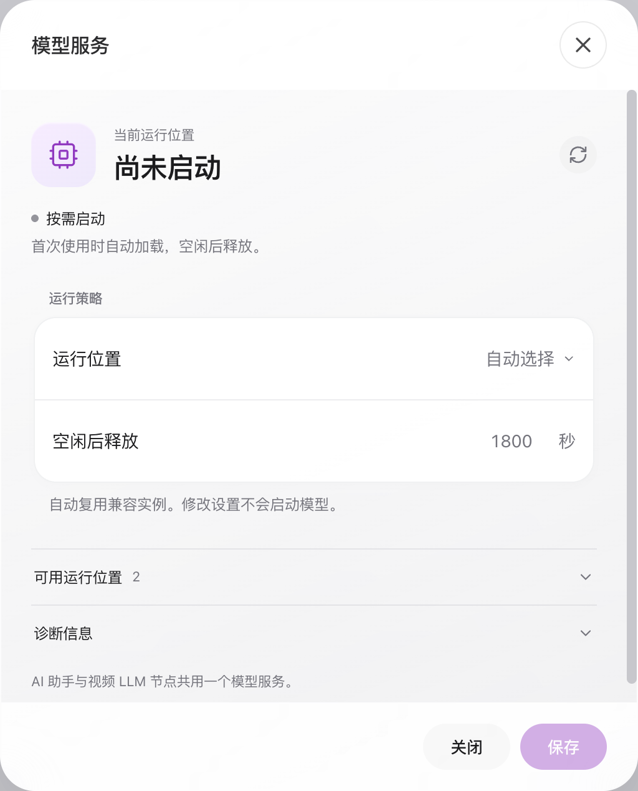

# AI 助手使用说明

[English](../../en/ai-assistant/index.md)

AI 助手让你通过对话使用 AI-BOX：查找已有图片和视频、了解设备状态、咨询检测方案，以及创建和管理视频任务。你不需要记住算法编号或命令格式；说出想做的事，再按回复中的提示填写信息、核对结果即可。涉及创建、启停或删除任务时，请先确认操作对象和要求。

你想做什么？可以从下面的入口开始：

| 你的需求 | 示例 | 阅读位置 |
|---|---|---|
| 找到已有画面 | `找穿红色衣服的女性图片和视频` | [通过会话进行智能索引搜索](#intelligent-retrieval) |
| 配置今后的检测和报警 | `发现有人吸烟时报警` | [创建检测任务](#6-创建检测任务) |
| 查看设备状态 | `本机CPU和内存占用多少？` | [查询设备信息](#device-information) |
| 查阅已发生的报警 | `查询今天的火灾报警` | [查询报警和图片证据](#8-查询报警和图片证据) |

本手册按“打开助手 → 提出需求 → 完成操作 → 查看结果 → 处理常见问题”的顺序介绍使用方法。首次使用智能索引搜索，可以直接阅读第 8.3 节。

!!! note "适用版本与界面示例"
    本文适用于 `2.1.1-202609121751-ai-assistant-rc5` 配套版本。功能入口、可选算法和运行位置以你的设备为准；若缺少本文介绍的功能，请联系管理员核对应用、网页和插件是否配套。版本发布状态及已知问题以交付说明为准。

    截图用于说明操作位置，不同版本的界面可能略有差异。文中摄像头地址、任务名称、数量和时间均为示例，操作时请使用你自己的设备信息。

点击文中图片可打开原图，放大查看控件和文字。

## 1. 找到并打开 AI 助手

### 1.1 设备网页入口

1. 在浏览器中打开实际设备的 Web 管理地址并登录。
2. 等待顶栏设备连接状态恢复正常。
3. 点击顶栏放大镜左侧的 **AI 助手**，打开“AI 助手 · 视频任务”悬浮窗。
4. 若网页刚升级而入口没有出现，刷新页面以加载配套资源；若仍无入口，核对应用和网页版本。

[](../../assets/ai-assistant/01-entry.png)

*图 1：设备主页入口。红色箭头标出 AI 助手按钮。截图中的设备地址仅用于说明位置，请使用你自己的设备地址。*

### 1.2 悬浮窗的基本操作

助手打开后，背景任务页面仍可操作。你可以一边查看任务，一边阅读助手的回复。

| 界面区域 / 操作 | 用途 | 使用要点 |
|---|---|---|
| 标题栏 | 移动助手窗口 | 拖动到不遮挡任务卡片的位置 |
| 窗口边缘或右下角 | 调整大小 | 长列表可适当拉高窗口；输入区保持在底部 |
| 收起 | 暂时减少遮挡 | 展开后继续查看当前会话 |
| 恢复默认位置 | 将窗口放回默认位置 | 窗口偏移或屏幕尺寸变化后使用 |
| 关闭 | 关闭助手视图 | 关闭窗口不会撤销设备已经接受的操作 |
| 状态行 | 查看实际模型运行位置与状态 | “尚未启动”不必然意味着助手不可用 |
| 使用说明图标 | 展开依赖、模式与安装说明 | 正常状态下说明默认折叠 |
| 模型服务图标 | 打开共享模型服务设置 | 用于查看运行策略、可用位置和诊断 |
| 对话区 | 显示回复、表单和证据入口 | 独立滚动，长回复可向上查看 |
| 底部输入区 | 输入自然语言需求 | 点击发送或按 Enter；Shift+Enter 换行 |

[](../../assets/ai-assistant/zh-02-overview.png)

*图 2：助手窗口示例。顶部为模型状态、说明和设置；下方为快捷查询与输入区。具体状态以你的设备为准。*

窗口位置和大小保存在当前浏览器中；更换浏览器不保证沿用原位置。标题栏聚焦后可使用方向键移动，右下角缩放控件支持方向键调整，Shift 可增大步长。小窗口可能隐藏快捷示例，这不影响输入指令。

## 2. 首次使用前检查

### 2.1 准备清单

| 项目 | 应确认的内容 | 不满足时如何处理 |
|---|---|---|
| 设备连接 | 网页已登录，设备消息通道可用 | 先恢复连接，再等待助手自动检测 |
| 应用与网页 | 使用互相兼容的版本 | 按正式升级流程更新配套版本 |
| 算法插件 | 所需算法已安装、成功加载且可见 | 在插件管理中核对，再查询算法列表 |
| LLM 桥接组件 | 应用内组件可用 | 按“检查 LLM 组件”提示处理 |
| 独立模型扩展 | 与 AX/AXCL 或 RK 平台匹配 | 由管理员按扩展包说明安装 |
| 文本能力 | 当前模型支持助手对话 | 按提示核对模型状态；恢复前可使用原有设备管理页面 |
| 存储 | 外置模型存储持续挂载、可读 | 核对 TF 卡/挂载状态，不反复插拔 |
| 摄像头 | 设备可访问有效 RTSP 地址 | 核对网络、端口、认证与流路径 |
| 现场参数 | 区域、方向、人脸库等已准备 | 需要时进入草稿编辑器补充 |

!!! warning "扩展包与算法包不是同一种文件"
    独立 `.deb` 模型扩展不能当作 `.plugin` 算法包上传。应用内的 LLM 组件与独立模型程序、权重也不是同一项依赖。请按当前交付包说明安装匹配的版本，不要仅凭文件存在就判断模型能正常推理。

RC5 配套安装组合如下。先安装匹配的主包，再安装扩展；主包携带私有 Python 运行时，设备不需要自行安装系统 Python。

| 平台 | 主包 | 完整交付中的扩展 |
|---|---|---|
| AX650N | `aibox-ax650n` | `aibox-plugin-llm` |
| RK3588 | `aibox-rk3588` | `aibox-plugin-llm`、`aibox-plugin-llm-rk-vlm` |

`aibox-plugin-llm` 为 AX/AXCL 共享扩展，内含分别编译、签名的宿主平台插件；RK 本机模型由 RK VLM 扩展提供。不要混装主包平台，也不要只升级网页而保留不兼容的主程序或桥接插件。更新设备 DEB 不会自动部署云平台网页。

交付按 AX 两包、RK 三包分目录提供五个 DEB 文件，其中共享的 `aibox-plugin-llm` 在两目录各放一份相同包，实际为四个独立包。不要把两份共享包重复安装，也不要把包的宿主平台插件与模型运行位置混淆。

### 2.2 依赖检查与重新检测

助手会在打开时检查依赖；连接恢复后也会自动重新检查。扩展缺失、文件不完整、组件不可用或检查失败时，输入可能不可用，界面会给出对应提示。

1. 展开 **使用说明**，阅读具体状态和原因。
2. 扩展缺失时查看 **安装说明**；组件不可用时进入 **检查 LLM 组件**。
3. 管理员修复后点击 **重新检测**。
4. 确认输入区恢复可用，再执行查询或创建。

检测本身不会启动模型，也不需要先创建一个 LLM 视频任务。模型“已安装”“支持文本”“正在运行”是三个独立事实。

需要安装 DEB 或配置内外部模型存储时，请参阅文末[附录 A：DEB 安装位置与模型存储配置](#installation-storage)。

## 3. 五分钟完成第一次使用

首次操作建议从查询开始，熟悉返回内容后再创建任务。

1. 打开助手，等待依赖检查结束。
2. 点击 **查看任务列表**，核对当前任务名称、ID 和状态。
3. 点击 **查看算法列表**，查看设备实际可选算法。
4. 输入 `创建吸烟检测任务`，按提示选择算法与任务运行位置。
5. 在专用表单中填写实际摄像头 RTSP 地址，检查无误后点击 **确定**。
6. 阅读结果：是需要补配置的草稿，还是已保存、已启动的任务；若验证未完成，继续核对状态。
7. 在任务页面打开视频预览，检查画面、检测叠加和报警。现场验证完成后再投入正式使用。

!!! tip "第一次创建就明确写出目标"
    推荐：`创建吸烟检测任务，使用本机运行。`

    不够明确：`帮我弄一下。`

    创建、暂停、停止等需求可能改变实际任务状态。发送前确认目标；若需要先了解能力，使用“查看算法列表”或“查看任务列表”。

## 4. 如何描述需求

### 4.1 推荐结构

可以直接用日常语言提问，不要求记住算法 ID 或命令格式。补充“**动作 + 对象 + 范围 + 必要条件**”通常有助于减少追问，例如：

```text
查看任务列表
创建吸烟和未戴安全帽检测任务
暂停任务“仓库入口”
查询今天的火灾报警
查看本周错误日志
查看车牌报警的关联录像
```

直接发送消息即可，助手会理解你的需求，并根据设备实际可用的功能和数据回复。模型尚未启动时会自动加载，所以第一次回复可能较慢；不需要先创建 LLM 视频任务。算法选择、摄像头地址等已有表单可以直接填写并确认，不用重新组织成一句话发送。

遇到建议确认卡片，先核对建议动作再点击 **确定**。理解不可靠、条件不支持或关键信息缺失时，应按提示补充，不能把“支持自然语言”理解为任意表达都保证正确。模型故障或超时不是“业务已完成”；不要为得到回复连续重发创建请求。

### 4.2 多轮补充与改口

在当前未提交的创建流程中，可以补充算法、运行位置、复核或输出要求，例如“再加一个摔倒检测”“使用第一张计算卡”“加上录像”。必须查看更新后的选择和表单，确认原需求是否正确保留。

查询报警后，可以继续询问关联录像；任务列表后可以进一步指定任务。像“它们”“这些”这样的表达依赖已有上下文，若上一轮范围不完整或已过期，请重新查询并选择，不要依赖助手猜测。

切换话题或取消未提交表单后，重新明确目标。已提交的创建或启停操作不会因为后续改口自动回滚。

接着上一轮操作时，尽量保留明确的任务名称。例如任务保存后说“停止它”，请在回复中核对是不是刚才的任务；说“其它任务”时，请补充具体名称或从列表选择。

修改需求后，使用最新的确认卡片，旧的未提交卡片会失效。当前会话上下文有效期为最近一次成功更新后的 20 分钟，服务重启后不会保留，也不能跨浏览器自动续聊。长时间未操作或断线重连后，重新查询任务并核对 ID；需要继续搜索时，重新写出完整画面描述。即使聊天记录仍可见，也请核对新回复是否保留了你的全部条件。

### 4.3 三类确认不要混淆

| 确认类型 | 你需要核对的内容 | 确认的含义 |
|---|---|---|
| 操作建议 | 动作、目标、时间或其他条件 | 接受助手对需求的理解，后续仍可能需要选任务 |
| 算法 / 摄像头表单 | 算法、运行位置、摄像头地址、复核与输出要求 | 继续创建流程；完整配置可能直接保存并启动 |
| 任务选择 / 删除确认 | 实际名称、ID、状态、数量 | 对选定对象操作；删除仍有独立确认 |

取消按钮用于结束未提交的当前步骤。确认期间如果目标配置或状态改变，系统可能要求重新选择；以最新列表重新核对即可。

### 4.4 先咨询，再完善方案

例如：`储物间的监控想用来防火，你建议怎么做？先别创建。` 助手可基于已安装能力给出候选建议和适用限制。`为什么推荐这个？` 是咨询，不表示同意创建。

准备采用方案后，可以继续说 `沿用刚才的方案，准备放在计算卡1，增加录像`，再说 `还是留在本机吧，其他保持不变`。在新的确认表单中核对算法、运行位置和录像要求；修改运行位置不应把检测目标换成另一个算法。

需要算法选择、RTSP 地址等输入时，直接在对话中的专用表单填写并点击 **确定/取消**，不用把选择结果重新拼成一句聊天指令。咨询建议不等于现场效果验证，未提交草稿也不等于已运行任务。

### 4.5 查询设备信息 {#device-information}

可以问 `软件和固件分别是什么版本？`、`主板CPU占用多少？`、`一号计算卡有多烫？`，并继续追问 `那内存呢？`。回复应标明所查询的硬件范围、单位和数据时效。

#### 4.5.1 可以查询哪些信息

| 信息 | 例句 | 如何理解结果 |
|---|---|---|
| 软件版本 | `这台设备的软件版本是什么？` | 设备接口报告的应用版本，不是网页缓存中的版本文案 |
| 固件版本 | `固件是什么版本？` | 设备版本接口提供的固件/SDK 版本信息；不同平台格式可能不同 |
| 设备标识 | `查看设备标识` | 接口提供的设备编号；分享给他人前按项目要求脱敏 |
| 平台 | `设备是什么平台？` | 接口报告的平台，不根据任务名称猜测 |
| 设备时间 | `设备当前时间是多少？` | 设备侧时间，不是用户电脑时间 |
| CPU 使用率 | `主板CPU占用多少？` | 对应硬件范围的百分比 |
| NPU 使用率 | `本机NPU使用率是多少？` | 设备采样值；模型推理本身也可能增加占用 |
| CMM | `本机CMM占用是多少？` | 接口支持时显示使用率及已用/总量；不支持时明确标记 |
| 内存 | `本机内存还用了多少？` | 使用率，以及接口提供的已用/总量（MiB） |
| 温度 | `一号计算卡有多烫？` | 对应硬件温度，单位 °C；不是对设备安全性的自动判定 |

例如 `软件和固件分别是什么版本？` 或 `本机CPU、NPU和内存分别占用多少？` 可以一次查询多项。`查看设备信息` 可请求当前已接入字段。

磁盘、网络配置、开机时长等不在本页当前字段范围内；需要时使用设备管理页面。不能将本功能理解为助手已经接入设备的任意属性。

#### 4.5.2 本机、计算卡和连续追问

```text
一号计算卡有多烫？
那内存呢？
改看本机CPU占用
```

前两句应查询同一张计算卡；第三句明确切换到本机。还可以使用 `计算卡1`、`第一张计算卡`、`compute card 1` 等表达；`本机`、`主板`、`host`、`mainboard`、`onboard` 指本机范围。明确切回主板后不应沿用上一轮计算卡范围，未指定新位置的指标追问则沿用已确认的硬件范围，最终以设备返回的实际硬件为准。

每次查看回复的硬件标签，不能只看数字。指定卡不存在、离线或未提供该项指标时，不应改拿主机值填充。卡上的版本没有独立接口时，不能把主机软件/固件版本说成该卡版本。多个硬件范围无法明确区分时，分开提问。

以下配置彼此独立：

- **本次查询的硬件范围**：决定查看哪个硬件的指标。
- **视频任务运行位置**：决定视频检测任务在哪里执行。
- **共享模型运行位置**：决定用于理解问题/复核的模型在哪里运行。

询问计算卡温度不会迁移任务，也不会修改模型运行策略。

#### 4.5.3 数据从哪里来，什么时候采样

模型负责理解问题和提取字段，数值由设备业务接口提供。版本来自设备版本接口，资源来自设备信息接口；助手不会根据常识编造 CPU、温度或版本号。

| 显示情况 | 含义 | 建议 |
|---|---|---|
| 有效的 `0%` | 接口报告了有效零值 | 不等于字段缺失 |
| 暂不可用 / 缺失 | 硬件、字段或接口未提供可用数据 | 核对硬件及版本，不按 0 计算 |
| 最近采样 | 接口提供了符合当前时效条件的采样时间 | 同时核对硬件标签和单位 |
| 数据过期 | 采样时间超出当前时效条件 | 重新查询或检查采样服务 |
| 采样时间未知 | 旧接口没有有效采样时间 | 不能声称它是刚刚采集的实时值 |

查询时间和采样时间不是同一个概念：收到一条新回复不代表底层刚采样。版本信息一般不使用资源采样的“过期”判定。

这是一条按需查询，不是持续监控。再次提问才能取得后续回复；采样周期、并发负载和模型推理可能使相邻回复的数值不同。没有厂商阈值和现场依据时，单凭温度或使用率不能断言“绝对安全”或“设备故障”。

#### 4.5.4 中英文示例

| 中文 | English |
|---|---|
| 软件和固件分别是什么版本？ | Which software and firmware versions are installed? |
| 主板CPU占用多少？ | Show the host CPU usage. |
| 本机NPU和CMM占用各是多少？ | Show the host NPU and CMM usage. |
| 一号计算卡有多烫？ | What is the temperature of compute card 1? |
| 那内存呢？ | And its memory usage? |
| 只看本机内存 | Just the onboard RAM usage, please. |

不需要把指标名翻译成算法名称，也不需要创建一个视频任务才能查询。

#### 4.5.5 排障与现场核对

1. 确认网页已登录、设备连接正常。
2. 核对应用/网页/模型组件版本是否配套，特别是旧设备升级后的缓存。
3. 查看是否明确指定了本机或某张卡，是否误用了过期会话中的对象。
4. 核对单位、采样时间和不可用提示；必要时与设备管理页面同一范围、相近采样时刻的数据对比。
5. 模型忙碌、加载或服务中断时等待恢复；不要因此反复创建任务、删除模型文件或把错误响应当作指标值。

支持人员需要的资料包括版本、问题原文、硬件范围、查询时间及脱敏回复。不要提供摄像头密码、令牌或完整认证信息。

## 5. 查看与选择算法

### 5.1 查看设备实际能力

点击 **查看算法列表**，或输入 `有哪些可用算法？`。列表来自当前设备已加载的组件，不代表全产品所有算法都已安装。

每个算法会标记：

- **默认参数可用**：可以尝试默认参数创建流程，但仍要检查摄像头、资源、输出和现场效果。
- **需补充现场配置**：通常需要绘制区域/绊线、指定方向、人脸库或提示词；会进入草稿流程。

### 5.2 选择一个或多个算法

1. 勾选目标算法，核对 **已选** 数量。
2. 如目标未在首屏，展开 **其它已安装算法**。
3. 在 **任务运行位置** 中选择实际可用的本机或计算卡。
4. 核对已保留的 LLM 复核、额外输出要求。
5. 点击 **确定** 进入下一步；不需要继续时点击 **取消**。

[](../../assets/ai-assistant/zh-03-algorithms.png)

*图 3：算法选择示例。勾选框代表本次选择；“需补充现场配置”表示不能仅凭默认值完成交付。示例列表不代表你的设备安装数量。*

算法不可用时先检查安装、加载与兼容性。不能通过手工输入一个不存在的算法名绕过设备能力检查。

## 6. 创建检测任务

### 6.1 填写摄像头地址

算法确认后，助手可能显示 **摄像头 RTSP 地址** 表单。建议在这个专用字段中填写地址。

```text
rtsp://192.168.1.100:554/live
```

这是格式示例，不能保证任何摄像头采用 `/live` 路径。实际路径、端口、用户名和密码应从摄像头配置取得。电脑能播放不代表 AI-BOX 能访问；创建时由设备侧检查连接。

1. 填入完整地址，去掉前后空格。
2. 核对摄像头对应的位置和通道，避免创建到错误画面。
3. 检查 **任务运行位置**，不要将其误认为模型服务位置。
4. 点击 **确定**；等待设备返回结果，不重复提交。

[](../../assets/ai-assistant/zh-04-camera.png)

*图 4：专用摄像头表单。地址用于当前任务，并隐藏在聊天记录中；这不代表已保存的任务配置不需要保护。*

摄像头字段最多接收 2048 个字符；普通指令输入上限为 4096 个字符。尽量使用简洁、明确的请求，不粘贴大段日志或任务 JSON 代替操作描述。

### 6.2 单算法与组合算法

```text
创建吸烟检测任务
创建吸烟 + 未戴安全帽检测组合任务
创建火灾烟雾检测任务，加 LLM 复核
创建吸烟检测任务，加上录像
```

组合算法通常在同一视频源上独立检测，并汇总显示结果。`吸烟 + 未戴安全帽` 不表示“同一个人同时吸烟且未戴安全帽才报警”。涉及同一目标关联、先后顺序、时间窗口或 AND 条件时，需要相应业务规则能力，不能将普通组合视为已经实现。

默认输出模板包含网络输出与报警；录像、HDMI 等额外输出以实际组件与请求为准，需要存储或目标配置时可能转为草稿。不要把“报警输出节点存在”理解为已经启用继电器、TTS 或外部服务器推送；这些联动仍要核对相应配置。

如果你的需求包含条件或指定输出，请重点核对以下内容：

- **同一个目标同时满足条件**：例如“发现男性且戴帽的人时报警”。在方案和算法参数中确认“男性”“戴帽”都已选中，关系为“全部满足”，而不是默认的“未戴帽”。目前这类条件主要用于行人属性检测；跨目标关系、先后顺序、持续时间以及颜色报警条件等，不能直接按普通算法组合处理。遇到不支持的条件，请修改方案或联系维护人员，不要将缺少条件的任务当作原需求已经完成。属性结果需结合实际画面核对。
- **录像、HDMI 等输出**：创建时可以明确提出，确认时检查是否保留。若提示当前模板不支持关闭默认报警、关闭网络输出或“只保留 HDMI”，请按提示调整方案，不要把提示当作设置成功。后续更换运行位置时，也要核对原有输出要求。

“通知我”会进入检测与报警任务的配置流程，不会仅凭这一句话就开始监控。继续完成摄像头、任务确认和启动，并在[报警联动](../alarm-linkage.md)中配置通知目的地；用实际触发测试确认通知能够收到。

### 6.3 任务运行位置与模型运行位置

| 配置 | 控制什么 | 在哪里查看 |
|---|---|---|
| 任务运行位置 | 此视频任务的可用执行位置 | 创建表单和任务配置 |
| 模型服务运行位置 | 共享 LLM 推理服务使用本机还是计算卡 | 模型服务设置 |
| 实际模型位置 | 当前驻留实例真实运行的位置 | 助手状态行与模型服务顶部 |

例如，任务选择本机不意味着 LLM 必须在本机运行。选择计算卡也不代表硬件、插件与模型已经通过完整验证。只选择设备实际返回的可用项，并根据错误信息处理资源或兼容性问题。

### 6.4 需要补充配置的草稿

当算法需要现场信息，助手会列出缺少的配置，并提供 **打开草稿，补充必要配置**。

1. 阅读缺少项：检测区域、岗位范围、绊线位置、方向、人脸库、提示词等。
2. 打开草稿，在任务编辑器中检查已生成的节点和连线。
3. 按现场实际情况补齐必填项，同时核对视频输入和输出配置。
4. 保存任务，再启动并预览。
5. 按现场测试标准验证触发条件和误报情况。

草稿在你保存前不是已保存、已运行任务。刷新页面后，为避免恢复敏感地址，草稿可能要求重新输入摄像头地址。编辑器详细操作见 [Web 用户使用手册](../user-manual/index.md)。

### 6.5 正确解读创建结果

| 结果阶段 | 可以确认的事实 | 仍需做什么 |
|---|---|---|
| 待选择 / 待填写 | 需求正在完善 | 完成当前表单 |
| 草稿待配置 | 已生成编辑草稿 | 补配置、保存、启动 |
| 已保存 | 设备有任务配置 | 确认启动是否成功 |
| 已启动 | 设备接受了启动或任务已运行 | 检查出帧和预览 |
| 出帧验证通过 | 观察到符合条件的新鲜输出指标 | 检查实际解码、画面、算法和报警 |
| 已保存但启动失败 / 验证未完成 | 可能已有任务，业务未完全就绪 | 先查原任务，不重复创建 |
| 结果未知 | 当前网页无法确认设备处理结果 | 使用原请求重查并核对列表 |

任务启动后，助手会等待最多约 30 秒检查是否出帧。若提示验证未完成，请先在任务列表中核对原任务并打开预览，不要立即重复创建。能够出帧不等于检测条件和报警效果都正确，仍需用现场画面检查。

## 7. 管理已有任务

### 7.1 先核对名称、ID 和状态

输入 `查看任务列表`。相似名称或相同算法可能对应多个任务；操作时优先使用完整任务名称，并在候选列表中核对 ID。

[](../../assets/ai-assistant/zh-05-tasks.png)

*图 5：任务列表示例。列表状态来自设备回复；现场操作以最新状态为准。普通查询行不等同于已经选中操作目标。*

### 7.2 启动、暂停、恢复与停止

| 需求示例 | 行为与注意事项 |
|---|---|
| `启动任务“仓库入口”` | 启动所选已有任务，不创建副本 |
| `暂停任务“仓库入口”` | 保留配置，释放视频执行资源；不冻结画面或保留跟踪器状态 |
| `恢复已经暂停的任务` | 按暂停状态筛选，再核对目标 |
| `恢复暂停之前状态` | 依赖已保存的暂停前状态；原本停止的任务应保持停止 |
| `停止任务“仓库入口”` | 停止视频任务，配置仍保留 |
| `启动所有任务` | 涉及提交时的全部目标，发送前确认资源和范围 |
| `暂停所有任务` | 批量暂停视频任务，不代表停止整个设备服务 |

恢复旧状态需要版本支持和相应记录。旧任务没有保存暂停前状态时，助手不能推测它原本是否运行；按提示手动核对。停止或暂停视频任务不会作为系统关机、重启、停止远程维护服务的入口。

### 7.3 多匹配目标选择

[](../../assets/ai-assistant/zh-06-selection.png)

*图 6：暂停目标选择示例。必须核对“待确认操作”与任务 ID，再勾选实际目标并确认。*

1. 阅读 **待确认操作**，确认是启动、暂停、停止、编辑还是删除。
2. 逐项核对名称、ID、算法与状态。
3. 只勾选本次目标；多个匹配不代表自动全选。
4. 点击 **确认所选任务**。
5. 阅读逐项结果。批量操作可能部分成功，不能只看到一条成功就认定全部完成。

### 7.4 编辑与删除

输入 `编辑任务“仓库入口”`，按提示点击 **打开任务，修改配置**。助手打开原任务编辑器，保留原 ID；具体参数仍在原有表单修改，不保证任意自然语言都可直接修改算法参数。

删除请使用明确需求，例如 `删除任务“仓库入口”`。先选择目标，再核对独立删除确认。

[](../../assets/ai-assistant/zh-07-delete.png)

*图 7：确认删除任务前，再次检查名称、ID 与数量。点击“取消，不删除”可放弃尚未提交的删除。*

执行时会先停止运行中的任务、释放资源，再删除配置；停止或资源释放失败时应保留配置并报告失败。删除任务不会在同一操作中清除历史报警和录像。不要把保留历史记录理解为可以一键恢复已删除任务配置。

## 8. 查询报警和图片证据

### 8.1 查询范围与类型

可从 **查看最近报警** 开始，或输入：

```text
查询今天的报警
查询本周火灾报警
最近七天有哪些车牌报警？
查看吸烟报警
```

当前时间范围为 **今天、本周、最近 7 天**。“最近”或未指定时间通常按最近 7 天处理；必须核对回复显示的实际起止时间。昨天、任意日期区间、整月等未支持表达不会自动替换成另一个范围。

统计按设备本地时间计算：本周从周一零点开始；最近 7 天包括今天和前六个日历日。设备时间或时区不正确会影响查询，应先在设备设置中核对。

类型由设备识别和实际记录确定。若类型不明确，先选择返回的类型候选。“其它类型报警”是另外一组结果，不计入当前目标类型的总数。

### 8.2 阅读统计与打开证据

[](../../assets/ai-assistant/zh-08-alarms.png)

*图 8：报警查询示例，显示 3 条示例记录。“无图片”表示该条没有可打开的图片，不应据此推断报警无效。*

1. 检查筛选类型与起止时间。
2. 读取总数、按任务分组和当前展示记录。
3. 有图片时点击 **查看图片**，核对时间、任务与现场画面。
4. 点击 **查看匹配报警记录**，或双击相应报警回复，进入报警侧栏。
5. 侧栏沿用该次查询的筛选与快照；展开侧栏时助手会收起避让。
6. 要获取查询之后的新报警，重新发起查询。

总数不等于当前显示的条数：对话通常展示最近 20 条以内，侧栏继续查看同一查询的记录。数据库错误不能视为“0 条”。旧记录可能按保留策略清理；无记录不证明现场没有事件。报警条数也不是独立事故数，仍需人工结合证据研判。

### 8.3 通过会话进行智能索引搜索 {#intelligent-retrieval}

想从已有资料中找某种画面，可以直接告诉助手，例如：**“找穿红色衣服的女性图片和视频。”** 助手使用设备的智能检索功能查找已建立索引的内容，并把候选结果列在当前会话中，不需要先创建检测任务。

先区分你要做的是哪一种操作：

| 你想做的事 | 怎么说 | 接下来做什么 |
|---|---|---|
| 找已经保存的画面 | `找戴帽子的男性图片和视频` | 按本节步骤搜索并查看候选画面 |
| 以后发现目标时报警 | `发现戴帽子的男性时通知我` | 按[创建检测任务](#6-创建检测任务)完善检测条件、摄像头和通知设置 |
| 查某类已发生的报警 | `查询今天的火灾报警` | 按[报警查询](#81-查询范围与类型)核对类型、时间和记录 |

#### 8.3.1 先开启智能检索

首次使用，请先准备检索服务和索引：

1. 登录设备网页。通过云平台使用时，先进入要查询的设备页面，并确认设备连接正常。
2. 点击**设备页面顶部的齿轮图标**，选择 **智能检索设置**。
3. 打开 **启用检索**，选择设备支持的 **运行位置**，点击 **保存**。
4. 等待状态显示 **服务已就绪**。首次启动可能需要准备模型和扫描已有文件。
5. 如果设备已有报警图片或保存录像，但提示索引为空，点击 **立即同步**，等待索引更新。没有历史媒体时，需要先产生并保存相应数据，才能建立可搜索内容。
6. 回到 **AI 助手**，发送你的搜索需求。

查询历史资料不要求原视频任务此刻仍在运行；只要媒体文件仍保留、已进入索引且检索服务可用，就可以尝试搜索。

!!! tip "智能检索和助手模型是两个独立设置"
    助手的“模型服务”负责理解对话，**智能检索设置**负责查找图片和视频。助手能够聊天，不代表智能检索已经开启。若对话提示“智能检索尚未启用”，请完成上面的设置；仅发送“帮我开启”不会代替设置操作，也不会自动开启录像。

#### 8.3.2 在会话中描述要找的画面

在底部输入框写出**画面内容 + 图片或视频**，点击发送。例如：

| 中文示例 | English |
|---|---|
| `找穿红色衣服的女性图片` | `Find images of a woman wearing red.` |
| `找戴帽子的男性图片和视频` | `Find images and videos of a man wearing a hat.` |
| `找白色汽车的视频` | `Find video clips of white cars.` |

可以描述人物外观、衣着、车辆、颜色和动作，不需要知道算法名称。描述的是希望找到的画面，相似结果仍需要你打开核对。

发送后，助手会先检查检索是否可用。服务未开启或正在启动时，按回复提示处理，再重新发送查询；服务正常时，候选列表直接出现在会话内。**不用把回复中的列表重新复制到聊天框，也不用创建新的任务来查询。**

#### 8.3.3 查看图片和播放视频

1. 先看结果卡片中的 **画面描述**，确认与本次需求一致。
2. 查看 **候选结果** 数量；会话一次最多展示 **20 项**，并不代表全部历史记录只有这些。
3. 点击 **查看图片**，在预览窗口中核对目标、衣着和场景。
4. 点击 **查看视频**，从返回的 **匹配位置（片段内）** 开始播放，结合前后画面确认内容。
5. 关闭预览后，继续点开其他候选项；不需要重新输入搜索词。

结果列表还会显示 **相似度分值（非概率）**，用于比较画面与描述的相关程度。高分不等于已确认身份、性别或事件真实发生，也不保证每个描述条件都严格满足。

视频条目中的位置是从该视频片段起点计算的偏移，不是事件发生的日期和时刻。当前会话卡片不提供摄像头名称或任务来源详情；本地与云端的播放控件可能不同，核对画面后再作业务判断。

#### 8.3.4 继续筛选或修改描述

在同一段有效会话中，可以接着上一轮修改需求：

```text
找穿红色衣服的女性图片和视频
只看视频，其他描述不变
只把衣服颜色改成绿色，还是同样的女性
```

每一轮都查看回复中的 **画面描述** 和结果类型：第二轮应保留“穿红色衣服的女性”，只看视频；第三轮是找符合“女性、绿色衣服”描述的视频，**不是跨视频追踪同一个人**。

也可以重新提出完整需求，例如 `改找穿蓝色衣服的男性图片`。若助手要求补充描述，直接写出完整需求即可，不要继续在不明确的条件上叠加追问。

开启检索后，可以说 `智能检索已经开启，重新查刚才的视频`；助手仍会检查设备是否就绪。若已断线、长时间未操作或会话上下文失效，请重新发送完整描述。

如果上一轮因“昨天”“摄像头 2”等筛选条件暂不支持而未执行，仅说“只看图片”不会取消那些条件。想放宽范围时，请重新发送一条不含日期、摄像头限制的完整查询；仍需要精确时间条件时，可根据记录类型使用报警查询或录像管理。

#### 8.3.5 没搜到或画面打不开怎么办

| 会话或设置页提示 | 含义 | 处理方法 |
|---|---|---|
| 智能检索尚未启用 | 检索开关未打开 | 到 **智能检索设置** 开启并保存，待就绪后重新发送查询 |
| 服务正在启动或预热 | 模型尚未准备好，不是没有匹配 | 等待 **服务已就绪**，再重新查询 |
| 启动失败、模型未就绪 | 检索模型、运行位置或资源异常 | 查看检索设置中的状态；缺少模型文件时联系管理员检查配套安装，不要改助手的 LLM 设置来代替检索配置 |
| 配置切换中 | 正在应用新的检索配置 | 等待切换完成，再重新查询 |
| 索引为空 | 当前没有已建库的可搜索内容 | 确认有报警图片或保存录像；点击 **立即同步** 并等待完成 |
| 没有匹配结果 | 当前索引未返回符合本次查询的候选 | 改写画面描述，或明确查询“图片和视频”；不能据此认定目标从未出现 |
| 索引仍在更新或部分结果暂不可用 | 当前列表可能不完整 | 等待更新后重新查询 |
| 暂时无法完成智能检索 | 连接或检索服务异常 | 恢复连接、确认检索服务就绪后重新发送查询，不把查询失败当作“0 条” |
| 媒体暂不可用 | 文件可能已清理或连接中断 | 检查连接后点击**预览窗口中的重试**；文件已删除时无法通过重试恢复 |

**重新查询**是再次发送描述或重查请求；**重试**按钮用于已经选中的图片/视频加载失败，二者不是同一个操作。

#### 8.3.6 搜索范围与其他入口

- 会话搜索范围是**当前设备中已建立索引的报警图片、保存录像的抽帧**，不是所有摄像头的完整历史，也不自动跨设备搜索。通过云平台使用时，先核对当前打开的是哪台设备。
- 当前可用的会话筛选是文字画面描述，以及图片、视频或两者。日期、时段、指定摄像头/通道/任务、最低相似度等精确筛选不能直接通过会话设置；报警统计支持的时间范围也不能直接套用到智能索引搜索。
- 当前会话最多展示 20 个候选项，没有“下一页”、全库精确总数或媒体下载按钮。需要更换返回数量、上传参考图进行**以图搜图**时，手动点击设备页面顶部的**放大镜“智能检索”**，使用独立检索窗口；聊天输入区目前不提供图片上传检索。
- 独立窗口不会自动继承会话中的搜索条件，请在那里重新输入描述或上传参考图片。操作见 [Web 用户使用手册：智能检索](../user-manual/index.md#intelligent-retrieval)。

搜索是查阅已有资料，不会创建检测任务、开启录像或自动订阅通知。若你的目标是“以后发现某种情况就报警”，请转到第 6 节完成任务和报警配置。

## 9. 查询关联录像

可在报警查询后继续询问关联录像，或输入 `查询本周车牌报警的关联录像`。

[](../../assets/ai-assistant/zh-09-recordings.png)

*图 9：录像关联示例。界面区分已核对报警、未找到关联录像与可访问片段；示例文件不是实际录像。*

1. 检查查询继承的报警类型与时间范围。
2. 查看 **已核对报警** 和 **未找到关联录像** 数量。
3. 点击可访问的片段，进入 **录像管理** 查看。
4. 文件不可访问时检查存储和保留情况，不重复发起任务创建。

没有关联录像可能是没有启用录像、文件尚未完成、已被清理，或没有满足关联条件的片段。`录像关联暂不可用 · 未完成核对` 表示关联检查失败，不能当作已检查但没有录像。本次最多展示 20 个片段，结果截断时会提示。助手不会补造历史视频。

## 10. 查询和下载日志片段

输入 `查看今天的错误日志` 或 `把最近的报错日志给我看看`。

[](../../assets/ai-assistant/zh-10-logs.png)

*图 10：示例错误日志。可以逐条展开，并下载本次返回的脱敏片段。*

1. 检查时间范围和日志级别。
2. 展开记录，阅读时间、级别和错误文本。
3. 点击 **下载这些脱敏片段** 保存本次返回内容。
4. 需要完整上下文时，结合设备日志管理页面核对。

下载的是查询返回片段，不是整台设备的完整诊断包。向他人提供文件前仍应检查内容是否包含现场名称、内部地址或其他项目资料。日志查询不是执行系统命令的入口。

## 11. 共享模型服务设置

### 11.1 打开设置并查看状态

从助手的 **模型服务** 图标或设置菜单进入。先读顶部实际状态，再查看下方策略，二者不要混淆。

[](../../assets/ai-assistant/zh-11-model-clear.png)

*图 11：模型服务示例。上方表示实际实例状态，下方表示保存的运行策略。“自动选择”并不代表模型已经启动。*

| 设置 / 状态 | 说明 |
|---|---|
| 当前运行位置 | 当前模型实例的真实位置；未启动时可能无实际位置 |
| 自动选择 | 根据可用能力选择并复用兼容实例 |
| 本机 / 计算卡 | 明确指定候选位置；不可用时报告原因，不静默换位置 |
| 空闲后释放 | 新配置默认 1800 秒（30 分钟）；可填写 30–3600 的整数秒数，3600 秒为 1 小时。已有设备以当前保存值为准 |
| 可用运行位置 | 查看扩展安装与声明的文本能力 |
| 诊断信息 | 查看 PID、状态、使用者、排队和推理中数量 |
| 保存 | 保存运行策略，不立即启动模型 |

### 11.2 按需启动何时发生

无需先创建一个 LLM 视频任务，也不需要手动启动模型。直接发送消息即可：模型未启动时会自动加载，已加载时继续使用。第一次回复通常比后续回复慢，等待当前请求即可，不要连续重复发送。

| 显示状态 | 如何理解 | 建议操作 |
|---|---|---|
| 尚未启动 / 按需启动 | 当前没有驻留模型 | 可以发送消息；本次消息应请求加载并等待解析 |
| 正在启动 / 加载 | 模型正在准备 | 等待本次请求，避免连续重复发送 |
| 空闲驻留 | 模型已加载但暂时未推理 | 后续请求可复用；空闲策略到期后可释放 |
| 推理中 / 排队 | 共享服务正在处理需求 | 等待，必要时检查使用者和队列 |
| 异常 / 状态未确认 | 当前结果不足以证明服务正常 | 刷新状态并查看诊断、扩展与存储 |

助手与视频 LLM 节点共用模型服务。只打开窗口、查看状态或保存运行策略，不会主动加载模型；发送消息或任务需要 LLM 处理时才会使用它。首次加载耗时与模型、存储、硬件和当前资源占用有关。关闭助手窗口不会代替停止视频任务；如需停止检测，请到任务列表核对并操作对应任务。

### 11.3 修改运行策略

1. 等待相关 LLM 使用者退出并释放实例，直到设置可编辑。
2. 选择实际可用位置，填写空闲释放秒数。
3. 点击 **保存**，确认 **已保存** 提示。
4. 下一次实际推理后，查看顶部实际位置是否符合预期。

保存失败或状态过期时，先刷新核对，不把当前输入框中的值当作已生效设置。模型正在使用或仍驻留时，设置可能锁定。已有 LLM 节点的显式位置与全局设置冲突时，需要协调配置，不能靠反复保存强制迁移。

## 12. LLM 复核的使用边界

LLM 复核是对检测结果的后续处理阶段，与“选择一个检测算法”不同。RC5 助手新建火灾烟雾任务默认加入复核，其他算法可按明确要求追加；这不会自动改写已有任务。以生成方案和节点配置为准。

- 核对算法表单是否提示 **已保留 LLM 复核要求**。
- 核对任务图包含相应 LLM 阶段，且上游算法打开复核请求。
- 检查上游算法的 **启用 LLM 复核** 已打开，Review Prompt 是可读、非空且符合该算法的文本，不能为 `[object Object]`；核对通过关键词（通常为 `YES`）和超时设置。
- 单算法在检测之后接 LLM，再接 OSD 与输出；多算法并行时，各算法输出进入共享复核阶段，再接 OSD。保留视频源到 OSD 的原帧旁路，不把并行连接理解为多个条件必须同时成立。
- 复核使用共享模型服务，不等于再启动独立模型实例。
- 缺少所需 LLM 组件时，不应把降级后的无复核任务当作原方案已经完成。
- 新模板的严格判断失败、超时或无法判断时可保留原始报警；“收到报警”不证明模型已经复核通过。
- 现场应同时检查正样本、负样本、超时和高负载情形。出帧或模型驻留不等于复核准确率达到要求。

报警系统配置详见 [报警联动](../alarm-linkage.md)，具体插件参数见 [插件配置完整参考](../reference/plugin-config-full.md)。

## 13. 断线、刷新与结果未知

这是避免重复任务和误判状态的重要步骤。

1. 操作提交后断线或超时，先保留“结果未知”的判断。
2. 连接恢复后点击 **查询结果 / 原请求重查**。
3. 在任务列表中核对原目标是否已经创建、启停或删除。
4. 如果原回执未查到，先完成手工核对，再点击 **已核对任务列表，解除等待**。
5. 只有确认实际状态后，才决定是否重新发起需求。

重查复用原请求，不等于再次执行一遍。换一句话重复发送“创建”可能变成新的请求，因此不能用反复点击或刷新代替查回执。

关闭窗口、退出页面和取消未提交表单都不能保证取消已经接受的后台操作。聊天文本不作为可靠的长期操作台账；设备任务状态和回执才是核对依据。

## 14. 中英文使用

中文页面使用中文助手；英文页面使用英文助手。切换语言后，新界面说明、状态与按钮会跟随语言显示，原始任务名、摄像头地址和业务内容不会被随意翻译。

| 中文 | English |
|---|---|
| 查看算法列表 | List algorithms |
| 查看任务列表 | List tasks |
| 查看最近报警 | Recent alarms |
| 软件和固件分别是什么版本？ | Which software and firmware versions are installed? |
| 主板CPU占用多少？ | Show the host CPU usage. |
| 一号计算卡有多烫？ | What is the temperature of compute card 1? |
| 那内存呢？ | And its memory usage? |
| 创建吸烟检测任务 | Create a smoking detection task |
| 暂停任务“Warehouse entrance” | Pause task “Warehouse entrance” |
| 查询今天的火灾报警 | Show today's fire alarms |
| 查看本周错误日志 | Show error logs for this week |
| 查看车牌报警的关联录像 | Show recordings related to license plate alarms |
| 模型服务 | Model service |
| 确认所选任务 | Confirm selection |
| 查询结果 / 原请求重查 | Check original request/result |

使用任务名称时保留实际名称；不要因为切换语言就将设备上的任务名翻译成另一个名称。

## 15. 常见问题与排查顺序

| 现象 | 优先检查 | 处理方法 |
|---|---|---|
| 看不到 AI 助手 | 网页和应用是否配套 | 刷新网页、核对交付版本 |
| 输入区灰色 | 连接、依赖检查、是否有待处理请求 | 恢复连接或完成/重查当前操作 |
| 提示安装扩展 | 平台和独立扩展是否匹配 | 按安装说明处理，再重新检测 |
| 安装完整仍不能自由对话 | 真实文本后端、模型位置和启动错误 | 核对适配版本及诊断；更换句式不能代替修复模型服务 |
| 发送消息后一直“尚未启动” | 模型启动错误、扩展与版本是否配套 | 刷新模型服务状态，按错误提示检查扩展、存储和资源 |
| 智能检索提示未启用 | 设备真实检索状态 | 在智能检索设置中使能、保存，待就绪后重试 |
| 设备指标缺失或时间未知 | 设备是否支持该字段、是否有采样时间 | 不将缺失值当成 0；参见[设备信息查询](#device-information) |
| 提示内容超限或回答不完整 | 单次输入长度、模型容量和输出限制 | 分步描述，检查当前表单/原请求，不反复提交写操作 |
| 模型忙碌或停止中 | 正在推理、释放或加载实例 | 等待恢复；服务中断不表示操作已完成 |
| 摄像头检查失败 | 设备侧网络、认证、流地址 | 修复后重试；先确认有没有保存任务 |
| 算法列表没有目标 | 插件安装、加载、可见性 | 在插件管理核对，不直接猜组件名 |
| 一直返回草稿 | 是否缺现场必填参数 | 打开编辑器补齐并保存 |
| 任务显示启动但没画面 | 拉流、输出、客户端播放 | 查询原任务并进入预览排查 |
| 暂停后不能恢复原状态 | 是否有暂停前状态记录 | 核对任务并手动决定启动范围 |
| 删除未完成 | 版本变化、停止或释放失败 | 查逐项错误、刷新目标，保留当前配置 |
| 报警为 0 | 时间、类型、保留范围和数据库状态 | 不以 0 推断现场绝对安全 |
| 没有图片 | 原记录无证据或文件不可访问 | 核对记录和存储，不生成替代证据 |
| 没有关联录像 | 是否录制、完成、保留、关联成功 | 查看录像管理和存储状态 |
| 模型位置不可修改 | 使用者、排队、驻留实例 | 等待释放后再改，不强制抢占 |
| 断线后按钮不可用 | 原请求结果未确认 | 使用原请求重查，再核对任务 |
| 旧表单不能确认 | 表单过期、连接或目标变化 | 重新提出需求，核对新表单 |
| 窗口遮住内容 | 窗口位置或大小 | 拖动、缩放、收起或恢复默认位置 |

## 16. 使用前确认与获取帮助

### 16.1 重要使用限制

请先用少量熟悉的画面和任务确认设置，再用于日常业务：

- 助手可能需要你补充或改写需求；创建、修改、启停和删除前，核对最新方案、目标任务与全部条件。
- 多个检测算法并行运行，不等于已经实现“同一个目标同时满足所有条件”。有特殊关联、时序或持续时间要求时，先确认设备支持再使用。
- 智能检索返回的是候选画面，需人工打开核对；无匹配不代表目标从未出现。搜索范围与限制见[第 8.3 节](#intelligent-retrieval)。
- 聊天上下文不能作为长期台账。重连、换浏览器或长时间未操作后，重新查询实际任务状态或重新发送完整描述。
- “任务已保存”“已启动”“通知已收到”是不同结果。使用检测和通知功能时，请用实际样本确认画面、触发条件及通知目的地。

### 16.2 现场检查与联系支持

首次使用或调整配置后，建议按实际业务检查：

- [ ] 正在操作正确的设备，连接正常，所需算法和运行位置可用。
- [ ] 摄像头预览是目标现场；最终任务保留了全部检测条件、输出和运行位置。
- [ ] 使用熟悉的画面试运行，确认该报警时能报警、不该报警时不会误触发；需要通知时已在接收端收到测试消息。
- [ ] 需要搜索或录像时，检索服务已就绪，已有文件能查询、打开和播放。
- [ ] 查看设备信息时，已核对本机/计算卡、单位和采样时间，没有把缺失值当作零。
- [ ] 启停、删除或断线后的操作结果已在原任务中核对，避免重复创建；需要帮助时已记录任务 ID 和界面提示。

需要帮助时，请提供设备软件版本、发生时间、输入的完整需求、实际任务 ID（如有）、界面提示和必要的脱敏日志。搜索问题还可附上检索设置的状态、画面描述，以及是“查询失败”还是“候选画面打不开”。请勿提供摄像头密码、令牌或完整认证信息。

## 17. 继续阅读

- [设备开箱与快速上手](../device-onboarding.md)：首次连网、访问设备和基本部署。
- [Web 用户使用手册](../user-manual/index.md)：任务编辑、节点参数和视频预览。
- [运行位置与部署](../runtime-location.md)：不同硬件与执行位置。
- [报警联动](../alarm-linkage.md)：报警输出与外部联动配置。
- [交付运维](../deployment-ops.md)：上线、升级和现场维护。
- [常见问题 FAQ](../faq.md)：其他设备与 SDK 问题。

## 附录 A. DEB 安装位置与模型存储配置 {#installation-storage}

### A.1 先分清三种“路径”

| 路径 | 当前 RC5 能否指定 | 说明 |
|---|---|---|
| DEB 文件存放目录 | 可以 | 可从本地、移动盘等可访问位置安装；不决定解包后的安装位置 |
| 主程序、运行库、签名插件目录 | 不提供任意路径选项 | 仍使用包内固定系统路径，如 `/usr/local/aibox` |
| LLM 模型实际存储盘 | 可以预先指定已挂载的外部盘 | 通过 `/etc/aibox/llm-storage.json` 配置；仅模型权重外置 |

**在外部盘目录执行 `dpkg -i`，不会把整个 AIBox 安装到该目录。** 打包时的 `--output-dir` 也只是构建产物目录，不是设备安装路径。不要用 `dpkg --root` 或手工移动整个 `/usr/local/aibox` 来代替正常安装。

内部模式是默认值，不是任意内部目录选择器。模型默认路径为：

- AX/AXCL：`/usr/local/aibox-plugin-llm-ax/server/<模型目录>`。
- RK 本机：`/usr/local/aibox-plugin-llm-rk/models`。

### A.2 先判断是不是“首次配置”

先执行以下只读命令，查看是否已经有配置或绑定：

```bash
for p in /etc/aibox/llm-storage.json \
  /usr/local/aibox-plugin-llm-ax/external-model.json \
  /usr/local/aibox-plugin-llm-rk/external-model.json \
  /usr/local/aibox-plugin-llm/external-model.json; do
  if [ -f "$p" ]; then
    printf '\n%s\n' "$p"
    cat "$p"
  fi
done
```

实际选择优先级是：

1. 对应私有扩展目录内已有的 `external-model.json` 绑定。
2. `/etc/aibox/llm-storage.json` 中对应的 `ax` 或 `rk` 配置。
3. 对 AX，若未指定配置，还可能继承兼容旧包的外置绑定。
4. 都没有有效外置选择时，使用内部默认路径；空间不足就停止，不自动挑盘。

!!! warning "以下配置示例主要用于首次安装扩展"
    已有模型目录、绑定或未完成安装事务时，不能直接照着新装步骤切换存储。不要删除 `external-model.json`、事务文件或软链接来强行绕过保护。先看本节末尾的迁移与恢复说明。

### A.3 选择内部存储

在没有私有外置绑定、没有旧 AX 外置绑定的新设备上，不创建 `/etc/aibox/llm-storage.json` 即可使用内部默认路径。也可以将配置设为空对象：

```json
{}
```

如果该文件已给另一个扩展配置了外置盘，只省略本次要使用内部存储的键，保留另一个键。例如，仅有 `rk` 配置时，首次安装且无历史绑定的 AX 扩展仍走内部默认路径。

`internal`、`install_path`、`model_path`、`mode` 都不是这里支持的内部路径开关。把已有配置改成 `{}` 或 `null`，**不会**把已经绑定到外部盘的模型迁回系统盘。

### A.4 准备外部存储

以下命令由管理员在设备上执行。示例使用 `sudo`；已经是 root 时可以省略。升级或迁移应安排维护窗口，先确认没有任务、复核或助手请求正在使用模型。

**第一步：确认目标分区，不按盘符猜测。**

```bash
lsblk -o NAME,SIZE,FSTYPE,UUID,MOUNTPOINT
```

选择实际计划用于模型的 TF/U 盘/SSD 分区，记下文件系统 UUID。若分区未格式化、含有需保护的数据，或无法确定用途，先停止操作。本说明不执行也不要求格式化。

**第二步：使用稳定的实际挂载点。** 如果设备已经将目标盘挂载在稳定路径（例如 `/mnt/storage/...`），直接使用那个实际挂载点，不需要再挂载一次。

下面仅演示“已有文件系统，但尚未挂载”的情况。确认 `/mnt/aibox-models` 尚未挂载且目录为空，再执行挂载，不能盖住已有目录内容：

```bash
sudo mkdir -p /mnt/aibox-models
ls -A /mnt/aibox-models
# 将 YOUR-ACTUAL-UUID 替换为上一步确认的真实 UUID。
sudo mount UUID=YOUR-ACTUAL-UUID /mnt/aibox-models
findmnt -rn --mountpoint /mnt/aibox-models -o TARGET,UUID,FSTYPE,OPTIONS
df -h /mnt/aibox-models /usr/local
```

`findmnt` 必须显示这个挂载点、正确 UUID、实际文件系统类型，且安装时包含 `rw`。只创建一个目录并不等于已经挂载外部盘。配置中的 `mountpoint` 必须是实际挂载点，不能随意填它下面的子目录。

如需开机自动挂载，由管理员备份并编辑 `/etc/fstab`。以下只适用于 **ext4** 示例；不能把其他文件系统类型照抄成 ext4：

```text
UUID=YOUR-ACTUAL-UUID /mnt/aibox-models ext4 defaults,nofail,x-systemd.device-timeout=10s 0 2
```

保持同一分区、同一挂载点和正确文件系统类型，避免重复 fstab 条目。对已卸载且未被使用的目标，可用 `sudo mount /mnt/aibox-models` 验证该条目，再用 `findmnt` 核对。`nofail` 允许缺盘时系统继续启动，**不代表模型可在缺盘时运行**。

不要把 `/`、普通目录、`/dev/shm` 或没有文件系统 UUID 的网络挂载当作外置模型盘。安装器不会自动挂载、格式化或替你选一块盘。

### A.5 写入外置配置

```bash
sudo mkdir -p /etc/aibox
sudoedit /etc/aibox/llm-storage.json
# 如果设备没有 sudoedit，以 root 使用 vi 编辑同一个文件。
```

保存 UTF-8 JSON，不写注释。`uuid` 和 `fstype` 必须填写 `findmnt` 的实际输出。

**AX650N 的 AX/AXCL 模型放外部盘：**

```json
{
  "ax": {
    "mountpoint": "/mnt/aibox-models",
    "uuid": "YOUR-ACTUAL-UUID",
    "fstype": "ext4"
  }
}
```

**RK3588 的 RK 本机模型和 AXCL 模型都放同一块外部盘：**

```json
{
  "ax": {
    "mountpoint": "/mnt/aibox-models",
    "uuid": "YOUR-ACTUAL-UUID",
    "fstype": "ext4"
  },
  "rk": {
    "mountpoint": "/mnt/aibox-models",
    "uuid": "YOUR-ACTUAL-UUID",
    "fstype": "ext4"
  }
}
```

只想将 RK 本机模型外置时，仅配置 `rk`；只想将 AX/AXCL 模型外置时，仅配置 `ax`。它们也可以指向不同的盘，分别填写各自真实信息。**省略的键只有在没有历史绑定时才代表内部默认。** 编辑已有文件时保留其他所需配置，不要整份覆盖。

安装器在挂载点下创建自己的管理目录，例如：

```text
/mnt/aibox-models/.aibox/llm-models/aibox-plugin-llm-ax/generations/model-<自动生成ID>/
/mnt/aibox-models/.aibox/llm-models/aibox-plugin-llm-rk/generations/model-<自动生成ID>/
```

这里不支持任意指定生成目录名。系统模型路径通过目录软链接指向它，主程序和插件仍在系统盘。

### A.6 按平台安装配套包

完成存储配置后，进入交付包的对应平台目录，只执行适合当前硬件的一组命令。先主包、后扩展，设备不需另装系统 Python。

**AX650N：**

```bash
( # 在子 shell 中执行，任何一步失败即停止本组安装。
set -e
AIBOX_INSTALL_VERSION=2.1.1-202609121751-ai-assistant-rc5
sudo dpkg -i "./aibox-ax650n_${AIBOX_INSTALL_VERSION}_arm64.deb"
# 仅当你创建了存储配置文件时，检查 JSON 语法：
if [ -f /etc/aibox/llm-storage.json ]; then
  sudo /usr/local/aibox/bin/aibox-python3 -m json.tool /etc/aibox/llm-storage.json
fi
sudo dpkg -i "./aibox-plugin-llm_${AIBOX_INSTALL_VERSION}_arm64.deb"
)
```

**RK3588：**

```bash
( # 只执行 RK3588 这一组，不要混装另一个平台的主包。
set -e
AIBOX_INSTALL_VERSION=2.1.1-202609121751-ai-assistant-rc5
sudo dpkg -i "./aibox-rk3588_${AIBOX_INSTALL_VERSION}_arm64.deb"
if [ -f /etc/aibox/llm-storage.json ]; then
  sudo /usr/local/aibox/bin/aibox-python3 -m json.tool /etc/aibox/llm-storage.json
fi
sudo dpkg -i "./aibox-plugin-llm_${AIBOX_INSTALL_VERSION}_arm64.deb"
sudo dpkg -i "./aibox-plugin-llm-rk-vlm_${AIBOX_INSTALL_VERSION}_arm64.deb"
)
```

**每条命令成功后再执行下一条；发生错误立即停止。** JSON 语法检查不等于挂载、空间和版本校验通过；这些由扩展安装前检查完成。不要使用 `--force-overwrite`、忽略依赖或伪造 UUID 来强行通过。

空间按解包体积计算，不按 `.deb` 压缩大小计算：

- 主包升级需要系统盘容纳安装载荷与安全余量，不受外置模型配置替代。
- 外置模型安装分别检查系统盘上的运行程序、外部盘上的模型，并各保留 128 MiB 余量。
- 外置升级会先保留旧一代模型，再解包新一代，不能只留版本差额的空间。
- 如果两个路径实际仍在同一文件系统，换目录不会增加空间。

### A.7 安装后确认实际位置

外置安装成功后，查看对应绑定文件的 `mountpoint`、`uuid`、`fstype`、`model_path`：

```bash
# AX/AXCL：
sudo cat /usr/local/aibox-plugin-llm-ax/external-model.json
# RK 本机：
sudo cat /usr/local/aibox-plugin-llm-rk/external-model.json
```

只执行已安装的扩展对应命令；纯内部新装没有这个外置绑定文件是正常的。

可以运行包自带的只读存储检查，不会因此启动模型：

```bash
# AX/AXCL：
sudo /usr/local/aibox/bin/aibox-python3 /usr/local/aibox-plugin-llm-ax/bin/check_model_storage.py
# RK 本机：
sudo /usr/local/aibox/bin/aibox-python3 /usr/local/aibox-plugin-llm-rk/bin/check_model_storage.py
```

再用 `findmnt --mountpoint <实际挂载点>` 核对磁盘身份，用 `df -h <实际挂载点>` 查看容量。安装阶段会验证模型 SHA-256；启动前的快速存储检查主要核对挂载绑定、路径和文件大小，不是每次全量重算权重哈希。最后在助手中核对扩展状态和一次正常推理，存储检查成功不等于推理或算法效果验收通过。

### A.8 已有安装迁移、换盘与恢复

| 当前情况 | 能否只改配置完成 |
|---|---|
| 首次安装扩展，目标无历史模型目录/绑定 | 可以按上述步骤选择默认内部或配置外部盘 |
| 已绑定外部盘，升级仍使用同一块盘 | 自动沿用已有绑定，并检查盘的身份和空间 |
| 内部模型已经存在，想改外部盘 | 不支持直接改 JSON 自动迁移；可能因已有模型目录而拒绝 |
| 已外置，想换盘或迁回内部 | 已有绑定优先，新配置不会直接覆盖；需要单独迁移方案 |
| 旧 AX 官方外置配置 | 兼容时会继承旧盘身份，不代表任意旧软链接都可迁移 |

当前 RC5 没有通用的无损一键迁移命令。迁移应由管理员先确认版本和绑定、停用相关模型使用者、备份并校验，再安排切换；不要手动 `mv`/`ln -s`、删除所有权记录或以卸载重装来假定数据一定保留。

安装中断时先恢复原来的盘和挂载，核对 UUID、读写状态和空间。若仅配置阶段失败且文件完整，可对具体扩展重试 `sudo dpkg --configure aibox-plugin-llm` 或 `sudo dpkg --configure aibox-plugin-llm-rk-vlm`；解包未完成时，应重新安装同一份完整可信 DEB。安装器会依据事务记录处理未提交版本，不能承诺绕过磁盘故障自动恢复。

升级提交后只清理清单中仍匹配的旧模型文件；用户新增、修改或不归它管理的文件可能保留。因此外部盘也需要容量管理。安装器不会为了完成安装而自动格式化磁盘或删除客户录像。
