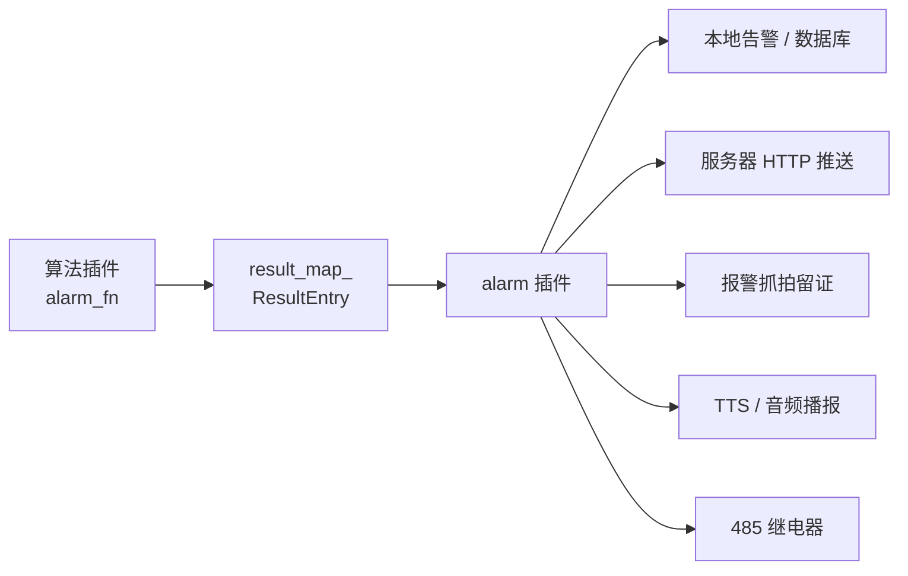

# 报警联动

AIBox SDK 的报警链路用于把算法事件转换为可推送、可留证、可联动的业务告警。核心设计是 **职责分离**：算法插件只负责判断"是否发生业务事件"并输出结构化结果，`alarm_plugin` 负责执行推送、抓拍、TTS 和继电器等动作。这样避免每个算法重复实现外设控制，也便于集中处理并发、冷却和错误恢复。

## 报警链路



## 两层协议

报警协议分两层，理解这个分层是对接的关键：

| 层 | 范围 | 载体 |
|---|---|---|
| **层 A（插件内部）** | 算法插件 ↔ `alarm_plugin` | `alarm_fn` 返回的 JSON |
| **层 B（设备外部）** | 设备 ↔ 平台 | HTTP 上报（规范 V1.0.2） |

## 层 A：`alarm_fn` 统一报警结构

算法插件的 `alarm_fn` 必须返回统一结构，`alarm_plugin` 才能正确路由：

```json
{
  "msg": "TaskId:xxx 检测到目标",
  "alarm_type": "persondet_alarm",
  "timestamp": "2026-03-07T10:10:10.123Z",
  "alarm_count": 1,
  "alarm_push_uri": "/api/v1/device/report/event",
  "server_push_uri": "/api/v1/face/capture",
  "alarms": [
    {
      "local_push_msg": {
        "alarm_type": "persondet_alarm",
        "region_event": "Enter",
        "region_id": 0,
        "track_id": 42,
        "bbox": {"x": 100, "y": 120, "w": 200, "h": 260},
        "tts_text": "注意，检测到人员入侵"
      },
      "server_push_msg": {
        "time": 1770000000000,
        "sn": "device-sn",
        "event": "Enter",
        "face_data": "data:image/jpeg;base64,...",
        "bg_data":   "data:image/jpeg;base64,..."
      },
      "alarm_push_msg": {
        "did": "device-id",
        "type": 11,
        "time": 1770000000000,
        "state": 0,
        "data": {
          "event": "Enter",
          "region_id": 0,
          "track_id": 42,
          "bg_data": "data:image/jpeg;base64,..."
        }
      }
    }
  ]
}
```

`alarm_plugin` 的路由规则：

| 字段 | 行为 |
|---|---|
| `server_push_uri` + `server_push_msg` | POST 到 `server_push_uri`（业务抓拍上报） |
| `alarm_push_uri` + `alarm_push_msg` | POST 到 `alarm_push_uri`（事件上报） |
| `local_push_msg` | 本地 UI / 数据库 / TTS，不对外 HTTP 推送 |

!!! warning "空报文会被跳过"
    `alarm_fn` 返回空 JSON 对象时，`alarm_plugin` 会跳过该次推送。务必确保只有 `alarm_count > 0` 时才填充 `alarms[]`。

## TTS 字段

TTS 字段放在 `local_push_msg` 中：

| 字段 | 说明 |
|---|---|
| `tts_text` | 直接播报文本 |
| `tts_url` | 播放远端音频 URL |
| `tts_queue` | `["文本1", "文本2"]` 队列顺序播报 |

## 事件类型映射（EventType）

来源：`thirdpark/comm/include/DevProtoDef.hpp`。常用值：

| 值 | 枚举名 | 含义 |
|---|---|---|
| 2 | INTRUSION_DETECTION | 入侵 / 绊线 |
| 5 | CROWD_GATHERING | 人群聚集 |
| 6 | PERSON_LOITERING | 人员徘徊 |
| 8 | FIRE_ALARM | 火焰 / 烟雾 |
| 11 | HUMAN_DETECTION | 人形抓拍 |
| 12 | WHITELIST_DETECTION | 白名单识别 |
| 13 | BLACKLIST_DETECTION | 黑名单识别 |
| 15 | POST_ABANDONMENT | 离岗检测 |
| 16 | FALL_DETECTION | 摔倒检测 |
| 19 | BEHAVIOR_DETECTION | 行为检测（打架/吸烟/打电话） |
| 20 | NON_MOTORIZED_VEHICLE | 非机动车 |

!!! note "前向兼容"
    SDK 当前已扩展到 `type=20`，协议文档 V1.0.2 示例覆盖到 `14`。建议后端枚举做前向兼容，未知值不要拒绝，改用 `type + alarm_type` 双字段联合识别。

## 层 B：设备对外 HTTP 协议

根据平台设备对接协议规范 V1.0.2：

| 接口 | 方法 | 用途 |
|---|---|---|
| `/api/v1/device/report/event` | POST | 通用事件上报 |
| `/api/v1/device/report/info` | POST | 设备信息上报 |
| `/api/v1/adapter/lenfocus/face/capture` | POST | 人脸抓拍上报 |
| `/api/v1/adapter/lenfocus/vehicle/capture` | POST | 车辆抓拍上报 |

事件上报标准体：

```json
{
  "did": "1234512",
  "type": 11,
  "time": 1666781577816,
  "data": {
    "face_data":       "data:image/jpeg;base64,...",
    "body_data":       "data:image/jpeg;base64,...",
    "bg_data":         "data:image/jpeg;base64,...",
    "jpeg_url_face":   "sdcard/capture/xxx_face.jpg",
    "jpeg_url_body":   "sdcard/capture/xxx_body.jpg",
    "jpeg_url_frame":  "sdcard/capture/xxx_frame.jpg"
  }
}
```

## 报警插件职责

报警插件负责执行动作：

- 服务器 HTTP 推送。
- 本地报警记录。
- 报警抓拍。
- TTS 或音频播报。
- 485 继电器触发。

执行失败只影响对应外设，不应阻塞视频主链路。

## 485 继电器

报警插件提供 485 执行配置：

| 参数 | 说明 |
|---|---|
| `relay_enabled` | 是否启用 485 继电器 |
| `relay_device` | 串口设备号，例如 `/dev/ttyS1`、`/dev/ttyUSB0` |
| `relay_baud_rate` | 波特率 |
| `relay_slave_id` | 从站地址 |
| `relay_channel` | 继电器通道 |
| `relay_coil_address` | 线圈地址，`-1` 表示按通道自动映射 |
| `relay_pulse_ms` | 触发时长 |
| `relay_default_interval` | 默认触发间隔 |
| `relay_active_high` | 是否高电平吸合 |

## 多任务并发

多个任务同时报警时，报警插件使用统一队列执行 485 写入：

- 所有任务提交到同一个控制器。
- 串口写入串行执行，避免 RS485 总线冲突。
- 冷却键包含设备号、从站、线圈、任务 ID 和报警类型。
- 队列满时丢弃最旧请求，保护系统稳定性。

## 交付建议

- 默认关闭继电器联动，现场确认接线和继电器协议后再开启。
- 串口设备号应根据硬件平台配置，不要假设所有平台都是同一个 `/dev/tty*`。
- 报警间隔应在算法侧根据业务场景配置，报警插件只负责执行。

## 报警链路联调清单

上线前逐项确认报警链路完整：

- [ ] 算法插件输出 `alarm_count > 0`。
- [ ] `alarm_push_uri` / `server_push_uri` 非空。
- [ ] `alarm_plugin` 配置的 `http_url` 网络可达（`curl -X POST <url>` 验证）。
- [ ] 报文包含 `did` / `type` / `time` 字段。
- [ ] `data.bg_data` 图片大小未超限（建议压缩到 200KB 以内，过大会导致接口超时）。
- [ ] TTS：`tts_enabled=true` 且 `tts_speaker_ip` 可达。
- [ ] 485：现场确认接线和继电器协议后再开启。

更多排障参见 [交付运维](deployment-ops.md) 和 [常见问题](faq.md)。
