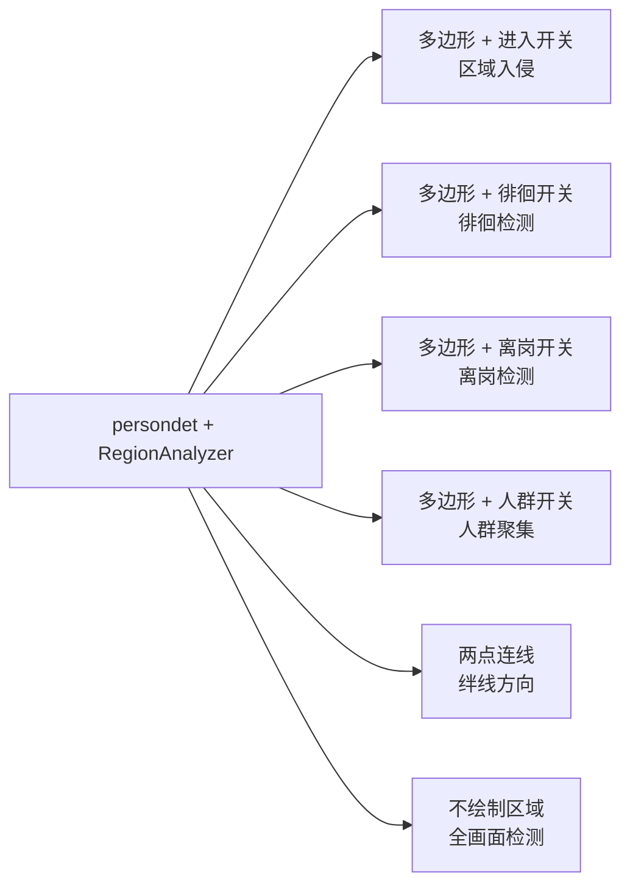

# 算法能力

AIBox SDK 提供面向现场业务的算法组件矩阵，覆盖人员安防、车辆管理、安全生产、行为识别和开放词汇检测等场景。

## 人员安防

| 能力 | 典型场景 |
|---|---|
| 区域入侵 | 禁区、机房、仓库、危险区域 |
| 徘徊检测 | 门口、周界、重点通道 |
| 离岗检测 | 值班岗、收费岗、生产岗位 |
| 人群聚集 | 广场、门店、候车区 |
| 绊线方向 | 出入口、通道、周界 |
| 人流统计 | 商超、园区、展厅 |
| 人脸检测与识别 | 门禁、考勤、重点人员布控 |

## 车辆管理

| 能力 | 典型场景 |
|---|---|
| 车牌识别 | 园区入口、停车场、道路卡口 |
| 违章停车 | 消防通道、园区道路、门口 |
| 车流统计 | 出入口、道路、停车场 |
| 车辆逆行 | 单行道、物流场站、园区通道 |

## 安全生产

| 能力 | 典型场景 |
|---|---|
| 火灾烟雾 | 仓库、工厂、机房 |
| 安全帽 | 工地、车间、施工区域 |
| 摔倒检测 | 康养、园区、公共空间 |
| 打电话检测 | 加油站、生产车间、禁手机区域 |
| 吸烟检测 | 仓库、消防重点区域 |
| 打架检测 | 园区、门店、公共空间 |

## 行为识别

| 插件 | 显示名 | 关键能力 |
|---|---|---|
| `fight` | 打架检测 | 肢体冲突行为识别 |
| `falldown` | 摔倒检测 | 人员跌倒姿态识别 |
| `calling` | 打电话检测 | 手持设备打电话行为识别 |
| `smoking` | 吸烟检测 | 吸烟行为识别 |

## 区域规则引擎

`persondet` 插件集成了 `RegionAnalyzer`，**同一个插件通过前端绘制不同形状和开关配置，可实现 6 种安防场景**，无需为每种场景单独部署算法：



关键配置项（`config.json`）：

| 配置 key | 默认值 | 说明 |
|---|---|---|
| `region_enable_enter` | `true` | 开启进入/离开报警 |
| `region_enable_loiter` | `false` | 开启徘徊检测 |
| `region_loiter_sec` | `10` | 徘徊触发时间（秒） |
| `region_loiter_cooldown` | `30` | 徘徊报警冷却（秒） |
| `region_enable_absence` | `false` | 开启离岗检测 |
| `region_absence_sec` | `30` | 离岗触发时间（秒） |
| `region_enable_crowd` | `false` | 开启人群聚集 |
| `region_crowd_threshold` | `10` | 聚集触发人数 |
| `region_enable_line_cross` | `false` | 开启绊线越线 |

## 开放词汇与智能审核

`promptdet` 插件面向"类别经常变化、但不希望为每个场景重新训练模型"的业务。用户在 Web 端下发英文提示词，系统理解语义并在实时视频中检测对应目标。`llm` 插件对候选报警做语义复核，降低误报。

典型目标词：

```text
person
trash bag
traffic cone
fire extinguisher
cardboard box
```

核心能力：

- **动态提示词**：每个任务最多 5 个英文提示词；一行一个，提示词内部可含空格。
- **统一资源交付**：检测能力、提示词理解能力和必要资源随插件统一交付（`promptdet_model.axpkg`）。
- **区域规则**：未绘制区域时默认全画面检测；绘制多边形后只对区域内目标生效。
- **通用事件规则**：支持目标出现、目标缺失、目标静止、新增物体、数量超限、动作候选等规则。
- **报警治理**：内置轻量跟踪、连续帧确认、重复报警间隔和本地/服务器报警推送。

典型场景：

| 场景 | 推荐提示词 | 推荐规则 |
|---|---|---|
| 门口包裹检测 | `package` / `cardboard box` | 新增物体或目标出现 |
| 通道堆物检测 | `box` / `trash bag` / `carton` | 目标静止 |
| 道路异物检测 | `traffic cone` / `debris` | 目标出现或目标静止 |
| 岗位物品缺失 | `fire extinguisher` / `helmet` | 目标缺失 |

!!! note "提示词语言建议"
    当前版本建议使用英文提示词。中文提示词不会报错，但语义对齐不稳定，不建议用于正式布控。

## 能力组合（行业方案）

实际项目中，通过能力组合完成业务闭环：

| 行业场景 | 能力组合 |
|---|---|
| 周界安防 | 区域入侵 + 报警抓拍 + 485 继电器 |
| 消防安全 | 火灾烟雾 + LLM 复核 + TTS 播报 |
| 停车管理 | 车牌识别 + 平台推送 + 录像留证 |
| 快速定制 | 提示词检测 + 区域规则 + 智能检索 |
| 生产管理 | 安全帽 + 离岗检测 + 平台工单 |
| 商业分析 | 人流统计 + 人群聚集 + 数据报表 |

更多算法接口和模型类型，见 [SDK 开发指南](sdk-guide.md)。
