# 云端管理平台使用说明

> 文档版本：1.0 · 更新日期：2026-09-09 · 适用对象：设备管理员、项目实施人员、值班人员和运维人员

[English](../../en/cloud-platform/index.md) · [设备端 Web 用户使用手册](../user-manual/index.md) · [设备开箱与快速上手](../device-onboarding.md)

本手册介绍如何将 AI-BOX 接入云端管理平台，以及如何在云端查看设备、配置算法任务、预览实时视频、查看报警证据和开展日常运维。教程按“设备准备 → 云端配置 → 添加设备 → 检查在线 → 配置任务 → 查看视频 → 处置报警”的顺序展开。

!!! note "界面与版本"
    本文以 2026 年 9 月核对的云端管理平台和设备端 Web 界面为准。图片来自实际界面，图中的设备名称、数量、报警数量及运行状态只是采集时的示例。不同固件、插件、账号权限和后续版本可能影响可用入口。中英文手册使用同一组实拍界面，英文版提供对应的英文操作说明和中英文菜单对照。

点击任意截图可打开原图，查看小字和完整字段。

**按角色快速阅读**

- **首次接入**：第 2–4 章，准备信息、设备云端配置、一次性认领。
- **配置人员**：第 6–8 章，设备凭据、任务配置和运行验收。
- **值班人员**：第 5、9–11 章，总览、实时监控、报警和审计。
- **交付运维**：第 13–15 章，完整示例、排障和验收清单。

## 1. 先理解三个使用入口

### 1.1 设备端与云端分别做什么

| 入口 | 用途 | 使用的账号 | 访问条件 |
| --- | --- | --- | --- |
| 设备端 Web | 首次配置设备网络、云端连接、插件、存储；直接管理本机任务 | 该设备的登录账号 | 电脑能够访问设备所在网络 |
| 云端管理平台 | 集中查看已绑定设备、远程管理任务、实时预览、报警处置和审计 | 云端注册账号 | 电脑能够访问云平台，设备按实际操作需要保持在线 |
| 云端里的“设备登录” | 在已登录云平台后，进一步验证对某台设备的操作权限 | 该设备的登录账号 | 云端与设备的远程通道可用 |

云端登录密码与设备登录密码属于不同的账号体系。进入云平台成功，并不代表已经通过设备端登录验证。反过来，知道设备登录密码也不意味着该设备已经绑定到当前云端账号所属的租户。

### 1.2 本教程的访问地址

| 项目 | 示例地址 | 说明 |
| --- | --- | --- |
| 云端登录 | [https://cloud.fiveeyes.cc/login](https://cloud.fiveeyes.cc/login) | 使用自己的云端账号登录 |
| 本次设备端入口 | `https://192.168.1.234:8099/aibox/login` | 局域网示例；请替换为自己设备的 IP |
| 本平台设备连接地址 | `wss://cloud.fiveeyes.cc/v1/device-control` | 本次设备真实配置；在设备“云端配置”中填写 |
| 私有部署设备连接地址 | 由部署方提供的完整 `wss://` 地址 | 域名、端口和路径按实际部署填写 |

**不要把云端网页登录地址直接当作设备连接地址。** 浏览器登录使用 HTTPS 页面，设备连接使用 WSS 服务地址。`/login?redirect=/dashboard` 是网页路径，不应复制进设备“服务器地址”输入框。服务端口也不能仅凭网页端口推断。

公开手册不提供真实云端账号、密码或有效绑定码。设备密码以交付资料和实际设置为准。

!!! note "示例设备说明"
    本次设备端入口示例为 `192.168.1.234`；云端账号现有设备列表中的 RK3588 是另一台已绑定设备。云端截图使用当前可访问设备展示操作，不能据此认定示例 IP 已完成认领。

### 1.3 推荐的首次使用顺序

1. 在局域网登录设备，确认本机服务正常。
2. 打开 **设置 → 云端配置**，检查服务器地址与设备身份。
3. 确认设备已登记并能显示设备编号和有效的一次性绑定码。
4. 登录云平台，在 **设备管理 → 添加设备** 中认领设备。
5. 检查设备端“已绑定”以及云端“在线”。
6. 进入该设备的任务管理，完成设备登录验证。
7. 配置、保存并运行一个算法任务。
8. 打开实时视频，确认画面和算法叠加信息正常。
9. 到报警中心查看真实事件及证据，完成日常处置。

## 2. 接入前准备

### 2.1 需要准备的信息

| 信息 | 从哪里获得 | 用在哪里 |
| --- | --- | --- |
| 设备 IP、Web 端口 | 交付资料、网络管理员、设备发现工具 | 首次登录设备端 |
| 设备账号、密码 | 设备管理员 | 设备端登录和云端远程设备验证 |
| 云端账号 | 已注册账号或项目管理员 | 云端登录 |
| 云端 WSS 服务地址 | 平台部署方 | 设备“云端配置” |
| 设备编号 | 设备“云端配置 → 设备绑定” | 云端添加设备 |
| 一次性绑定码 | 同一设备的“云端配置”弹窗 | 在有效期内认领设备 |
| 视频源地址与凭据 | 摄像头/NVR 管理员 | 配置任务输入节点 |
| 算法需求 | 项目方案 | 选择插件、检测区域、阈值及报警方式 |

### 2.2 网络与浏览器检查

- 使用当前受支持的 Chrome 或 Edge 等浏览器，允许页面运行 JavaScript。
- 初次配置时，电脑需要能访问设备 IP 和 Web 端口；云端远程访问则需要设备到云端服务的网络可达。
- 检查设备 IP、网关、DNS 和时间。浏览器能访问云平台，不代表设备自己的网关或 DNS 配置正确。
- 视频预览需要远程媒体通道可用。网页打开、设备在线、视频首帧出现是不同的检查点。
- 首次使用先验证一路视频，再增加任务和同时预览的路数。
- 遇到证书错误时，先由设备或网络管理员核对地址、证书和设备时间；不要把关闭浏览器安全检查当作常规安装步骤。

### 2.3 不同标识的区别

| 名称 | 含义 | 是否手工填写 |
| --- | --- | --- |
| 设备编号 / Device SN | 用于云端登记、认领的业务编号 | 从设备端复制到添加设备表单 |
| 设备唯一标识 / Device UID | 稳定的设备身份，用于识别设备和关联任务、报警 | 系统生成，在界面核对 |
| P2P 凭证标识 / P2P UID | 远程通道使用的身份标识 | 系统管理，不自行修改 |
| 一次性绑定码 | 认领设备时的临时证明 | 仅在云端添加设备时使用 |
| 设备名称 | 方便人员识别的显示名称 | 添加设备时可按项目命名 |

请勿用 Device UID、P2P UID、设备 IP 或授权序列号替代“设备编号”。这些值即使看起来相近，也不是同一字段。

## 3. 设备端：找到云端配置

### 3.1 登录设备

1. 在与设备网络可达的电脑上打开设备 Web 地址。
2. 输入设备账号和密码，点击 **登录**。
3. 等待任务页及连接状态加载完成。
4. 找到页面右上角的齿轮图标，打开设置菜单。
5. 点击 **云端配置**。

[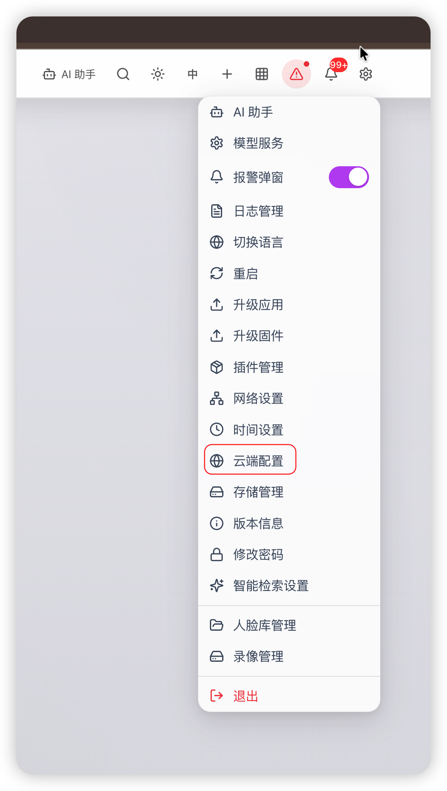](../../assets/cloud-platform/04-device-menu.png)

*图：用户提供的设备端实际菜单截图。设备端右上角设置菜单。“云端配置”位于设备管理相关设置中；不要与云平台侧栏的“系统设置”混淆。*

### 3.2 逐项阅读云端配置

[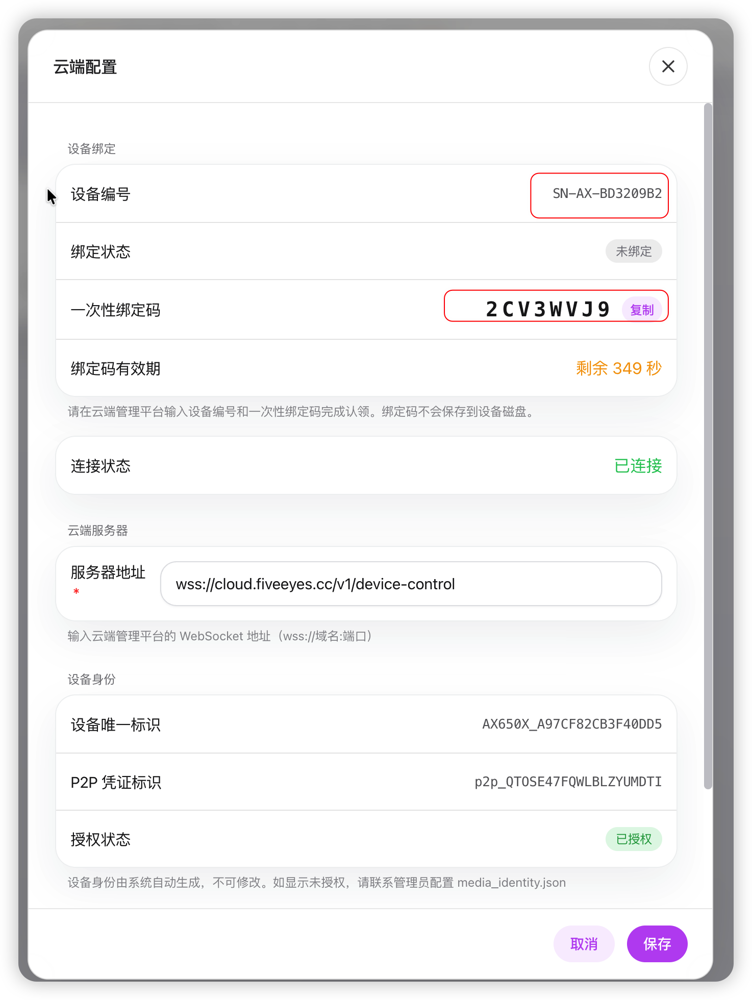](../../assets/cloud-platform/05-cloud-config.png)

*图：用户提供的实际设备配置窗口。截图中的一次性绑定码仅为已失效的历史示例，不能用于实际认领。*

图中“已连接”和“已授权”均已满足，但“绑定状态”仍是“未绑定”，因此还需要到云端完成认领。设备端的 **设备编号** 对应云端添加表单的 **设备序列号**；复制这个值，不要复制下方的设备唯一标识或 P2P 凭证标识。

| 区域/字段 | 如何理解 | 操作建议 |
| --- | --- | --- |
| 设备编号 | 云端登记使用的编号 | 添加设备时完整复制 |
| 绑定状态 | 是否已有租户归属 | 首次接入关注“未绑定”；认领后应为“已绑定” |
| 一次性绑定码 | 当前有效的认领码 | 与本设备编号成对使用，不使用旧截图中的码 |
| 绑定码有效期 | 当前码的剩余可用时间 | 过期后等待设备获取新的有效码 |
| 连接状态 | 设备与云端服务的连接状态 | 已绑定后仍需检查此状态 |
| 服务器地址 | 设备连接的 WSS 地址 | 使用部署方确认的值 |
| 设备唯一标识 | 设备的稳定身份 | 用于对照云端设备详情和排障 |
| P2P 凭证标识 | 远程媒体/控制通道身份 | 只读，不自行填写 |
| 授权状态 | 远程通道身份是否已授权 | 未授权时联系交付/运维人员处理 |
| 重连间隔 | 断线后再次尝试连接的间隔 | 单位为秒；界面范围 1–60 秒，通常保留现有设置 |

### 3.3 配置服务器地址

1. 核对当前服务器地址。设备已经连接到正确平台时，保留现有值即可。
2. 如确需配置，本示例云平台使用 `wss://cloud.fiveeyes.cc/v1/device-control`；私有部署填写部署方提供的完整 `wss://` 地址。
3. 核对域名、端口和部署要求的路径，避免复制空格或网页登录路径。
4. 点击 **保存**。
5. 重新打开云端配置，检查连接状态是否更新。

保存后可能看到两类结果：

- **配置已保存并重启云端连接**：表示配置已保存并触发连接重建，仍应检查最终连接状态。
- **配置已保存，但云端连接未建立**：配置保存成功与连接成功是两件事。继续排查地址、网络、时间和身份授权。

弹窗会刷新只读状态及绑定码倒计时。正在输入的服务器地址属于未保存草稿，必须点击保存才会生效；点击取消仅关闭本次编辑。

### 3.4 三个状态分别验收

| 状态 | 能证明什么 | 不能单独证明什么 |
| --- | --- | --- |
| 已连接 | 设备已建立云端连接 | 不能证明属于当前云端租户 |
| 已绑定 | 已建立设备归属关系 | 不能证明此刻在线或视频可播放 |
| 已授权 | 远程身份凭证有效 | 不能证明任务已经运行、摄像头已经出图 |

交付验收要同时核对：**归属正确、连接在线、身份可用、任务运行、视频首帧、报警证据**。

## 4. 云端：登录与添加设备

### 4.1 登录云平台

1. 打开 [云端登录页](https://cloud.fiveeyes.cc/login)。
2. 检查手机号国家/地区代码，例如中国大陆为 `+86`。
3. 输入自己的手机号和云端密码。
4. 点击 **登录**，等待进入首页总览。
5. 核对右上角账号身份，确保处于预期租户/项目环境。

登录页提供注册、找回密码和语言入口；是否可完成相应流程取决于平台部署与账号策略。设备账号不能直接作为云端手机号账号使用。

平台会话与当前浏览器使用过程关联。退出或重新打开新的会话后，如再次出现登录页，使用云端账号重新登录。

### 4.2 打开添加设备表单

1. 在左侧导航点击 **设备管理**。
2. 查看“我的设备”列表，避免重复认领已经存在的设备。
3. 点击右上角 **添加设备**。
4. 在“连接新设备”窗口填写设备信息。

[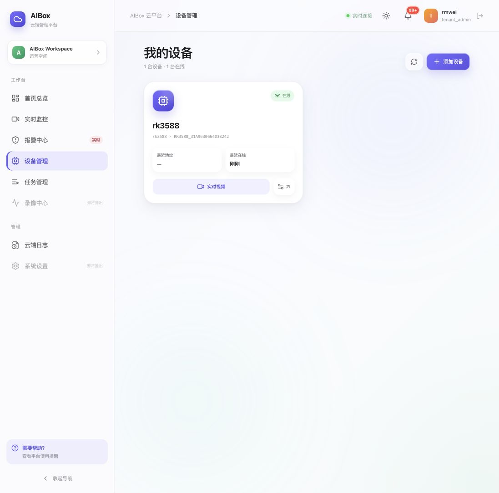](../../assets/cloud-platform/02-devices.jpg)

[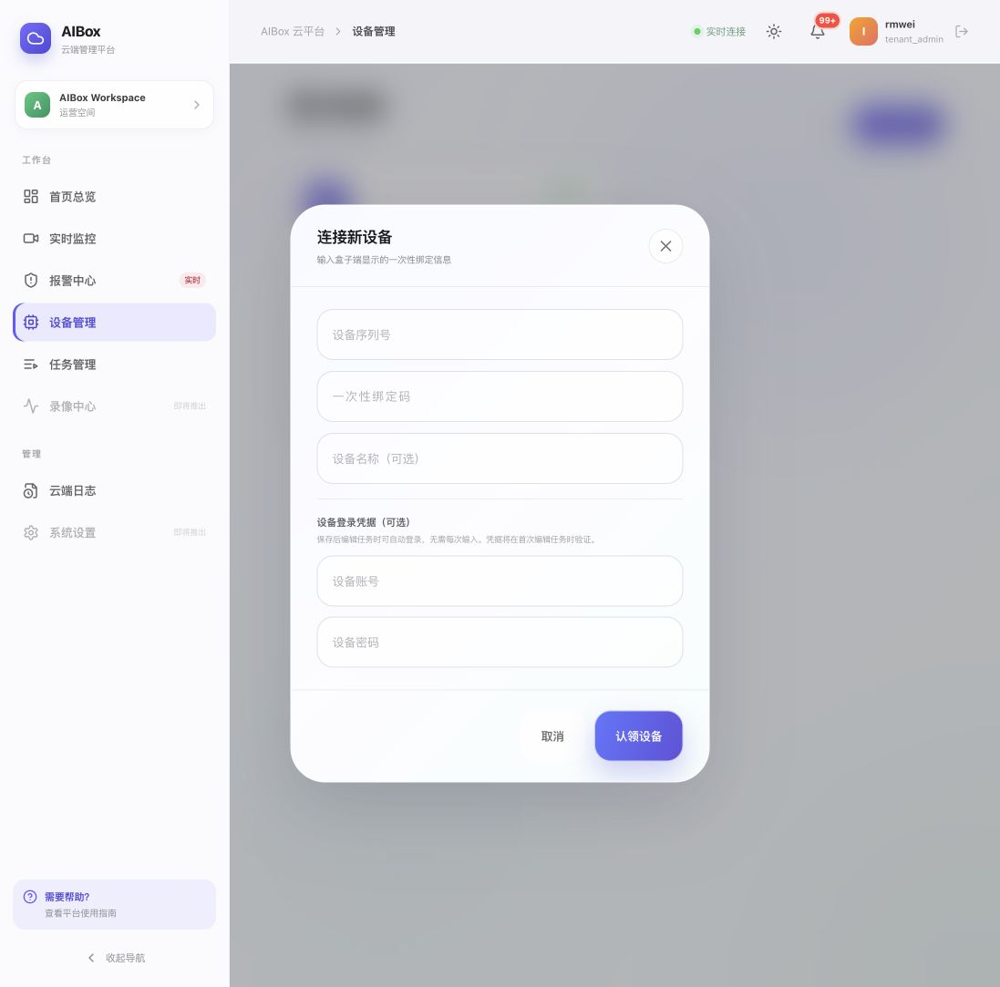](../../assets/cloud-platform/03-add-device.jpg)

### 4.3 表单填写说明

| 字段 | 是否必填 | 填写方法 | 常见错误 |
| --- | --- | --- | --- |
| 设备序列号（设备编号） | 是 | 从设备端云端配置复制 | 填入设备 IP 或 Device UID |
| 一次性绑定码 | 是 | 使用同一设备当前有效码 | 使用过期码、另一台设备的码 |
| 设备名称 | 否 | 使用场所和用途命名，例如“北门-智能分析盒” | 名称缺少场所信息，多台设备难以区分 |
| 设备账号 | 可选，与密码成对填写 | 填设备端登录账号 | 填云端手机号账号 |
| 设备密码 | 可选，与账号成对填写 | 填设备当前登录密码 | 密码已修改但仍填旧值 |

如果填写设备登录凭据，账号与密码必须同时填写；也可以暂时都不填写，之后进入远程任务管理时再验证。**认领成功不代表设备密码已经验证通过**：设备操作阶段仍可能要求重新登录。

### 4.4 提交及成功确认

1. 提交前再次核对设备编号和绑定码有效期。
2. 点击表单底部的 **认领设备** 按钮，等待结果。
3. 成功后检查新设备是否出现在列表中。
4. 核对设备名称、型号及 Device UID 是否符合预期。
5. 回到设备端云端配置，确认绑定状态更新。
6. 云端卡片显示在线后，继续验证任务和视频。

如果绑定码在填写时过期，重新取得有效码再提交；不要持续重复提交旧码。如果设备提示已有归属，应由原租户管理员核对归属和移交流程，不要通过修改设备标识尝试绕过。

### 4.5 已绑定设备无需重新添加

设备已出现在当前租户列表时，直接进入设备详情或任务管理。如果只是视频打不开、设备密码错误或网络离线，先排查对应问题，重新绑定通常不是首选处理方式。

## 5. 首页总览与导航

[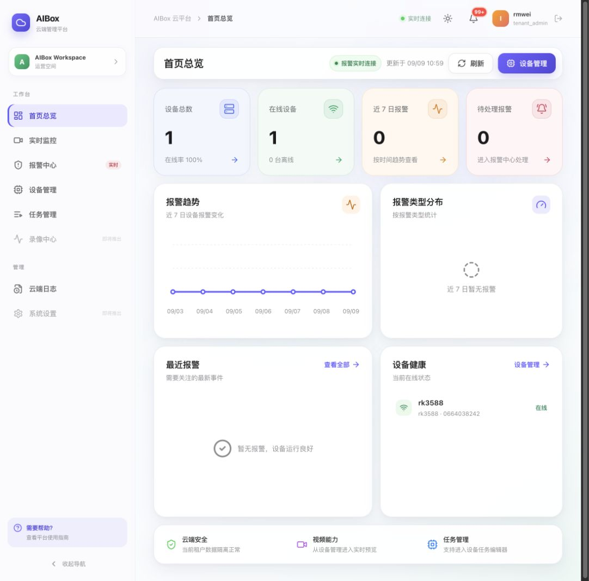](../../assets/cloud-platform/01-dashboard.jpg)

*图：首页总览展示设备在线情况、近期报警趋势与快捷入口；统计值以当前账号和页面标注的时间范围为准。*

### 5.1 首页指标

| 区块 | 用途 | 使用方法 |
| --- | --- | --- |
| 设备总数 | 查看当前账号可见的设备规模 | 点击进入设备管理 |
| 在线设备与在线率 | 发现离线设备 | 对照设备健康列表定位设备 |
| 近 7 日报警 | 查看近期事件量 | 结合趋势和报警类型分布分析 |
| 待处理报警 | 提醒值班人员关注事件 | 进入报警中心核实具体状态 |
| 报警趋势 | 查看近七日变化 | 悬停或点击日期查看数量 |
| 报警类型分布 | 了解主要事件类别 | 进入报警中心进一步筛选 |
| 最近报警 | 快速查看最新事件与证据入口 | 点击查看图片、报文或全部记录 |
| 设备健康 | 查看设备在线状态 | 进一步进入设备页面检查 |

“近 7 日”指标与报警中心的累计统计可能采用不同时间范围，不应仅因数量不同判断为数据丢失。页面右上角“实时连接”表示云端事件通道状态，也不等于每台设备的视频已经连通。

### 5.2 左侧菜单用途

| 菜单 | 主要用途 | 当前使用提示 |
| --- | --- | --- |
| 首页总览 | 运营指标与快捷入口 | 适合开始值班时检查 |
| 实时监控 | 打开监控墙并选择设备通道 | 也可从设备卡片的“实时视频”进入 |
| 报警中心 | 筛选、查看和处置报警 | 支持图片、录像和结构化报文入口 |
| 设备管理 | 添加设备、查看详情 | 与远程任务、视频入口相连 |
| 任务管理 | 汇总各设备任务 | 可搜索设备/任务并进入编辑 |
| 录像中心 | 统一录像入口 | 当前标注“即将推出”时不可按已上线功能使用 |
| 云端日志 | 操作审计 | 运行日志以页面实际开放情况为准 |
| 系统设置 | 平台/租户设置入口 | 当前标注“即将推出”时不可用 |

窄窗口或手机界面中，左侧导航可能收起为左上角菜单按钮；先点击该按钮展开导航，再选择模块。

侧栏可以折叠。折叠后可通过图标提示识别菜单；上方面包屑用于返回上级页面。主题按钮调整显示外观，不改变设备上的算法配置。

## 6. 设备管理与详情

### 6.1 设备卡片怎么读

每张卡片显示设备名称、型号、Device UID、在线状态、最近地址和最近在线时间。最近地址为空时界面可显示 `—`，应结合在线状态和详情判断，不能单凭这一字段认定设备故障。

- 点击 **实时视频**：打开该设备的实时监控页面；离线时此入口可能不可用。
- 点击 **设备详情** 图标：查看设备资源与身份信息。
- **双击设备卡片**，或聚焦卡片后按回车：进入该设备任务管理。
- 点击 **刷新设备**：更新列表与状态。

### 6.2 查看设备详情

[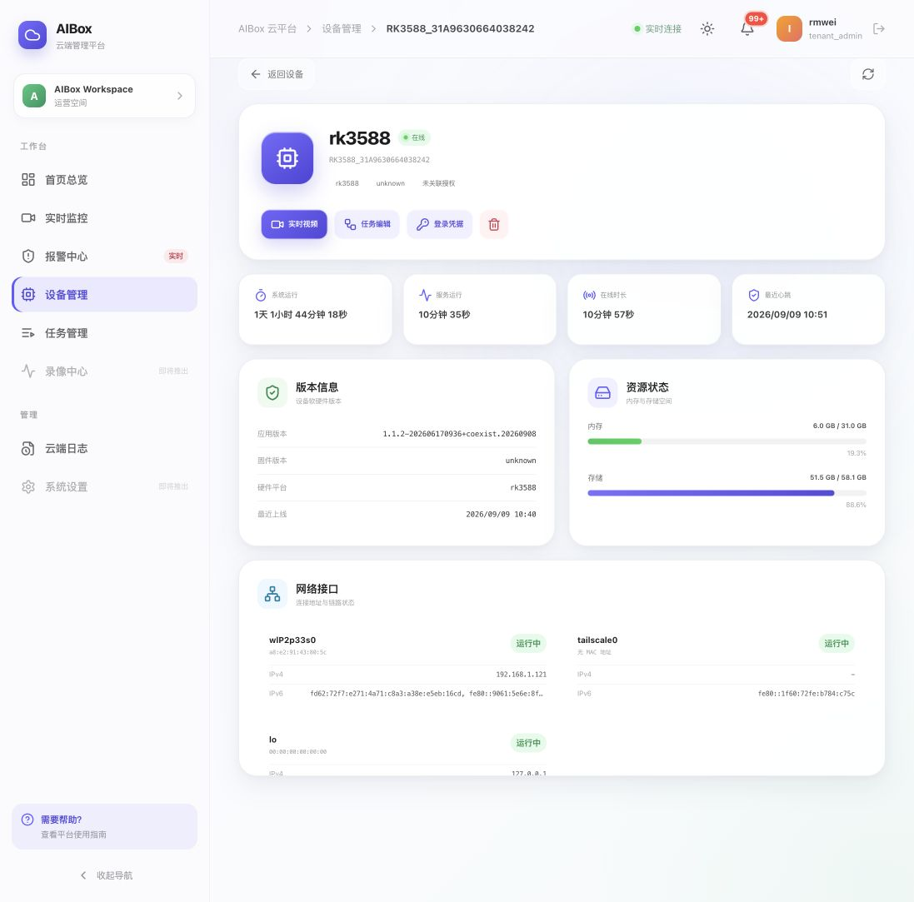](../../assets/cloud-platform/06-device-detail.jpg)

*图：设备详情顶部提供实时视频、任务编辑和登录凭据入口；下方展示版本、运行时长及资源状态。较窄窗口可向下滚动查看其余信息。*

核对设备名称和 UID 后，查看界面实际返回的版本、运行时长、CPU/NPU、内存、磁盘及网络等信息。不同设备或固件可能不提供全部指标，缺失值不应按零负载理解。

推荐按以下顺序排查设备健康：

1. 先看在线状态和最近在线时间。
2. 再看版本、运行时长和身份信息，确认目标设备没有选错。
3. 查看 CPU/NPU、内存、磁盘等资源是否异常。
4. 结合具体任务的状态、帧率和延迟定位问题。
5. 必要时进入设备端日志和存储管理进一步处理。

### 6.3 更新远程设备登录凭据

设备详情中的凭据入口用于更新云端保存的设备登录信息。适用于设备密码已变更、原凭据失效或首次添加时未填写凭据的情况。

1. 打开目标设备详情中的登录凭据入口。
2. 输入当前有效的设备账号和密码。
3. 保存后，重新进入该设备任务管理进行验证。
4. 如果仍失败，先在设备本地 Web 验证相同账号密码是否可用。

此操作更新云端保存的信息，**不修改设备本身的登录密码**。保存成功也不能替代一次实际的远程设备登录验证。

### 6.4 解绑设备

设备详情提供解绑入口。确认提示明确说明：解绑会将设备从当前租户移除，同时清除已保存的设备登录凭据。

移交设备前应确认原租户、目标租户、设备编号、交接时间和后续认领方式。不要把解绑当作普通的刷新或重连按钮，也不要假定解绑等同于清空设备本地任务或历史录像。

## 7. 任务管理：从总览到设备

[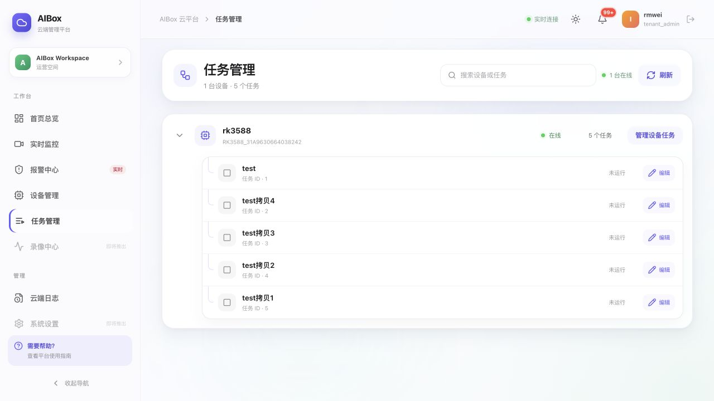](../../assets/cloud-platform/07-tasks.jpg)

*图：任务总览按设备展开。上方可搜索，下方每行显示任务名称、ID 和状态，右侧进入编辑。示例任务处于未运行状态。*

### 7.1 查找目标任务

1. 点击左侧 **任务管理**。
2. 在 **搜索设备或任务** 中输入名称关键词。
3. 展开目标设备，查看该设备的任务列表。
4. 核对任务名称、任务 ID 和运行状态。
5. 点击任务或 **管理设备任务**，进入设备级任务页面。

各设备任务可能分批加载。某台设备正在同步、离线或读取失败，不表示其他设备任务也不可用。需要时针对失败设备重试，避免把“暂未读取”误判为“已删除”。

### 7.2 设备登录与连接过程

打开设备任务页时，平台可能依次显示准备、自动登录、连接中、设备登录或错误提示。平台会尝试使用已保存的设备凭据；没有凭据或验证失败时，需要输入设备账号密码。

输入设备密码后等待连接和数据加载，避免连续点击登录。如果设备本地密码已经修改，应使用新密码。若提示“设备已登录，但自动登录凭据保存失败”，表示本次设备会话可能已经建立，但后续自动登录仍需处理凭据保存问题。

### 7.3 设备任务页

[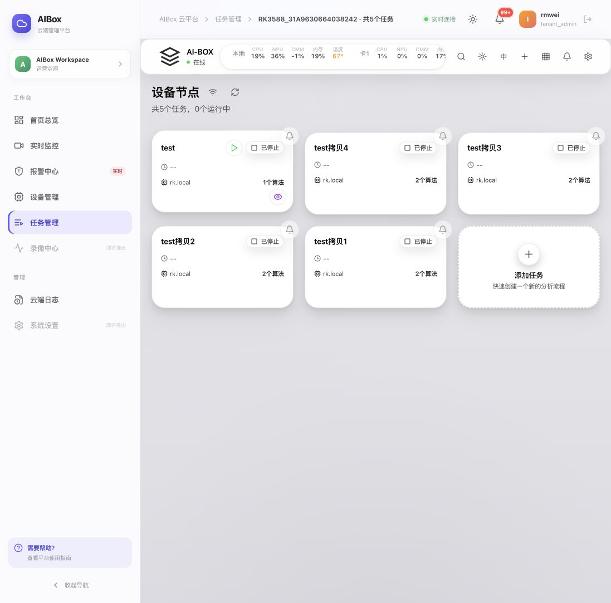](../../assets/cloud-platform/08-device-tasks.jpg)

设备任务页显示任务卡片、任务总数、运行数量、连接状态和刷新入口。先核对面包屑中的设备标识，再进行创建、编辑或停止操作，避免对错误设备下发配置。

任务配置和运行发生在实际设备上。关闭浏览器预览窗口通常只是停止本次观看，不能替代停止设备任务。

## 8. 创建并运行第一个算法任务

### 8.1 先确定任务目标

建议第一次只配置一路视频和一个算法，例如“北门-区域入侵”。事先明确：视频源、需要检测的对象、检测区域、工作时段、报警触发条件、是否需要录像，以及是否需要实时叠加画面。

### 8.2 新建任务

1. 进入目标设备任务页面，点击新建任务入口。
2. 输入能区分场景的名称，如“北门-区域入侵”。
3. 确认后进入流程编辑器。
4. 在节点列表中查找视频输入、算法和输出节点。
5. 添加节点并连接数据流。

[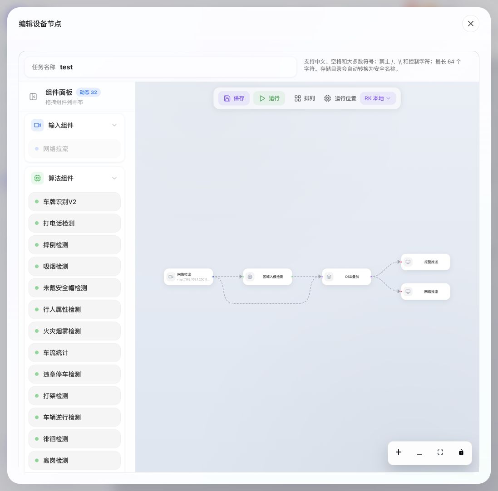](../../assets/cloud-platform/09-task-editor.jpg)

*图：现有任务的流程编辑器。左侧为组件面板，中间为节点与连线，上方提供保存、运行和运行位置设置。*

### 8.3 典型流程的职责

| 节点类别 | 职责 | 配置重点 |
| --- | --- | --- |
| 视频输入 | 从摄像头/NVR/视频源获取画面 | 地址、凭据、码流、解码方式 |
| 算法节点 | 检测目标或事件 | 类别、阈值、区域、时间条件等插件参数 |
| OSD 叠加 | 绘制框、标签和状态文字 | 是否显示类别、置信度、轨迹等 |
| 网络输出 | 为远程实时预览提供视频 | 输出启用、码流配置、通道选择 |
| 报警节点 | 将算法事件转为报警及相关证据 | 触发条件、去重/间隔、图片、录像等 |
| 录像节点 | 按插件能力保存视频 | 保存位置、时长、保留策略、可用空间 |

常见的实时显示链路为“视频输入 → 算法 → OSD → 网络输出”。报警和录像应按插件要求接在正确数据链路上；具体可用端口和参数由设备已安装插件决定。

### 8.4 配置视频输入

1. 打开输入节点配置。
2. 填写摄像头或 NVR 的有效视频流地址。
3. 按视频源要求配置账号、密码和码流。
4. 使用适合设备负载的分辨率与帧率。
5. 保存节点配置，确认流程中的连线方向正确。

视频地址中的账号密码属于设备访问凭据。不要把带密码的完整 RTSP 地址粘贴到公开工单或截图说明中。

### 8.5 配置算法与检测区域

1. 选择与需求相符的算法插件。
2. 查看该插件当前界面提供的参数含义。
3. 按场景设置检测对象、置信度、区域和触发时间等参数。
4. 涉及区域绘制时，对照正确的视频画面和尺寸设置区域。
5. 初期保留可解释的参数，使用真实样本逐项调整。

阈值不是越低越好：降低阈值可能增加误报，提高阈值可能漏掉较弱目标。应在相同画面条件下对照报警证据评估。各插件参数详解见 [Web 用户使用手册](../user-manual/index.md) 和 [算法能力](../algorithm-capabilities.md)。

### 8.6 保存、启动、验收

1. 保存节点配置和整个任务。
2. 返回任务卡片，点击启动入口。
3. 等待启动中状态结束。
4. 确认卡片显示运行状态，观察可用的帧率、延迟和节点状态。
5. 打开实时预览，确认已出现持续变化的画面。
6. 检查检测框、标签及叠加内容与预期一致。
7. 在有真实触发条件时检查报警中心记录及证据。

任务保存成功、任务运行成功、视频播放成功、报警生成成功应分别确认。仅看到“运行中”还不足以证明输入视频、算法和所有输出都健康。

### 8.7 修改已有任务

编辑前记录任务名称、设备 UID 和要调整的参数。进入编辑器后先查看已有流程，再修改必要字段并保存。修改可能触发任务重载或影响正在进行的视频分析，应按项目值班要求安排。未保存的编辑内容不会因为关闭编辑器而自动变成正式配置。

### 8.8 任务状态的理解

| 状态/现象 | 处理方式 |
| --- | --- |
| 启动中/停止中 | 等待结果，不连续重复点击 |
| 运行中 | 继续检查帧率、画面和输出 |
| 未运行/已停止 | 按需要启动，检查上次停止原因 |
| 布控暂停 | 检查任务工作时段及恢复提示，不直接认定崩溃 |
| 错误/异常 | 查看节点状态、输入源、插件、授权和资源 |
| 长时间无更新 | 核对设备连接，刷新任务状态 |

## 9. 实时视频与多画面监控

[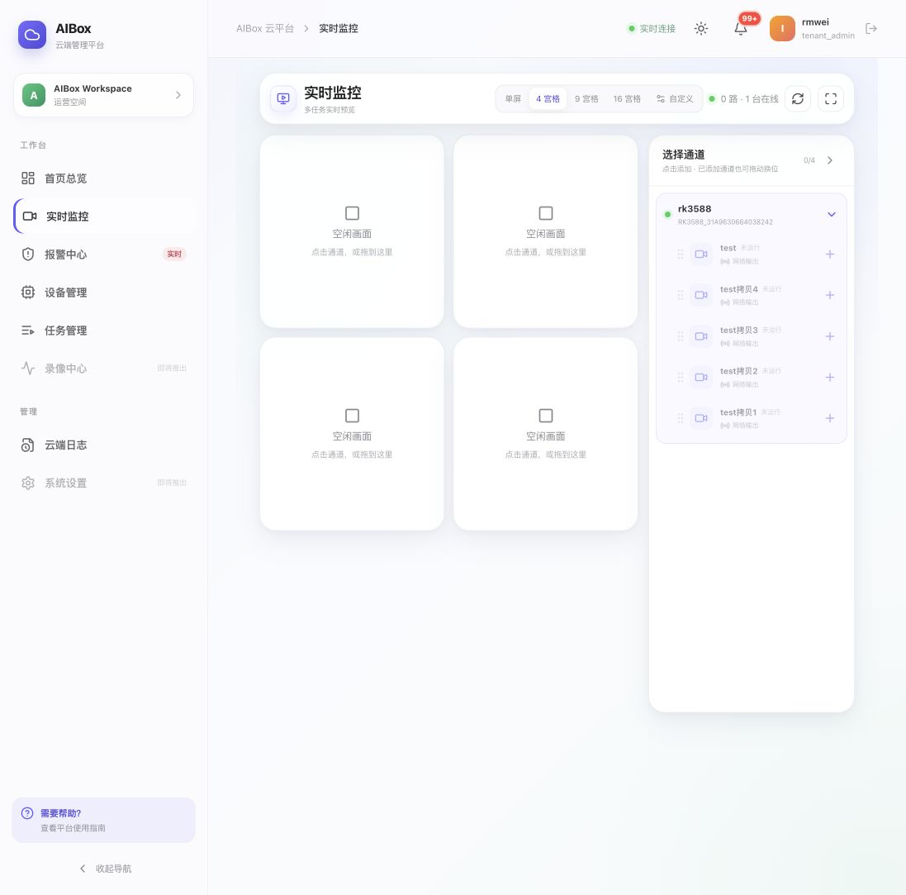](../../assets/cloud-platform/10-monitor.jpg)

*图：四宫格监控墙及右侧通道列表。示例设备在线，但任务均未运行，因此画面为空、通道不可选择；这不是正常播放画面的示例。*

### 9.1 进入实时监控

1. 点击左侧 **实时监控** 打开监控墙；也可在 **设备管理** 中点击在线设备卡片的 **实时视频**。
2. 在监控页右侧展开 **选择通道**。
3. 选择设备，等待任务通道读取。
4. 点击可用任务，或将其拖到空闲画面。
5. 等待状态变为播放并出现首帧。

### 9.2 哪些任务可以预览

当前监控墙要求任务处于运行状态，并具有网络输出。停止的任务或没有网络输出的任务会被禁用，可能显示“无网络输出”等提示。

这时应返回任务编辑器检查网络输出节点、连接和启动状态，而不是只在浏览器中刷新视频。

### 9.3 布局与窗口操作

| 操作 | 方法 | 说明 |
| --- | --- | --- |
| 切换布局 | 单屏、4/9/16 宫格 | 按屏幕大小和负载选择 |
| 自定义布局 | 点击自定义并设置行列 | 以界面允许范围为准 |
| 添加画面 | 点击右侧任务或拖到窗口 | 使用在线、运行、有网络输出的任务 |
| 调整位置 | 拖动窗口的拖动柄 | 可安排重点画面在明显位置 |
| 移除画面 | 点击窗口关闭/移除入口 | 仅移除预览，不删除设备任务 |
| 重新连接 | 点击窗口重连按钮 | 用于单路预览故障 |
| 声音 | 点击音量按钮 | 无音频的通道无法开启声音 |
| 画面全屏 | 点击单个窗口全屏 | 适合检查目标细节 |
| 监控墙全屏 | 点击页面全屏入口 | 适合值班大屏；退出可用页面按钮或浏览器全屏退出方式 |

缩小布局可能不足以容纳当前全部窗口，调整后应检查重点通道是否仍在可见区域。增加预览路数会增加浏览器解码与网络负载；实际流畅度取决于设备、码流、带宽和观看电脑。

### 9.4 设备任务页的预览方式

设备级任务页也提供任务预览和多路预览入口。可将符合条件的任务卡片拖到预览区域，并按需要选择布局。此处面向当前设备；跨设备值班建议使用云端监控入口统一选择通道。

### 9.5 常见播放问题

- **设备在线但没有画面**：检查任务运行、网络输出、媒体授权和视频源。
- **一直连接中**：检查远程媒体通道及网络环境，再尝试单路重连。
- **黑屏但状态似乎正常**：确认是否实际渲染首帧，检查设备侧输入和编码输出。
- **画面卡顿**：减少同时预览窗口，先验证单路；再检查带宽和设备负载。
- **无声音**：确认源和输出本身带音频，并检查当前窗口是否静音。
- **关闭预览后算法仍在运行**：属于预览与任务运行分离的正常行为；停止任务需在任务管理中操作。

## 10. 报警中心：查看、筛选与处置

[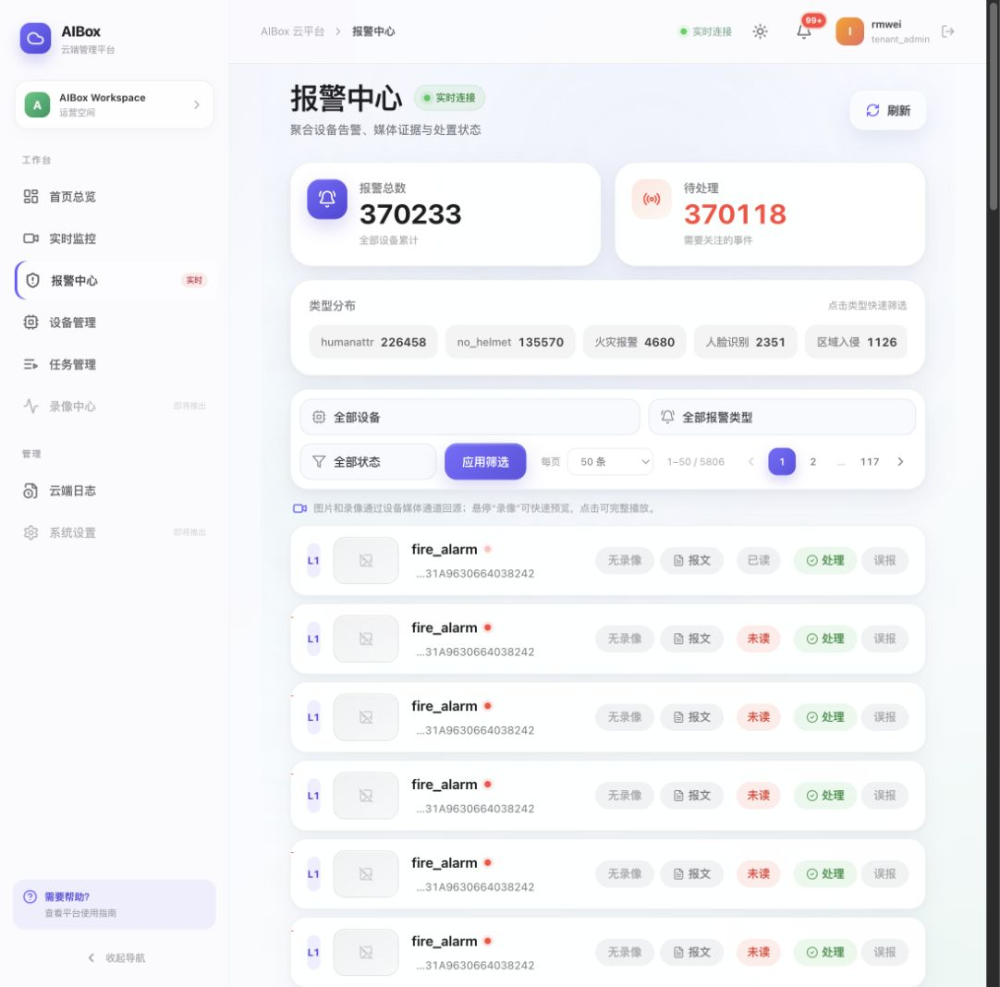](../../assets/cloud-platform/11-alarms.jpg)

*图：报警中心从上到下依次为统计、类型分布、筛选与分页、事件列表。示例中的“无录像”表示该事件没有可用录像入口。*

### 10.1 报警页面包含什么

页面汇总报警总数、待关注事件、类型分布、筛选条件和报警列表。列表包含报警标题/类型、设备、任务、时间、证据入口以及阅读和处理状态。

### 10.2 使用筛选条件

1. 点击左侧 **报警中心**。
2. 在 **按设备筛选** 中选择设备，或保留全部设备。
3. 在 **按报警类型筛选** 中选择事件类型。
4. 在 **按处理状态筛选** 中选择未读、已读、已处理或误报。
5. 点击 **应用筛选**，等待列表更新。
6. 需要清除条件时点击 **重置**。

选择下拉框属于修改筛选草稿，点击应用后才按新条件查询。类型分布的类型按钮可用于快速筛选。筛选后没有结果时，先清除条件确认是否筛选过窄。

### 10.3 分页

列表顶部和底部提供分页入口；可调整每页数量并翻页。先确认当前页、总页数和筛选条件，再判断事件是否存在。不要只查看第一页就认定历史事件丢失。

### 10.4 图片、录像与报文

| 证据入口 | 用途 | 注意事项 |
| --- | --- | --- |
| 报警缩略图/图片 | 查看事件发生时的检测画面 | 核对时间、区域、检测框和目标 |
| 录像 | 播放报警相关片段 | 没有录像时显示“无录像”；是否存在取决于任务配置和保留情况 |
| 报文 | 查看结构化事件详情 | 可用于确认设备 UID、任务 ID、类型、时间和附加字段 |
| 下载 | 留存已有图片/录像 | 按当前行状态和可用证据显示，不能下载不存在的媒体 |

部分报警证据需要连接报警所属设备。云端能够显示报警记录，并不保证离线设备上的媒体仍可即时读取。历史文件也可能受设备存储保留策略影响。

### 10.5 阅读状态与处理状态

| 状态 | 含义 | 后续操作 |
| --- | --- | --- |
| 未读 | 尚未阅读的事件 | 打开证据并判断事件 |
| 已读 | 已查看，但不一定完成处置 | 根据现场核实结果处理 |
| 已处理 | 已确认完成处置 | 需要时下载证据、查阅报文 |
| 误报 | 已判断为误触发 | 留存证据，作为算法参数调整依据 |

报警行的阅读标记可能显示“已读”，同时处理按钮显示“已处理”或“误报”；两者表达的层次不同。已读不等于已处理。

### 10.6 推荐处置顺序

1. 核对设备、任务、报警时间和类型。
2. 打开图片，必要时播放录像。
3. 与现场情况核实，按项目流程完成实际处置。
4. 对真实且已处置事件点击 **处理**；确认误触发后点击 **误报**。
5. 检查按钮和状态是否更新。
6. 需要归档时下载当前可用证据。

标记为误报不会自动调整设备上的算法阈值或检测区域。需要回到任务编辑器，依据样本审慎调整配置。不要为了清空待办数量而把未核实事件批量视为已处理。

### 10.7 结构化报文怎么用

报文页显示事件字段，并提供复制 JSON 的入口。向运维反馈时，优先提供设备 UID、任务 ID、报警时间、类型和错误现象。历史事件可能只有当时保存的结构化元数据，缺少新版本完整报文字段并不等于该事件无效。

对外分享前检查报文、视频源地址和图片中的敏感信息。不要公开账号、密码、有效绑定码或包含人员隐私的原始证据。

## 11. 云端日志与操作追踪

[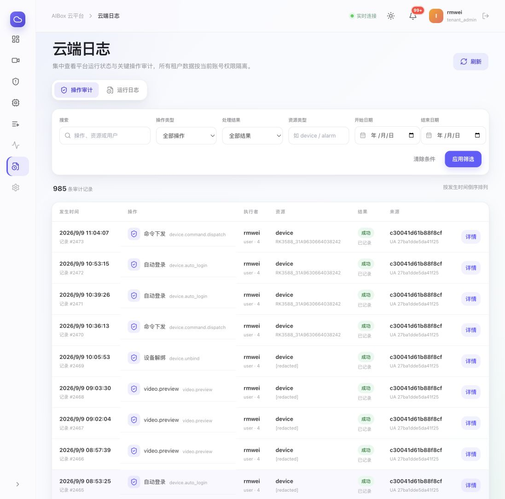](../../assets/cloud-platform/12-logs.jpg)

### 11.1 查询操作审计

1. 点击左侧 **云端日志**，选择 **操作审计**。
2. 根据需要输入操作、资源或用户关键词。
3. 选择操作类型和处理结果；需要时在资源类型框输入 `device` 或 `alarm` 等类型。
4. 选择开始日期、结束日期。
5. 点击 **应用筛选**。
6. 查看发生时间、执行者、资源、结果及来源摘要。
7. 点击记录右侧的 **详情** 查看请求标识和安全详情。

窗口较窄时，可以收起左侧导航并使用底部横向滚动条，查看筛选区右侧按钮及表格末列。清空条件使用 **清除条件**，再按页面需要应用筛选。

### 11.2 运维反馈应提供什么

| 信息 | 用途 |
| --- | --- |
| 操作时间与时区 | 对齐设备和平台日志 |
| 操作类型及处理结果 | 判断在哪一步失败 |
| 设备 UID/任务 ID | 定位实际资源 |
| Request ID / Trace ID（如果显示） | 帮助运维追踪同一请求 |
| 页面错误原文 | 避免仅凭“不能用”猜测问题 |
| 已尝试的步骤 | 减少重复排查 |

当前“运行日志”页如显示“接入中”，表示租户界面尚未提供该功能。服务器原始日志由平台运维侧管理；不要把此提示理解为设备没有产生日志。

## 12. 权限、会话与可用功能边界

- 当前账号可见的设备、报警和审计记录受租户归属及权限限制。
- 不同项目账号登录后看到不同设备列表，是首先需要核对的账号环境问题。
- 远程设备验证与云端账号验证分开，设备凭据失效时需单独更新。
- 普通租户使用手册不等同于平台超级管理员后台说明，不应假定普通账号可以制造登记设备、改租户归属或分配平台权限。
- 当前标注“即将推出”或“接入中”的入口，应以实际开放状态为准。
- 在共享电脑上操作完毕，使用右上角退出入口结束会话。

## 13. 完整示例：接入一台盒子并看到实时分析

以下用“北门-智能分析盒”作为示例名称，字段值须使用自己的设备信息。

| 步骤 | 操作 | 成功标志 |
| --- | --- | --- |
| 1 | 局域网登录设备 Web | 能看到本机任务页 |
| 2 | 设置 → 云端配置，核对 WSS 地址 | 云端连接状态正常 |
| 3 | 读取设备编号和当前绑定码 | 绑定码在有效期内 |
| 4 | 云端设备管理 → 添加设备 | 表单提交成功 |
| 5 | 名称设为“北门-智能分析盒” | 列表出现正确设备 UID |
| 6 | 回看设备端绑定状态 | 显示已绑定 |
| 7 | 双击设备卡片，完成设备登录 | 设备任务页加载成功 |
| 8 | 创建“北门-区域入侵”任务 | 流程包含正确输入、算法和所需输出 |
| 9 | 保存并启动 | 任务运行，输入有有效帧 |
| 10 | 返回实时视频，选择该任务 | 持续显示实时画面及叠加信息 |
| 11 | 在受控、符合现场安全要求的场景中验证报警 | 报警中心出现对应设备与任务事件 |
| 12 | 查看证据并按流程处置 | 图片/录像可核对，状态更新正确 |

完成这 12 步，才能说明从设备接入到业务使用的完整链路已经跑通。演示或验收时应采用项目允许的测试方式，不人为制造危险事件。

## 14. 常见问题与排查顺序

| 现象 | 优先检查 | 建议处理 |
| --- | --- | --- |
| 设备 Web 打不开 | IP、端口、电脑与设备网络 | 确认实际地址及网络可达，再检查服务 |
| 云端登录失败 | 国家代码、手机号、密码、账号状态 | 使用云端账号；不要混用设备密码 |
| 配置地址保存失败 | 是否为 `wss://` | 按部署方地址填写 |
| 地址保存成功但未连接 | 设备网关、DNS、时间、服务端口 | 先修复连接，不急于反复绑定 |
| 设备编号为空 | 设备登记状态及云端连接 | 联系交付人员检查登记信息 |
| 没有绑定码 | 是否已绑定、连接是否正常、码是否过期 | 已绑定时不必重新取码；未绑定时检查连接 |
| 绑定码失效 | 是否使用最新有效码 | 重新获取并在有效期内提交 |
| 设备已有归属 | 当前租户与原租户 | 联系原管理员确认移交 |
| 设备端已连接，云端列表没有设备 | 是否完成认领、登录租户是否正确 | 核对编号、绑定结果和账号 |
| 已绑定但云端离线 | 设备供电与云端连接 | 检查网络和设备服务 |
| 在线但设备登录失败 | 设备账号密码 | 本地验证后更新云端凭据 |
| 任务列表为空 | 设备是否真无任务，还是尚未同步 | 查看加载错误并重试 |
| 任务启动后异常 | 视频源、插件、授权、资源、连线 | 从输入向输出逐节点检查 |
| 布控暂停 | 工作时间与设备时间 | 检查时段和恢复倒计时 |
| 监控任务不可点击 | 运行状态、网络输出 | 运行任务并配置网络输出 |
| 视频连接中/黑屏 | 媒体授权、通道、首帧、输入 | 先单路验证，再逐步增加窗口 |
| 有记录没有图片/录像 | 证据配置、所属设备在线、文件保留 | 检查报警与录像配置、设备存储 |
| 选择筛选条件后列表没变 | 是否点击应用筛选 | 点击应用并等待完成 |
| 首页和报警中心数量不同 | 统计时间范围、筛选和状态 | 用同一范围比较 |
| 处理/误报按钮不可再次点击 | 已经处于最终处置状态 | 查看现有状态及可用下载入口 |
| 运行日志显示接入中 | 当前版本功能范围 | 联系平台运维查询服务器日志 |

## 15. 日常检查与交付清单

### 15.1 每班检查

1. 登录后核对租户/账号和设备在线数量。
2. 查看重点设备离线情况和资源异常。
3. 检查关键任务是否运行、是否处于计划暂停。
4. 抽查一路实时视频和算法叠加。
5. 查看未读及尚未处置事件，按现场流程核实。
6. 检查图片、录像和设备存储是否可用。
7. 交接时记录未解决问题、时间、设备 UID 和任务 ID。

### 15.2 新项目验收

- [ ] 云端与设备账号分别交接并验证。
- [ ] 设备编号、UID、显示名称和安装位置有对应记录。
- [ ] 设备绑定到正确租户。
- [ ] 在线、授权、远程设备登录均验证成功。
- [ ] 算法输入、区域、阈值、时段和输出已按需求配置。
- [ ] 实时视频已有首帧并持续更新。
- [ ] 报警图片/录像、报文和处理状态完成验证。
- [ ] 设备时间、存储策略和网络配置已核对。
- [ ] 运维人员知道查询审计及反馈问题的方法。
- [ ] 未开放功能、版本差异和剩余问题已经记录。

## 16. 中英文菜单对照

| 中文界面 | English meaning |
| --- | --- |
| 云端配置 | Cloud Configuration |
| 设备编号 | Device SN |
| 一次性绑定码 | One-time Binding Code |
| 绑定状态 | Binding Status |
| 连接状态 | Connection Status |
| 已授权/未授权 | Authorized / Unauthorized |
| 首页总览 | Dashboard |
| 设备管理/我的设备 | Device Management / My Devices |
| 添加设备 | Add Device |
| 设备详情 | Device Details |
| 任务管理 | Task Management |
| 管理设备任务 | Manage Device Tasks |
| 实时视频/实时监控 | Live Video / Live Monitoring |
| 选择通道 | Select Channels |
| 网络输出 | Network Output |
| 报警中心 | Alarm Center |
| 应用筛选/重置 | Apply Filters / Reset |
| 未读/已读 | Unread / Read |
| 已处理/误报 | Handled / False Positive |
| 报文 | Event Payload |
| 云端日志/操作审计 | Cloud Logs / Audit Log |
| 即将推出/接入中 | Coming Soon / Integration Pending |

更多设备本地功能、插件参数、录像与存储设置请继续阅读 [Web 用户使用手册](../user-manual/index.md)。设备首次安装和网络接入请参阅 [设备开箱与快速上手](../device-onboarding.md)。
