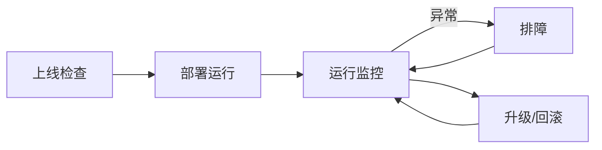

# 交付运维

本章面向交付实施和现场运维，覆盖从上线检查、运行监控到升级回滚和排障的完整流程。



## 上线检查

上线前逐项检查：

- [ ] 摄像头 RTSP 地址、码流格式和帧率。
- [ ] 运行位置是否符合硬件能力（`ax.local` / `rk.local` / `compute_card_N`）。
- [ ] 插件版本、模型资源和配置文件是否匹配。
- [ ] 报警推送地址、鉴权参数和网络连通性。
- [ ] 抓拍、录像和日志目录是否有足够空间。
- [ ] 485、音柱、平台接口等外设是否完成现场联调。

## 运行监控

关注以下指标，可通过平台面板或系统命令观察：

| 类别 | 关键指标 | 说明 |
|---|---|---|
| 系统资源 | CPU、NPU、内存、温度 | 温度过高会触发降频，影响推理帧率 |
| 媒体链路 | 解码帧率、推理耗时、编码帧率 | 帧率下降通常是负载过高或码流异常 |
| 报警链路 | 报警数量、推送成功率、抓拍成功率 | 推送失败多为网络或后端地址问题 |
| 服务状态 | 插件加载、任务启动、设备在线 | 用 `journalctl -u aibox -f` 观察 |

```bash
# 查看服务实时日志
journalctl -u aibox -f

# 查看运行库依赖是否完整（RK 平台）
ldd /usr/local/aibox/bin/TaskManager | grep -E 'rga|mpp|rknn'
```

## 常见问题

### 视频能播放但没有报警

检查：

- 算法阈值是否过高。
- 区域或绊线是否配置正确。
- 报警插件是否接在算法节点后面。
- `alarm_count` 是否大于 0。

### 报警有 OSD 但平台没有收到

检查：

- 报警推送节点是否启用。
- 服务器地址是否可访问。
- 设备鉴权是否正常。
- 报警冷却是否正在生效。

### 485 继电器不动作

检查：

- alarm 节点是否启用 485 继电器。
- `relay_device` 是否对应真实串口。
- 波特率、从站地址、通道和线圈地址是否与继电器板一致。
- 内核是否已启用 RS485 模式。
- 串口是否被其它进程占用。

## 调试辅助环境变量

现场排障时可通过环境变量开启诊断能力：

| 变量 | 说明 |
|---|---|
| `AXPLUGIN_KEEP_TMP_SO=1` | 保留解压后的临时 `.so`，方便 GDB 调试 |
| `PLUGIN_DECRYPT_KEY=<key>` | 加密插件解密密钥 |
| `ALARM_SNAPSHOT_RETENTION_DAYS=7` | 快照保留天数（默认 7） |
| `ALARM_SNAPSHOT_MAX_BYTES_MB=500` | 快照占用上限（MB，默认 500） |
| `AIBOX_RK_IVPS_DIAG=1` | 打开 RK RGA / IVPS 诊断日志，定位缩放、OSD、格式转换问题 |
| `AIBOX_RKNN_DMA_INPUT=1` | RKNN 输入尝试 dma-buf 绑定路径 |

## 升级建议

- 先在测试设备验证插件包和模型包。
- 保留上一版本可回滚包。
- 对关键任务分批升级。
- 升级后检查任务运行位置、报警推送和抓拍链路。

## 相关文档

- 高频问题速查：[常见问题 FAQ](faq.md)
- 报警链路联调：[报警联动](alarm-linkage.md)
- 运行位置选型：[运行位置与部署](runtime-location.md)
