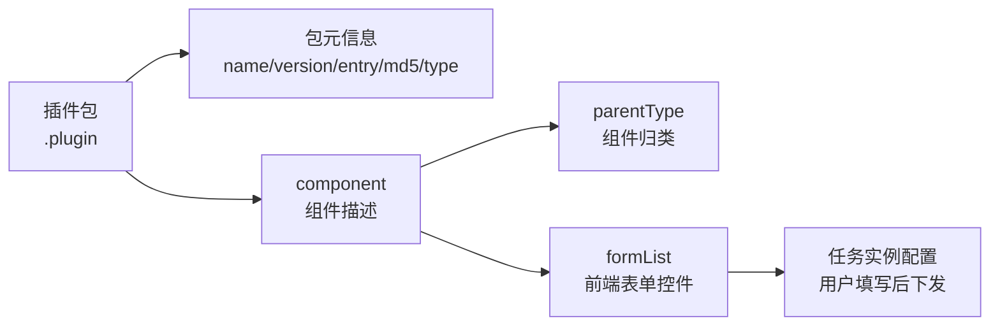

# 配置参考

插件配置用于定义节点默认参数和 Web 表单渲染方式。它是插件包与平台之间的契约：**后端**依据 `name` / `version` / `entry` / `md5` 加载并校验插件，**前端**依据 `component.formList` 动态渲染任务配置表单。

!!! tip "完整字段清单"
    本页是设计概要。逐字段说明和全部控件类型见 [插件配置完整参考](reference/plugin-config-full.md)。

## 配置分层



- **包元信息**：后端加载和完整性校验使用，用户不可见。
- **component**：定义节点在画布中的归类和展示。
- **formList**：定义用户在 Web 端可调的参数，最终生成任务实例配置。

## 基本结构

```json
{
  "name": "example_plugin",
  "version": "1.0.0",
  "entry": "libexample.so",
  "type": "example",
  "component": {
    "parentType": "algorithm-component",
    "label": {
      "zh": "示例算法",
      "en": "Example"
    },
    "type": "example",
    "component": {
      "formList": []
    }
  }
}
```

## 常用字段

| 字段 | 必填 | 说明 |
|---|---|---|
| `name` | 是 | 插件名称，需全局唯一 |
| `version` | 是 | 插件版本，用于升级和回滚 |
| `entry` | 是 | 动态库入口文件名，与包内 `.so` 一致 |
| `md5` | 建议 | 动态库校验值，后端加载前完整性校验 |
| `type` | 是 | 节点类型，须与 `register_node()` 注册值完全一致 |
| `model_files` | 视情况 | 模型文件名数组，包内实际存在 |
| `component.parentType` | 是 | 组件分类：`algorithm-component` / `input-component` / `output-component` |
| `component.type` | 是 | 前端组件类型，须与 `type` 一致 |
| `component.label` | 是 | 多语言显示名 |
| `component.formList` | 是 | 前端表单控件数组 |

!!! warning "type 必须三处一致"
    `type`、`component.type` 与 `register_node()` 注册的类型三者必须**完全一致**（区分大小写），否则前端表单无法与后端节点匹配。

## 常见控件

每个控件至少包含 `type`（控件类型）、`key`（参数键）、`name`（显示名）三个字段。

| 控件 | 用途 | 关键属性 |
|---|---|---|
| `input` | 单行输入 | `placeholder`、`default` |
| `textarea` | 多行文本，如提示词 | `rows`、`maxlength` |
| `switch` | 布尔开关，如 TTS/继电器使能 | `default`（建议高风险项默认关闭） |
| `slider` | 阈值、比例、时间等数值调节 | `min`、`max`、`step`、`default` |
| `select` | 枚举选择 | `options[]`（`{label,value}`） |
| `inputNumber` | 数值输入 | `min`、`max`、`precision` |
| `divider` | 配置分组分隔线 | `name`（分组标题） |

### 控件示例

```json
{
  "formList": [
    { "type": "divider", "name": "检测参数" },
    { "type": "slider", "key": "conf_threshold", "name": "置信度阈值",
      "min": 0.1, "max": 0.9, "step": 0.05, "default": 0.5 },
    { "type": "switch", "key": "tts_enabled", "name": "语音播报", "default": false }
  ]
}
```

## 多语言建议

面向交付的插件应至少提供中文和英文显示名。多语言字段建议保持语义一致，不要在不同语言中改变配置含义。

```json
{
  "name": {
    "zh": "检测区域",
    "en": "Detection Region"
  }
}
```

## 配置设计原则

- 默认值应保守，避免误报警和误触发外设。
- 高风险外设配置默认关闭，例如继电器、报警播报。
- 参数名保持稳定，升级时兼容旧任务配置。
- 复杂业务规则应放在算法插件配置中，执行层参数应放在输出插件配置中。
