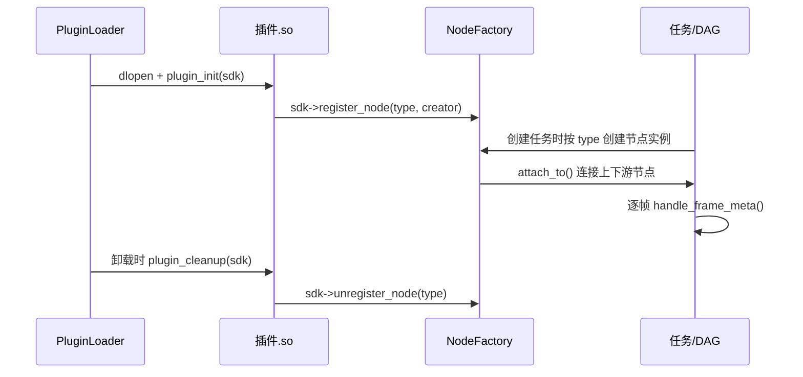
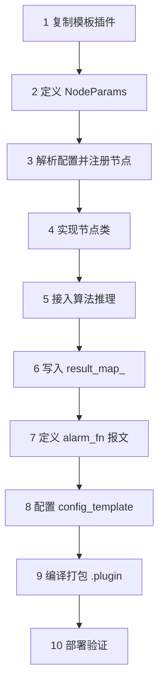

# 插件开发

插件是 AIBox Runtime 的功能扩展单元。算法能力以 `.plugin` 形式独立交付，运行时动态加载，便于按项目裁剪、独立升级，而不影响主程序稳定性。本章讲清楚插件的构成、生命周期和从零开发的标准步骤。

## 插件的构成

一个插件通常包含：

- 节点实现动态库（`.so`）。
- 插件配置文件（`config.json`，由 `config_template.json.in` 生成）。
- 模型资源（`.axmodel` / `.rknn` / `.axpkg`）。
- 前端表单元数据（`formList`）。
- 打包与版本信息（`name` / `version` / `md5`）。

## 节点生命周期

每个插件必须导出两个 C 接口，运行时通过它们注册和注销节点类型：

```cpp
extern "C" void plugin_init(SDKInterface* sdk);
extern "C" void plugin_cleanup(SDKInterface* sdk);
```



!!! warning "type 必须一致"
    `component.type`（配置文件）必须与 `register_node()` 注册的 `type` **完全一致**（区分大小写），否则前端表单不显示、节点无法创建。

## 推荐工程结构

```text
xxx_plugin/
├── CMakeLists.txt
├── config_template.json.in   # 前端表单与组件定义模板
├── plugin_infer.cpp          # 插件入口：解析配置、注册节点
├── JdkXxxNode.hpp            # 节点参数结构 NodeParams
├── JdkXxxNode.cpp            # 节点实现：算法核心
└── models/                   # 模型资源
```

!!! note "目录命名"
    目录建议以 `_plugin` 结尾。`plugins/CMakeLists.txt` 默认通过 `*_plugin` 模式自动发现并构建子工程。

## 从零开发：标准 10 步



### 步骤 1：复制最接近的模板

从 `persondet_plugin` / `firedet_plugin` / `netclient_plugin` 中选一个结构最接近的复制。

### 步骤 2：定义节点参数结构

在 `JdkXxxNode.hpp` 中定义 `NodeParams`，集中管理配置项默认值。

### 步骤 3：解析配置并注册节点

在 `plugin_infer.cpp` 中用 `jp(config, key, default)` 读取参数，构造节点并注册。注意通过 `PluginRuntime` 选择模型和后端，不要写死平台分支：

```cpp
sdk->register_node(PLUGIN_NODE_NAME, [](const std::string& name, const nlohmann::json& config) {
    const auto runtime = PluginRuntime::from_task_config(config);

    auto nodeParams = std::make_unique<MyNodeParams>();
    nodeParams->threshold = jp(config, "threshold", 0.8f);
    nodeParams->runtime_location = runtime.location;
    nodeParams->runtime_device_id = runtime.runtime_device_id; // local=-1, compute_card_N=N-1
    nodeParams->model_path = runtime.is_rk_local()
        ? jp(config, "model_path_rk", "./models/xxx.rknn")
        : jp(config, "model_path_ax", "./models/xxx.axmodel");

    return jdk_nodes::jdk_node_wrapper::create(
        name,
        std::make_shared<jdk_nodes::MyNode>(name, std::move(nodeParams), runtime));
});
```

### 步骤 4：实现节点类

建议继承 `jdk_node_base`、`CustomHandleFrame`、`CustomHandleControl`。最少实现：

- `handle_frame_meta(std::shared_ptr<jdk_frame_meta>)`
- `handle_control_meta(...)`
- （可选）`run_infer_combinations(...)`

### 步骤 5：接入算法推理

使用 AX 算法 SDK 时优先用 `SafeAlgorithm` 封装：

```cpp
SafeAlgorithm::Options opt{ax_model_type_fire_smoke, nodeParams_->model_path, nodeParams_->runtime_device_id};
alg_ = std::make_shared<SafeAlgorithm>(opt);
alg_->set_affinity(true);              // 多路场景必选：随机 NPU 亲和性
alg_->update_params([&](auto &p) {
    p.det_threshold = 0.8f;
});
```

需要同时支持 RKNN 时，按运行位置选择后端：

```cpp
// runtime.infer_type(): rk.local → "rk"，ax.local / compute_card_N → "ax"
infer_ = YOLOV5FACE::create_infer(model_path, runtime.infer_type(), runtime.runtime_device_id);
```

常用推理接口：`detect()`、`track()`、`get_body_attr()`、`get_plate()`、`get_face_feature_2()`。

### 步骤 6：将结果写入 `result_map_`

核心是构造 `jdk_objects::ResultEntry`，作为算法与输出插件之间的结果总线：

| 字段 | 作用 |
|---|---|
| `result` | 算法结果对象（通常 `std::any`） |
| `render_fn` | OSD 绘制回调 |
| `alarm_fn` | 报警报文构造回调 |
| `push_enabled` / `push_interval_ms` | 上报开关与冷却策略 |

### 步骤 7：定义 `alarm_fn` 报文

**必须遵循统一报文结构**，否则 `alarm_plugin` 无法正确路由到 HTTP / TTS / 存储。详见 [报警联动](alarm-linkage.md)。

### 步骤 8：配置 `config_template.json.in`

- 定义组件归属：`input-component` / `algorithm-component` / `output-component` / `other-component`。
- 定义前端可视化配置：`component.formList`。

### 步骤 9：编译打包

`plugins/CMakeLists.txt` 自动遍历 `*_plugin` 子目录构建并打包为 `.plugin`：

```bash
cmake -S plugins -B plugins/build && cmake --build plugins/build -j$(nproc)
ls plugins/build_out/*.plugin
```

### 步骤 10：部署验证

```bash
cp plugins/build_out/*.plugin /usr/local/aibox/plugins/
service aibox restart
./jdk_node_sample      # 确认节点注册成功、组件结构正确
```

## 运行时排障：连线变红

!!! warning "节点连线变红 = 信息上报异常"
    任务运行时，画布上节点之间的**连线颜色代表链路健康状态**：绿色/正常色表示上下游节点在持续上报帧/结果，**红色表示该链路一段时间未收到有效的节点信息上报**。看到红线不要只看前端，优先排查节点侧的上报链路。

常见原因与排查顺序：

- **节点未持续产出**：`handle_frame_meta()` 遇到异常提前 `return`，或推理阻塞导致不再向下游传递帧。确认推理异常已捕获并仍能透传帧。
- **`result_map_` 未写入或 `push_enabled=false`**：结果总线没有有效条目，下游无可上报。检查 `ResultEntry` 是否正确填充。
- **上报冷却过长**：`push_interval_ms` 过大时上报稀疏，可能被误判为超时，适当调小。
- **上下游未正确 `attach_to()`**：节点未成功连接，链路未建立。核对节点 `type` 三处一致（配置/注册/前端）。
- **模型或设备初始化失败**：节点已创建但推理未就绪，日志中会有加载错误。确认模型路径、运行位置与后端选择正确。

排查时可配合 `./jdk_node_sample` 确认节点注册与结构，并查看运行日志中该节点的帧处理与上报记录。

## 输入输出约定

算法插件从上游接收视频帧和元数据，输出推理结果、OSD 绘制回调、报警构造回调和推送冷却时间。报警、推流、录像等输出插件消费这些结果，不直接耦合具体算法实现。

## 配置表单常用控件

插件通过 `config_template.json.in` 定义 Web 配置界面。常见控件：

| 控件 | 用途 |
|---|---|
| `input` / `inputNumber` / `password` / `textarea` | 文本 / 数字输入 |
| `select` / `switch` / `slider` | 下拉 / 开关 / 滑块 |
| `button` / `divider` / `subdivider` | 操作按钮 / 分割线 |
| `schedule` | 按时段布控配置 |
| `regionDraw` | 前端区域 / 绊线绘制（与 RegionAnalyzer 联动） |
| `readOnly` / `status` | 只读展示 / 运行状态 |

配置键应稳定、语义清晰，并提供中英文显示名。完整字段见 [配置参考](plugin-config.md)。

## 工程建议

- 算法插件只做算法判断，不直接操作继电器、TTS、平台推送等外设。
- 外设执行统一交给报警插件，便于集中处理并发、冷却和错误恢复。
- 对高频视频链路保持低拷贝，调试保存和 CPU 同步只在必要时使用。
- 新增字段必须有默认值（`jp(config, key, default)`），老字段尽量不重命名，避免数据库迁移。
- 新增平台能力时优先通过运行位置和公共帧接口扩展。
