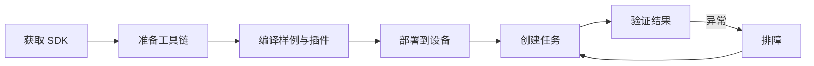

# 快速开始

本章带你从零走完一条完整链路：**获取 SDK → 准备交叉编译环境 → 编译样例与插件 → 部署到设备 → 创建任务 → 验证结果**。每一步都给出可直接执行的命令，并说明背后的原理，方便你在自己的环境中复现。



!!! tip "阅读建议"
    如果你只想先跑通一个 Demo，按 1→2→3→6 走即可；需要在 Web 端配置业务任务，再补充 4→5。

## 1. 获取 SDK

### 1.1 目录结构

SDK 以源码形式交付，解压后目录如下：

```text
jinsonic-ai-sdk/
├── include/              # 对外头文件（插件开发必读）
├── plugins/              # 插件参考实现与打包脚本
├── example/              # 示例工程（demo 样例）
├── doc/                  # 协议与补充资料
├── README_CN.md          # 中文开发指南（最全）
├── README.md             # 英文开发指南
├── build_sdk_sample.sh   # 一键构建脚本
└── CMakeLists.txt        # 根工程
```

### 1.2 获取方式

=== "Git 克隆（推荐）"

    ```bash
    # 通过 Git 仓库获取，便于后续拉取更新
    git clone https://github.com/JinsonicAi/jinsonic-ai-sdk.git
    cd jinsonic-ai-sdk

    # 查看当前版本与提交
    git log -1 --oneline
    ```

=== "压缩包"

    ```bash
    # 从交付渠道拿到 tar.gz 后解压
    tar -xzf jinsonic-ai-sdk-<version>.tar.gz
    cd jinsonic-ai-sdk
    ```

!!! note "版本对齐"
    当前文档对应 SDK `aibox_sdk`、固件基线 `3.10.2`、对接协议规范 `V1.0.2`。部署前请确认设备固件与 SDK 版本匹配，避免出现插件与运行时 ABI 不一致。

## 2. 准备交叉编译环境

SDK 运行在 ARM64（`aarch64`）设备上，需要在 x86 主机上用 **交叉编译工具链** 生成 ARM64 可执行文件与动态库。

### 2.1 环境要求

| 项目 | 要求 |
|---|---|
| 主机 OS | Ubuntu 20.04 / 22.04 |
| 交叉编译器 | `aarch64-none-linux-gnu-g++`（12.2.rel1） |
| CMake | ≥ 3.10 |
| 构建工具 | `make`、`git`、`unzip` |

### 2.2 下载并安装工具链

工具链体积较大，通过网盘分发：

| 渠道 | 地址 |
|---|---|
| 百度网盘 | `https://pan.baidu.com/s/18CczjjNDnMhM15VDcAJcpQ?pwd=v8me`（提取码 `v8me`） |
| 谷歌网盘 | `https://drive.google.com/drive/folders/15cmvIBABTxfgwNvJvhgTI9tMyAiH8vVT` |

下载后解压到固定目录，并把 `bin/` 加入 `PATH`：

```bash
# 假设解压到 /home/work/ax/ 下
tar -xf arm-gnu-toolchain-12.2.rel1-x86_64-aarch64-none-linux-gnu.tar.xz -C /home/work/ax/

# 临时加入 PATH（当前终端有效）
export PATH="/home/work/ax/arm-gnu-toolchain-12.2.rel1-x86_64-aarch64-none-linux-gnu/bin:$PATH"

# 验证工具链可用，应输出版本号 12.2.x
aarch64-none-linux-gnu-g++ --version
```

!!! warning "路径要与脚本一致"
    `build_sdk_sample.sh` 中写死了工具链路径。如果你的解压位置不同，请同步修改脚本中的 `export PATH=...` 行，或改用下方的手动构建方式自行指定 `PATH`。

## 3. 编译样例与插件

### 3.1 一键构建

```bash
cd jinsonic-ai-sdk
bash build_sdk_sample.sh
```

脚本内部依次完成：

1. 配置交叉工具链 `PATH`。
2. 编译根工程 `cmake -B build && cmake --build build`，产出所有 demo 样例。
3. 进入 `plugins/`，编译子工程并打包为 `.plugin` 插件包。

### 3.2 手动构建（推荐 CI 使用）

需要精细控制或在 CI 中构建时，分两步手动执行：

```bash
export PATH="/home/work/ax/arm-gnu-toolchain-12.2.rel1-x86_64-aarch64-none-linux-gnu/bin:$PATH"

# 第一步：编译 demo 样例
cmake -B build && cmake --build build -j$(nproc)

# 第二步：编译并打包插件
cmake -S plugins -B plugins/build && cmake --build plugins/build -j$(nproc)
```

### 3.3 编译产物

| 产物 | 路径 | 说明 |
|---|---|---|
| 样例程序 | `build/example/<demo_name>` | 可直接推到设备运行的 ARM64 可执行文件 |
| 插件包 | `plugins/build_out/*.plugin` | 含 `共享库 + config.json + 模型文件` 的功能包 |
| 插件配置 | 插件包内 `config.json` | 由 `config_template.json.in` 生成，定义前端表单 |

确认产物存在：

```bash
ls build/example/
ls plugins/build_out/*.plugin
```

!!! tip "产物是什么"
    `.plugin` 是运行时动态加载的功能单元，内部打包了动态库、`config.json` 和模型资源。运行时通过 `dlopen` 加载并调用 `plugin_init()` 注册节点，这样算法能力可以按项目裁剪、独立升级，而不影响主程序稳定性。

## 4. 部署到设备

编译产物需要推送到 ARM64 设备上运行。

```bash
# 1. 安装运行时（板端执行，deb 由交付渠道提供）
dpkg -i aibox-runtime_*.deb

# 2. 部署插件到运行时插件目录
cp plugins/build_out/*.plugin /usr/local/aibox/plugins/

# 3. 设置动态库搜索路径（建议写入 /etc/profile.d/）
export LD_LIBRARY_PATH=/usr/local/aibox/lib:$LD_LIBRARY_PATH

# 4. 重启服务加载新插件
service aibox restart

# 5. 查看实时日志确认加载成功
journalctl -u aibox -f
```

如果主机与设备通过网络连接，可先用 `scp` 把产物拷到设备：

```bash
scp build/example/jdk_node_sample root@<设备IP>:/root/
scp plugins/build_out/*.plugin root@<设备IP>:/usr/local/aibox/plugins/
```

## 5. 创建任务

在 Web 管理界面按下面流程创建任务：


1. 添加输入组件，例如网络拉流（RTSP）。
2. 添加一个或多个算法组件，例如区域入侵、火灾烟雾、人脸检测。
3. 添加 OSD、报警推送、网络推流、录像等输出组件。
4. 选择 [运行位置](runtime-location.md)（`ax.local` / `rk.local` / `compute_card_N`）。
5. 保存并运行任务。

!!! note "运行位置的意义"
    运行位置决定任务在哪个硬件后端闭环执行。应尽量让解码、预处理、推理和编码在同一个运行位置内完成，减少跨设备搬运带来的带宽和延迟开销。

## 6. 验证结果

### 6.1 先验证 SDK 栈（Demo）

建议按依赖顺序逐层验证，快速定位问题在哪一层：

| 顺序 | Demo | 验证目标 |
|---|---|---|
| 1 | `jdk_frame_sample` | 帧对象文件读写正常 |
| 2 | `jdk_capture_sample` / `jdk_ivps_sample` | 图像处理链（抓拍、缩放、格式转换）正常 |
| 3 | `jdk_npu_sample` / `jdk_alg_sample` | NPU 推理栈正常 |
| 4 | `jdk_node_sample` | 插件加载与组件结构输出正常 |

```bash
# 例：运行节点样例，应打印各插件的组件结构 JSON
./jdk_node_sample
```

### 6.2 再验证业务任务

任务运行后逐项确认：

- [ ] 输入视频稳定，无花屏、无频繁断流。
- [ ] 算法 OSD 正确叠加（检测框、区域、轨迹）。
- [ ] 报警按冷却规则触发，无风暴式重复报警。
- [ ] 抓拍图片、录像文件、推流地址均可访问。
- [ ] 本地告警、HTTP 上报（`/api/v1/device/report/event`）、图像落盘（`sdcard/capture/`）到位。
- [ ] 设备 CPU、NPU、内存、温度在合理范围内。

### 6.3 预期结果示例

正常运行时，一次目标事件会产生如下闭环：

```text
目标进入区域
  → 算法节点输出结构化结果（alarm_count > 0）
  → OSD 叠加检测框与区域
  → alarm 插件本地告警 + HTTP 上报 + 抓拍落盘
  → （可选）TTS 播报 / 485 继电器动作
```

## 下一步

- 深入架构、接口与报警协议：[SDK 开发指南](sdk-guide.md)
- 选择合适的硬件后端：[运行位置与部署](runtime-location.md)
- 开发自己的算法插件：[插件开发](plugin-development.md)
- 遇到报错先查：[常见问题 FAQ](faq.md)
