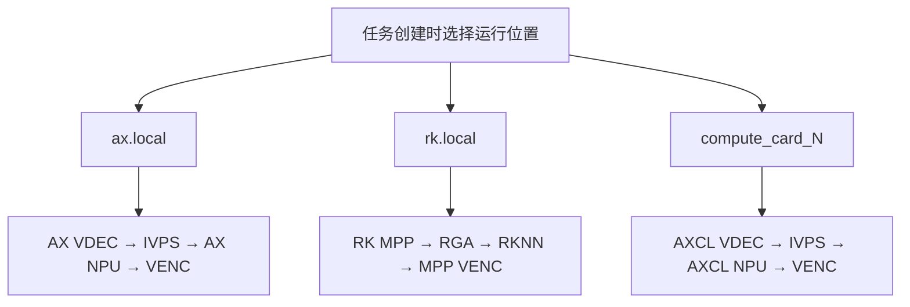
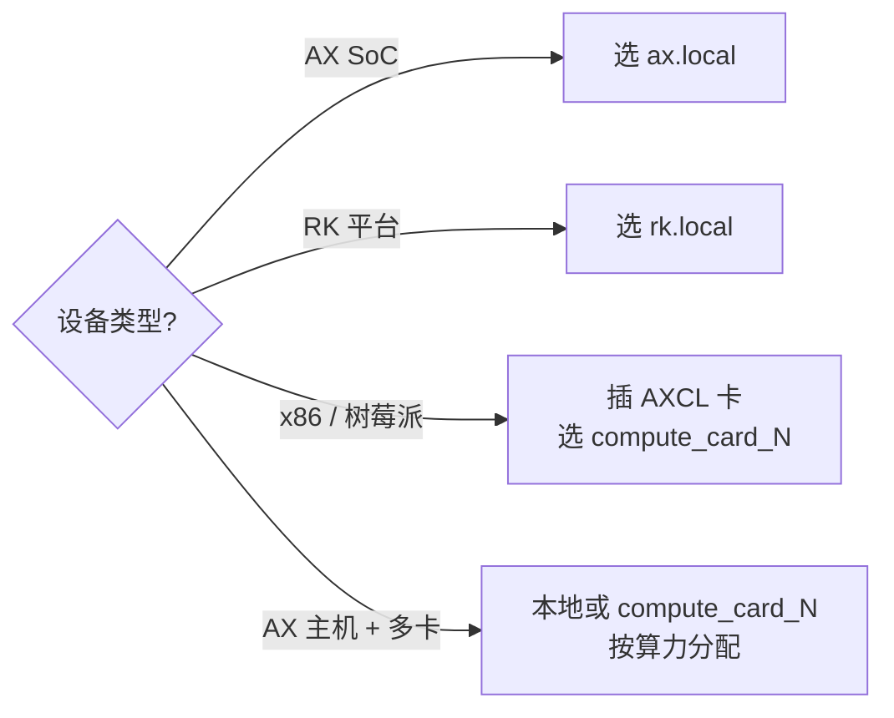

# 运行位置与部署

AIBox Runtime 使用统一的 **Runtime Location（运行位置）** 抽象，让上层任务、插件和前端只需选择"任务在哪里运行"，不需要关心底层是 AX 本地、RK 本地还是 AXCL 计算卡。这样同一套业务逻辑可以覆盖多种硬件形态。



## 运行位置类型

| 运行位置 | 典型硬件 | 媒体链路 | 推理后端 | 适用场景 |
|---|---|---|---|---|
| `ax.local` | AX650N / AX8850 独立设备 | AX VDEC / IVPS / VENC | AX NPU | AX 一体机、边缘盒子，本地闭环处理 |
| `rk.local` | RK35xx / RV1126B 等 RK 平台 | RK MPP / RGA / MPP VENC | RKNN | RK 主机独立部署，本地闭环减少搬运 |
| `compute_card_N` | AXCL 计算卡 | AXCL VDEC / IVPS / VENC | AXCL NPU | RK / 树莓派 / x86 / AX 主机插卡，`N` 从 1 开始 |

## 设计原则

- **本地算力按需开放**：AX 平台显示 `ax.local`，RK 平台显示 `rk.local`；普通 x86 / 树莓派等 Host 不会暴露本地 NPU 选项，只能使用外挂算力卡。
- **任务级闭环运行**：同一任务的解码、图像处理、推理、编码默认在同一个运行位置完成，避免 RK 与 AXCL 之间频繁搬运大帧数据。
- **插件接口保持一致**：插件统一接收 `AXVideoFrame` / `jdk_frame_meta` 等公共抽象；底层帧可能来自 AX、AXCL 或 RK，但上层算法节点不直接操作平台私有结构。
- **面向零拷贝优化**：RK 解码输出、RGA 处理、RKNN 输入优先使用 dma-buf / MPP buffer 传递；只有抓拍、调试保存或 CPU 算法确实需要时才同步到 Host。

## 资源隔离规则

| 运行位置 | `runtime_device_id` | 资源类型 |
|---|---|---|
| `ax.local` | `-1` | 本地 AX 媒体 / NPU |
| `rk.local` | `-1` | 本地 RK MPP / RGA / RKNN |
| `compute_card_1` | `0` | AXCL 卡 0 |
| `compute_card_2` | `1` | AXCL 卡 1（以此类推） |

解码、编码和图像处理通道按 `runtime_location` 独立分配，避免本地与计算卡资源互相覆盖。

## 部署形态与选型



=== "AX 一体机"

    适合现场独立运行，推荐 `ax.local`。链路：

    ```text
    RTSP → AX VDEC → AX IVPS → AX NPU → AX VENC / WebRTC
    ```

=== "RK 本地设备"

    适合轻量边缘终端，推荐 `rk.local`，使用 RK 本地编解码、RGA 图像处理和 RKNN 推理。链路：

    ```text
    RTSP → RK MPP → RGA → RKNN → RK MPP VENC / WebRTC
    ```

=== "第三方主机 + AXCL 算力卡"

    适合多路视频和算力扩展，推荐 `compute_card_N`，让任务在计算卡侧闭环运行。链路：

    ```text
    RTSP → AXCL VDEC → AXCL IVPS → AXCL NPU → AXCL VENC / WebRTC
    ```

## RK 本地运行环境

选择 `rk.local` 时，板端运行环境需包含 Rockchip 相关运行库和驱动：

| 能力 | 依赖 | 用途 |
|---|---|---|
| 视频解码 / 编码 | RK MPP | RTSP H.264/H.265 拉流解码、编码输出、WebRTC 预览 |
| 图像处理 | librga / RGA 驱动 | OSD 合成、缩放、裁剪、格式转换、仿射变换 |
| NPU 推理 | RKNN Runtime | `.rknn` 模型加载与推理 |
| 帧内存 | dma-buf / MPP buffer | 在 MPP、RGA、RKNN 之间减少大帧拷贝 |

部署前检查：

```bash
# 1. 确认 RK 设备节点和驱动可用
ls /dev/rga /dev/mpp_service 2>/dev/null

# 2. 确认运行库可被加载
ldd /usr/local/aibox/bin/TaskManager | grep -E 'rga|mpp|rknn'

# 3. 启动服务前设置运行库路径
export LD_LIBRARY_PATH=/usr/local/aibox/lib:$LD_LIBRARY_PATH
```

!!! warning "rk.local 不出现在运行位置列表？"
    确认当前设备为 RK / RV / Rockchip 平台：`cat /proc/device-tree/compatible`。非 RK 平台不会开放本地运行位置。

## 插件开发约定

插件应从 TaskManager 注入的配置中读取运行位置，不要在内部写死平台分支：

```json
{
  "runtime_location": "rk.local",
  "runtime_device_id": -1,
  "device_id": -1
}
```

推荐通过 `PluginRuntime::from_task_config(config)` 统一解析：

```cpp
const auto runtime = PluginRuntime::from_task_config(config);

if (runtime.is_rk_local()) {
    // RK 本地：RK MPP / RGA / RKNN
} else if (runtime.is_ax_local()) {
    // AX 本地：AX VDEC / IVPS / NPU / VENC
} else if (runtime.is_compute_card()) {
    // AXCL 计算卡：runtime.runtime_device_id 为卡索引，从 0 开始
}

// 按运行位置选择推理后端
const char* backend = runtime.infer_type(); // rk.local → "rk"，其它 AX 路径 → "ax"
auto infer = Algorithm::create_infer(model_path, backend, runtime.runtime_device_id);
```

!!! tip "RK 本地开发注意"
    - 推理模型必须提供 RKNN 格式，建议用 `model_path_rk` 与 AX 模型分开配置。
    - 对实时 MPP / RGA 帧优先沿用 `AXVideoFrame` 抽象继续传递，不要为普通处理流程频繁 `toHost()`。
    - 多任务场景下 RGA / RKNN 由运行时调度，不建议插件自行创建全局单例硬件上下文。

更详细的接口与后端适配，见 [SDK 开发指南](sdk-guide.md)。
